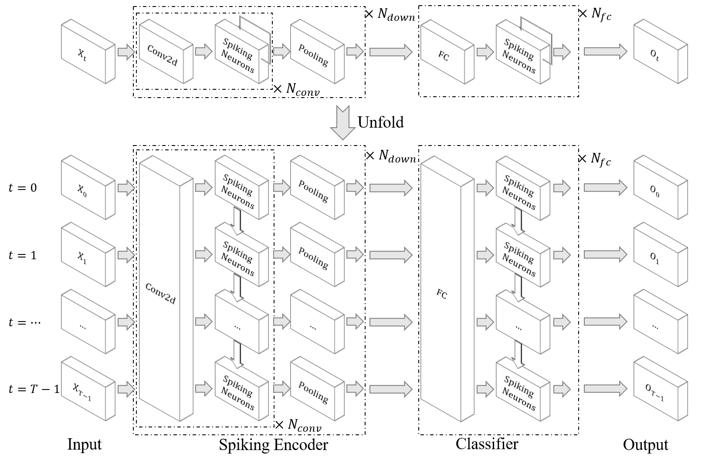
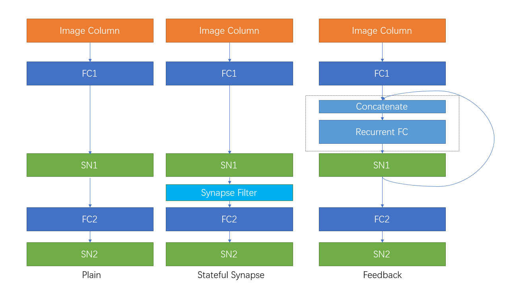
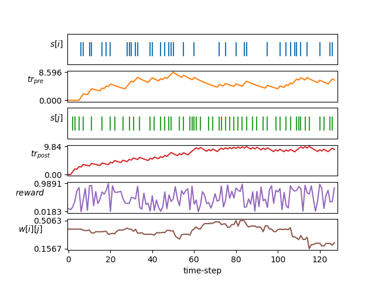

# SpikingJelly
 
[](https://spikingjelly.readthedocs.io/zh_CN/latest) 
[](https://pypi.org/project/spikingjelly) 
[](https://pypi.org/project/spikingjelly) 


English | [中文(Chinese)](./README_cn.md)


SpikingJelly is an open-source deep learning framework for Spiking Neural Network (SNN) based on [PyTorch](https://pytorch.org/).

The documentation of SpikingJelly is written in both English and Chinese: https://spikingjelly.readthedocs.io.

- [Installation](#installation)
- [Build SNN In An Unprecedented Simple Way](#build-snn-in-an-unprecedented-simple-way)
- [Fast And Handy ANN-SNN Conversion](#fast-and-handy-ann-snn-conversion)
- [CUDA-Enhanced Neuron](#cuda-enhanced-neuron)
- [Device Supports](#device-supports)
- [Neuromorphic Datasets Supports](#neuromorphic-datasets-supports)
- [Tutorials](#Tutorials)
- [Publications and Citation](#publications-and-citation)
- [Contribution](#contribution)
- [About](#about)

## Installation

Note that SpikingJelly is based on PyTorch. Please make sure that you have installed PyTorch before you install SpikingJelly.

**Version notes**

The odd version number is the developing version, updated with the GitHub/OpenI repository. The even version number is the stable version and is available at PyPI. 

The default doc is for the latest developing version. If you are using the stable version, do not forget to switch to the doc in the corresponding version.

From the version `0.0.0.0.14`, modules including `clock_driven` and `event_driven` are renamed. Please refer to the tutorial [Migrate From Old Versions](https://spikingjelly.readthedocs.io/zh_CN/0.0.0.0.14/activation_based_en/migrate_from_legacy.html).

If you use an old version of SpikingJelly, you may encounter some fatal bugs. Refer to [Bugs History with Releases](./bugs.md) for more details.

**Docs for different versions:**

- [zero](https://spikingjelly.readthedocs.io/zh_CN/zero/)
- [0.0.0.0.4](https://spikingjelly.readthedocs.io/zh_CN/0.0.0.0.4/#index-en)
- [0.0.0.0.6](https://spikingjelly.readthedocs.io/zh_CN/0.0.0.0.6/#index-en)
- [0.0.0.0.8](https://spikingjelly.readthedocs.io/zh_CN/0.0.0.0.8/#index-en)
- [0.0.0.0.10](https://spikingjelly.readthedocs.io/zh_CN/0.0.0.0.10/#index-en)
- [0.0.0.0.12](https://spikingjelly.readthedocs.io/zh_CN/0.0.0.0.12/#index-en)
- [0.0.0.0.14](https://spikingjelly.readthedocs.io/zh_CN/0.0.0.0.14/#index-en)
- [latest](https://spikingjelly.readthedocs.io/zh_CN/latest/#index-en)

**Install the last stable version from** [**PyPI**](https://pypi.org/project/spikingjelly/):

```bash
pip install spikingjelly
```

**Install the latest developing version from the source code**:

From [GitHub](https://github.com/fangwei123456/spikingjelly):
```bash
git clone https://github.com/fangwei123456/spikingjelly.git
cd spikingjelly
python setup.py install
```
From [OpenI](https://openi.pcl.ac.cn/OpenI/spikingjelly):
```bash
git clone https://openi.pcl.ac.cn/OpenI/spikingjelly.git
cd spikingjelly
python setup.py install
```
## Build SNN In An Unprecedented Simple Way

SpikingJelly is user-friendly. Building SNN with SpikingJelly is as simple as building ANN in PyTorch:

```python
nn.Sequential(
        layer.Flatten(),
        layer.Linear(28 * 28, 10, bias=False),
        neuron.LIFNode(tau=tau, surrogate_function=surrogate.ATan())
        )
```

This simple network with a Poisson encoder can achieve 92% accuracy on the MNIST test dataset. Read refer to the tutorial for more details. You can also run this code in a Python terminal for training on classifying MNIST:

```python
python -m spikingjelly.activation_based.examples.lif_fc_mnist -tau 2.0 -T 100 -device cuda:0 -b 64 -epochs 100 -data-dir <PATH to MNIST> -amp -opt adam -lr 1e-3 -j 8
```

## Fast And Handy ANN-SNN Conversion

SpikingJelly implements a relatively general ANN-SNN Conversion interface. Users can realize the conversion through PyTorch. What's more, users can customize the conversion mode. 

```python
class ANN(nn.Module):
    def __init__(self):
        super().__init__()
        self.network = nn.Sequential(
            nn.Conv2d(1, 32, 3, 1),
            nn.BatchNorm2d(32, eps=1e-3),
            nn.ReLU(),
            nn.AvgPool2d(2, 2),

            nn.Conv2d(32, 32, 3, 1),
            nn.BatchNorm2d(32, eps=1e-3),
            nn.ReLU(),
            nn.AvgPool2d(2, 2),

            nn.Conv2d(32, 32, 3, 1),
            nn.BatchNorm2d(32, eps=1e-3),
            nn.ReLU(),
            nn.AvgPool2d(2, 2),

            nn.Flatten(),
            nn.Linear(32, 10)
        )

    def forward(self,x):
        x = self.network(x)
        return x
```

This simple network with analog encoding can achieve 98.44% accuracy after conversion on MNIST test dataset. Read the tutorial for more details. You can also run this code in a Python terminal for training on classifying MNIST using the converted model:

```python
>>> import spikingjelly.activation_based.ann2snn.examples.cnn_mnist as cnn_mnist
>>> cnn_mnist.main()
```

## CUDA-Enhanced Neuron

SpikingJelly provides two backends for multi-step neurons. You can use the user-friendly `torch` backend for easily coding and debugging and use `cupy` backend for faster training speed.

The following figure compares the execution time of two backends of Multi-Step LIF neurons (`float32`):


`float16` is also provided by the `cupy` backend and can be used in [automatic mixed precision training](https://pytorch.org/docs/stable/notes/amp_examples.html).

To use the `cupy` backend, please install [CuPy](https://docs.cupy.dev/en/stable/install.html). Note that the `cupy` backend only supports GPU, while the `torch` backend supports both CPU and GPU.

## Device Supports

-   [x] Nvidia GPU
-   [x] CPU

As simple as using PyTorch.

```python
>>> net = nn.Sequential(layer.Flatten(), layer.Linear(28 * 28, 10, bias=False), neuron.LIFNode(tau=tau))
>>> net = net.to(device) # Can be CPU or CUDA devices
```

## Neuromorphic Datasets Supports
SpikingJelly includes the following neuromorphic datasets:

| Dataset | Source |
| -------------- | ------------------------------------------------------------ |
| ASL-DVS        | [Graph-based Object Classification for Neuromorphic Vision Sensing](https://openaccess.thecvf.com/content_ICCV_2019/html/Bi_Graph-Based_Object_Classification_for_Neuromorphic_Vision_Sensing_ICCV_2019_paper.html) |
| CIFAR10-DVS    | [CIFAR10-DVS: An Event-Stream Dataset for Object Classification](https://internal-journal.frontiersin.org/articles/10.3389/fnins.2017.00309/full) |
| DVS128 Gesture | [A Low Power, Fully Event-Based Gesture Recognition System](https://openaccess.thecvf.com/content_cvpr_2017/html/Amir_A_Low_Power_CVPR_2017_paper.html) |
| ES-ImageNet    | [ES-ImageNet: A Million Event-Stream Classification Dataset for Spiking Neural Networks](https://www.frontiersin.org/articles/10.3389/fnins.2021.726582/full) |
| HARDVS | [HARDVS: Revisiting Human Activity Recognition with Dynamic Vision Sensors](https://arxiv.org/abs/2211.09648) |
| N-Caltech101   | [Converting Static Image Datasets to Spiking Neuromorphic Datasets Using Saccades](https://www.frontiersin.org/articles/10.3389/fnins.2015.00437/full) |
| N-MNIST        | [Converting Static Image Datasets to Spiking Neuromorphic Datasets Using Saccades](https://www.frontiersin.org/articles/10.3389/fnins.2015.00437/full) |
| Nav Gesture    | [Event-Based Gesture Recognition With Dynamic Background Suppression Using Smartphone Computational Capabilities](https://www.frontiersin.org/articles/10.3389/fnins.2020.00275/full) |
| Spiking Heidelberg Digits (SHD) | [The Heidelberg Spiking Data Sets for the Systematic Evaluation of Spiking Neural Networks](https://doi.org/10.1109/TNNLS.2020.3044364) |
| DVS-Lip | [Multi-Grained Spatio-Temporal Features Perceived Network for Event-Based Lip-Reading](https://openaccess.thecvf.com/content/CVPR2022/html/Tan_Multi-Grained_Spatio-Temporal_Features_Perceived_Network_for_Event-Based_Lip-Reading_CVPR_2022_paper.html) |

Users can use both the origin event data and frame data integrated by SpikingJelly:

```python
import torch
from torch.utils.data import DataLoader
from spikingjelly.datasets import pad_sequence_collate, padded_sequence_mask
from spikingjelly.datasets.dvs128_gesture import DVS128Gesture

# Set the root directory for the dataset
root_dir = 'D:/datasets/DVS128Gesture'
# Load event dataset
event_set = DVS128Gesture(root_dir, train=True, data_type='event')
event, label = event_set[0]
# Print the keys and their corresponding values in the event data
for k in event.keys():
    print(k, event[k])

# t [80048267 80048277 80048278 ... 85092406 85092538 85092700]
# x [49 55 55 ... 60 85 45]
# y [82 92 92 ... 96 86 90]
# p [1 0 0 ... 1 0 0]
# label 0

# Load a dataset with fixed frame numbers
fixed_frames_number_set = DVS128Gesture(root_dir, train=True, data_type='frame', frames_number=20, split_by='number')
# Randomly select two frames and print their shapes
rand_index = torch.randint(low=0, high=fixed_frames_number_set.__len__(), size=[2])
for i in rand_index:
    frame, label = fixed_frames_number_set[i]
    print(f'frame[{i}].shape=[T, C, H, W]={frame.shape}')

# frame[308].shape=[T, C, H, W]=(20, 2, 128, 128)
# frame[453].shape=[T, C, H, W]=(20, 2, 128, 128)

# Load a dataset with a fixed duration and print the shapes of the first 5 samples
fixed_duration_frame_set = DVS128Gesture(root_dir, data_type='frame', duration=1000000, train=True)
for i in range(5):
    x, y = fixed_duration_frame_set[i]
    print(f'x[{i}].shape=[T, C, H, W]={x.shape}')

# x[0].shape=[T, C, H, W]=(6, 2, 128, 128)
# x[1].shape=[T, C, H, W]=(6, 2, 128, 128)
# x[2].shape=[T, C, H, W]=(5, 2, 128, 128)
# x[3].shape=[T, C, H, W]=(5, 2, 128, 128)
# x[4].shape=[T, C, H, W]=(7, 2, 128, 128)

# Create a data loader for the fixed duration frame dataset and print the shapes and sequence lengths
train_data_loader = DataLoader(fixed_duration_frame_set, collate_fn=pad_sequence_collate, batch_size=5)
for x, y, x_len in train_data_loader:
    print(f'x.shape=[N, T, C, H, W]={tuple(x.shape)}')
    print(f'x_len={x_len}')
    mask = padded_sequence_mask(x_len)  # mask.shape = [T, N]
    print(f'mask=\n{mask.t().int()}')
    break

# x.shape=[N, T, C, H, W]=(5, 7, 2, 128, 128)
# x_len=tensor([6, 6, 5, 5, 7])
# mask=
# tensor([[1, 1, 1, 1, 1, 1, 0],
#         [1, 1, 1, 1, 1, 1, 0],
#         [1, 1, 1, 1, 1, 0, 0],
#         [1, 1, 1, 1, 1, 0, 0],
#         [1, 1, 1, 1, 1, 1, 1]], dtype=torch.int32)
```
More datasets will be included in the future.

If some datasets' download links are not available for some users, the users can download from the OpenI mirror:

https://openi.pcl.ac.cn/OpenI/spikingjelly/datasets?type=0

All datasets saved in the OpenI mirror are allowable by their license or author's agreement.

## Tutorials

SpikingJelly provides elaborate tutorials. Here are some tutorials:

| Figure                                                       | Tutorial                                                     |
| ------------------------------------------------------------ | ------------------------------------------------------------ |
|  | [Basic Conception](https://spikingjelly.readthedocs.io/zh_CN/0.0.0.0.14/activation_based_en/basic_concept.html) |
|  | [Neuron](https://spikingjelly.readthedocs.io/zh_CN/0.0.0.0.14/activation_based_en/neuron.html) |
|  | [Single Fully Connected Layer SNN to Classify MNIST](https://spikingjelly.readthedocs.io/zh_CN/0.0.0.0.14/activation_based_en/lif_fc_mnist.html) |
|  | [Convolutional SNN to Classify FMNIST](https://spikingjelly.readthedocs.io/zh_CN/0.0.0.0.14/activation_based_en/conv_fashion_mnist.html) |
|  | [ANN2SNN](https://spikingjelly.readthedocs.io/zh_CN/0.0.0.0.14/activation_based_en/ann2snn.html) |
|  | [Neuromorphic Datasets Processing](https://spikingjelly.readthedocs.io/zh_CN/0.0.0.0.14/activation_based_en/neuromorphic_datasets.html) |
|  | [Classify DVS Gesture](https://spikingjelly.readthedocs.io/zh_CN/0.0.0.0.14/activation_based_en/classify_dvsg.html) |
|  | [Recurrent Connection and Stateful Synapse](https://spikingjelly.readthedocs.io/zh_CN/0.0.0.0.14/activation_based_en/recurrent_connection_and_stateful_synapse.html) |
|  | [STDP Learning](https://spikingjelly.readthedocs.io/zh_CN/0.0.0.0.14/activation_based_en/stdp.html) |
|  | [Reinforcement Learning](https://spikingjelly.readthedocs.io/zh-cn/latest/activation_based/ilc_san.html) |

Other tutorials that are not listed here are also available at the document https://spikingjelly.readthedocs.io.

## Publications and Citation

Publications using SpikingJelly are recorded in [Publications](./publications.md). If you use SpikingJelly in your paper, you can also add it to this table by pull request.

If you use SpikingJelly in your work, please cite it as follows:

```
@article{
doi:10.1126/sciadv.adi1480,
author = {Wei Fang  and Yanqi Chen  and Jianhao Ding  and Zhaofei Yu  and Timothée Masquelier  and Ding Chen  and Liwei Huang  and Huihui Zhou  and Guoqi Li  and Yonghong Tian },
title = {SpikingJelly: An open-source machine learning infrastructure platform for spike-based intelligence},
journal = {Science Advances},
volume = {9},
number = {40},
pages = {eadi1480},
year = {2023},
doi = {10.1126/sciadv.adi1480},
URL = {https://www.science.org/doi/abs/10.1126/sciadv.adi1480},
eprint = {https://www.science.org/doi/pdf/10.1126/sciadv.adi1480},
abstract = {Spiking neural networks (SNNs) aim to realize brain-inspired intelligence on neuromorphic chips with high energy efficiency by introducing neural dynamics and spike properties. As the emerging spiking deep learning paradigm attracts increasing interest, traditional programming frameworks cannot meet the demands of automatic differentiation, parallel computation acceleration, and high integration of processing neuromorphic datasets and deployment. In this work, we present the SpikingJelly framework to address the aforementioned dilemma. We contribute a full-stack toolkit for preprocessing neuromorphic datasets, building deep SNNs, optimizing their parameters, and deploying SNNs on neuromorphic chips. Compared to existing methods, the training of deep SNNs can be accelerated 11×, and the superior extensibility and flexibility of SpikingJelly enable users to accelerate custom models at low costs through multilevel inheritance and semiautomatic code generation. SpikingJelly paves the way for synthesizing truly energy-efficient SNN-based machine intelligence systems, which will enrich the ecology of neuromorphic computing. Motivation and introduction of the software framework SpikingJelly for spiking deep learning.}}
```

## Contribution

You can read the issues and get the problems to be solved and the latest development plans. We welcome all users to join the discussion of development plans, solve issues, and send pull requests.

Not all API documents are written in both English and Chinese. We welcome users to complete translation (from English to Chinese or from Chinese to English).

## About

[Multimedia Learning Group, Institute of Digital Media (NELVT), Peking University](https://pkuml.org/) and [Peng Cheng Laboratory](http://www.szpclab.com/) are the main developers of SpikingJelly.


The list of developers can be found [here](https://github.com/fangwei123456/spikingjelly/graphs/contributors).

## All Thanks to Our Contributors

<a href="https://github.com/fangwei123456/spikingjelly/graphs/contributors">
  
</a>

<p align="right"><a href="#top"></a></p>
