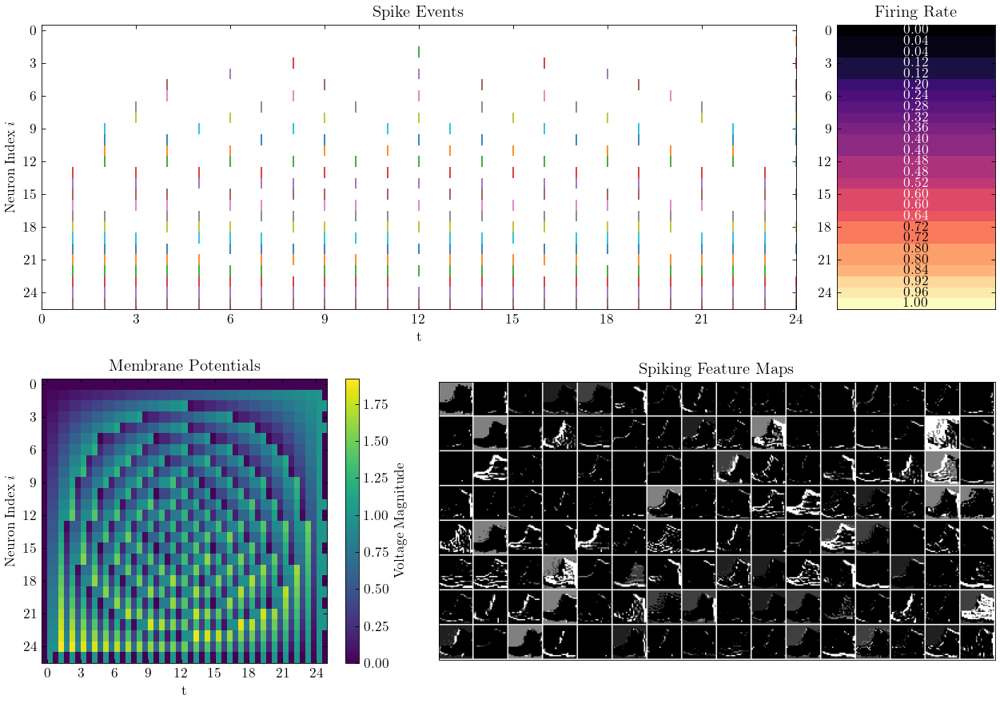
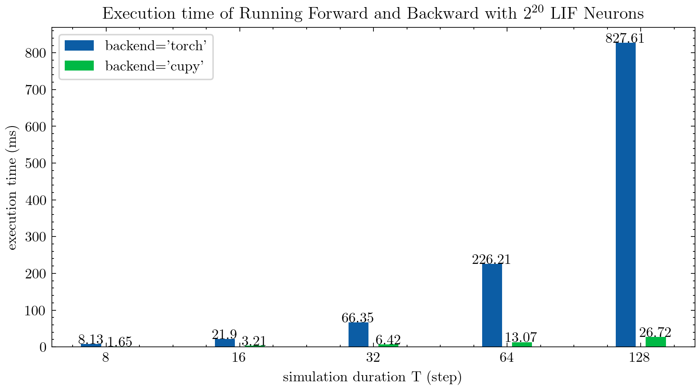

# SpikingJelly

[中文](./README_cn.md) | English

[](https://pypi.org/project/spikingjelly)
[](https://pypi.org/project/spikingjelly)
[](https://spikingjelly.readthedocs.io/zh_CN/latest)
[](https://github.com/fangwei123456/spikingjelly/graphs/contributors)




## Contents

- [Why SpikingJelly](#why-spikingjelly)
- [Installation](#installation)
- [Quick Start](#quick-start)
- [Core Capabilities](#core-capabilities)
  - [Backend Performance](#backend-performance)
  - [Large-Scale SNN Systems](#large-scale-snn-systems)
  - [Datasets](#datasets)
  - [Interchange and Deployment](#interchange-and-deployment)
- [Project Status and Version Notes](#project-status-and-version-notes)
- [Acknowledgement](#acknowledgement)
- [Contributing](#contributing)
- [Citation](#citation)

## Why SpikingJelly

SpikingJelly is a PyTorch-native framework for spiking neural networks (SNNs), with support for large-scale SNN training and inference.

- Beginner-friendly API
- ANN2SNN conversion
- Event-based datasets
- Acceleration backends: `torch`, `cupy`, `triton`
- Memory-efficient training, distributed execution, precision control
- Hardware deployment and framework exchange

## Installation

SpikingJelly is built on PyTorch. Install [PyTorch, torchvision, and torchaudio](https://pytorch.org/) first.

- Python `>=3.11`
- PyTorch `>=2.6.0` (tested with `2.7.1`)

Install the latest stable release `0.0.0.0.15`:

```bash
pip install spikingjelly
```

Install the latest development version from source:

```bash
git clone https://github.com/fangwei123456/spikingjelly.git
cd spikingjelly
pip install .
```

Optional dependencies:

| Feature | Install |
| --- | --- |
| CuPy backend | `pip install cupy-cuda12x` or `pip install cupy-cuda11x` |
| Triton backend | `pip install triton==3.3.1` |
| NIR exchange | `pip install nir nirtorch` |
| Lightning integration | `pip install lightning jsonargparse[signatures]` |

Version note: SpikingJelly uses a `0.0.0.0.X` scheme where odd `X` tracks development versions and even `X` tracks stable releases.

## Quick Start

Define an SNN in the same way that you would define any PyTorch model:

```python
from torch import nn
from spikingjelly.activation_based import layer, neuron, surrogate

net = nn.Sequential(
    layer.Flatten(),
    layer.Linear(28 * 28, 10, bias=False),
    neuron.LIFNode(tau=2.0, surrogate_function=surrogate.ATan())
)
```

Next steps:

- [Learn about spiking neurons](https://spikingjelly.readthedocs.io/zh_CN/latest/tutorials/en/neuron.html)
- [Train on event-based datasets](https://spikingjelly.readthedocs.io/zh_CN/latest/tutorials/en/classify_dvsg.html)
- [Convert ANN to SNN](https://spikingjelly.readthedocs.io/zh_CN/latest/tutorials/en/ann2snn.html)

## Core Capabilities

| Area | What SpikingJelly provides |
| --- | --- |
| SNN modeling | Activation-based SNN components: spiking neurons, surrogate gradients, stateful and stateless modules. Predefined SNN models. |
| Training workflows | PyTorch-native training flows, online-learning utilities, and ANN2SNN conversion |
| Performance | `torch`, `cupy`, and `triton` backends, FlexSN for customized neuron kernels, and mixed-precision training utilities (e.g., `fp8`) |
| Scaling | Memory-efficient training, and distributed training |
| Datasets | Neuromorphic datasets, and data preprocessing pipelines |
| Analysis | FLOPs / SynOps / memory-access profiling, and inference energy estimation |
| Interchange and deployment | NIR, Lava, and Lynxi-oriented exchange interfaces for neuromorphic workflows |

### Backend Performance

Spiking neuron models run on `torch`, `cupy`, or `triton` backends. The backend is set at neuron creation and can be changed later. The selected backend is respected explicitly: choosing `backend="torch"` or `backend="cupy"` does not silently upgrade execution to Triton. All backends are compatible with `torch.compile`.

Below: execution time comparison for multi-step LIF neurons on `torch` vs `cupy`. Triton is covered in the backend tutorials.



### Large-Scale SNN Systems

For large-scale SNN systems, SpikingJelly provides:

- Memory-efficient training with spike compression (`memopt`)
- Experimental distributed execution for multi-GPU workloads
- Precision policy tools for large-scale training and inference
- Spiking transformer components

### Datasets

SpikingJelly includes the following event-based and neuromorphic datasets: 

- [ASL-DVS](https://openaccess.thecvf.com/content_ICCV_2019/html/Bi_Graph-Based_Object_Classification_for_Neuromorphic_Vision_Sensing_ICCV_2019_paper.html)
- [Bullying10K](https://proceedings.neurips.cc/paper_files/paper/2023/file/05ffe69463062b7f9fb506c8351ffdd7-Paper-Datasets_and_Benchmarks.pdf)
- [CIFAR10-DVS](https://www.frontiersin.org/journals/neuroscience/articles/10.3389/fnins.2017.00309/full)
- [DVS-Lip](https://openaccess.thecvf.com/content/CVPR2022/html/Tan_Multi-Grained_Spatio-Temporal_Features_Perceived_Network_for_Event-Based_Lip-Reading_CVPR_2022_paper.html)
- [DVS128 Gesture](https://openaccess.thecvf.com/content_cvpr_2017/html/Amir_A_Low_Power_CVPR_2017_paper.html)
- [ES-ImageNet](https://www.frontiersin.org/articles/10.3389/fnins.2021.726582/full)
- [HARDVS](https://arxiv.org/abs/2211.09648)
- [N-Caltech101](https://www.frontiersin.org/articles/10.3389/fnins.2015.00437/full)
- [N-MNIST](https://www.frontiersin.org/articles/10.3389/fnins.2015.00437/full)
- [Nav Gesture](https://www.frontiersin.org/articles/10.3389/fnins.2020.00275/full)
- [SHD](https://doi.org/10.1109/TNNLS.2020.3044364)
- [SSC](https://doi.org/10.1109/TNNLS.2020.3044364)
- [Speech Commands](https://arxiv.org/abs/1804.03209)

Each dataset supports raw event access and frame representations. See the [neuromorphic datasets tutorial](https://spikingjelly.readthedocs.io/zh_CN/latest/tutorials/en/neuromorphic_datasets.html) for the full workflow.

### Interchange and Deployment

Export SpikingJelly models to neuromorphic hardware or other frameworks:

- [NIR exchange](https://spikingjelly.readthedocs.io/zh_CN/latest/tutorials/en/nir_exchange.html)
- [Lava exchange](https://spikingjelly.readthedocs.io/zh_CN/latest/tutorials/en/lava_exchange.html)
- [Lynxi deployment](https://spikingjelly.readthedocs.io/zh_CN/latest/tutorials/cn/inference_on_lynxi.html)

## Project Status and Version Notes

**Development / release policy:**

Odd version numbers track the development branch on GitHub / OpenI. Even version numbers are stable releases published to PyPI.

<details>
<summary>Compatibility, migration, and older docs</summary>

- From `0.0.0.0.14`, modules including `clock_driven` and `event_driven` were renamed. See [Migrate From Old Versions](https://spikingjelly.readthedocs.io/zh_CN/0.0.0.0.14/activation_based_en/migrate_from_legacy.html).
- The default documentation points to the latest development version.
- If you rely on an older release, check [bugs.md](./bugs.md) and switch to the matching documentation version.

Historical documentation:

- [zero](https://spikingjelly.readthedocs.io/zh_CN/zero/)
- [0.0.0.0.4](https://spikingjelly.readthedocs.io/zh_CN/0.0.0.0.4/#index-en)
- [0.0.0.0.6](https://spikingjelly.readthedocs.io/zh_CN/0.0.0.0.6/#index-en)
- [0.0.0.0.8](https://spikingjelly.readthedocs.io/zh_CN/0.0.0.0.8/#index-en)
- [0.0.0.0.10](https://spikingjelly.readthedocs.io/zh_CN/0.0.0.0.10/#index-en)
- [0.0.0.0.12](https://spikingjelly.readthedocs.io/zh_CN/0.0.0.0.12/#index-en)
- [0.0.0.0.14](https://spikingjelly.readthedocs.io/zh_CN/0.0.0.0.14/#index-en)
- [latest](https://spikingjelly.readthedocs.io/zh_CN/latest/#index-en)

</details>

## Acknowledgement

### Maintainers

Current maintainers (since July 2024):

- [Yifan Huang](https://github.com/AllenYolk)
- [Peng Xue](https://github.com/PengXue0812)

Previous core maintainers (before July 2024):

- [Wei Fang](https://github.com/fangwei123456)
- [Yanqi Chen](https://github.com/Yanqi-Chen)
- [Jianhao Ding](https://github.com/DingJianhao)
- [Ding Chen](https://github.com/lucifer2859)
- [Liwei Huang](https://github.com/Grasshlw)

### Contributors

The full contributor list is on the [contributors page](https://github.com/fangwei123456/spikingjelly/graphs/contributors).

<a href="https://github.com/fangwei123456/spikingjelly/graphs/contributors">
  
</a>

### Institutes

The main institutions behind SpikingJelly are [Multimedia Learning Group, Institute of Digital Media (NELVT), Peking University](https://pkuml.org/) and [Peng Cheng Laboratory](http://www.szpclab.com/).

<p align="center">
  
  
</p>

### Community and related links

- [Documentation](https://spikingjelly.readthedocs.io/)
- [Contributing Guide](./CONTRIBUTING.md)
- [Issues and development discussion](https://github.com/fangwei123456/spikingjelly/issues)
- [OpenI mirror](https://openi.pcl.ac.cn/OpenI/spikingjelly)
- [Community Jupyter tutorials in Chinese](https://github.com/fangwei123456/spikingjelly/tree/8932ac0668fe19b3efd0afedb3ca454cd8c126d3/community_tutorials/jupyter/chinese)

## Contributing

We welcome issues, pull requests, documentation improvements, and translations.

- Read the [Contributing Guide](./CONTRIBUTING.md).
- Check [issues](https://github.com/fangwei123456/spikingjelly/issues) for ongoing work.
- API docs are not fully bilingual yet; translation contributions are especially welcome.

## Citation

Publications using SpikingJelly are listed on the [documentation page](https://spikingjelly.readthedocs.io/zh_CN/latest/publications.html). The source of truth in this repository is [publications.json](./publications.json).

If you use SpikingJelly in your work, please cite:

```bibtex
@article{
doi:10.1126/sciadv.adi1480,
author = {Wei Fang and Yanqi Chen and Jianhao Ding and Zhaofei Yu and Timothee Masquelier and Ding Chen and Liwei Huang and Huihui Zhou and Guoqi Li and Yonghong Tian},
title = {SpikingJelly: An open-source machine learning infrastructure platform for spike-based intelligence},
journal = {Science Advances},
volume = {9},
number = {40},
pages = {eadi1480},
year = {2023},
doi = {10.1126/sciadv.adi1480},
url = {https://www.science.org/doi/abs/10.1126/sciadv.adi1480},
eprint = {https://www.science.org/doi/pdf/10.1126/sciadv.adi1480}
}
```
