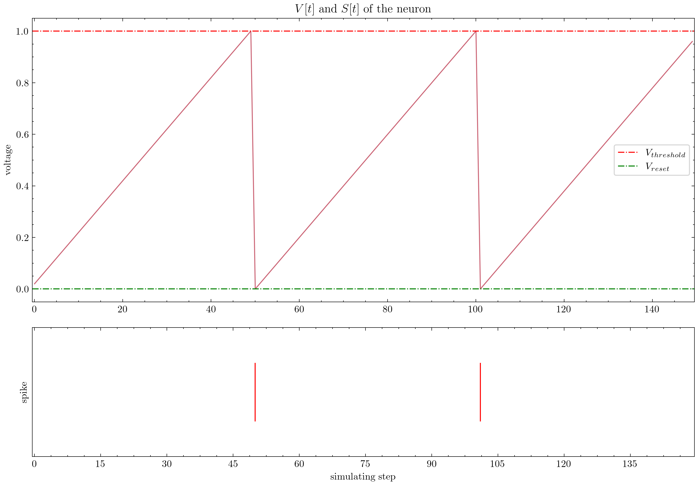
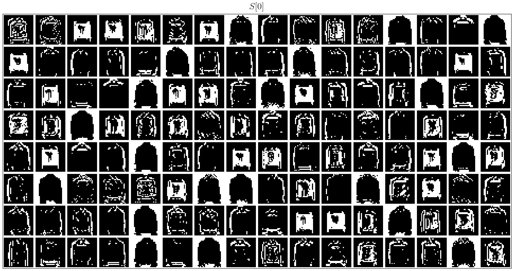

# 惊蜇(SpikingJelly)


[](https://spikingjelly.readthedocs.io/zh_CN/latest)
[](https://pypi.org/project/spikingjelly)
[](https://pypi.org/project/spikingjelly)


[English](./README.md) | 中文


[SpikingJelly](https://github.com/fangwei123456/spikingjelly) 是一个基于 [PyTorch](https://pytorch.org/) ，使用脉冲神经网络(Spiking Neural Network, SNN)进行深度学习的框架。

SpikingJelly的[文档](https://spikingjelly.readthedocs.io)使用中英双语编写。

- [更新日志](#更新日志)
- [安装](#安装)
- [以前所未有的简单方式搭建SNN](#以前所未有的简单方式搭建snn)
- [快速好用的ANN-SNN转换](#快速好用的ann-snn转换)
- [CUDA增强的神经元](#cuda或triton增强的神经元)
- [设备支持](#设备支持)
- [神经形态数据集支持](#神经形态数据集支持)
- [教程](#教程)
- [出版物与引用](#出版物与引用)
- [贡献](#贡献)
- [项目信息](#项目信息)

## 更新日志

我们正在积极维护和改进 SpikingJelly。以下是未来的计划以及各版本的亮点。

**版本亮点**

在latest版本（Github版本）中，

- 已添加`IFNode`，`LIFNode`和`ParametricLIFNode`的 [Triton](https://github.com/triton-lang/triton) 后端；
- 已添加`FlexSN`，可将PyTorch神经元动力学转换到Triton内核；
- 已添加`SpikingSelfAttention`和`QKAttention`；
- 已添加`nir_exchange`；
- 已重构`spikingjelly.activation_based.layer`, `spikingjelly.activation_based.functional`和`spikingjelly.datasets`；
- 已重构数据集的实现。
- 已更新文档和教程。

**计划**

我们即将发布版本 `0.0.0.1.0`。

- [x] 添加[Triton](https://github.com/triton-lang/triton)后端以在GPU上进一步加速。
- [x] 添加一个将PyTorch脉冲神经元转换为Triton后端的转译器，该转译器将比现有的[`auto_cuda`](https://github.com/fangwei123456/spikingjelly/tree/master/spikingjelly/activation_based/cuda_kernel/auto_cuda)子包更灵活、易用。
- [x] 添加脉冲自注意力机制的实现。
- [x] 更新文档和教程。

其他长期计划包括：

- [x] 添加对[NIR](https://github.com/neuromorphs/NIR)的支持。
- [ ] 优化训练时的显存开销。
- [ ] 支持华为 NPU 加速。

如果想尝试前沿实验性功能，请查看我们的配套项目[flashsnn](https://github.com/AllenYolk/flash-snn)。今后，新功能将先在 flashsnn中原型化，待技术成熟后再合并到SpikingJelly。

**版本说明**

- 奇数版本是开发版，随着GitHub/OpenI不断更新。偶数版本是稳定版，可以从PyPI获取。

- 默认的文档与最新的开发版匹配，如果你使用的是稳定版，不要忘记切换到对应的文档版本。

- 自`0.0.0.0.14`版本开始，包括`clock_driven`和 `event_driven`在内的模块被重命名了，请参考教程[从老版本迁移](https://spikingjelly.readthedocs.io/zh_CN/0.0.0.0.14/activation_based/migrate_from_legacy.html)。

- 如果使用老版本的SpikingJelly，则有可能遇到一些致命的bugs。参见[Bugs History with Releases](./bugs.md) 。推荐使用最新的稳定版或开发版。

**不同版本的文档：**

- [zero](https://spikingjelly.readthedocs.io/zh_CN/zero/)
- [0.0.0.0.4](https://spikingjelly.readthedocs.io/zh_CN/0.0.0.0.4/)
- [0.0.0.0.6](https://spikingjelly.readthedocs.io/zh_CN/0.0.0.0.6/)
- [0.0.0.0.8](https://spikingjelly.readthedocs.io/zh_CN/0.0.0.0.8/)
- [0.0.0.0.10](https://spikingjelly.readthedocs.io/zh_CN/0.0.0.0.10/)
- [0.0.0.0.12](https://spikingjelly.readthedocs.io/zh_CN/0.0.0.0.12/)
- [0.0.0.0.14](https://spikingjelly.readthedocs.io/zh_CN/0.0.0.0.14/)
- [latest](https://spikingjelly.readthedocs.io/zh_CN/latest/)

## 安装

注意，SpikingJelly是基于PyTorch的。安装SpikingJelly前，请先确保环境中已经安装了[PyTorch、torchvision和torchaudio](https://pytorch.org)。最新版的SpikingJelly依赖`torch>=2.2.0`；所有测试均在`torch==2.7.1`上进行。

**从** [**PyPI**](https://pypi.org/project/spikingjelly/) **安装最新的稳定版本**：

```bash
pip install spikingjelly
```

**从源代码安装最新的开发版**：

通过[GitHub](https://github.com/fangwei123456/spikingjelly)：

```bash
git clone https://github.com/fangwei123456/spikingjelly.git
cd spikingjelly
pip install .
```

通过[OpenI](https://openi.pcl.ac.cn/OpenI/spikingjelly):

```bash
git clone https://openi.pcl.ac.cn/OpenI/spikingjelly.git
cd spikingjelly
pip install .
```

**可选依赖**

若想使用`cupy`后端，需安装[CuPy](https://docs.cupy.dev/en/stable/install.html#installing-cupy)。

```bash
pip install cupy-cuda12x # for CUDA 12.x
pip install cupy-cuda11x # for CUDA 11.x
```

若想使用`triton`后端，请确保安装了[Triton](https://github.com/triton-lang/triton)。通常，在安装 PyTorch 2.X 时，`triton`会被作为依赖项而自动安装。针对`triton`后端的测试均在`triton==3.3.1`上进行。

```bash
pip install triton==3.3.1
```

若想使用`nir_exchange`功能，请安装[NIR](https://github.com/neuromorphs/NIR)和[NIRTorch](https://github.com/neuromorphs/NIRTorch)。

```bash
pip install nir nirtorch
```

## 以前所未有的简单方式搭建SNN

SpikingJelly非常易于使用。使用SpikingJelly搭建SNN，就像使用PyTorch搭建ANN一样简单：

```python
nn.Sequential(
    layer.Flatten(),
    layer.Linear(28 * 28, 10, bias=False),
    neuron.LIFNode(tau=tau, surrogate_function=surrogate.ATan())
)
```

这个简单的网络，使用泊松编码器，在MNIST的测试集上可以达到92%的正确率。 更多信息，参见教程。您还可以在Python中运行以下代码，以使用转换后的模型对MNIST进行分类：

```python
python -m spikingjelly.activation_based.examples.lif_fc_mnist -tau 2.0 -T 100 -device cuda:0 -b 64 -epochs 100 -data-dir <PATH to MNIST> -amp -opt adam -lr 1e-3 -j 8
```

## 快速好用的ANN-SNN转换

SpikingJelly实现了一个相对通用的ANN-SNN转换接口。此外，用户可以自定义转换模块以添加到转换中。

```python
class ANN(nn.Module):
    def __init__(self):
        super().__init__()
        self.network = nn.Sequential(
            nn.Conv2d(1, 32, 3, 1),
            nn.BatchNorm2d(32, eps=1e-3),
            nn.ReLU(),
            nn.AvgPool2d(2, 2),

            nn.Conv2d(32, 32, 3, 1),
            nn.BatchNorm2d(32, eps=1e-3),
            nn.ReLU(),
            nn.AvgPool2d(2, 2),

            nn.Conv2d(32, 32, 3, 1),
            nn.BatchNorm2d(32, eps=1e-3),
            nn.ReLU(),
            nn.AvgPool2d(2, 2),

            nn.Flatten(),
            nn.Linear(32, 10),
            nn.ReLU()
        )

    def forward(self,x):
        x = self.network(x)
        return x
```

在MNIST测试数据集上进行收敛之后，这种具有模拟编码的简单网络可以达到98.51％的精度。有关更多详细信息，请阅读教程。可以在Python命令行中通过如下命令，在MNIST上使用ANN2SNN：

```python
>>> import spikingjelly.activation_based.ann2snn.examples.cnn_mnist as cnn_mnist
>>> cnn_mnist.main()
```

## CUDA或Triton增强的神经元

SpikingJelly为部分神经元提供给了多种后端。可以使用对用户友好的`torch`后端进行快速开发，并使用`cupy`或`triton`后端进行高效训练。

下图对比了`torch`和`cupy`后端的LIF神经元 (`float32`) 在多步模式下的运行时长。根据我们的经验，`triton`后端的速度持平、乃至高于`cupy`后端。


`cupy`和`triton`后端同样接支持`float16`，并且可以在[自动混合精度训练](https://pytorch.org/docs/stable/notes/amp_examples.html)中使用。

若想使用`cupy`后端，请安装 [CuPy](https://docs.cupy.dev/en/stable/install.html)。若想使用`triton`后端，请安装 [Triton](https://triton-lang.org/main/index.html)。`cupy`和`triton`后端仅支持GPU，而`torch`后端同时支持CPU和GPU。

## 设备支持

- [x] Nvidia GPU
- [x] CPU
- [ ] Huawei NPU

像使用PyTorch一样简单。

```python
>>> net = nn.Sequential(layer.Flatten(), layer.Linear(28 * 28, 10, bias=False), neuron.LIFNode(tau=tau))
>>> net = net.to(device) # Can be CPU or CUDA devices
```

## 神经形态数据集支持

SpikingJelly 已经将下列数据集纳入：

| 数据集 | 来源 |
| ------------------------------- | ------------------------------------------------------------ |
| ASL-DVS | [Graph-based Object Classification for Neuromorphic Vision Sensing](https://openaccess.thecvf.com/content_ICCV_2019/html/Bi_Graph-Based_Object_Classification_for_Neuromorphic_Vision_Sensing_ICCV_2019_paper.html) |
| Bullying10K | [Bullying10K: A Large-Scale Neuromorphic Dataset towards Privacy-Preserving Bullying Recognition](https://proceedings.neurips.cc/paper_files/paper/2023/file/05ffe69463062b7f9fb506c8351ffdd7-Paper-Datasets_and_Benchmarks.pdf) |
| CIFAR10-DVS | [CIFAR10-DVS: An Event-Stream Dataset for Object Classification](https://internal-journal.frontiersin.org/articles/10.3389/fnins.2017.00309/full) |
| DVS-Lip | [Multi-Grained Spatio-Temporal Features Perceived Network for Event-Based Lip-Reading](https://openaccess.thecvf.com/content/CVPR2022/html/Tan_Multi-Grained_Spatio-Temporal_Features_Perceived_Network_for_Event-Based_Lip-Reading_CVPR_2022_paper.html) |
| DVS128 Gesture | [A Low Power, Fully Event-Based Gesture Recognition System](https://openaccess.thecvf.com/content_cvpr_2017/html/Amir_A_Low_Power_CVPR_2017_paper.html) |
| ES-ImageNet | [ES-ImageNet: A Million Event-Stream Classification Dataset for Spiking Neural Networks](https://www.frontiersin.org/articles/10.3389/fnins.2021.726582/full) |
| HARDVS | [HARDVS: Revisiting Human Activity Recognition with Dynamic Vision Sensors](https://arxiv.org/abs/2211.09648) |
| N-Caltech101 | [Converting Static Image Datasets to Spiking Neuromorphic Datasets Using Saccades](https://www.frontiersin.org/articles/10.3389/fnins.2015.00437/full) |
| N-MNIST | [Converting Static Image Datasets to Spiking Neuromorphic Datasets Using Saccades](https://www.frontiersin.org/articles/10.3389/fnins.2015.00437/full) |
| Nav Gesture | [Event-Based Gesture Recognition With Dynamic Background Suppression Using Smartphone Computational Capabilities](https://www.frontiersin.org/articles/10.3389/fnins.2020.00275/full) |
| Spiking Heidelberg Digits (SHD) | [The Heidelberg Spiking Data Sets for the Systematic Evaluation of Spiking Neural Networks](https://doi.org/10.1109/TNNLS.2020.3044364) |
| Spiking Speech Commands (SSC) | [The Heidelberg Spiking Data Sets for the Systematic Evaluation of Spiking Neural Networks](https://doi.org/10.1109/TNNLS.2020.3044364) |
| Speech Commands | [Speech Commands: A Dataset for Limited-Vocabulary Speech Recognition](https://arxiv.org/abs/1804.03209) |

用户可以轻松使用事件数据，或由SpikingJelly积分生成的帧数据：

```python
import torch
from torch.utils.data import DataLoader
from spikingjelly.datasets.utils import pad_sequence_collate, padded_sequence_mask
from spikingjelly.datasets import DVS128Gesture
root_dir = 'D:/datasets/DVS128Gesture'
event_set = DVS128Gesture(root_dir, train=True, data_type='event')
event, label = event_set[0]
for k in event.keys():
    print(k, event[k])

# t [80048267 80048277 80048278 ... 85092406 85092538 85092700]
# x [49 55 55 ... 60 85 45]
# y [82 92 92 ... 96 86 90]
# p [1 0 0 ... 1 0 0]
# label 0

fixed_frames_number_set = DVS128Gesture(root_dir, train=True, data_type='frame', frames_number=20, split_by='number')
rand_index = torch.randint(low=0, high=fixed_frames_number_set.__len__(), size=[2])
for i in rand_index:
    frame, label = fixed_frames_number_set[i]
    print(f'frame[{i}].shape=[T, C, H, W]={frame.shape}')

# frame[308].shape=[T, C, H, W]=(20, 2, 128, 128)
# frame[453].shape=[T, C, H, W]=(20, 2, 128, 128)

fixed_duration_frame_set = DVS128Gesture(root_dir, data_type='frame', duration=1000000, train=True)
for i in range(5):
    x, y = fixed_duration_frame_set[i]
    print(f'x[{i}].shape=[T, C, H, W]={x.shape}')

# x[0].shape=[T, C, H, W]=(6, 2, 128, 128)
# x[1].shape=[T, C, H, W]=(6, 2, 128, 128)
# x[2].shape=[T, C, H, W]=(5, 2, 128, 128)
# x[3].shape=[T, C, H, W]=(5, 2, 128, 128)
# x[4].shape=[T, C, H, W]=(7, 2, 128, 128)

train_data_loader = DataLoader(fixed_duration_frame_set, collate_fn=pad_sequence_collate, batch_size=5)
for x, y, x_len in train_data_loader:
    print(f'x.shape=[N, T, C, H, W]={tuple(x.shape)}')
    print(f'x_len={x_len}')
    mask = padded_sequence_mask(x_len)  # mask.shape = [T, N]
    print(f'mask=\n{mask.t().int()}')
    break

# x.shape=[N, T, C, H, W]=(5, 7, 2, 128, 128)
# x_len=tensor([6, 6, 5, 5, 7])
# mask=
# tensor([[1, 1, 1, 1, 1, 1, 0],
#         [1, 1, 1, 1, 1, 1, 0],
#         [1, 1, 1, 1, 1, 0, 0],
#         [1, 1, 1, 1, 1, 0, 0],
#         [1, 1, 1, 1, 1, 1, 1]], dtype=torch.int32)
```

未来将会纳入更多数据集。

如果用户无法下载某些数据集，可以尝试从[OpenI的数据集镜像](https://openi.pcl.ac.cn/OpenI/spikingjelly/datasets?type=0)下载：

只有原始数据集所使用的协议允许分发，或原始数据集作者已经同意分发的数据集才会被建立镜像。

## 教程

SpikingJelly精心准备了多项教程。下面展示了**部分**教程：

| 图例 | 教程 |
| ------------------------------------------------------------ | ------------------------------------------------------------ |
|  | [基本概念](https://spikingjelly.readthedocs.io/zh_CN/0.0.0.0.14/activation_based/basic_concept.html) |
|  | [神经元](https://spikingjelly.readthedocs.io/zh_CN/0.0.0.0.14/activation_based/neuron.html) |
|  | [使用单层全连接SNN识别MNIST](https://spikingjelly.readthedocs.io/zh_CN/0.0.0.0.14/activation_based/lif_fc_mnist.html) |
|  | [使用卷积SNN识别Fashion-MNIST](https://spikingjelly.readthedocs.io/zh_CN/0.0.0.0.14/activation_based/conv_fashion_mnist.html) |
|  | [ANN2SNN](https://spikingjelly.readthedocs.io/zh_CN/0.0.0.0.14/activation_based/ann2snn.html) |
|  | [神经形态数据集处理](https://spikingjelly.readthedocs.io/zh_CN/0.0.0.0.14/activation_based/neuromorphic_datasets.html) |
|  | [分类DVS128 Gesture](https://spikingjelly.readthedocs.io/zh_CN/0.0.0.0.14/activation_based/classify_dvsg.html) |
|  | [自连接和有状态突触](https://spikingjelly.readthedocs.io/zh_CN/0.0.0.0.14/activation_based/recurrent_connection_and_stateful_synapse.html) |
|  | [STDP学习](https://spikingjelly.readthedocs.io/zh_CN/0.0.0.0.14/activation_based/stdp.html) |
|  | [强化学习](https://spikingjelly.readthedocs.io/zh-cn/latest/tutorials/cn/ilc_san.html) |

其他没有列出在此处的教程可以在[文档](https://spikingjelly.readthedocs.io)中获取。

社区用户[赵振宇](https://github.com/15947470421)提供了[jupyter教程](https://github.com/fangwei123456/spikingjelly/tree/8932ac0668fe19b3efd0afedb3ca454cd8c126d3/community_tutorials/jupyter/chinese)。

## 出版物与引用

[出版物列表](./publications.md)中保存了已知的使用惊蜇(SpikingJelly)的出版物。如果你的文章也使用了惊蜇(SpikingJelly)，可以通过提交pull request的方式来更新出版物列表。

如果您在自己的工作中用到了惊蜇(SpikingJelly)，您可以按照下列格式进行引用：

```bibtex
@article{
doi:10.1126/sciadv.adi1480,
author = {Wei Fang  and Yanqi Chen  and Jianhao Ding  and Zhaofei Yu  and Timothée Masquelier  and Ding Chen  and Liwei Huang  and Huihui Zhou  and Guoqi Li  and Yonghong Tian },
title = {SpikingJelly: An open-source machine learning infrastructure platform for spike-based intelligence},
journal = {Science Advances},
volume = {9},
number = {40},
pages = {eadi1480},
year = {2023},
doi = {10.1126/sciadv.adi1480},
URL = {https://www.science.org/doi/abs/10.1126/sciadv.adi1480},
eprint = {https://www.science.org/doi/pdf/10.1126/sciadv.adi1480},
abstract = {Spiking neural networks (SNNs) aim to realize brain-inspired intelligence on neuromorphic chips with high energy efficiency by introducing neural dynamics and spike properties. As the emerging spiking deep learning paradigm attracts increasing interest, traditional programming frameworks cannot meet the demands of the automatic differentiation, parallel computation acceleration, and high integration of processing neuromorphic datasets and deployment. In this work, we present the SpikingJelly framework to address the aforementioned dilemma. We contribute a full-stack toolkit for preprocessing neuromorphic datasets, building deep SNNs, optimizing their parameters, and deploying SNNs on neuromorphic chips. Compared to existing methods, the training of deep SNNs can be accelerated 11×, and the superior extensibility and flexibility of SpikingJelly enable users to accelerate custom models at low costs through multilevel inheritance and semiautomatic code generation. SpikingJelly paves the way for synthesizing truly energy-efficient SNN-based machine intelligence systems, which will enrich the ecology of neuromorphic computing. Motivation and introduction of the software framework SpikingJelly for spiking deep learning.}}
```

注意：为了表明您所使用的框架代码版本，`note` 字段中的缺省日期 `YYYY-MM-DD` 应当被替换为您所使用的框架代码最近一次更新的日期（即最新一次commit的日期）。

## 贡献

可以通过阅读issues来获取目前尚未解决的问题和开发计划。我们非常欢迎各位用户参与讨论、解决问题和提交pull requests。

因开发者精力有限，惊蜇(SpikingJelly)的API文档并没有被中英双语完全覆盖，我们非常欢迎各位用户参与翻译补全工作（中译英、英译中）。

阅读[贡献指南](./CONTRIBUTING.md)以获取更多信息。

## 项目信息

### 机构

北京大学信息科学技术学院数字媒体所媒体学习组 [Multimedia Learning Group](https://pkuml.org/) 和 [鹏城实验室](https://www.pcl.ac.cn/) 是SpikingJelly的主要负责机构。

<p align="left">
    
    
</p>

### 主要开发者

SpikingJelly主要由以下开发者开发维护：

**2024.07~现在**

[黄一凡](https://github.com/AllenYolk), [薛鹏](https://github.com/PengXue0812)

**2019.12~2024.06**

[方维](https://github.com/fangwei123456), [陈彦骐](https://github.com/Yanqi-Chen), [丁健豪](https://github.com/DingJianhao), [陈鼎](https://github.com/lucifer2859), [黄力炜](https://github.com/Grasshlw)

### 感谢全体贡献者

贡献者名单可以在[这里](https://github.com/fangwei123456/spikingjelly/graphs/contributors)找到。

<a href="https://github.com/fangwei123456/spikingjelly/graphs/contributors">
  
</a>

<p align="right"><a href="#top"></a></p>