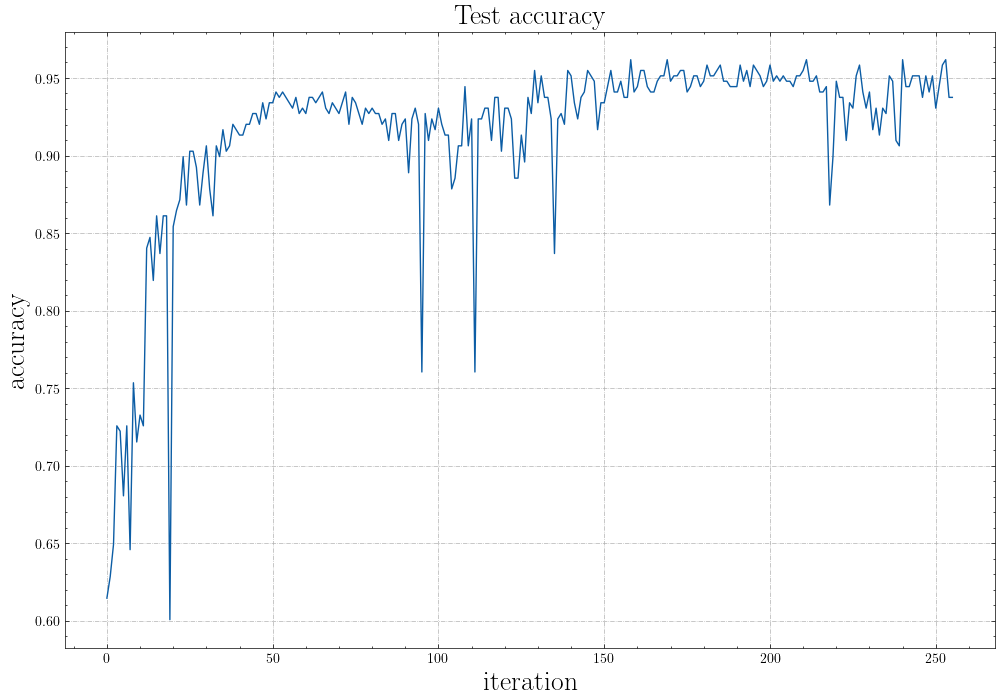

# 惊蜇(SpikingJelly)
 [](https://spikingjelly.readthedocs.io/zh_CN/latest) [](https://pypi.org/project/spikingjelly) [](https://pypi.org/project/spikingjelly) 

[English](./README.md) | 中文


[SpikingJelly](https://github.com/fangwei123456/spikingjelly) 是一个基于 [PyTorch](https://pytorch.org/) ，使用脉冲神经网络(Spiking Neural Network, SNN)进行深度学习的框架。

SpikingJelly的文档使用中英双语编写： https://spikingjelly.readthedocs.io

- [安装](#安装)
- [以前所未有的简单方式搭建SNN](#以前所未有的简单方式搭建SNN)
- [快速好用的ANN-SNN转换](#快速好用的ANN-SNN转换)
- [CUDA增强的神经元](#CUDA增强的神经元)
- [设备支持](#设备支持)
- [神经形态数据集支持](#神经形态数据集支持)
- [教程](#教程)
- [引用](#引用)
- [常见问题](#常见问题)
- [项目信息](#项目信息)

## 安装

注意，SpikingJelly是基于PyTorch的，需要确保环境中已经安装了PyTorch，才能安装SpikingJelly。

**从** [**PyPI**](https://pypi.org/project/spikingjelly/) **安装最新的稳定版本(0.0.0.0.4)**：

```bash
pip install spikingjelly
```

PyPI的安装包不包含CUDA扩展。如果想使用CUDA扩展，请**从源代码安装**：

通过[GitHub](https://github.com/fangwei123456/spikingjelly)：
```bash
git clone https://github.com/fangwei123456/spikingjelly.git
cd spikingjelly
git checkout 0.0.0.0.4  # 如果你不想使用master版本，则用此命令切换到最新的稳定版本
python setup.py install
```
通过[OpenI](https://git.openi.org.cn/OpenI/spikingjelly)：
```bash
git clone https://git.openi.org.cn/OpenI/spikingjelly.git
cd spikingjelly
git checkout 0.0.0.0.4  # 如果你不想使用master版本，则用此命令切换到最新的稳定版本
python setup.py install
```
从源代码安装时，会检测环境中是否已经安装CUDA。如果没有安装CUDA，则CUDA扩展也不会被安装。

## 以前所未有的简单方式搭建SNN

SpikingJelly非常易于使用。使用SpikingJelly搭建SNN，就像使用PyTorch搭建ANN一样简单：

```python
class Net(nn.Module):
    def __init__(self, tau=100.0, v_threshold=1.0, v_reset=0.0):
        super().__init__()
        # 网络结构，简单的双层全连接网络，每一层之后都是LIF神经元
        self.fc = nn.Sequential(
            nn.Flatten(),
            nn.Linear(28 * 28, 14 * 14, bias=False),
            neuron.LIFNode(tau=tau, v_threshold=v_threshold, v_reset=v_reset),
            nn.Linear(14 * 14, 10, bias=False),
            neuron.LIFNode(tau=tau, v_threshold=v_threshold, v_reset=v_reset)
        )

    def forward(self, x):
        return self.fc(x)
```

这个简单的网络，使用泊松编码器，在MNIST的测试集上可以达到92%的正确率。 更多信息，参见[时间驱动的教程](https://spikingjelly.readthedocs.io/zh_CN/latest/tutorial.clock_driven.html)。可以通过Python命令行直接运行这份代码，训练MNIST分类：

```python
>>> import spikingjelly.clock_driven.examples.lif_fc_mnist as lif_fc_mnist
>>> lif_fc_mnist.main()
```

阅读[spikingjelly.clock_driven.examples](https://spikingjelly.readthedocs.io/zh_CN/latest/spikingjelly.clock_driven.examples.html)以探索更多先进的神经网络！

## 快速好用的ANN-SNN转换

SpikingJelly实现了一个相对通用的ANN-SNN转换接口。用户可以通过PyTorch或ONNX软件包实现转换。此外，用户可以自定义转换模块以添加到转换中。

```python
class ANN(nn.Module):
    def __init__(self):
        super().__init__()
        self.network = nn.Sequential(
            nn.Conv2d(1, 32, 3, 1),
            nn.BatchNorm2d(32, eps=1e-3),
            nn.ReLU(),
            nn.AvgPool2d(2, 2),

            nn.Conv2d(32, 32, 3, 1),
            nn.BatchNorm2d(32, eps=1e-3),
            nn.ReLU(),
            nn.AvgPool2d(2, 2),

            nn.Conv2d(32, 32, 3, 1),
            nn.BatchNorm2d(32, eps=1e-3),
            nn.ReLU(),
            nn.AvgPool2d(2, 2),

            nn.Flatten(),
            nn.Linear(32, 10),
            nn.ReLU()
        )

    def forward(self,x):
        x = self.network(x)
        return x
```

在MNIST测试数据集上进行收敛之后，这种具有模拟编码的简单网络可以达到98.51％的精度。有关更多详细信息，请阅读[ann2snn的教程](https://spikingjelly.readthedocs.io/zh_CN/latest/clock_driven/5_ann2snn.html)。您还可以在Python中运行以下代码，以使用转换后的模型对MNIST进行分类：

```python
>>> import spikingjelly.clock_driven.ann2snn.examples.cnn_mnist as cnn_mnist
>>> cnn_mnist.main()
```

## CUDA增强的神经元

SpikingJelly 提供了2种版本的神经元：用户友好的PyTorch版本，以及速度更快的CUDA版本。下图对比了各种类型的LIF神经元的运行时长：


## 设备支持

-   [x] Nvidia GPU
-   [x] CPU

像使用PyTorch一样简单。

```python
>>> net = nn.Sequential(nn.Flatten(), nn.Linear(28 * 28, 10, bias=False), neuron.LIFNode(tau=tau))
>>> net = net.to(device) # Can be CPU or CUDA devices
```

## 神经形态数据集支持
SpikingJelly 已经将下列数据集纳入：

| 数据集         | 来源                                                         |
| -------------- | ------------------------------------------------------------ |
| ASL-DVS        | Graph-based Object Classification for Neuromorphic Vision Sensing |
| CIFAR10-DVS    | CIFAR10-DVS: An Event-Stream Dataset for Object Classification |
| DVS128 Gesture | A Low Power, Fully Event-Based Gesture Recognition System    |
| N-Caltech101   | Converting Static Image Datasets to Spiking Neuromorphic Datasets Using Saccades |
| N-MNIST        | Converting Static Image Datasets to Spiking Neuromorphic Datasets Using Saccades |

用户可以轻松使用事件数据，或由SpikingJelly积分生成的帧数据：

```python
from spikingjelly.datasets.dvs128_gesture import DVS128Gesture
root_dir = 'D:/datasets/DVS128Gesture'
event_set = DVS128Gesture(root_dir, train=True, data_type='event')
frame_set = DVS128Gesture(root_dir, train=True, data_type='frame', frames_number=20, split_by='number')
```

未来将会纳入更多数据集。

如果用户无法下载某些数据集，可以尝试从OpenI的数据集镜像下载：

https://git.openi.org.cn/OpenI/spikingjelly/datasets?type=0

只有原始数据集所使用的协议允许分发，或原始数据集作者已经同意分发的数据集才会被建立镜像。 

## 教程

SpikingJelly精心准备了多项教程。下面展示了部分教程：

| 图例                                                         | 教程                                                         |
| ------------------------------------------------------------ | ------------------------------------------------------------ |
|  | [神经元](https://spikingjelly.readthedocs.io/zh_CN/latest/clock_driven/0_neuron.html) |
|  | [编码器](https://spikingjelly.readthedocs.io/zh_CN/latest/clock_driven/2_encoding.html) |
|  | [使用单层全连接SNN识别MNIST](https://spikingjelly.readthedocs.io/zh_CN/latest/clock_driven/3_fc_mnist.html) |
|  | [使用卷积SNN识别Fashion-MNIST](https://spikingjelly.readthedocs.io/zh_CN/latest/clock_driven/4_conv_fashion_mnist.html) |
|  | [ANN2SNN](https://spikingjelly.readthedocs.io/zh_CN/latest/clock_driven/5_ann2snn.html) |
|  | [强化学习DQN](https://spikingjelly.readthedocs.io/zh_CN/latest/clock_driven/6_dqn_cart_pole.html) |
|  | [传播模式](https://spikingjelly.readthedocs.io/zh_CN/latest/clock_driven/10_propagation_pattern.html) |
|  | [神经形态数据集处理](https://spikingjelly.readthedocs.io/zh_CN/latest/clock_driven/13_neuromorphic_datasets.html) |
|  | [分类DVS128 Gesture](https://spikingjelly.readthedocs.io/zh_CN/latest/clock_driven/14_classify_dvsg.html) |

## 引用

如果您在自己的工作中用到了惊蜇(SpikingJelly)，您可以按照下列格式进行引用：

```
@misc{SpikingJelly,
	title = {SpikingJelly},
	author = {Fang, Wei and Chen, Yanqi and Ding, Jianhao and Chen, Ding and Yu, Zhaofei and Zhou, Huihui and Tian, Yonghong and other contributors},
	year = {2020},
	howpublished = {\url{https://github.com/fangwei123456/spikingjelly}},
	note = {Accessed: YYYY-MM-DD},
}
```

## 常见问题

### ModuleNotFoundError:No module named "\_C\_…"

"\_C\_..."模块是SpikingJelly中的CUDA扩展，例如"\_C\_neuron"是编译出的CUDA神经元的模块。注意，PyPI的安装包不包含CUDA扩展。如果需要使用CUDA扩展模块，请从源代码安装。

## 项目信息

北京大学信息科学技术学院数字媒体所媒体学习组 [Multimedia Learning Group](https://pkuml.org/) 和 [鹏城实验室](https://www.pcl.ac.cn/) 是SpikingJelly的主要开发者。


开发人员名单可以在[这里](https://github.com/fangwei123456/spikingjelly/graphs/contributors)找到。

欢迎各位开发者参与此框架的开发！
