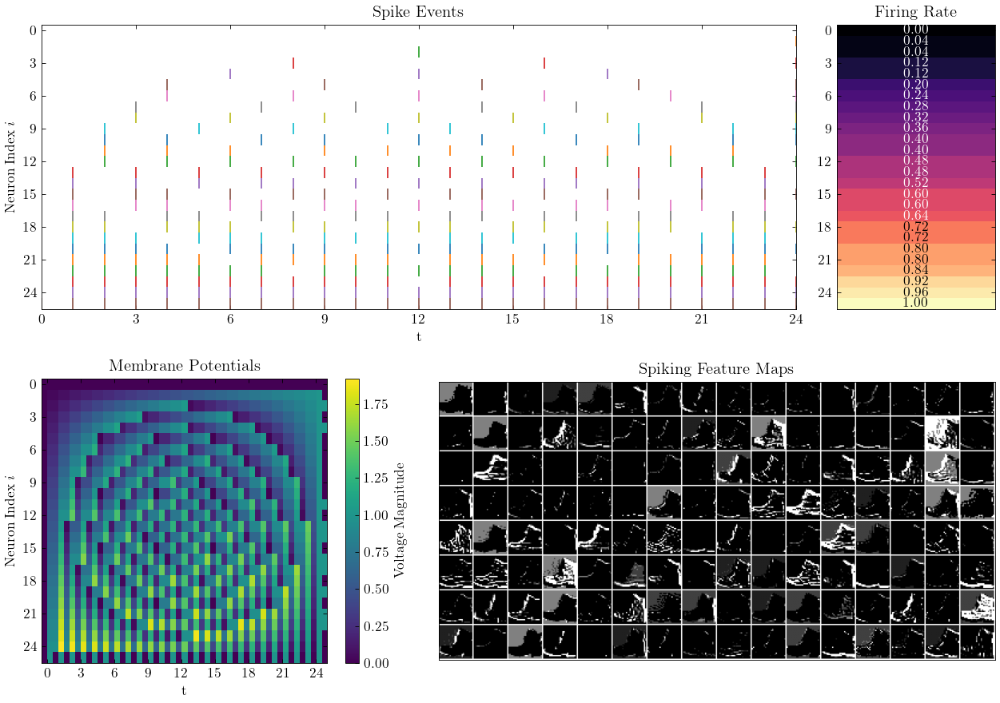

# 惊蜇 (SpikingJelly)

[English](./README.md) | 中文

[](https://pypi.org/project/spikingjelly)
[](https://pypi.org/project/spikingjelly)
[](https://spikingjelly.readthedocs.io/zh_CN/latest)
[](https://github.com/fangwei123456/spikingjelly/graphs/contributors)




## 目录

- [为什么用 SpikingJelly](#为什么用-spikingjelly)
- [安装](#安装)
- [快速开始](#快速开始)
- [核心能力](#核心能力)
  - [算子执行](#算子执行)
  - [大规模 SNN 系统](#大规模-snn-系统)
  - [数据集](#数据集)
  - [转换与部署](#转换与部署)
- [项目状态与版本说明](#项目状态与版本说明)
- [许可证](#许可证)
- [致谢](#致谢)
- [贡献](#贡献)
- [引用](#引用)

## 为什么用 SpikingJelly

SpikingJelly 是一个 PyTorch 原生的脉冲神经网络（SNN）框架，支持大规模 SNN 训练与推理。

- 对 SNN 新手友好
- ANN2SNN 转换
- 事件数据集
- 算子自动执行：Torch、Triton 和可选原生 CUDA
- 显存优化训练、分布式执行、精度控制
- 硬件部署与框架转换

## 安装

SpikingJelly 基于 PyTorch。请先安装 [PyTorch、torchvision 和 torchaudio](https://pytorch.org/)。

- Python `>=3.11`
- PyTorch `>=2.6.0`（测试使用 `2.7.1`）

安装最新 PyPI 稳定版：

```bash
uv pip install spikingjelly
```

安装已发布的 V2 先行版：

```bash
uv pip install --pre spikingjelly
```

从源码安装最新开发版：

```bash
git clone https://github.com/fangwei123456/spikingjelly.git
cd spikingjelly
uv pip install .
```

可选依赖：

| 功能 | 安装方式 |
| --- | --- |
| CUDA 自动执行（Triton） | `uv pip install "spikingjelly[triton]"` 或源码目录 `uv pip install --editable ".[triton]"` |
| NIR exchange | `uv pip install "spikingjelly[nir]"`（PyPI）或 `uv pip install ".[nir]"`（源码目录） |
| Lightning 集成 | `uv pip install lightning jsonargparse[signatures]` |

常规 wheel 不包含预编译原生 CUDA 动态库。可选本地构建需要先准备匹配的
CUDA 版 Torch、CUDA Toolkit（含 nvcc）、C++ 编译器、`setuptools>=77.0.3` 和 ninja：

```bash
SJ_BUILD_NATIVE_CUDA=1 uv pip install --no-build-isolation .
```

缺少工具链时给出提示并跳过扩展，实际编译失败会报错；运行时不编译原生 CUDA。
Triton 自身采用 JIT。不能假定所有平台的 CUDA Torch 都自带可用 Triton。
更换 Torch/CUDA 或目标 GPU 后可能需要重新构建原生扩展。

## 快速开始

定义一个 SNN 和定义普通 PyTorch 模型一样：

```python
from torch import nn
from spikingjelly.activation_based import layer, neuron, surrogate

net = nn.Sequential(
    layer.Flatten(),
    layer.Linear(28 * 28, 10, bias=False),
    neuron.LIFNode(tau=2.0, surrogate_function=surrogate.ATan())
)
```

下一步：

- [了解脉冲神经元](https://spikingjelly.readthedocs.io/zh_CN/latest/tutorials/cn/neuron.html)
- [训练事件数据集](https://spikingjelly.readthedocs.io/zh_CN/latest/tutorials/cn/classify_dvsg.html)
- [把 ANN 转成 SNN](https://spikingjelly.readthedocs.io/zh_CN/latest/tutorials/cn/ann2snn.html)

## 核心能力

| 方向 | SpikingJelly 提供什么 |
| --- | --- |
| SNN 建模 | activation-based SNN 组件、脉冲神经元、替代梯度、有状态与无状态模块，以及预定义 SNN 模型 |
| 训练工作流 | PyTorch 原生训练流程、在线学习工具、ANN2SNN 转换 |
| 性能 | Torch/Triton/原生 CUDA 自动执行、自定义神经元 FlexSN、以及混合精度训练工具（如 `fp8` 支持） |
| 扩展 | 显存优化训练和分布式训练 |
| 数据集 | 神经形态数据集和数据预处理流程 |
| 分析 | FLOPs / SynOps / 访存 profiling，以及推理能耗估算 |
| 转换与部署 | 面向神经形态工作流的 NIR、Lava、Lynxi 转换接口 |

### 算子执行

只需将模块和输入移动到目标设备。CPU 使用 Torch；CUDA eager 优先兼容的原生 CUDA，
Inductor 编译展开优先 Triton。CUDA Graph 保留被捕获函数预热后的选择。
神经元没有 backend 参数，也不依赖 CuPy。低精度状态等配置可能使用 Torch 参考路径。

常规 PyPI wheel 是纯 Python 包，包含 Torch 参考和可选 Triton 执行代码。
原生神经元、融合 IF/LIF-Linear 和 packed/sparse 投影可从源码本地构建。
未构建投影扩展时采用 Torch 参考公式；融合前向不物化中间脉冲的特性依赖原生扩展。
普通 Linear/Conv 的省显存训练使用 `memopt`，旧 `SpikeLinear/SpikeConv` 已删除。

使用、编译和诊断见[神经元自动执行教程](https://spikingjelly.readthedocs.io/zh_CN/latest/tutorials/cn/triton_backend.html)。

### 大规模 SNN 系统

面向大规模 SNN 系统，SpikingJelly 提供：

- 基于 `memopt` 的显存优化与 spike 压缩训练
- 实验性多 GPU 分布式执行
- 面向大规模训练和推理的精度策略工具
- Spiking Transformer 组件

### 数据集

SpikingJelly 内置以下事件数据和神经形态数据集：

- [ASL-DVS](https://openaccess.thecvf.com/content_ICCV_2019/html/Bi_Graph-Based_Object_Classification_for_Neuromorphic_Vision_Sensing_ICCV_2019_paper.html)
- [Bullying10K](https://proceedings.neurips.cc/paper_files/paper/2023/file/05ffe69463062b7f9fb506c8351ffdd7-Paper-Datasets_and_Benchmarks.pdf)
- [CIFAR10-DVS](https://www.frontiersin.org/journals/neuroscience/articles/10.3389/fnins.2017.00309/full)
- [DVS-Lip](https://openaccess.thecvf.com/content/CVPR2022/html/Tan_Multi-Grained_Spatio-Temporal_Features_Perceived_Network_for_Event-Based_Lip-Reading_CVPR_2022_paper.html)
- [DVS128 Gesture](https://openaccess.thecvf.com/content_cvpr_2017/html/Amir_A_Low_Power_CVPR_2017_paper.html)
- [ES-ImageNet](https://www.frontiersin.org/articles/10.3389/fnins.2021.726582/full)
- [HARDVS](https://arxiv.org/abs/2211.09648)
- [N-Caltech101](https://www.frontiersin.org/articles/10.3389/fnins.2015.00437/full)
- [N-MNIST](https://www.frontiersin.org/articles/10.3389/fnins.2015.00437/full)
- [Nav Gesture](https://www.frontiersin.org/articles/10.3389/fnins.2020.00275/full)
- [SHD](https://doi.org/10.1109/TNNLS.2020.3044364)
- [SSC](https://doi.org/10.1109/TNNLS.2020.3044364)
- [Speech Commands](https://arxiv.org/abs/1804.03209)

每个数据集都支持原始事件访问与帧表示。完整工作流请见[神经形态数据集教程](https://spikingjelly.readthedocs.io/zh_CN/latest/tutorials/cn/neuromorphic_datasets.html)。

### 转换与部署

将 SpikingJelly 模型导出到神经形态硬件或其他框架：

- [NIR exchange](https://spikingjelly.readthedocs.io/zh_CN/latest/tutorials/cn/nir_exchange.html)
- [Lava exchange](https://spikingjelly.readthedocs.io/zh_CN/latest/tutorials/cn/lava_exchange.html)
- [Lynxi exchange](https://spikingjelly.readthedocs.io/zh_CN/latest/tutorials/cn/inference_on_lynxi.html)

## 项目状态与版本说明

**开发 / 发布策略：**

从 SpikingJelly V2 起，发布版本采用兼容 PEP 440 的语义化风格
`MAJOR.MINOR.PATCH` 版本号。`MAJOR` 表示兼容性世代，`MINOR`
表示向后兼容的功能更新，`PATCH` 表示缺陷修复。V2 开发版和先行版使用
Python 包版本写法，例如 `2.0.0.dev0`、`2.0.0a1`、`2.0.0b1` 和
`2.0.0rc1`。

V2 版本更新记录见 [CHANGELOG.md](./CHANGELOG.md)。

<details>
<summary>兼容性、迁移说明与旧版文档</summary>

- V2 之前，SpikingJelly 使用历史遗留的 `0.0.0.0.X` 版本方案：奇数 `X` 对应 GitHub / OpenI 上的开发版，偶数 `X` 对应发布到 PyPI 的稳定版。
- 如果项目必须停留在 V2 之前的版本，请用类似 `spikingjelly<2` 的上界固定依赖。
- 从 `0.0.0.0.14` 起，`clock_driven`、`event_driven` 等模块已重命名。参见[从老版本迁移](https://spikingjelly.readthedocs.io/zh_CN/0.0.0.0.14/activation_based_en/migrate_from_legacy.html)。
- 默认文档对应最新开发版。
- 如果依赖老版本，请同时检查 [bugs.md](./bugs.md) 以及对应版本文档。

历史文档入口：

- [zero](https://spikingjelly.readthedocs.io/zh_CN/zero/)
- [0.0.0.0.4](https://spikingjelly.readthedocs.io/zh_CN/0.0.0.0.4/#index-en)
- [0.0.0.0.6](https://spikingjelly.readthedocs.io/zh_CN/0.0.0.0.6/#index-en)
- [0.0.0.0.8](https://spikingjelly.readthedocs.io/zh_CN/0.0.0.0.8/#index-en)
- [0.0.0.0.10](https://spikingjelly.readthedocs.io/zh_CN/0.0.0.0.10/#index-en)
- [0.0.0.0.12](https://spikingjelly.readthedocs.io/zh_CN/0.0.0.0.12/#index-en)
- [0.0.0.0.14](https://spikingjelly.readthedocs.io/zh_CN/0.0.0.0.14/#index-en)
- [latest](https://spikingjelly.readthedocs.io/zh_CN/latest/#index-en)

</details>

## 许可证

SpikingJelly 的项目许可证为 [Apache-2.0](./LICENSE)。第三方归属及许可条款汇总于
[LICENSES/NOTICE](./LICENSES/NOTICE)。适用范围与历史许可证见[许可证指南](./LICENSES/README.md)。

## 致谢

### 当前维护者

当前维护者（2024 年 7 月至今）：

- [黄一凡](https://github.com/AllenYolk)
- [薛鹏](https://github.com/PengXue0812)

前任核心维护者（2024 年 7 月以前）：

- [方维](https://github.com/fangwei123456)
- [陈彦骐](https://github.com/Yanqi-Chen)
- [丁健豪](https://github.com/DingJianhao)
- [陈鼎](https://github.com/lucifer2859)
- [黄力炜](https://github.com/Grasshlw)

### 贡献者

完整贡献者名单见[贡献者页面](https://github.com/fangwei123456/spikingjelly/graphs/contributors)。

<a href="https://github.com/fangwei123456/spikingjelly/graphs/contributors">
  
</a>

### 机构

SpikingJelly 的主要负责机构是北京大学信息科学技术学院数字媒体所媒体学习组 [Multimedia Learning Group](https://pkuml.org/) 与 [鹏城实验室](https://www.pcl.ac.cn/)。

<p align="center">
  
  
</p>

### 社区与相关入口

- [文档首页](https://spikingjelly.readthedocs.io/)
- [贡献指南](./CONTRIBUTING.md)
- [Issues 与开发讨论](https://github.com/fangwei123456/spikingjelly/issues)
- [OpenI 镜像](https://openi.pcl.ac.cn/OpenI/spikingjelly)
- [社区中文 Jupyter 教程](https://github.com/fangwei123456/spikingjelly/tree/8932ac0668fe19b3efd0afedb3ca454cd8c126d3/community_tutorials/jupyter/chinese)

<a href="https://star-history.com/#fangwei123456/spikingjelly&amp;Date">
  <picture>
    <source media="(prefers-color-scheme: dark)" srcset="https://api.star-history.com/svg?repos=fangwei123456/spikingjelly&amp;type=Date&amp;theme=dark" />
    
  </picture>
</a>

## 贡献

欢迎提交 issue、pull request、文档改进和翻译。

- 阅读[贡献指南](./CONTRIBUTING.md)。
- 查看 [issues](https://github.com/fangwei123456/spikingjelly/issues) 了解当前工作。
- API 文档尚未完全双语化，欢迎参与翻译补全。

## 引用

使用 SpikingJelly 的论文列表可见[文档页面](https://spikingjelly.readthedocs.io/zh_CN/latest/publications.html)。仓库中的数据来源为 [publications.json](./publications.json)。

如果您在工作中使用了 SpikingJelly，请引用：

```bibtex
@article{
doi:10.1126/sciadv.adi1480,
author = {Wei Fang and Yanqi Chen and Jianhao Ding and Zhaofei Yu and Timothee Masquelier and Ding Chen and Liwei Huang and Huihui Zhou and Guoqi Li and Yonghong Tian},
title = {SpikingJelly: An open-source machine learning infrastructure platform for spike-based intelligence},
journal = {Science Advances},
volume = {9},
number = {40},
pages = {eadi1480},
year = {2023},
doi = {10.1126/sciadv.adi1480},
url = {https://www.science.org/doi/abs/10.1126/sciadv.adi1480},
eprint = {https://www.science.org/doi/pdf/10.1126/sciadv.adi1480}
}
```
