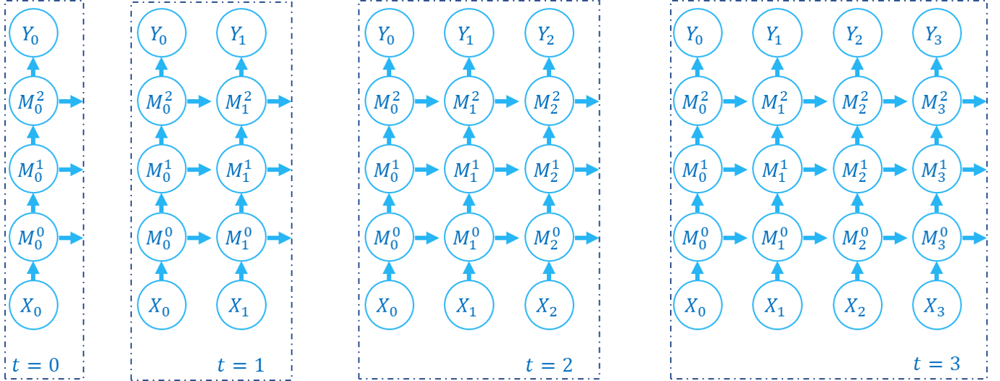
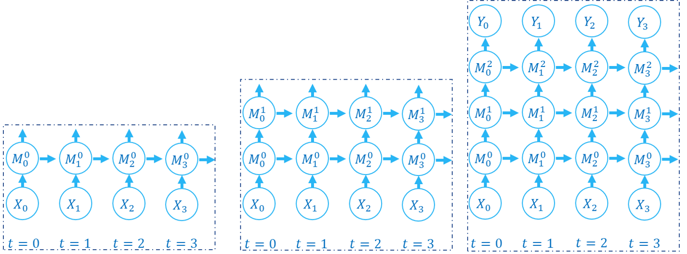

基本概念
=======================================
本教程作者： `fangwei123456 <https://github.com/fangwei123456>`_

本教程介绍了 ``spikingjelly.activation_based`` 的一些基本概念，推荐所有用户在使用SpikingJelly框架前进行阅读。

SpikingJelly框架是基于PyTorch的SNN深度学习框架，使用SpikingJelly框架的用户应该首先熟悉PyTorch的使用。\
如果用户对PyTorch不甚了解，我们推荐用户先学习 `PyTorch的基础教程 <https://pytorch.org/tutorials/>`_ 。

基于激活值的表示方法
-------------------------------------------
``spikingjelly.activation_based`` 使用取值仅为0或1的张量表示脉冲，例如：

.. code-block:: python

    import torch

    v = torch.rand([8])
    v_th = 0.5
    spike = (v >= v_th).to(v)
    print('spike =', spike)
    # spike = tensor([0., 0., 0., 1., 1., 0., 1., 0.])

数据格式
-------------------------------------------
在 ``spikingjelly.activation_based`` 中，数据有两种格式，分别为：

* 表示单个时刻的数据，其 ``shape = [N, *]``，其中 ``N`` 是batch维度，``*`` 表示任意额外的维度
* 表示多个时刻的数据，其 ``shape = [T, N, *]``，其中 ``T`` 是数据的时间维度， ``N`` 是batch维度，``*`` 表示任意额外的维度

步进模式
-------------------------------------------
``spikingjelly.activation_based`` 中的模块，具有两种传播模式，分别是单步模式(single-step)和多步模式(multi-step)。\
在单步模式下，数据使用 ``shape = [N, *]`` 的格式；而在多步模式下，数据使用 ``shape = [T, N, *]`` 的格式。

模块在初始化时可以指定其使用的步进模式 ``step_mode``，也可以在构建后直接进行修改：

.. code-block:: python
    
    import torch
    from spikingjelly.activation_based import neuron

    net = neuron.IFNode(step_mode='m')
    # 'm' is the multi-step mode
    net.step_mode = 's'
    # 's' is the single-step mode

如果我们想给单步模式的模块输入 ``shape = [T, N, *]`` 的序列数据，通常需要手动做一个时间上的循环，\
将数据拆成 ``T`` 个 ``shape = [N, *]`` 的数据并逐步输入进去。\
让我们新建一层IF神经元，设置为单步模式，将数据逐步输入并得到输出：

.. code-block:: python

    import torch
    from spikingjelly.activation_based import neuron

    net_s = neuron.IFNode(step_mode='s')
    T = 4
    N = 1
    C = 3
    H = 8
    W = 8
    x_seq = torch.rand([T, N, C, H, W])
    y_seq = []
    for t in range(T):
        x = x_seq[t]  # x.shape = [N, C, H, W]
        y = net_s(x)  # y.shape = [N, C, H, W]
        y_seq.append(y.unsqueeze(0))

    y_seq = torch.cat(y_seq)
    # y_seq.shape = [T, N, C, H, W]

:class:`multi_step_forward <spikingjelly.activation_based.functional.multi_step_forward>` 提供了将 ``shape = [T, N, *]`` 的序列数据输入到单步模块进行逐步的前向传播的封装，\
使用起来更加方便：

.. code-block:: python

    import torch
    from spikingjelly.activation_based import neuron, functional
    net_s = neuron.IFNode(step_mode='s')
    T = 4
    N = 1
    C = 3
    H = 8
    W = 8
    x_seq = torch.rand([T, N, C, H, W])
    y_seq = functional.multi_step_forward(x_seq, net_s)
    # y_seq.shape = [T, N, C, H, W]

但是，直接将模块设置成多步模块，其实更为便捷：

.. code-block:: python

    import torch
    from spikingjelly.activation_based import neuron

    net_m = neuron.IFNode(step_mode='m')
    T = 4
    N = 1
    C = 3
    H = 8
    W = 8
    x_seq = torch.rand([T, N, C, H, W])
    y_seq = net_m(x_seq)
    # y_seq.shape = [T, N, C, H, W]

为了保持与老版本SpikingJelly代码的兼容性，所有模块的默认步进模式都是单步。

状态的保存和重置
-------------------------------------------
SNN中的神经元等模块，与RNN类似，带有隐藏状态，其输出 :math:`Y[t]` 不仅仅与当前时刻的输入 :math:`X[t]` 有关，\
还与上一个时末的状态 :math:`H[t-1]` 有关，即 :math:`Y[t] = f(X[t], H[t-1])`。

PyTorch的设计为RNN将状态也一并输出，可以参考 :class:`torch.nn.RNN` 的API文档。而在 ``spikingjelly.activation_based`` 中，\
状态会被保存在模块内部。例如，我们新建一层IF神经元，设置为单步模式，查看给与输入前的默认电压，和给与输入后的电压：

.. code-block:: python

    import torch
    from spikingjelly.activation_based import neuron

    net_s = neuron.IFNode(step_mode='s')
    x = torch.rand([4])
    print(net_s)
    print(f'the initial v={net_s.v}')
    y = net_s(x)
    print(f'x={x}')
    print(f'y={y}')
    print(f'v={net_s.v}')

    # outputs are:

    '''
    IFNode(
    v_threshold=1.0, v_reset=0.0, detach_reset=False
    (surrogate_function): Sigmoid(alpha=4.0, spiking=True)
    )
    the initial v=0.0
    x=tensor([0.5543, 0.0350, 0.2171, 0.6740])
    y=tensor([0., 0., 0., 0.])
    v=tensor([0.5543, 0.0350, 0.2171, 0.6740])
    '''

在初始化后，IF神经元层的 ``v`` 会被设置为0，首次给与输入后 ``v`` 会自动广播到与输入相同的 ``shape``。

若我们给与一个新的输入，则应该先清除神经元之前的状态，让其恢复到初始化状态，可以通过调用模块的 ``self.reset()`` 函数实现：

.. code-block:: python

    import torch
    from spikingjelly.activation_based import neuron

    net_s = neuron.IFNode(step_mode='s')
    x = torch.rand([4])
    print(f'check point 0: v={net_s.v}')
    y = net_s(x)
    print(f'check point 1: v={net_s.v}')
    net_s.reset()
    print(f'check point 2: v={net_s.v}')
    x = torch.rand([8])
    y = net_s(x)
    print(f'check point 3: v={net_s.v}')

    # outputs are:

    '''
    check point 0: v=0.0
    check point 1: v=tensor([0.9775, 0.6598, 0.7577, 0.2952])
    check point 2: v=0.0
    check point 3: v=tensor([0.8728, 0.9031, 0.2278, 0.5089, 0.1059, 0.0479, 0.5008, 0.8530])
    '''

方便起见，还可以通过调用 :class:`spikingjelly.activation_based.functional.reset_net` 将整个网络中的所有有状态模块进行重置。

若网络使用了有状态的模块，在训练和推理时，务必在处理完毕一个batch的数据后进行重置：

.. code-block:: python

    from spikingjelly.activation_based import functional
    # ...
    for x, label in tqdm(train_data_loader):
        # ...
        optimizer.zero_grad()
        y = net(x)
        loss = criterion(y, label)
        loss.backward()
        optimizer.step()

        functional.reset_net(net)
        # Never forget to reset the network!

如果忘了重置，在推理时可能输出错误的结果，而在训练时则会直接报错：

.. code-block:: shell

    RuntimeError: Trying to backward through the graph a second time (or directly access saved variables after they have already been freed). 
    Saved intermediate values of the graph are freed when you call .backward() or autograd.grad(). 
    Specify retain_graph=True if you need to backward through the graph a second time or if you need to access saved variables after calling backward.

传播模式
-------------------------------------------
若一个网络全部由单步模块构成，则整个网络的计算顺序是按照逐步传播(step-by-step)的模式进行，例如：

.. code-block:: python

    for t in range(T):
        x = x_seq[t]
        y = net(x)
        y_seq_step_by_step.append(y.unsqueeze(0))

    y_seq_step_by_step = torch.cat(y_seq_step_by_step, 0)

如果网络全部由多步模块构成，则整个网络的计算顺序是按照逐层传播(layer-by-layer)的模式进行，例如：

.. code-block:: python 

    import torch
    import torch.nn as nn
    from spikingjelly.activation_based import neuron, functional, layer
    T = 4
    N = 2
    C = 8
    x_seq = torch.rand([T, N, C]) * 64.

    net = nn.Sequential(
        layer.Linear(C, 4),
        neuron.IFNode(),
        layer.Linear(4, 2),
        neuron.IFNode()
    )

    functional.set_step_mode(net, step_mode='m')
    with torch.no_grad():
        y_seq_layer_by_layer = x_seq
        for i in range(net.__len__()):
            y_seq_layer_by_layer = net[i](y_seq_layer_by_layer)

在绝大多数情况下我们不需要显式的实现 ``for i in range(net.__len__())`` 这样的循环，因为 :class:`torch.nn.Sequential` 已经帮我们实现过了，\
因此实际上我们可以这样做：

.. code-block:: python 
    
    y_seq_layer_by_layer = net(x_seq)

逐步传播和逐层传播，实际上只是计算顺序不同，它们的计算结果是完全相同的：

.. code-block:: python

    import torch
    import torch.nn as nn
    from spikingjelly.activation_based import neuron, functional, layer
    T = 4
    N = 2
    C = 3
    H = 8
    W = 8
    x_seq = torch.rand([T, N, C, H, W]) * 64.

    net = nn.Sequential(
    layer.Conv2d(3, 8, kernel_size=3, padding=1, stride=1, bias=False),
    neuron.IFNode(),
    layer.MaxPool2d(2, 2),
    neuron.IFNode(),
    layer.Flatten(start_dim=1),
    layer.Linear(8 * H // 2 * W // 2, 10),
    neuron.IFNode(),
    )

    print(f'net={net}')

    with torch.no_grad():
        y_seq_step_by_step = []
        for t in range(T):
            x = x_seq[t]
            y = net(x)
            y_seq_step_by_step.append(y.unsqueeze(0))

        y_seq_step_by_step = torch.cat(y_seq_step_by_step, 0)
        # we can also use `y_seq_step_by_step = functional.multi_step_forward(x_seq, net)` to get the same results

        print(f'y_seq_step_by_step=\n{y_seq_step_by_step}')

        functional.reset_net(net)
        functional.set_step_mode(net, step_mode='m')
        y_seq_layer_by_layer = net(x_seq)

        max_error = (y_seq_layer_by_layer - y_seq_step_by_step).abs().max()
        print(f'max_error={max_error}')

上面这段代码的输出为：

.. code-block:: shell

    net=Sequential(
    (0): Conv2d(3, 8, kernel_size=(3, 3), stride=(1, 1), padding=(1, 1), bias=False, step_mode=s)
    (1): IFNode(
        v_threshold=1.0, v_reset=0.0, detach_reset=False, step_mode=s
        (surrogate_function): Sigmoid(alpha=4.0, spiking=True)
    )
    (2): MaxPool2d(kernel_size=2, stride=2, padding=0, dilation=1, ceil_mode=False, step_mode=s)
    (3): IFNode(
        v_threshold=1.0, v_reset=0.0, detach_reset=False, step_mode=s
        (surrogate_function): Sigmoid(alpha=4.0, spiking=True)
    )
    (4): Flatten(start_dim=1, end_dim=-1, step_mode=s)
    (5): Linear(in_features=128, out_features=10, bias=True)
    (6): IFNode(
        v_threshold=1.0, v_reset=0.0, detach_reset=False, step_mode=s
        (surrogate_function): Sigmoid(alpha=4.0, spiking=True)
    )
    )
    y_seq_step_by_step=
    tensor([[[0., 0., 0., 0., 0., 0., 0., 0., 0., 0.],
            [0., 0., 0., 0., 0., 0., 0., 0., 0., 0.]],

            [[0., 1., 0., 0., 0., 0., 0., 1., 1., 0.],
            [0., 0., 0., 0., 0., 0., 0., 1., 1., 0.]],

            [[0., 0., 0., 0., 0., 0., 0., 0., 0., 0.],
            [0., 1., 0., 1., 0., 0., 1., 0., 0., 0.]],

            [[0., 1., 0., 0., 0., 0., 1., 0., 1., 0.],
            [0., 0., 0., 0., 0., 0., 0., 1., 1., 0.]]])
    max_error=0.0

下面的图片展示了逐步传播构建计算图的顺序：

下面的图片展示了逐层传播构建计算图的顺序：

SNN的计算图有2个维度，分别是时间步数和网络深度，网络的传播实际上就是生成完整计算图的过程，正如上面的2张图片所示。\
实际上，逐步传播是深度优先遍历，而逐层传播是广度优先遍历。

尽管两者区别仅在于计算顺序，但计算速度和内存消耗上会略有区别。\

* 在使用梯度替代法训练时，通常推荐使用逐层传播。在正确构建网络的情况下，逐层传播的并行度更大，速度更快
* 在内存受限时使用逐步传播，例如ANN2SNN任务中需要用到非常大的 ``T``。因为在逐层传播模式下，对无状态的层而言，真正的 batch size 是 ``TN`` 而不是 ``N`` (参见下一个教程)，当 ``T`` 太大时\
  内存消耗极大
