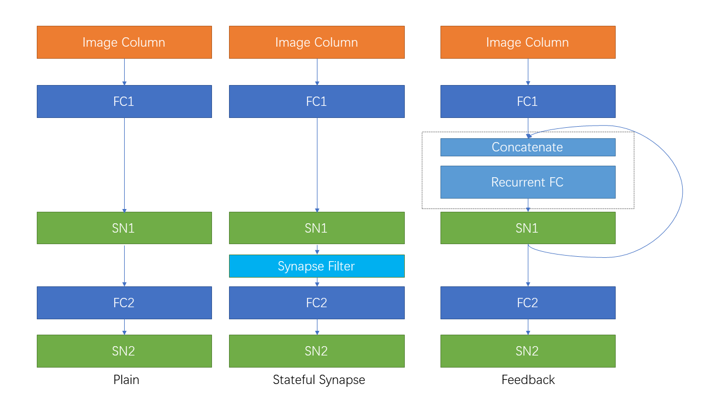

自连接和有状态突触
======================================

本教程作者： `fangwei123456 <https://github.com/fangwei123456>`_

自连接模块
-----------------------
自连接指的是从输出到输入的连接，例如 [#Effective]_ 一文中的SRNN(recurrent networks of spiking neurons)，如下图所示：

.. image:: ../_static/tutorials/clock_driven/15_recurrent_connection_and_stateful_synapse/SRNN_example.*
    :width: 100%

使用惊蜇框架很容易构建出带有自连接的模块。考虑最简单的一种情况，我们给神经元增加一个回路，使得它在 :math:`t` 时刻的输出 :math:`s[t]`，会与下一个时刻的外界
输入 :math:`x[t+1]` 相加，共同作为输入。这可以由 :class:`spikingjelly.clock_driven.layer.ElementWiseRecurrentContainer` 轻松实现。
``ElementWiseRecurrentContainer`` 是一个包装器，给任意的 ``sub_module`` 增加一个额外的自连接。连接的形式可以使用用户自定义的逐元素函数
操作 :math:`z=f(x, y)` 来实现。记 :math:`x[t]` 为 :math:`t` 时刻整个模块的输入，:math:`i[t]` 和 :math:`y[t]` 是 ``sub_module`` 的
输入和输出（注意 :math:`y[t]` 同时也是整个模块的输出），则

.. math::

    i[t] = f(x[t], y[t-1])

其中 :math:`f` 是用户自定义的逐元素操作。默认 :math:`y[-1] = 0`。

现在让我们用 ``ElementWiseRecurrentContainer`` 来包装一个IF神经元，逐元素操作设置为加法，因而

.. math::

    i[t] = x[t] + y[t-1].

我们使用软重置，且给与 :math:`x[t]=[1.5, 0, ..., 0]` 的输入：

.. code-block:: python

    T = 8
    def element_wise_add(x, y):
        return x + y
    net = ElementWiseRecurrentContainer(neuron.IFNode(v_reset=None), element_wise_add)
    print(net)
    x = torch.zeros([T])
    x[0] = 1.5
    for t in range(T):
        print(t, f'x[t]={x[t]}, s[t]={net(x[t])}')

    functional.reset_net(net)

输出为：

.. code-block:: bash

    ElementWiseRecurrentContainer(
      element-wise function=<function element_wise_add at 0x000001FE0F7968B0>
      (sub_module): IFNode(
        v_threshold=1.0, v_reset=None, detach_reset=False
        (surrogate_function): Sigmoid(alpha=1.0, spiking=True)
      )
    )
    0 x[t]=1.5, s[t]=1.0
    1 x[t]=0.0, s[t]=1.0
    2 x[t]=0.0, s[t]=1.0
    3 x[t]=0.0, s[t]=1.0
    4 x[t]=0.0, s[t]=1.0
    5 x[t]=0.0, s[t]=1.0
    6 x[t]=0.0, s[t]=1.0
    7 x[t]=0.0, s[t]=1.0

可以发现，由于存在自连接，即便 :math:`t \ge 1` 时 :math:`x[t]=0`，由于输出的脉冲能传回到输入，神经元也能持续释放脉冲。

可以使用 :class:`spikingjelly.clock_driven.layer.LinearRecurrentContainer` 实现更复杂的全连接形式的自连接。

有状态的突触
-----------------------

[#Unsupervised]_ [#Exploiting]_ 等文章使用有状态的突触。将 :class:`spikingjelly.clock_driven.layer.SynapseFilter` 放在普通无状
态突触的后面，对突触输出的电流进行滤波，就可以得到有状态的突触，例如：

.. code-block:: python

    stateful_conv = nn.Sequential(
        nn.Conv2d(3, 16, kernel_size=3, padding=1, stride=1),
        SynapseFilter(tau=100, learnable=True)
    )

Sequential FashionMNIST上的对比实验
-------------------------------------
接下来让我们在Sequential FashionMNIST上做一个简单的实验，验证自连接和有状态突触是否有助于改善网络的记忆能力。Sequential FashionMNIST指的是
将原始的FashionMNIST图片一行一行或者一列一列，而不是整个图片，作为输入。在这种情况下，网络必须具有一定的记忆能力，才能做出正确的分类。我们将会把
图片一列一列的输入，这样对网络而言，就像是从左到右“阅读”一样，如下图所示：

.. image:: ../_static/tutorials/clock_driven/15_recurrent_connection_and_stateful_synapse/samples/a.*
    :width: 50%

下图中展示了被读入的列：

.. image:: ../_static/tutorials/clock_driven/15_recurrent_connection_and_stateful_synapse/samples/b.*
    :width: 50%

首先导入相关的包：

.. code:: python

    import torch
    import torch.nn as nn
    import torch.nn.functional as F
    import torchvision.datasets
    from spikingjelly.clock_driven.model import train_classify
    from spikingjelly.clock_driven import neuron, surrogate, layer
    from spikingjelly.clock_driven.functional import seq_to_ann_forward
    from torchvision import transforms
    import os, argparse

    try:
        import cupy
        backend = 'cupy'
    except ImportError:
        backend = 'torch'

我们定义一个普通的前馈网络 ``Net``：

.. code:: python

    class Net(nn.Module):
        def __init__(self):
            super().__init__()
            self.fc1 = nn.Linear(28, 32)
            self.sn1 = neuron.MultiStepIFNode(surrogate_function=surrogate.ATan(), detach_reset=True, backend=backend)
            self.fc2 = nn.Linear(32, 10)
            self.sn2 = neuron.MultiStepIFNode(surrogate_function=surrogate.ATan(), detach_reset=True, backend=backend)

        def forward(self, x: torch.Tensor):
            # x.shape = [N, C, H, W]
            x.squeeze_(1)  # [N, H, W]
            x = x.permute(2, 0, 1)  # [W, N, H]
            x = seq_to_ann_forward(x, self.fc1)
            x = self.sn1(x)
            x = seq_to_ann_forward(x, self.fc2)
            x = self.sn2(x)
            return x.mean(0)

我们在 ``Net`` 的第一层脉冲神经元后增加一个 :class:`spikingjelly.clock_driven.layer.SynapseFilter`，得到一个新的网络 ``StatefulSynapseNet``：

.. code:: python

    class StatefulSynapseNet(nn.Module):
        def __init__(self):
            super().__init__()
            self.fc1 = nn.Linear(28, 32)
            self.sn1 = neuron.MultiStepIFNode(surrogate_function=surrogate.ATan(), detach_reset=True, backend=backend)
            self.sy1 = layer.MultiStepContainer(layer.SynapseFilter(tau=2., learnable=True))
            self.fc2 = nn.Linear(32, 10)
            self.sn2 = neuron.MultiStepIFNode(surrogate_function=surrogate.ATan(), detach_reset=True, backend=backend)

        def forward(self, x: torch.Tensor):
            # x.shape = [N, C, H, W]
            x.squeeze_(1)  # [N, H, W]
            x = x.permute(2, 0, 1)  # [W, N, H]
            x = self.fc1(x)
            x = self.sn1(x)
            x = self.sy1(x)
            x = self.fc2(x)
            x = self.sn2(x)
            return x.mean(0)

我们给 ``Net`` 的第一层脉冲神经元增加一个反馈连接 :class:`spikingjelly.clock_driven.layer.LinearRecurrentContainer` 得到 ``FeedBackNet``：

.. code:: python

    class FeedBackNet(nn.Module):
        def __init__(self):
            super().__init__()
            self.fc1 = nn.Linear(28, 32)
            self.sn1 = layer.MultiStepContainer(
                layer.LinearRecurrentContainer(
                    neuron.IFNode(surrogate_function=surrogate.ATan(), detach_reset=True),
                    32, 32
                )
            )
            self.fc2 = nn.Linear(32, 10)
            self.sn2 = neuron.MultiStepIFNode(surrogate_function=surrogate.ATan(), detach_reset=True, backend=backend)

        def forward(self, x: torch.Tensor):
            # x.shape = [N, C, H, W]
            x.squeeze_(1)  # [N, H, W]
            x = x.permute(2, 0, 1)  # [W, N, H]
            x = seq_to_ann_forward(x, self.fc1)
            x = self.sn1(x)
            x = seq_to_ann_forward(x, self.fc2)
            x = self.sn2(x)
            return x.mean(0)

下图展示了3种网络的结构：

完整的代码位于 `spikingjelly.clock_driven.examples.rsnn_sequential_fmnist <https://github.com/fangwei123456/spikingjelly/blob/master/spikingjelly/clock_driven/examples/rsnn_sequential_fmnist.py>`_。我们可以通过命令行直接运行。运行参数为：

.. code:: shell

    (pytorch-env) PS C:/Users/fw> python -m spikingjelly.clock_driven.examples.rsnn_sequential_fmnist --h
    usage: rsnn_sequential_fmnist.py [-h] [--data-path DATA_PATH] [--device DEVICE] [-b BATCH_SIZE] [--epochs N] [-j N]
                                     [--lr LR] [--opt OPT] [--lrs LRS] [--step-size STEP_SIZE] [--step-gamma STEP_GAMMA]
                                     [--cosa-tmax COSA_TMAX] [--momentum M] [--wd W] [--output-dir OUTPUT_DIR]
                                     [--resume RESUME] [--start-epoch N] [--cache-dataset] [--amp] [--tb] [--model MODEL]

    PyTorch Classification Training

    optional arguments:
      -h, --help            show this help message and exit
      --data-path DATA_PATH
                            dataset
      --device DEVICE       device
      -b BATCH_SIZE, --batch-size BATCH_SIZE
      --epochs N            number of total epochs to run
      -j N, --workers N     number of data loading workers (default: 16)
      --lr LR               initial learning rate
      --opt OPT             optimizer (sgd or adam)
      --lrs LRS             lr schedule (cosa(CosineAnnealingLR), step(StepLR)) or None
      --step-size STEP_SIZE
                            step_size for StepLR
      --step-gamma STEP_GAMMA
                            gamma for StepLR
      --cosa-tmax COSA_TMAX
                            T_max for CosineAnnealingLR. If none, it will be set to epochs
      --momentum M          Momentum for SGD
      --wd W, --weight-decay W
                            weight decay (default: 0)
      --output-dir OUTPUT_DIR
                            path where to save
      --resume RESUME       resume from checkpoint
      --start-epoch N       start epoch
      --cache-dataset       Cache the datasets for quicker initialization. It also serializes the transforms
      --amp                 Use AMP training
      --tb                  Use TensorBoard to record logs
      --model MODEL         "plain", "feedback", or "stateful-synapse"

分别训练3个模型：

.. code:: shell

    python -m spikingjelly.clock_driven.examples.rsnn_sequential_fmnist --data-path /raid/wfang/datasets/FashionMNIST --tb --device cuda:0 --amp --model plain

    python -m spikingjelly.clock_driven.examples.rsnn_sequential_fmnist --data-path /raid/wfang/datasets/FashionMNIST --tb --device cuda:1 --amp --model feedback

    python -m spikingjelly.clock_driven.examples.rsnn_sequential_fmnist --data-path /raid/wfang/datasets/FashionMNIST --tb --device cuda:2 --amp --model stateful-synapse

训练集损失为：

.. image:: ../_static/tutorials/clock_driven/15_recurrent_connection_and_stateful_synapse/train_loss.*
    :width: 100%

训练集正确率为：

.. image:: ../_static/tutorials/clock_driven/15_recurrent_connection_and_stateful_synapse/train_acc.*
    :width: 100%

测试集正确率为：

.. image:: ../_static/tutorials/clock_driven/15_recurrent_connection_and_stateful_synapse/test_acc.*
    :width: 100%

可以发现，``feedback`` 和 ``stateful-synapse`` 的性能都高于 ``plain``，表明自连接和有状态突触都有助于提升网络的记忆能力。

.. [#Effective] Yin B, Corradi F, Bohté S M. Effective and efficient computation with multiple-timescale spiking recurrent neural networks[C]//International Conference on Neuromorphic Systems 2020. 2020: 1-8.

.. [#Unsupervised] Diehl P U, Cook M. Unsupervised learning of digit recognition using spike-timing-dependent plasticity[J]. Frontiers in computational neuroscience, 2015, 9: 99.

.. [#Exploiting] Fang H, Shrestha A, Zhao Z, et al. Exploiting Neuron and Synapse Filter Dynamics in Spatial Temporal Learning of Deep Spiking Neural Network[J].
