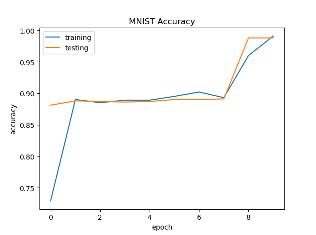

ANN转换SNN
=======================================
本教程作者： `DingJianhao <https://github.com/DingJianhao>`_, `fangwei123456 <https://github.com/fangwei123456>`_

本节教程主要关注 ``spikingjelly.clock_driven.ann2snn``，介绍如何将训练好的ANN转换SNN，并且在SpikingJelly框架上进行仿真。

目前实现了两套实现：基于ONNX 和 基于PyTorch，在框架中被称为 ONNX kernel 和 PyTorch kernel。
但是这两套实现各有特点，ONNX kernel的实现更加通用，支持更加复杂的拓扑结构（例如ResNet）；
PyTorch kernel主要是为了简单测试，支持的模块比较有限且在现有配置下可能有很多bug。
更多模块可以通过ONNX拓展，用户可自行实现...

ANN转换SNN的理论基础
--------------------

SNN相比于ANN，产生的脉冲是离散的，这有利于高效的通信。在ANN大行其道的今天，SNN的直接训练需要较多资源。自然我们会想到使用现在非常成熟的ANN转换到SNN，希望SNN也能有类似的表现。这就牵扯到如何搭建起ANN和SNN桥梁的问题。现在SNN主流的方式是采用频率编码，因此对于输出层，我们会用神经元输出脉冲数来判断类别。发放率和ANN有没有关系呢？

幸运的是，ANN中的ReLU神经元非线性激活和SNN中IF神经元(采用减去阈值 :math:`V_{threshold}` 方式重置)的发放率有着极强的相关性，我们可以借助这个特性来进行转换。这里说的神经元更新方式，也就是 `时间驱动教程 <https://spikingjelly.readthedocs.io/zh_CN/latest/clock_driven/0_neuron.html>`_ 中提到的Soft方式。

实验：IF神经元脉冲发放频率和输入的关系
^^^^^^^^^^^^^^^^^^^^^^^^^^^^^^^^^^^^^^^^^^^^^^^^^^^^^^^^^^^^^^^^^^^^^^

我们给与恒定输入到IF神经元，观察其输出脉冲和脉冲发放频率。首先导入相关的模块，新建IF神经元层，确定输入并画出每个IF神经元的输入 :math:`x_{i}`：

.. code-block:: python

    import torch
    from spikingjelly.clock_driven import neuron
    from spikingjelly import visualizing
    from matplotlib import pyplot as plt
    import numpy as np

    plt.rcParams['figure.dpi'] = 200
    if_node = neuron.IFNode(v_reset=None, monitor_state=True)
    T = 128
    x = torch.arange(-0.2, 1.2, 0.04)
    plt.scatter(torch.arange(x.shape[0]), x)
    plt.title('Input $x_{i}$ to IF neurons')
    plt.xlabel('Neuron index $i$')
    plt.ylabel('Input $x_{i}$')
    plt.grid(linestyle='-.')
    plt.show()

.. image:: ../_static/tutorials/clock_driven/5_ann2snn/0.*
    :width: 100%

接下来，将输入送入到IF神经元层，并运行 ``T=128`` 步，观察各个神经元发放的脉冲、脉冲发放频率：

.. code-block:: python

    for t in range(T):
        if_node(x)
    out_spikes = np.asarray(if_node.monitor['s']).T
    visualizing.plot_1d_spikes(out_spikes, 'IF neurons\' spikes and firing rates', 't', 'Neuron index $i$')
    plt.show()

.. image:: ../_static/tutorials/clock_driven/5_ann2snn/1.*
    :width: 100%

可以发现，脉冲发放的频率在一定范围内，与输入 :math:`x_{i}` 的大小成正比。

接下来，让我们画出IF神经元脉冲发放频率和输入 :math:`x_{i}` 的曲线，并与 :math:`\mathrm{ReLU}(x_{i})` 对比：

.. code-block:: python

    plt.subplot(1, 2, 1)
    firing_rate = np.mean(out_spikes, axis=1)
    plt.plot(x, firing_rate)
    plt.title('Input $x_{i}$ and firing rate')
    plt.xlabel('Input $x_{i}$')
    plt.ylabel('Firing rate')
    plt.grid(linestyle='-.')

    plt.subplot(1, 2, 2)
    plt.plot(x, x.relu())
    plt.title('Input $x_{i}$ and ReLU($x_{i}$)')
    plt.xlabel('Input $x_{i}$')
    plt.ylabel('ReLU($x_{i}$)')
    plt.grid(linestyle='-.')
    plt.show()

.. image:: ../_static/tutorials/clock_driven/5_ann2snn/2.*
    :width: 100%

可以发现，两者的曲线几乎一致。需要注意的是，脉冲频率不可能高于1，因此IF神经元无法拟合ANN中ReLU的输入大于1的情况。

理论证明
^^^^^^^^

文献 [#f1]_ 对ANN转SNN提供了解析的理论基础。理论说明，SNN中的IF神经元是ReLU激活函数在时间上的无偏估计器。

针对神经网络第一层即输入层，讨论SNN神经元的发放率 :math:`r` 和对应ANN中激活的关系。假定输入恒定为 :math:`z \in [0,1]`。
对于采用减法重置的IF神经元，其膜电位V随时间变化为：

.. math::
    V_t=V_{t-1}+z-V_{threshold}\theta_t

其中：
 :math:`V_{threshold}` 为发放阈值，通常设为1.0。 :math:`\theta_t` 为输出脉冲。 :math:`T` 时间步内的平均发放率可以通过对膜电位求和得到：

.. math::
    \sum_{t=1}^{T} V_t= \sum_{t=1}^{T} V_{t-1}+z T-V_{threshold} \sum_{t=1}^{T}\theta_t

将含有 :math:`V_t` 的项全部移项到左边，两边同时除以 :math:`T` ：

.. math::
    \frac{V_T-V_0}{T} = z - V_{threshold}  \frac{\sum_{t=1}^{T}\theta_t}{T} = z- V_{threshold}  \frac{N}{T}

其中 :math:`N` 为 :math:`T` 时间步内脉冲数， :math:`\frac{N}{T}` 就是发放率  :math:`r`。利用  :math:`z= V_{threshold} a` 
即：

.. math::
    r = a- \frac{ V_T-V_0 }{T V_{threshold}}

故在仿真时间步  :math:`T` 无限长情况下:

.. math::
    r = a (a>0)

类似地，针对神经网络更高层，文献 [#f1]_ 进一步说明层间发放率满足：

.. math::
    r^l = W^l r^{l-1}+b^l- \frac{V^l_T}{T V_{threshold}}

详细的说明见文献 [#f1]_ 。ann2snn中的方法也主要来自文献 [#f1]_ 

转换和仿真
----------

具体地，进行前馈ANN转SNN主要有两个步骤：即模型分析（英文：parse，直译：句法分析）和仿真模拟。

模型分析
^^^^^^^^

模型分析主要解决两个问题：

1. ANN为了快速训练和收敛提出了批归一化（Batch Normalization）。批归一化旨在将ANN输出归一化到0均值，这与SNN的特性相违背。因此，需要将BN的参数吸收到前面的参数层中（Linear、Conv2d）

2. 根据转换理论，ANN的每层输入输出需要被限制在[0,1]范围内，这就需要对参数进行缩放（模型归一化）

◆ BatchNorm参数吸收

假定BatchNorm的参数为 :math:`\gamma` (``BatchNorm.weight``)， :math:`\beta` (``BatchNorm.bias``)， :math:`\mu` (``BatchNorm.running_mean``) ，
:math:`\sigma` (``BatchNorm.running_var``，:math:`\sigma = \sqrt{\mathrm{running\_var}}`)。具体参数定义详见
`torch.nn.BatchNorm1d <https://pytorch.org/docs/stable/generated/torch.nn.BatchNorm2d.html#torch.nn.BatchNorm1d>`_ 。
参数模块（例如Linear）具有参数 :math:`W` 和 :math:`b` 。BatchNorm参数吸收就是将BatchNorm的参数通过运算转移到参数模块的 :math:`W`和 :math:`b` 中，使得数据输入新模块的输出和有BatchNorm时相同。
对此，新模型的 :math:`\bar{W}` 和 :math:`\bar{b}` 公式表示为：

.. math::
    \bar{W} = \frac{\gamma}{\sigma}  W

.. math::
    \bar{b} = \frac{\gamma}{\sigma} (b - \mu) + \beta

◆ 模型归一化

对于某个参数模块，假定得到了其输入张量和输出张量，其输入张量的最大值为 :math:`\lambda_{pre}` ,输出张量的最大值为 :math:`\lambda` 
那么，归一化后的权重 :math:`\hat{W}` 为：

.. math::
    \hat{W} = W * \frac{\lambda_{pre}}{\lambda}

归一化后的偏置 :math:`\hat{b}` 为：

.. math::
    \hat{b} = \frac{b}{\lambda}

ANN每层输出的分布虽然服从某个特定分布，但是数据中常常会存在较大的离群值，这会导致整体神经元发放率降低。
为了解决这一问题，鲁棒归一化将缩放因子从张量的最大值调整为张量的p分位点。文献中推荐的分位点值为99.9。

到现在为止，我们对神经网络做的操作，在数值上是完全等价的。当前的模型表现应该与原模型相同。

模型仿真
^^^^^^^^

仿真前，我们需要将原模型中的ReLU激活函数变为IF神经元。
对于ANN中的平均池化，我们需要将其转化为空间下采样。由于IF神经元可以等效ReLU激活函数。空间下采样后增加IF神经元与否对结果的影响极小。
对于ANN中的最大池化，目前没有非常理想的方案。目前的最佳方案为使用基于动量累计脉冲的门控函数控制脉冲通道 [#f1]_ 。当然在ONNX kernel中没有用，不过我们在``ann2snn.modules``依然有实现。还有文献提出使用空间下采样替代Maxpool2d。此处我们依然推荐使用avgpool2d。

仿真时，依照转换理论，SNN需要输入恒定的模拟输入。使用Poisson编码器将会带来准确率的降低。Poisson编码和恒定输入方式均已实现，感兴趣可通过配置进行不同实验。

实现与可选配置
^^^^^^^^^^^^^^^^^^^^^^^^

ann2snn框架在2020年12月进行一次较大更新。最大改动就是将参数配置回归到了模块参数，并且尽可能考虑到了用户对灵活度和渐变操作的需求。这里我们将简单介绍一下这些类和方法。
针对理论中提到的分析和仿真两大中心，设计了parser和simulator两大类。类的定义在``spikingjelly.ann2snn.__init__``中。

◆ parser类
1. 类初始化函数
- kernel：转换的kernel。可选范围为'onnx'、'pytorch'，这将决定您使用的是ONNX kernel还是PyTorch kernel
- name：模型的名字，通常您可以取一个和任务、模型相关的名字，之后的文件夹生成将可能用到这个字符串
- z_norm：许多深度学习模型会存在数据标准化（Z normalization）。如果您ANN模型有这个操作，这个参数的数据格式为：(mean, std)，例如对于CIFAR10，z_norm可以为((0.4914, 0.4822, 0.4465), (0.2023, 0.1994, 0.2010))
- log_dir：保存临时文件的文件夹，如没有此参数则会根据参数name和当前时间自动生成
- json：历史配置文件名。当您运行过一次parser后，程序会自动保存json文件到log_dir，您可以使用json文件进行parser快速初始化

2. parse函数
- channelwise: 如果为``True``，则控制激活幅值的统计是channelwise的；否则，控制激活幅值的统计是layerwise的
- robust: 如果为``True``，则控制激活幅值的统计是激活的99.9百分位；否则，控制激活幅值的统计是激活的最值
- user_methods：默认使用``spikingjelly.ann2snn.kernel.onnx._o2p_converter``；当发现ONNX kernel遇到ONNX转换PyTorch的方法缺乏的时候，可以通过用户自定义函数的形式进行转换。函数接口可见``spikingjelly.ann2snn.kernel.onnx._o2p_converter``的staticmethods

◆ simulator类
1. 类初始化参数
- snn：待仿真的转换后的SNN
- device：仿真的设备，支持单设备（输入为字符串）和多设备（输入为list,set,tuple类型）
- name：模型的名字，通常您可以取一个和任务、模型相关的名字，之后的文件夹生成将可能用到这个字符串
- log_dir：保存临时文件的文件夹，如没有此参数则会根据参数name和当前时间自动生成
- encoder：编码器，可选范围为'constant'、'poisson'

2. simulate函数
- data_loader：仿真的数据集的dataloader
- T：仿真时间
- canvas：plt.fig类型，用于对仿真模型标量性能（例如准确率）的绘图
- online_drawer：如果为``True``，则在线绘图；否则，仿真结束后绘图
- func_dict：用户可以通过自己定义标量性能函数实现绘图

除此之外，用户可以通过继承simulate类进行仿真器的功能细化。
比如``spikingjelly.ann2snn.__init__``实现了仿真分类任务的``classify_simulator``

3. classify_simulator.simulate函数
除去继承的参数外，
- ann_acc：ANN转换前的分类准确率（0-1间的小数）
- fig_name: 仿真图像的名字
- step_max： 如果为``True``，则图像中标明推理过程中的最大准确率

识别MNIST
---------

现在我们使用 ``ann2snn`` ，搭建一个简单卷积网络，对MNIST数据集进行分类。

首先定义我们的网络结构：

.. code-block:: python

    class ANN(nn.Module):
        def __init__(self):
            super().__init__()
            self.network = nn.Sequential(
                nn.Conv2d(1, 32, 3, 1),
                nn.BatchNorm2d(32, eps=1e-3),
                nn.ReLU(),
                nn.AvgPool2d(2, 2),

                nn.Conv2d(32, 32, 3, 1),
                nn.BatchNorm2d(32, eps=1e-3),
                nn.ReLU(),
                nn.AvgPool2d(2, 2),

                nn.Conv2d(32, 32, 3, 1),
                nn.BatchNorm2d(32, eps=1e-3),
                nn.ReLU(),
                nn.AvgPool2d(2, 2),

                nn.Flatten(),
                nn.Linear(32, 10),
                nn.ReLU()
            )

        def forward(self,x):
            x = self.network(x)
            return x

注意：如果遇到需要将tensor展开的情况，就在网络中定义一个 ``nn.Flatten`` 模块，在forward函数中需要使用定义的Flatten而不是view函数。

定义我们的超参数：

.. code-block:: python

    device = input('输入运行的设备，例如“cpu”或“cuda:0”\n input device, e.g., "cpu" or "cuda:0": ')
    dataset_dir = input('输入保存MNIST数据集的位置，例如“./”\n input root directory for saving MNIST dataset, e.g., "./": ')
    batch_size = int(input('输入batch_size，例如“64”\n input batch_size, e.g., "64": '))
    learning_rate = float(input('输入学习率，例如“1e-3”\n input learning rate, e.g., "1e-3": '))
    T = int(input('输入仿真时长，例如“100”\n input simulating steps, e.g., "100": '))
    train_epoch = int(input('输入训练轮数，即遍历训练集的次数，例如“10”\n input training epochs, e.g., "10": '))
    model_name = input('输入模型名字，例如“mnist”\n input model name, for log_dir generating , e.g., "mnist": ')

之后的所有临时文件都会储存到文件夹中。

初始化数据加载器、网络、优化器、损失函数：

.. code-block:: python

    # 初始化网络
    ann = ANN().to(device)
    # 定义损失函数
    loss_function = nn.CrossEntropyLoss()
    # 使用Adam优化器
    optimizer = torch.optim.Adam(ann.parameters(), lr=learning_rate, weight_decay=5e-4)

训练ANN，并定期测试。训练时也可以使用utils中预先写好的训练程序：

.. code-block:: python

    for epoch in range(train_epoch):
        # 使用utils中预先写好的训练程序训练网络
        # 训练程序的写法和经典ANN中的训练也是一样的
        # Train the network using a pre-prepared code in ''utils''
        utils.train_ann(net=ann,
                        device=device,
                        data_loader=train_data_loader,
                        optimizer=optimizer,
                        loss_function=loss_function,
                        epoch=epoch
                        )
        # 使用utils中预先写好的验证程序验证网络输出
        # Validate the network using a pre-prepared code in ''utils''
        acc = utils.val_ann(net=ann,
                            device=device,
                            data_loader=test_data_loader,
                            epoch=epoch
                            )
        if best_acc <= acc:
            utils.save_model(ann, log_dir, model_name+'.pkl')

完整的代码位于 ``ann2snn.examples.cnn_mnist.py`` ，在代码中我们还使用了Tensorboard来保存训练日志。可以直接在Python命令行运行它：

.. code-block:: python

    >>> import spikingjelly.clock_driven.ann2snn.examples.cnn_mnist as cnn_mnist
    >>> cnn_mnist.main()
    输入运行的设备，例如“cpu”或“cuda:0”
     input device, e.g., "cpu" or "cuda:0": cuda:15
    输入保存MNIST数据集的位置，例如“./”
     input root directory for saving MNIST dataset, e.g., "./": ./mnist
    输入batch_size，例如“64”
     input batch_size, e.g., "64": 128
    输入学习率，例如“1e-3”
     input learning rate, e.g., "1e-3": 1e-3
    输入仿真时长，例如“100”
     input simulating steps, e.g., "100": 100
    输入训练轮数，即遍历训练集的次数，例如“10”
     input training epochs, e.g., "10": 10
    输入模型名字，用于自动生成日志文档，例如“cnn_mnist”
     input model name, for log_dir generating , e.g., "cnn_mnist"

    Epoch 0 [1/937] ANN Training Loss:2.252 Accuracy:0.078
    Epoch 0 [101/937] ANN Training Loss:1.423 Accuracy:0.669
    Epoch 0 [201/937] ANN Training Loss:1.117 Accuracy:0.773
    Epoch 0 [301/937] ANN Training Loss:0.953 Accuracy:0.795
    Epoch 0 [401/937] ANN Training Loss:0.865 Accuracy:0.788
    Epoch 0 [501/937] ANN Training Loss:0.807 Accuracy:0.792
    Epoch 0 [601/937] ANN Training Loss:0.764 Accuracy:0.795
    Epoch 0 [701/937] ANN Training Loss:0.726 Accuracy:0.835
    Epoch 0 [801/937] ANN Training Loss:0.681 Accuracy:0.880
    Epoch 0 [901/937] ANN Training Loss:0.641 Accuracy:0.889
    100%|██████████| 100/100 [00:00<00:00, 116.12it/s]
    Epoch 0 [100/100] ANN Validating Loss:0.327 Accuracy:0.881
    Save model to: cnn_mnist-XXXXX\cnn_mnist.pkl
    ......

示例中，这个模型训练10个epoch。训练时测试集准确率变化情况如下：

最终达到98.8%的测试集准确率。

从训练集中，取出一部分数据，用于模型的归一化步骤。这里我们取192张图片。

.. code-block:: python

    # 加载用于归一化模型的数据
    # Load the data to normalize the model
    percentage = 0.004 # load 0.004 of the data
    norm_data_list = []
    for idx, (imgs, targets) in enumerate(train_data_loader):
        norm_data_list.append(imgs)
        if idx == int(len(train_data_loader) * percentage) - 1:
            break
    norm_data = torch.cat(norm_data_list)
    print('use %d imgs to parse' % (norm_data.size(0)))

调用\ ``ann2snn``\ 中的类parser，并使用ONNX kernel。

.. code-block:: python

    onnxparser = parser(name=model_name,
                        log_dir=log_dir + '/parser',
                        kernel='onnx')
    snn = onnxparser.parse(ann, norm_data.to(parser_device))

我们可以保存好我们转换好的snn模型，并且定义一个plt.figure用于绘图

.. code-block:: python

    torch.save(snn, os.path.join(log_dir,'snn-'+model_name+'.pkl'))
    fig = plt.figure('simulator')

现在，我们定义用于SNN的仿真器。由于我们的任务是分类，选择类``classify_simulator``

.. code-block:: python

    sim = classify_simulator(snn,
                             log_dir=log_dir + '/simulator',
                             device=simulator_device,
                             canvas=fig
                             )
    sim.simulate(test_data_loader,
                T=T,
                online_drawer=True,
                ann_acc=ann_acc,
                fig_name=model_name,
                step_max=True
                )

模型仿真由于时间较长，我们设计了tqdm的进度条用于预估仿真时间。仿真结束时会有仿真器的summary

.. code-block:: python

    simulator is working on the normal mode, device: cuda:0
    100%|██████████| 100/100 [00:46<00:00,  2.15it/s]
    --------------------simulator summary--------------------
    time elapsed: 46.55072790000008 (sec)
    ---------------------------------------------------------

通过最后的输出，可以知道，仿真器使用了46.6s。转换后的SNN准确率可以从simulator文件夹中plot.pdf看到，最高的转换准确率为98.51%。转换带来了0.37%的性能下降。通过增加推理时间可以减少转换损失。

.. [#f1] Rueckauer B, Lungu I-A, Hu Y, Pfeiffer M and Liu S-C (2017) Conversion of Continuous-Valued Deep Networks to Efficient Event-Driven Networks for Image Classification. Front. Neurosci. 11:682.
.. [#f2] Diehl, Peter U. , et al. Fast classifying, high-accuracy spiking deep networks through weight and threshold balancing. Neural Networks (IJCNN), 2015 International Joint Conference on IEEE, 2015.
.. [#f3] Rueckauer, B., Lungu, I. A., Hu, Y., & Pfeiffer, M. (2016). Theory and tools for the conversion of analog to spiking convolutional neural networks. arXiv preprint arXiv:1612.04052.
.. [#f4] Sengupta, A., Ye, Y., Wang, R., Liu, C., & Roy, K. (2019). Going deeper in spiking neural networks: Vgg and residual architectures. Frontiers in neuroscience, 13, 95.