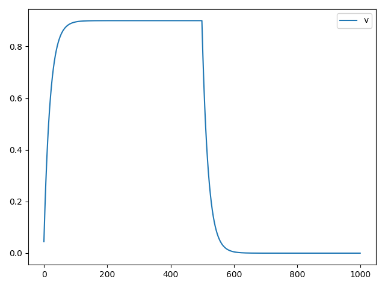
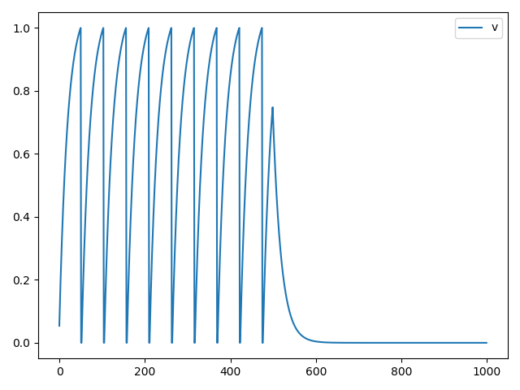

快速上手教程
=======================================

安装SpikingFlow
---------------

从pip安装

.. code-block:: bash

    pip install SpikingFlow

或者对于开发者，下载源代码，进行代码补充、修改和测试

.. code-block:: bash

    git clone https://github.com/fangwei123456/SpikingFlow

开始我们的第一次仿真
----------------------------------

.. code-block:: python

    import SpikingFlow
    import SpikingFlow.neuron as neuron
    # 导入绘图模块
    from matplotlib import pyplot

    # 新建一个LIF神经元
    lif_node = neuron.LIFNode([1], r=9.0, v_threshold=1.0, tau=20.0)
    # 新建一个空list，保存仿真过程中神经元的电压值
    v = []
    # 运行1000次
    for i in range(1000):
        # 前500次，输入电流都是0.1
        if i < 500:
            lif_node(0.1)
        # 后500次，不输入，也就是输入0
        else:
            lif_node(0)
        # 记录每一次输入后，神经元的电压
        v.append(lif_node.v.item())

    # 画出电压的变化
    pyplot.plot(v, label='v')
    pyplot.legend()
    pyplot.show()

运行后得到的电压曲线如下

你会发现，LIF神经元在有恒定输入电流时，电压会不断增大，但增速越来越慢

如果输入电流不是足够大，最终在每个dt内，LIF神经元的电压衰减值会恰好等于输入电流造成的电压增加值，电压不再
增大，导致无法充电到过阈值、发放脉冲

当停止输入后，LIF神经元的电压会指数衰减，从图中500个dt后的曲线可以看出

我们修改代码，给予更大的电流输入

.. code-block:: python

    ...
    for i in range(1000):
        # 前500次，输入电流都是0.12
        if i < 500:
            lif_node(0.12)
    ...

运行后得到的电压曲线如下

可以发现，LIF神经元已经开始大量发放脉冲了