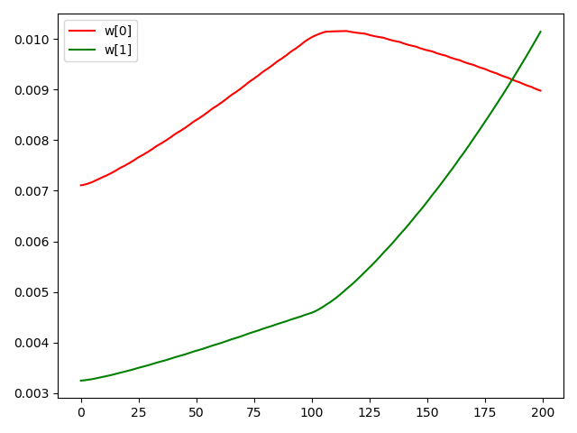
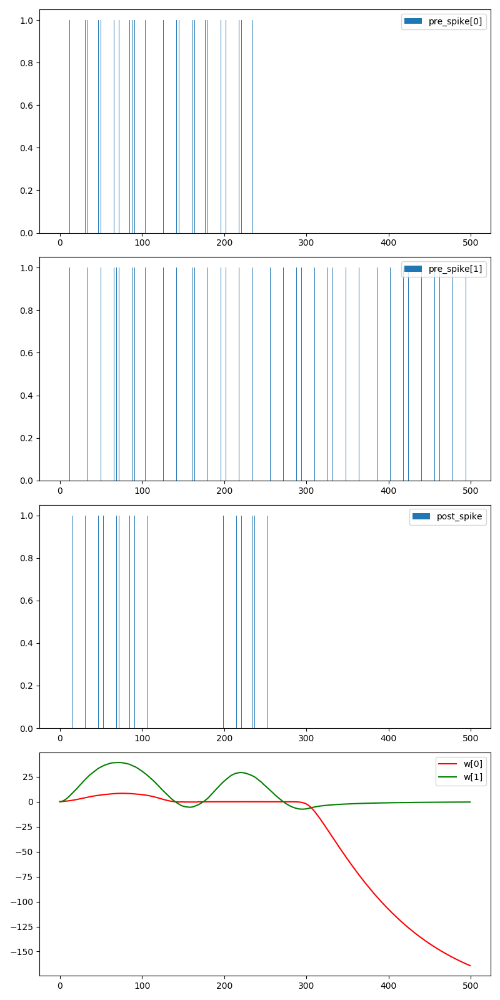

学习规则
=======================================

本节教程主要关注SpikingFlow.learning，包括如何使用已有学习规则、如何定义新的学习规则

学习规则是什么
-------------
“学习”在ANN中或许更多地被称作是“训练”。ANN中基于梯度的反向传播优化算法，就是应用最为广泛的学习规则

在SNN中，发放脉冲这一过程通常使用阶跃函数去描述，这是一个不可微分的过程；SNN比较注重生物可解释性，生物神经系统中似乎并没有使\
用反向传播这种训练成千上万次才能达到较好结果的“低效率”方法。在SNN中如何使用反向传播算法也是一个研究热点，使用反向传播算法的\
SNN一般为事件驱动模型（例如SpikeProp和Tempotron，在SpikingFlow.event_driven中可以找到），而SpikingFlow.learning中更多的聚\
焦于生物可解释性的学习算法，例如STDP

STDP(Spike Timing Dependent Plasticity)
--------------------------------------

STDP(Spike Timing Dependent Plasticity)学习规则是在生物实验中发现的一种突触可塑性机制。实验发现，突触的连接强度受到突触连接\
的前（pre）后（post）神经元脉冲活动的影响

如果pre神经元先发放脉冲，post神经元后发放脉冲，则突触强度增大；反之，如果post神经元先发放脉冲，pre神经元后发放脉冲，则突触强度\
减小。生物实验数据如下图所示，横轴是pre神经元和post神经元释放的一对脉冲的时间差，也就是 :math:`t_{post} - t_{pre}`，纵轴表示\
突触强度变化的百分比：

.. image:: ./_static/tutorials/3.png

这种突触强度和前后脉冲发放时间的关系，可以用以下公式进行拟合：

.. math::
    \begin{align}
    \Delta w=
    \left\{ \begin{aligned}
    & A e^{\frac{t_{pre} - t_{post}}{\tau}}, t_{pre} - t_{post} \leq 0, A > 0\\
    & B e^{-\frac{t_{pre} - t_{post}}{\tau}}, t_{pre} - t_{post} \geq 0, B < 0
    \end{aligned} \right.
    \end{align}

一般认为，突触连接权重的改变，是在脉冲发放的瞬间完成。不过，上图中的公式并不适合代码去实现，因为它需要分别记录前后神经元的脉冲\
发放时间。使用 [#f1]_ 提供的基于双脉冲的迹的方式来实现STDP更为优雅

对于突触的pre神经元j后post神经元i，分别使用一个名为迹（trace）的变量 :math:`x_{j}, y_{i}`，迹由类似于LIF神经元的膜电位的微分\
方程来描述：

.. math::
    \frac{\mathrm{d} x_{j}}{\mathrm{d} t} = - \frac{x_{j}}{\tau_{x}} + \sum_{t_{j} ^ {f}} \delta (t - t_{j} ^ {f})

    \frac{\mathrm{d} y_{i}}{\mathrm{d} t} = - \frac{y_{i}}{\tau_{y}} + \sum_{t_{i} ^ {f}} \delta (t - t_{i} ^ {f})

其中 :math:`t_{j} ^ {f}, t_{i} ^ {f}` 是pre神经元j后post神经元i的脉冲发放时刻， :math:`\delta(t)` 是脉冲函数，\
只在 :math:`t=0` 处为1，其他时刻均为0

当pre神经元j的脉冲 :math:`t_{j} ^ {f}` 到达时，突触权重减少；当post神经元i的脉冲 :math:`t_{i} ^ {f}` 到达时，突触权重增加：

.. math::

    \Delta w_{ij}^{-}(t_{j} ^ {f}) = - F_{-}(w_{ij}) y_i(t_{j} ^ {f})

    \Delta w_{ij}^{+}(t_{i} ^ {f}) = - F_{+}(w_{ij}) x_j(t_{i} ^ {f})

其中 :math:`F_{+}(w_{ij}), F_{-}(w_{ij})` 是突触权重 :math:`w_{ij}` 的函数，控制权重的增量

[#f1]_ 中给出了这种方式的示意图：

.. image:: ./_static/tutorials/4.png

SpikingFlow.learning.STDPModule是使用迹的方式实现的一个STDP学习模块。STDPModule会将脉冲电流转换器tf_module、\
突触connection_module、神经元neuron_module三者打包成一个模块，将输入到tf_module的脉冲，作为pre神经元的脉冲；\
neuron_module输出的脉冲，作为post神经元的脉冲，利用STDP学习规则，来更新connection_module的权重

示例代码如下：

.. code-block:: python

    import SpikingFlow.simulating as simulating
    import SpikingFlow.learning as learning
    import SpikingFlow.connection as connection
    import SpikingFlow.connection.transform as tf
    import SpikingFlow.neuron as neuron
    import torch
    from matplotlib import pyplot

    # 新建一个仿真器
    sim = simulating.Simulator()

    # 添加各个模块。为了更明显的观察到脉冲，我们使用IF神经元，而且把膜电阻设置的很大
    # 突触的pre是2个输入，而post是1个输出，连接权重是shape=[1, 2]的tensor
    sim.append(learning.STDPModule(tf.SpikeCurrent(amplitude=0.5),
                                   connection.Linear(2, 1),
                                   neuron.IFNode(shape=[1], r=50.0, v_threshold=1.0),
                                   tau_pre=10.0,
                                   tau_post=10.0,
                                   learning_rate=1e-3
                                   ))
    # 新建list，分别保存pre的2个输入脉冲、post的1个输出脉冲，以及对应的连接权重
    pre_spike_list0 = []
    pre_spike_list1 = []
    post_spike_list = []
    w_list0 = []
    w_list1 = []
    T = 200

    for t in range(T):
        if t < 100:
            # 前100步仿真，pre_spike[0]和pre_spike[1]都是发放一次1再发放一次0
            if t % 2 == 0:
                pre_spike = torch.ones(size=[2], dtype=torch.bool)
            else:
                pre_spike = torch.zeros(size=[2], dtype=torch.bool)
        else:
            # 后100步仿真，pre_spike[0]一直为0，而pre_spike[1]一直为1
            pre_spike = torch.zeros(size=[2], dtype=torch.bool)
            pre_spike[1] = True

        post_spike = sim.step(pre_spike)
        pre_spike_list0.append(pre_spike[0].float().item())
        pre_spike_list1.append(pre_spike[1].float().item())

        post_spike_list.append(post_spike.float().item())

        w_list0.append(sim.module_list[-1].module_list[2].w[:, 0].item())
        w_list1.append(sim.module_list[-1].module_list[2].w[:, 1].item())

    # 画出pre_spike[0]
    pyplot.bar(torch.arange(0, T).tolist(), pre_spike_list0, width=0.1, label='pre_spike[0]')
    pyplot.legend()
    pyplot.show()

    # 画出pre_spike[1]
    pyplot.bar(torch.arange(0, T).tolist(), pre_spike_list1, width=0.1, label='pre_spike[1]')
    pyplot.legend()
    pyplot.show()

    # 画出post_spike
    pyplot.bar(torch.arange(0, T).tolist(), post_spike_list, width=0.1, label='post_spike')
    pyplot.legend()
    pyplot.show()

    # 画出2个输入与1个输出的连接权重w_0和w_1
    pyplot.plot(w_list0, c='r', label='w[0]')
    pyplot.plot(w_list1, c='g', label='w[1]')
    pyplot.legend()
    pyplot.show()

这段代码中，突触的输入是2个脉冲，而输出是1个脉冲，在前100步仿真中，pre_spike[0]和pre_spike[1]都每隔1个仿真步长发放1次脉冲，
而在后100步仿真，pre_spike[0]停止发放，pre_spike[1]持续发放，如下图所示（需要说明的是，脉冲是以pyplot柱状图的形式\
画出，当柱状图的横轴，也就是时间太长时，而图像的宽度又不够大，一些“落单”的脉冲在图像上会无法画出，因为宽度小于一个像素点）：

.. image:: ./_static/tutorials/5.png

.. image:: ./_static/tutorials/6.png

引发的post神经元的脉冲如下图：

.. image:: ./_static/tutorials/7.png

在前100步， :math:`w_{00}, w_{01}` 均增大；而后100步，由于我们人为设定pre_spike[0]停止发放，pre_spike[1]持续\
发放，故 :math:`w_{00}` 减小，:math:`w_{01}` 增大：

更灵活的STDPUpdater
------------------

在SpikingFlow.learning.STDPModule中将脉冲电流转换器、突触、神经元这3个模块封装为1个，简化了使用，但封装也带来了灵活性的缺失。\
SpikingFlow.learning.STDPUpdater则提供了一种更为灵活的使用方式，可以手动地设置突触和其对应的前后脉冲，即便“前后脉冲”并不\
是真正的突触连接的前后神经元的脉冲，也可以被用来“远程更新”突触的权重

示例代码如下，与STDPModule的示例类似：

.. code-block:: python

    import SpikingFlow.simulating as simulating
    import SpikingFlow.learning as learning
    import SpikingFlow.connection as connection
    import SpikingFlow.connection.transform as tf
    import SpikingFlow.neuron as neuron
    import torch
    from matplotlib import pyplot

    # 定义权值函数f_w
    def f_w(x: torch.Tensor):
        x_abs = x.abs()
        return x_abs / (x_abs.sum() + 1e-6)

    # 新建一个仿真器
    sim = simulating.Simulator()

    # 放入脉冲电流转换器、突触、LIF神经元
    sim.append(tf.SpikeCurrent(amplitude=0.5))
    sim.append(connection.Linear(2, 1))
    sim.append(neuron.LIFNode(shape=[1], r=10.0, v_threshold=1.0, tau=100.0))

    # 新建一个STDPUpdater
    updater = learning.STDPUpdater(tau_pre=50.0,
                                   tau_post=100.0,
                                   learning_rate=1e-1,
                                   f_w=f_w)

    # 新建list，保存pre脉冲、post脉冲、突触权重w_00, w_01
    pre_spike_list0 = []
    pre_spike_list1 = []
    post_spike_list = []
    w_list0 = []
    w_list1 = []

    T = 500
    for t in range(T):
        if t < 250:
            if t % 2 == 0:
                pre_spike = torch.ones(size=[2], dtype=torch.bool)
            else:
                pre_spike = torch.randint(low=0, high=2, size=[2]).bool()
        else:
            pre_spike = torch.zeros(size=[2], dtype=torch.bool)
            if t % 2 == 0:
                pre_spike[1] = True

        pre_spike_list0.append(pre_spike[0].float().item())
        pre_spike_list1.append(pre_spike[1].float().item())

        post_spike = sim.step(pre_spike)

        updater.update(sim.module_list[1], pre_spike, post_spike)

        post_spike_list.append(post_spike.float().item())

        w_list0.append(sim.module_list[1].w[:, 0].item())
        w_list1.append(sim.module_list[1].w[:, 1].item())

    pyplot.figure(figsize=(8, 16))
    pyplot.subplot(4, 1, 1)
    pyplot.bar(torch.arange(0, T).tolist(), pre_spike_list0, width=0.1, label='pre_spike[0]')
    pyplot.legend()

    pyplot.subplot(4, 1, 2)
    pyplot.bar(torch.arange(0, T).tolist(), pre_spike_list1, width=0.1, label='pre_spike[1]')
    pyplot.legend()

    pyplot.subplot(4, 1, 3)
    pyplot.bar(torch.arange(0, T).tolist(), post_spike_list, width=0.1, label='post_spike')
    pyplot.legend()

    pyplot.subplot(4, 1, 4)
    pyplot.plot(w_list0, c='r', label='w[0]')
    pyplot.plot(w_list1, c='g', label='w[1]')
    pyplot.legend()
    pyplot.show()

运行结果如下：

定义新的学习规则
---------------
定义新的学习规则，可以参考STDPModule和STDPUpdater的代码。需要注意的是，对于每一种突触类型，都应该实现一个对应的参数更新方式，\
例如STDPUpdater的如下代码：

.. code-block:: python

    def update(self, connection_module, pre_spike, post_spike, inverse=False):
    ...
    if isinstance(connection_module, connection.Linear):
        ...
    ...

上述代码是针对SpikingFlow.connection.Linear进行的特定实现。

.. [#f1] Morrison A, Diesmann M, Gerstner W. Phenomenological models of synaptic plasticity based on spiketiming[J]. Biological cybernetics, 2008, 98(6): 459-478.