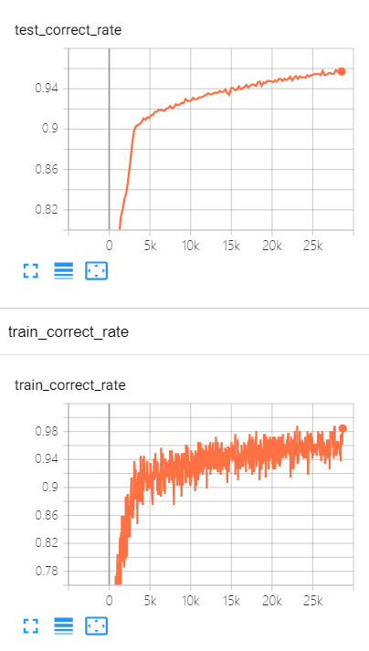
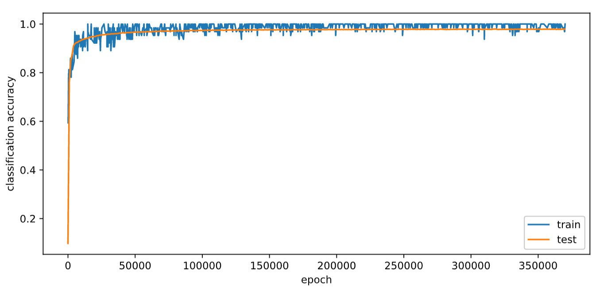
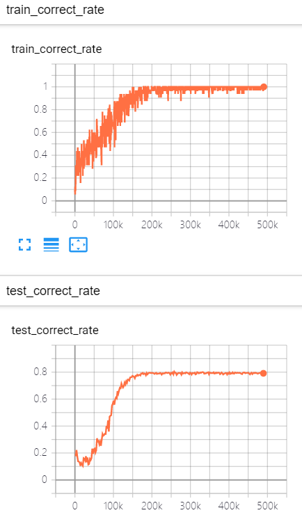

软反向传播 SpikingFlow.softbp
=======================================
本教程作者： `fangwei123456 <https://github.com/fangwei123456>`_

本节教程主要关注 ``SpikingFlow.softbp``，介绍软反向传播的概念、可微分SNN神经元的使用方式。

我们的这一方法的灵感，来源于使用CNN压缩图像中的量化过程的解决方法：

Mentzer F, Agustsson E, Tschannen M, et al. Conditional probability models for deep image \
compression[C]//Proceedings of the IEEE Conference on Computer Vision and Pattern Recognition. 2018: 4394-4402.

但这一方法其实已经被提出了，参见

Wu Y, Deng L, Li G, et al. Spatio-temporal backpropagation for \
training high-performance spiking neural networks[J]. Frontiers in neuroscience, 2018, 12: 331.

SNN之于RNN
----------
可以将SNN中的神经元看作是一种RNN，它的输入是电压增量（或者是电流，但为了方便，在 ``SpikingFlow.softbp`` 中用电压增量），\
隐藏状态是膜电压，输出是脉冲。这样的SNN神经元是具有马尔可夫性的：当前时刻的输出只与当前时刻的输入、神经元自身的状态有关。

可以用以下描述方程来描述任意的SNN：

.. math::
    H(t) & = f(V(t-1), X(t)) \\
    S(t) & = g(H(t) - V_{threshold}) = \Theta(H(t) - V_{threshold}) \\
    V(t) & = H(t) \cdot (1 - S(t)) + V_{reset} \cdot S(t)

其中 :math:`V(t)` 是神经元的膜电压；:math:`X(t)` 是外源输入，例如电压增量；:math:`H(t)` 是神经元的隐藏状态，可以理解为\
神经元还没有发放脉冲前的瞬时电压；:math:`f(V(t-1), X(t))` 是神经元的状态更新方程，不同的神经元，区别就在于更新方程不同。

例如对于LIF神经元：

.. math::
    \tau_{m} \frac{\mathrm{d}V(t)}{\mathrm{d}t} = -(V(t) - V_{reset}) + X(t)

:math:`S(t)` 是神经元发放的脉冲，:math:`g(x)=\Theta(x)` 是阶跃函数，或者按RNN的习惯称为门控函数，输出仅为0或1，可以表示脉冲\
的发放过程，定义为

.. math::
    \Theta(x) =
    \begin{cases}
    1, & x \geq 0 \\
    0, & x < 0
    \end{cases}

发放脉冲，则电压重置为 :math:`V_{reset}`；没有发放脉冲，则电压不变，这就是描述方程的最后一个方程，电压状态转移方程。

硬前向与软反向
-------------
RNN使用可微分的门控函数，例如tanh函数。而SNN的门控函数 :math:`g(x)=\Theta(x)` 显然是不可微分的，这就导致了SNN虽然一定程度上\
与RNN非常相似，但不能用梯度下降、反向传播来训练。但我们可以用一个形状与 :math:`g(x)=\Theta(x)` 非常相似，但可微分的门控函数\
:math:`\sigma(x)` 去替换它。

我们这一方法的核心思想是：在前向传播时，使用 :math:`g(x)=\Theta(x)`，神经元的输出是离散的0和1，我们的网络仍然是SNN；而反向\
传播时，使用近似门控函数 :math:`g'(x)=\sigma'(x)` 来求梯度。最常见的近似 :math:`g(x)=\Theta(x)` 的门控函数\
即为sigmoid函数 :math:`\sigma(\alpha x)=\frac{1}{1 + exp(-\alpha x)}`，:math:`\alpha` 可以控制函数的平滑程\
度，越大的 :math:`\alpha` 会越逼近 :math:`\Theta(x)` 但梯度越不光滑，网络也会越难以训练。近似门控函数引入后，电压状态转移\
函数 :math:`V(t) = H(t) \cdot (1 - S(t)) + V_{reset} \cdot S(t)` 也会随之改变。下图显示了不同的 :math:`\alpha` 以及电压\
状态转移方程：

.. image:: ./_static/tutorials/10.png

如果想使用其他的近似门控函数，只需要继承你想使用的 ``SpikingFlow.softbp`` 中的神经元，并重写 ``pulse_soft(x)`` 函数。默认\
的近似门控函数定义如下：

.. code-block:: python

    @staticmethod
    def pulse_soft(x):
        '''
        :param x: 输入，tensor
        :return: :math:`\\sigma(x)`

        此函数即为 :math:`\\sigma(x)`。默认是用sigmoid函数。如果想使用其他函数，继承后重写pulse_soft()函数即可
        '''
        return torch.sigmoid(x)

硬前向传播与软反向传播，在PyTorch中很容易实现，参考 ``SpikingFlow.softbp.BaseNode`` 中的 ``spiking``：

.. code-block:: python

        def spiking(self):
        if self.training:
            spike_hard = (self.v >= self.v_threshold).float()
            spike_soft = self.pulse_soft(self.v - self.v_threshold)
            v_hard = self.v_reset * spike_hard + self.v * (1 - spike_hard)
            v_soft = self.v_reset * spike_soft + self.v * (1 - spike_soft)
            self.v = v_soft + (v_hard - v_soft).detach_()
            return spike_soft + (spike_hard - spike_soft).detach_()
        else:
            spike_hard = (self.v >= self.v_threshold).float()
            self.v = self.v_reset * spike_hard + self.v * (1 - spike_hard)
            return spike_hard

前向传播时，该函数返回 ``spike_soft + spike_hard - spike_soft`` 即 ``spike_hard``，但计算图却是按照函数返回 ``spike_soft``\
建立的，因为 ``(spike_hard - spike_soft).detach_()`` 使得 ``spike_hard - spike_soft`` 被从计算图中剔除，因此反向传播时按\
照前向传播为 ``spike_soft`` 来计算梯度。

作为激活函数的SNN神经元
----------------------
解决了SNN的微分问题后，我们的SNN神经元可以像激活函数那样，嵌入到使用PyTorch搭建的任意网络中去了。在 ``SpikingFlow.softbp`` 中\
已经实现了IF神经元和LIF神经元，可以很方便地搭建各种网络，例如一个简单的全连接网络：\

.. code-block:: python

    net = nn.Sequential(
            nn.Linear(100, 10, bias=False),
            softbp.LIFNode(tau=100.0, v_threshold=1.0, v_reset=5.0)
            )

MNIST分类
--------
现在我们使用 ``SpikingFlow.softbp`` 中的LIF神经元，搭建一个双层全连接网络，对MNIST数据集进行分类：

.. code-block:: python

    import torch
    import torch.nn as nn
    import torch.nn.functional as F
    import torchvision
    import sys
    sys.path.append('.')
    import SpikingFlow.softbp as softbp
    import SpikingFlow.encoding as encoding
    from torch.utils.tensorboard import SummaryWriter
    import readline

    class Net(nn.Module):
        def __init__(self, tau=100.0, v_threshold=1.0, v_reset=0.0):
            super().__init__()
            # 网络结构，简单的双层全连接网络，每一层之后都是LIF神经元
            self.fc = nn.Sequential(
                nn.Flatten(),
                nn.Linear(28 * 28, 14 * 14, bias=False),
                softbp.LIFNode(tau=tau, v_threshold=v_threshold, v_reset=v_reset),
                nn.Linear(14 * 14, 10, bias=False),
                softbp.LIFNode(tau=tau, v_threshold=v_threshold, v_reset=v_reset)
            )

        def forward(self, x):
            return self.fc(x)

        def reset_(self):
            for item in self.modules():
                if hasattr(item, 'reset'):
                    item.reset()
    def main():
        device = input('输入运行的设备，例如“CPU”或“cuda:0”  ')
        dataset_dir = input('输入保存MNIST数据集的位置，例如“./”  ')
        batch_size = int(input('输入batch_size，例如“64”  '))
        learning_rate = float(input('输入学习率，例如“1e-3”  '))
        T = int(input('输入仿真时长，例如“50”  '))
        tau = float(input('输入LIF神经元的时间常数tau，例如“100.0”  '))
        train_epoch = int(input('输入训练轮数，即遍历训练集的次数，例如“100”  '))
        log_dir = input('输入保存tensorboard日志文件的位置，例如“./”  ')

        writer = SummaryWriter(log_dir)

        # 初始化数据加载器
        train_data_loader = torch.utils.data.DataLoader(
            dataset=torchvision.datasets.MNIST(
                root=dataset_dir,
                train=True,
                transform=torchvision.transforms.ToTensor(),
                download=True),
            batch_size=batch_size,
            shuffle=True,
            drop_last=True)
        test_data_loader = torch.utils.data.DataLoader(
            dataset=torchvision.datasets.MNIST(
                root=dataset_dir,
                train=False,
                transform=torchvision.transforms.ToTensor(),
                download=True),
            batch_size=batch_size,
            shuffle=True,
            drop_last=False)

        # 初始化网络
        net = Net(tau=tau).to(device)
        # 使用Adam优化器
        optimizer = torch.optim.Adam(net.parameters(), lr=learning_rate)
        # 使用泊松编码器
        encoder = encoding.PoissonEncoder()
        train_times = 0
        for _ in range(train_epoch):

            for img, label in train_data_loader:
                optimizer.zero_grad()
                # 将MNIST图像编码为脉冲数据
                in_spikes = encoder(img.to(device)).float()

                # 运行T个时长，out_spikes_counter是shape=[batch_size, 10]的tensor
                # 记录整个仿真时长内，输出层的10个神经元的脉冲发放次数
                for t in range(T):
                    if t == 0:
                        out_spikes_counter = net(in_spikes)
                    else:
                        out_spikes_counter += net(in_spikes)

                # out_spikes_counter / T 得到输出层10个神经元在仿真时长内的脉冲发放频率
                out_spikes_counter_frequency = out_spikes_counter / T

                # 损失函数为输出层神经元的脉冲发放频率，与真实类别的交叉熵
                # 这样的损失函数会使，当类别i输入时，输出层中第i个神经元的脉冲发放频率趋近1，而其他神经元的脉冲发放频率趋近0
                loss = F.cross_entropy(out_spikes_counter_frequency, label.to(device))
                loss.backward()
                optimizer.step()
                # 优化一次参数后，需要重置网络的状态，因为SNN的神经元是有“记忆”的
                net.reset_()

                # 正确率的计算方法如下。认为输出层中脉冲发放频率最大的神经元的下标i是分类结果
                correct_rate = (out_spikes_counter_frequency.max(1)[1] == label.to(device)).float().mean().item()
                writer.add_scalar('train_correct_rate', correct_rate, train_times)
                if train_times % 1024 == 0:
                    print('train_times', train_times, 'train_correct_rate', correct_rate)
                train_times += 1

            with torch.no_grad():
                # 每遍历一次全部数据集，就在测试集上测试一次
                test_sum = 0
                correct_sum = 0
                for img, label in test_data_loader:

                    in_spikes = encoder(img.to(device)).float()
                    for t in range(T):
                        if t == 0:
                            out_spikes_counter = net(in_spikes)
                        else:
                            out_spikes_counter += net(in_spikes)

                    correct_sum += (out_spikes_counter.max(1)[1] == label.to(device)).float().sum().item()
                    test_sum += label.numel()
                    net.reset_()

                writer.add_scalar('test_correct_rate', correct_sum / test_sum, train_times)

    if __name__ == '__main__':
        main()

这份代码位于 ``SpikingFlow.softbp.examples.mnist.py``。进入 ``SpikingFlow`` 的根目录（也就是GitHub仓库的根目录），直接运行\
即可，例如：

.. code-block:: bash

    (pytorch-env) wfang@pami:~/SpikingFlow$ python SpikingFlow/softbp/examples/mnist.py
    输入运行的设备，例如“CPU”或“cuda:0”  cuda:0
    输入保存MNIST数据集的位置，例如“./”  ./tempdir
    输入batch_size，例如“64”  256
    输入学习率，例如“1e-3”  1e-2
    输入仿真时长，例如“50”  50
    输入LIF神经元的时间常数tau，例如“100.0”  100.0
    输入训练轮数，即遍历训练集的次数，例如“100”  1000
    输入保存tensorboard日志文件的位置，例如“./”  ./tempdir

需要注意的是，训练这样的SNN，所需显存数量与仿真时长 ``T`` 线性相关，更长的 ``T`` 相当于使用更小的仿真步长，\
训练更为“精细”，训练效果也一般更好。这个模型只占用了 ``276MB`` 显存，但在之后的CIFAR10示例中，由于CNN的引入，使得显存消耗量\
剧增。

我们的这个模型，在Tesla K80上训练一个半小时，tensorboard记录的数据如下所示：

这个模型最终能够达到98%的测试集正确率，如下图所示，注意下图中的“epoch”表示训练次数，而代码中的“epoch”表示遍历一次训练集：

如果使用训练集增强的方法，例如给训练集图片加上一些随机噪声、仿射变换等，则训练好的网络泛化能力会进一步提升，最高能达到99%以上\
的测试集正确率。

CIFAR10分类
----------
我们的这种方法，具有的一大优势就是可以无缝嵌入到任意的PyTorch搭建的网络中。因此CNN的引入是非常简单而自然的。我们用CNN来进行\
CIFAR10分类任务，训练的代码与进行MNIST分类几乎相同，只需要更改一下网络结构和数据集。

.. code-block:: python

    import torch
    import torch.nn as nn
    import torch.nn.functional as F
    import torchvision
    import sys
    sys.path.append('.')
    import SpikingFlow.softbp as softbp
    import SpikingFlow.encoding as encoding
    from torch.utils.tensorboard import SummaryWriter
    import readline

    class Net(nn.Module):
        def __init__(self, tau=100.0, v_threshold=1.0, v_reset=0.0):
            super().__init__()
            # 网络结构，卷积-卷积-最大池化堆叠，最后接一个全连接层
            self.conv = nn.Sequential(
                nn.Conv2d(3, 256, kernel_size=3, padding=1),
                nn.BatchNorm2d(256),
                softbp.LIFNode(tau=tau, v_threshold=v_threshold, v_reset=v_reset),
                nn.Conv2d(256, 256, kernel_size=3, padding=1),
                nn.MaxPool2d(2, 2),
                nn.BatchNorm2d(256),
                softbp.LIFNode(tau=tau, v_threshold=v_threshold, v_reset=v_reset),  # 16 * 16

                nn.Conv2d(256, 256, kernel_size=3, padding=1),
                nn.BatchNorm2d(256),
                softbp.LIFNode(tau=tau, v_threshold=v_threshold, v_reset=v_reset),
                nn.Conv2d(256, 256, kernel_size=3, padding=1),
                nn.MaxPool2d(2, 2),
                nn.BatchNorm2d(256),
                softbp.LIFNode(tau=tau, v_threshold=v_threshold, v_reset=v_reset),  # 8 * 8

                nn.Conv2d(256, 256, kernel_size=3, padding=1),
                nn.BatchNorm2d(256),
                softbp.LIFNode(tau=tau, v_threshold=v_threshold, v_reset=v_reset),
                nn.Conv2d(256, 256, kernel_size=3, padding=1),
                nn.MaxPool2d(2, 2),
                nn.BatchNorm2d(256),
                softbp.LIFNode(tau=tau, v_threshold=v_threshold, v_reset=v_reset),  # 4 * 4

            )
            self.fc = nn.Sequential(
                nn.Flatten(),
                nn.Linear(256 * 4 * 4, 10, bias=False),
                softbp.LIFNode(tau=tau, v_threshold=v_threshold, v_reset=v_reset)
                                    )

        def forward(self, x):
            return self.fc(self.conv(x))

        def reset_(self):
            for item in self.modules():
                if hasattr(item, 'reset'):
                    item.reset()
    def main():
        device = input('输入运行的设备，例如“CPU”或“cuda:0”  ')
        dataset_dir = input('输入保存CIFAR10数据集的位置，例如“./”  ')
        batch_size = int(input('输入batch_size，例如“64”  '))
        learning_rate = float(input('输入学习率，例如“1e-3”  '))
        T = int(input('输入仿真时长，例如“50”  '))
        tau = float(input('输入LIF神经元的时间常数tau，例如“100.0”  '))
        train_epoch = int(input('输入训练轮数，即遍历训练集的次数，例如“100”  '))
        log_dir = input('输入保存tensorboard日志文件的位置，例如“./”  ')

        writer = SummaryWriter(log_dir)

        # 初始化数据加载器
        train_data_loader = torch.utils.data.DataLoader(
            dataset=torchvision.datasets.CIFAR10(
                root=dataset_dir,
                train=True,
                transform=torchvision.transforms.ToTensor(),
                download=True),
            batch_size=batch_size,
            shuffle=True,
            drop_last=True)
        test_data_loader = torch.utils.data.DataLoader(
            dataset=torchvision.datasets.CIFAR10(
                root=dataset_dir,
                train=False,
                transform=torchvision.transforms.ToTensor(),
                download=True),
            batch_size=batch_size,
            shuffle=True,
            drop_last=False)

        # 初始化网络
        net = Net(tau=tau).to(device)
        # 使用Adam优化器
        optimizer = torch.optim.Adam(net.parameters(), lr=learning_rate)
        # 使用泊松编码器
        encoder = encoding.PoissonEncoder()
        train_times = 0
        for _ in range(train_epoch):

            for img, label in train_data_loader:
                optimizer.zero_grad()
                # 将图像编码为脉冲数据
                in_spikes = encoder(img.to(device)).float()

                # 运行T个时长，out_spikes_counter是shape=[batch_size, 10]的tensor
                # 记录整个仿真时长内，输出层的10个神经元的脉冲发放次数
                for t in range(T):
                    if t == 0:
                        out_spikes_counter = net(in_spikes)
                    else:
                        out_spikes_counter += net(in_spikes)

                # out_spikes_counter / T 得到输出层10个神经元在仿真时长内的脉冲发放频率
                out_spikes_counter_frequency = out_spikes_counter / T

                # 损失函数为输出层神经元的脉冲发放频率，与真实类别的交叉熵
                # 这样的损失函数会使，当类别i输入时，输出层中第i个神经元的脉冲发放频率趋近1，而其他神经元的脉冲发放频率趋近0
                loss = F.cross_entropy(out_spikes_counter_frequency, label.to(device))
                loss.backward()
                optimizer.step()
                # 优化一次参数后，需要重置网络的状态，因为SNN的神经元是有“记忆”的
                net.reset_()

                # 正确率的计算方法如下。认为输出层中脉冲发放频率最大的神经元的下标i是分类结果
                correct_rate = (out_spikes_counter_frequency.max(1)[1] == label.to(device)).float().mean().item()
                writer.add_scalar('train_correct_rate', correct_rate, train_times)
                if train_times % 1024 == 0:
                    print('train_times', train_times, 'train_correct_rate', correct_rate)
                train_times += 1

            with torch.no_grad():
                # 每遍历一次全部数据集，就在测试集上测试一次
                test_sum = 0
                correct_sum = 0
                for img, label in test_data_loader:

                    in_spikes = encoder(img.to(device)).float()
                    for t in range(T):
                        if t == 0:
                            out_spikes_counter = net(in_spikes)
                        else:
                            out_spikes_counter += net(in_spikes)

                    correct_sum += (out_spikes_counter.max(1)[1] == label.to(device)).float().sum().item()
                    test_sum += label.numel()
                    net.reset_()

                writer.add_scalar('test_correct_rate', correct_sum / test_sum, train_times)

    if __name__ == '__main__':
        main()

这份代码位于 ``SpikingFlow.softbp.examples.cifar10.py``，运行方法与之前的MNIST的代码相同。需要注意的是，由于CNN的引入，CNN层\
后也跟有LIF神经元，CNN层的输出是一个高维矩阵，因此其后的LIF神经元数量众多，导致这个模型极端消耗显存。在大约 ``batch_size=32``\
，仿真时长 ``T=50`` 的情况下，这个模型几乎要消耗 ``12G`` 的显存。训练这样庞大模型，Tesla K80的算力显得捉襟见肘。我们在TITAN RTX\
上训练大约60小时，网络才能收敛，测试集正确率大约为80%。使用训练集增强的方法，同样可以提高泛化能力。

