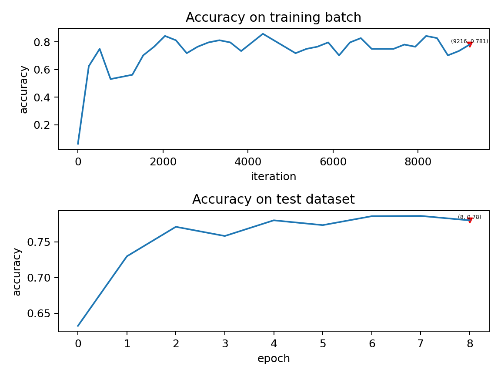

事件驱动 SpikingFlow.event_driven
=======================================
本教程作者： `fangwei123456 <https://github.com/fangwei123456>`_

本节教程主要关注 ``SpikingFlow.event_driven``，介绍事件驱动概念、Tempotron神经元。

事件驱动的SNN仿真
-----------------
``clock_driven`` 使用时间驱动的方法对SNN进行仿真，因此在代码中都能够找到在时间上的循环，例如：

.. code-block:: python

    for t in range(T):
        if t == 0:
            out_spikes_counter = net(encoder(img).float())
        else:
            out_spikes_counter += net(encoder(img).float())

而使用事件驱动的SNN仿真，并不需要在时间上进行循环，神经元的状态更新由事件触发，例如产生脉冲或接受输入脉冲，因而不同神经元的活动\
可以异步计算，不需要在时钟上保持同步。

脉冲响应模型(Spike response model, SRM)
--------------------------------------

在脉冲响应模型(Spike response model, SRM)中，使用显式的 :math:`V-t` 方程来描述神经元的活动，而不是用微分方程去描述神经元的充\
电过程。由于 :math:`V-t` 是已知的，因此给与任何输入 :math:`X(t)`，神经元的响应 :math:`V(t)` 都可以被直接算出。

Tempotron神经元
---------------

Tempotron神经元是 [#f1]_ 提出的一种SNN神经元，其命名来源于ANN中的感知器（Perceptron）。感知器是最简单的ANN神经元，对输入数据\
进行加权求和，输出二值0或1来表示数据的分类结果。Tempotron可以看作是SNN领域的感知器，它同样对输入数据进行加权求和，并输出二分类\
的结果。

Tempotron的膜电位定义为：

.. math::
    V(t) = \sum_{i} w_{i} \sum_{t_{i}} K(t - t_{i}) + V_{reset}

其中 :math:`w_{i}` 是第 :math:`i` 个输入的权重，也可以看作是所连接的突触的权重；:math:`t_{i}` 是第 :math:`i` 个输入的脉冲发\
放时刻，:math:`K(t - t_{i})` 是由于输入脉冲引发的突触后膜电位(postsynaptic potentials, PSPs)；:math:`V_{reset}` 是Tempotron\
的重置电位，或者叫静息电位。

:math:`K(t - t_{i})` 是一个关于 :math:`t_{i}` 的函数(PSP Kernel)，[#f1]_ 中使用的函数形式如下：

.. math::
    K(t - t_{i}) =
    \begin{cases}
    V_{0} (exp(-\frac{t - t_{i}}{\tau}) - exp(-\frac{t - t_{i}}{\tau_{s}})), & t \geq t_{i} \\
    0, & t < t_{i}
    \end{cases}

其中 :math:`V_{0}` 是归一化系数，使得函数的最大值为1；:math:`\tau` 是膜电位时间常数，可以看出输入的脉冲在Tempotron上会引起\
瞬时的点位激增，但之后会指数衰减；:math:`\tau_{s}` 则是突触电流的时间常数，这一项的存在表示突触上传导的电流也会随着时间衰减。

单个的Tempotron可以作为一个二分类器，分类结果的判别，是看Tempotron的膜电位在仿真周期内是否过阈值:

.. math::
    y =
    \begin{cases}
    1, & V_{t_{max}} \geq V_{threshold} \\
    0, & V_{t_{max}} < V_{threshold}
    \end{cases}

其中 :math:`t_{max} = \mathrm{argmax} \{V_{t}\}`。
从Tempotron的输出结果也能看出，Tempotron只能发放不超过1个脉冲。单个Tempotron只能做二分类，但多个Tempotron就可以做多分类。

如何训练Tempotron
-----------------
使用Tempotron的SNN网络，通常是“全连接层 + Tempotron”的形式，网络的参数即为全连接层的权重。使用梯度下降法来优化网络参数。

以二分类为例，损失函数被定义为仅在分类错误的情况下存在。当实际类别是1而实际输出是0，损失为 :math:`V_{threshold} - V_{t_{max}}`;\
当实际类别是0而实际输出是1，损失为 :math:`V_{t_{max}} - V_{threshold}`。可以统一写为：

.. math::
    E = (y - \hat{y})(V_{threshold} - V_{t_{max}})

直接对参数求梯度，可以得到：

.. math::
    \frac{\partial E}{\partial w_{i}} = (y - \hat{y}) (\sum_{t_{i} < t_{max}} K(t_{max} - t_{i}) \
    + \frac{\partial V(t_{max})}{\partial t_{max}} \frac{\partial t_{max}}{\partial w_{i}}) \\
    = (y - \hat{y})(\sum_{t_{i} < t_{max}} K(t_{max} - t_{i}))

因为 :math:`\frac{\partial V(t_{max})}{\partial t_{max}}=0`。

并行实现
--------
如前所述，对于脉冲响应模型，一旦输入给定，神经元的响应方程已知，任意时刻的神经元状态都可以求解。此外，计算 :math:`t` 时刻的电\
压值，并不需要依赖于 :math:`t-1` 时刻的电压值，因此不同时刻的电压值完全可以并行求解。在 ``SpikingFlow/event_driven/neuron.py`` 中\
实现了集成全连接层、并行计算的Tempotron，将时间看作是一个单独的维度，整个网络在 :math:`t=0, 1, ..., T-1` 时刻的状态全都被并
行地计算出。读者如有兴趣可以直接阅读源代码。

识别MNIST
---------
我们使用Tempotron搭建一个简单的SNN网络，识别MNIST数据集。首先我们需要考虑如何将MNIST数据集转化为脉冲输入。在 ``clock_driven``中\
的泊松编码器，在伴随着整个网络的for循环中，不断地生成脉冲；但在使用Tempotron时，我们使用高斯调谐曲线编码器 [#f2]_，这一编码器\
可以在时间维度上并行地将输入数据转化为脉冲发放时刻。

高斯调谐曲线编码器
^^^^^^^^^^^^^^^^^
假设我们要编码的数据有 :math:`n` 个特征，对于MNIST图像，因其是单通道图像，可以认为 :math:`n=1`。高斯调谐曲线编码器，使\
用 :math:`m (m>2)` 个神经元去编码每个特征，并将每个特征编码成这 :math:`m` 个神经元的脉冲发放时刻，因此可以认为编码器内\
共有 :math:`nm` 个神经元。

对于第 :math:`i` 个特征 :math:`X^{i}`，它的取值范围为 :math:`X^{i}_{min} \leq X^{i} \leq X^{i}_{max}`，首先计算\
出 :math:`m` 条高斯曲线 :math:`g^{i}_{j}` 的均值和方差：

.. math::
    \mu^{i}_{j} & = x^{i}_{min} + \frac{2j - 3}{2} \frac{x^{i}_{max} - x^{i}_{min}}{m - 2}, j=1, 2, ..., m \\
    \sigma^{i}_{j} & = \frac{1}{\beta} \frac{x^{i}_{max} - x^{i}_{min}}{m - 2}

其中 :math:`\beta` 通常取值为 :math:`1.5`。可以看出，这 :math:`m` 条高斯曲线的形状完全相同，只是对称轴所在的位置不同。

对于要编码的数据 :math:`x \in X^{i}`，首先计算出 :math:`x` 对应的高斯函数值 :math:`g^{i}_{j}(x)`，这些函数值全部介\
于 :math:`[0, 1]` 之间。接下来，将函数值线性地转换到 :math:`[0, T]` 之间的脉冲发放时刻，其中 :math:`T` 是编码周期，或者说\
是仿真时长：

.. math::
    t_{j} = \mathrm{Round}((1 - g^{i}_{j}(x))T)

其中 :math:`\mathrm{Round}` 取整函数。此外，对于发放时刻太晚的脉冲，例如发放时刻为 :math:`T`，则直接将发放时刻设置\
为 :math:`-1`，表示没有脉冲发放。

形象化的示例如下图 [#f2]_ 所示，要编码的数据 :math:`x \in X^{i}` 是一条垂直于横轴的直线，与 :math:`m` 条高斯曲线相交\
于 :math:`m` 个交点，这些交点在纵轴上的投影点，即为 :math:`m` 个神经元的脉冲发放时刻。但由于我们在仿真时，仿真步长通常是整\
数，因此脉冲发放时刻也需要取整。

.. image:: ./_static/tutorials/event_driven/1.png

定义网络、损失函数、分类结果
^^^^^^^^^^^^^^^^^^^^^^^^^^^

网络的结构非常简单，单层的Tempotron，输出层是10个神经元，因为MNIST图像共有10类：

.. code-block:: python

    class Net(nn.Module):
        def __init__(self, m, T):
            # m是高斯调谐曲线编码器编码一个像素点所使用的神经元数量
            super().__init__()
            self.tempotron = neuron.Tempotron(784*m, 10, T)
        def forward(self, x: torch.Tensor):
            # 返回的是输出层10个Tempotron在仿真时长内的电压峰值
            return self.tempotron(x, 'v_max')

分类结果被认为是输出的10个电压峰值的最大值对应的神经元索引，因此训练时正确率计算如下：

.. code-block:: python

    train_acc = (v_max.argmax(dim=1) == label.to(device)).float().mean().item()

我们使用的损失函数与 [#f1]_ 中的类似，但所有不同。对于分类错误的神经元，误差为其峰值电压与阈值电压之差的平方，损失函数可以\
在 ``event_driven.neuron`` 中找到源代码：

.. code-block:: python

    class Tempotron(nn.Module):
        ...
        @staticmethod
        def mse_loss(v_max, v_threshold, label, num_classes):
            '''
            :param v_max: Tempotron神经元在仿真周期内输出的最大电压值，与forward函数在ret_type == 'v_max'时的返回值相\
            同。shape=[batch_size, out_features]的tensor
            :param v_threshold: Tempotron的阈值电压，float或shape=[batch_size, out_features]的tensor
            :param label: 样本的真实标签，shape=[batch_size]的tensor
            :param num_classes: 样本的类别总数，int
            :return: 分类错误的神经元的电压，与阈值电压之差的均方误差
            '''
            wrong_mask = ((v_max >= v_threshold).float() != F.one_hot(label, 10)).float()
            return torch.sum(torch.pow((v_max - v_threshold) * wrong_mask, 2)) / label.shape[0]

下面我们直接运行代码。完整的源代码位于 ``SpikingFlow/event_driven/examples/tempotron_mnist.py``：

.. code-block:: python

    >>> import SpikingFlow.event_driven.examples.tempotron_mnist as tempotron_mnist
    >>> tempotron_mnist.main()
    输入运行的设备，例如“cpu”或“cuda:0”
     input device, e.g., "cpu" or "cuda:0": cuda:15
    输入保存MNIST数据集的位置，例如“./”
     input root directory for saving MNIST dataset, e.g., "./": ./mnist
    输入batch_size，例如“64”
     input batch_size, e.g., "64": 64
    输入学习率，例如“1e-3”
     input learning rate, e.g., "1e-3": 1e-3
    输入仿真时长，例如“100”
     input simulating steps, e.g., "100": 10
    输入训练轮数，即遍历训练集的次数，例如“100”
     input training epochs, e.g., "100": 100
    输入使用高斯调谐曲线编码每个像素点使用的神经元数量，例如“16”
     input neuron number for encoding a piexl in GaussianTuning encoder, e.g., "16": 16
    输入保存tensorboard日志文件的位置，例如“./”
     input root directory for saving tensorboard logs, e.g., "./": ./logs_tempotron_mnist

查看训练结果
^^^^^^^^^^^^
在Tesla K80上训练10个epoch，大约需要32分钟。训练时每个batch的正确率、测试集正确率的变化情况如下：

测试集的正确率在78%左右，可以看出Tempotron确实实现了类似ANN中感知器的功能，具有一定的分类能力。但是与主流的多层SNN相比，性能较差。

.. [#f1] Gutig R, Sompolinsky H. The tempotron: a neuron that learns spike timing–based decisions[J]. Nature Neuroscience, 2006, 9(3): 420-428.
.. [#f2] Bohte S M, Kok J N, La Poutre J A, et al. Error-backpropagation in temporally encoded networks of spiking neurons[J]. Neurocomputing, 2002, 48(1): 17-37.
