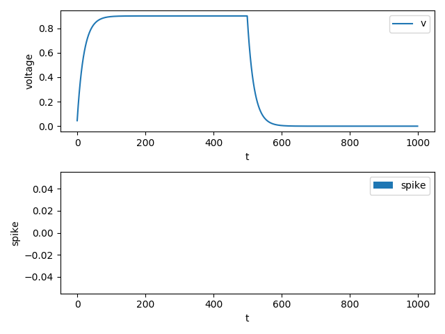
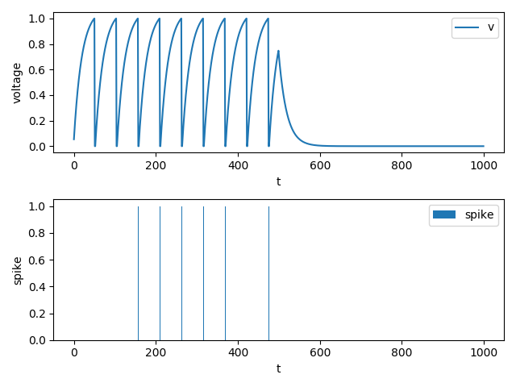

神经元
=======================================

本节教程主要关注SpikingFlow.neuron，包括如何使用已有神经元、如何定义新的神经元

LIF神经元仿真
------------

我们使用一个LIF神经元进行仿真，代码如下

.. code-block:: python

    import SpikingFlow
    import SpikingFlow.neuron as neuron
    # 导入绘图模块
    from matplotlib import pyplot
    import torch

    # 新建一个LIF神经元
    lif_node = neuron.LIFNode([1], r=9.0, v_threshold=1.0, tau=20.0)
    # 新建一个空list，保存仿真过程中神经元的电压值
    v_list = []
    # 新建一个空list，保存神经元的输出脉冲
    spike_list = []

    T = 1000
    # 运行1000次
    for t in range(T):
        # 前500次，输入电流都是0.12
        if t < 500:
            spike_list.append(lif_node(0.12).float().item())
        # 后500次，不输入，也就是输入0
        else:
            spike_list.append(lif_node(0).float().item())

        # 记录每一次输入后，神经元的电压
        v_list.append(lif_node.v.item())

    # 画出电压的变化
    pyplot.subplot(2, 1, 1)
    pyplot.plot(v_list, label='v')
    pyplot.xlabel('t')
    pyplot.ylabel('voltage')
    pyplot.legend()

    # 画出脉冲
    pyplot.subplot(2, 1, 2)
    pyplot.bar(torch.arange(0, T).tolist(), spike_list, label='spike')
    pyplot.xlabel('t')
    pyplot.ylabel('spike')
    pyplot.legend()
    pyplot.show()

运行后得到的电压和脉冲如下

你会发现，LIF神经元在有恒定输入电流时，电压会不断增大，但增速越来越慢

如果输入电流不是足够大，最终在每个dt内，LIF神经元的电压衰减值会恰好等于输入电流造成的电压增加值，电压不再增大，导致无法充电到\
过阈值、发放脉冲

当停止输入后，LIF神经元的电压会指数衰减，从图中500个dt后的曲线可以看出

我们修改代码，给予更大的电流输入

.. code-block:: python

    ...
    for t in range(T):
        # 前500次，输入电流都是0.12
        if t < 500:
            spike_list.append(lif_node(0.12).float().item())
    ...

运行后得到的电压和脉冲如下

可以发现，LIF神经元已经开始大量发放脉冲了

定义新的神经元
-------------

在SNN中，不同的神经元模型，区别往往体现在描述神经元的微分方程。上文所使用的LIF神经元，描述其动态特性的微分方程为：

.. math::
    \tau_{m} \frac{\mathrm{d}V(t)}{\mathrm{d}t} = -(V(t) - V_{reset}) + R_{m}I(t)

其中 :math:`tau_{m}` 是细胞膜的时间常数， :math:`V(t)` 是膜电位， :math:`V_{reset}` 是静息电压， :math:`R_{m}` 是膜电\
阻， :math:`I(t)` 是输入电流
