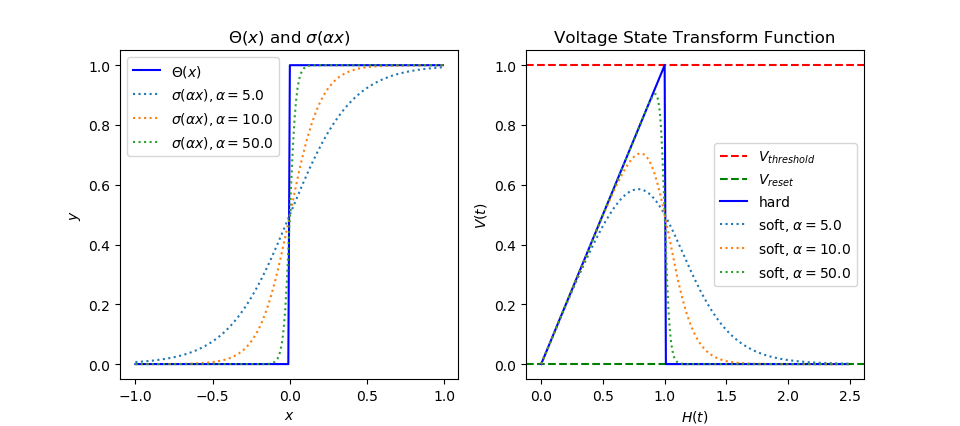
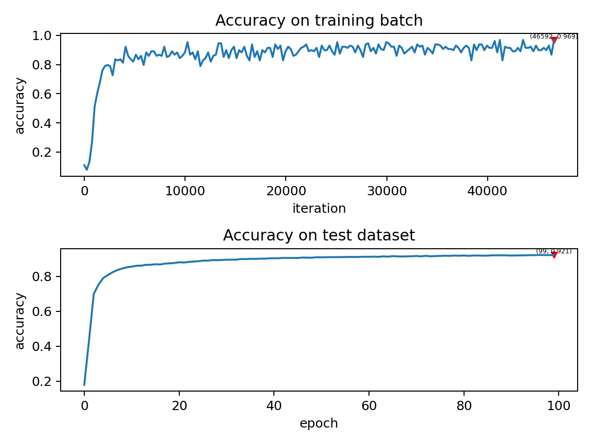

Clock_driven
=======================================
Author: `fangwei123456 <https://github.com/fangwei123456>`_, `lucifer2859 <https://github.com/lucifer2859>`_

This tutorial focuses on ``SpikingFlow.clock_driven``, introducing the clock-driven simulation method, the concept of surrogate gradient method, and the use of differentiable spiking neurons.

The surrogate gradient method is a new method emerging in recent years. For more information about this method, please refer to the following overview:

Neftci E, Mostafa H, Zenke F, et al. Surrogate Gradient Learning in Spiking Neural Networks: Bringing the Power of Gradient-based optimization to spiking neural networks[J]. IEEE Signal Processing Magazine, 2019, 36(6): 51-63.

The download address for this article can be found at `arXiv <https://arxiv.org/abs/1901.09948>`_ .

SNN Compared with RNN
----------
The neuron in SNN can be regarded as a kind of RNN, and its input is the voltage increment (or the product of current and membrane resistance, but for convenience, ``clock_driven.neuron`` uses voltage increment). The hidden state is the membrane voltage, and the output is a spike. Such spiking neurons are Markovian: the output at the current time is only related to the input at the current time and the state of the neuron itself.

You can use three discrete equations —— Charge, Discharge, Reset —— to describe any discrete spiking neuron:

.. math::
    H(t) & = f(V(t-1), X(t)) \\
    S(t) & = g(H(t) - V_{threshold}) = \Theta(H(t) - V_{threshold}) \\
    V(t) & = H(t) \cdot (1 - S(t)) + V_{reset} \cdot S(t)

where :math:`V(t)` is the membrane voltage of the neuron; :math:`X(t)` is an external source input, such as voltage increment; :math:`H(t)` is the hidden state of the neuron, which can be understood as the instant before the neuron has not fired a spike; :math:`f(V(t-1), X(t))` is the state update equation of the neuron. Different neurons differ in the update equation.

For example, for a LIF neuron, we describe the differential equation of its dynamics below a threshold, and the corresponding difference equation are:

.. math::
    \tau_{m} \frac{\mathrm{d}V(t)}{\mathrm{d}t} = -(V(t) - V_{reset}) + X(t)

    \tau_{m} (V(t) - V(t-1)) = -(V(t-1) - V_{reset}) + X(t)

The corresponding Charge equation is

.. math::
    f(V(t - 1), X(t)) = V(t - 1) + \frac{1}{\tau_{m}}(-(V(t - 1) - V_{reset}) + X(t))

In the Discharge equation, :math:`S(t)` is a spike fired by a neuron, :math:`g(x)=\Theta(x)` is a step function. RNN is used to call it a gating function. In SNN, it is called a spiking function. The output of the spiking function is only 0 or 1, which can represent the firing process of spike, defined as

.. math::
    \Theta(x) =
    \begin{cases}
    1, & x \geq 0 \\
    0, & x < 0
    \end{cases}

Reset means the reset process of the voltage: when a spike is fired, the voltage is reset to :math:`V_{reset}`; If no spike is fired, the voltage remains unchanged.

Surrogate Gradient Method
-------------
RNN uses differentiable gating functions, such as the tanh function. Obviously, the spiking function of SNN :math:`g(x)=\Theta(x)` is not differentiable, which leads to the fact that SNN is very similar to RNN to a certain extent, but it cannot be trained by gradient descent and back-propagation. We can use a gating function that is very similar to :math:`g(x)=\Theta(x)` , but differentiable :math:`\sigma(x)` to replace it.

The core idea of ​​this method is: when forwarding, using :math:`g(x)=\Theta(x)`, the output of the neuron is discrete 0 and 1, and our network is still SNN; When back-propagation, the gradient of the surrogate gradient function :math:`g'(x)=\sigma'(x)` is used to replace the gradient of the spiking function. The most common surrogate gradient function is the sigmoid function :math:`\sigma(\alpha x)=\frac{1}{1 + exp(-\alpha x)}`. :math:`\alpha` can control the smoothness of the function. The function with larger :math:`\alpha` will be closer to :math:`\Theta(x)`. But when it gets closer to :math:`x=0`, the gradient will be more likely to explode. And when it gets farther to :math:`x=0`, the gradient will be more likely to disappear. This makes the network more difficult to train. The following figure shows the shape of the surrogate gradient function and the corresponding Reset equation for different :math:`\alpha`:

The default surrogate gradient function is ``clock_driven.surrogate.Sigmoid()``, ``clock_driven.surrogate`` also provides other optional approximate gating functions.
The surrogate gradient function is one of the parameters of the neuron constructor in ``clock_driven.neuron``:

.. code-block:: python

    class BaseNode(nn.Module):
        def __init__(self, v_threshold=1.0, v_reset=0.0, surrogate_function=surrogate.Sigmoid(), monitor_state=False):
            '''
            :param v_threshold: The threshold voltage of the neuron
            :param v_reset: The reset voltage of the neuron. If it is not None, when the neuron fires the spike, the voltage will be reset to v_reset; if it is set to None, the voltage will be subtracted from the threshold
            :param surrogate_function: Surrogate function used to calculate the gradient of the spiking function during back-propagation
            :param monitor_state: Whether to set up a monitor to save the voltage of the neurons and the spikes fired. If True, self.monitor is a dictionary, whose keys include 'v' and 's', recording voltage and output spike respectively. The corresponding value is a linked list. In order to save video memory (memory), what is stored in the list is the value of the original variable converted into a numpy array. Also note that the self.reset() function will clear these linked lists

If you want to customize the new approximate gating function, you can refer to the code in ``clock_driven.surrogate``. Usually we define it as ``torch.autograd.Function``, and then encapsulate it into a subclass of ``torch.nn.Module``.

Embed Spiking Neurons into Deep Networks
------------------------
After solving the differential problem of spiking neurons, our spiking neurons can be embedded into any network built using PyTorch like an activation function, making the network an SNN. Some classic neurons have been implemented in ``clock_driven.neuron``, which can easily build various networks, such as a simple fully connected network:

.. code-block:: python

    net = nn.Sequential(
            nn.Linear(100, 10, bias=False),
            neuron.LIFNode(tau=100.0, v_threshold=1.0, v_reset=5.0)
            )

MNIST classification using a double-layer fully connected network
-----------------------------
Now we use the LIF neurons in ``clock_driven.neuron`` to build a two-layer fully connected network to classify the MNIST dataset.

First we define our network structure:

.. code-block:: python

    class Net(nn.Module):
        def __init__(self, tau=100.0, v_threshold=1.0, v_reset=0.0):
            super().__init__()
            # Network structure, a simple two-layer fully connected network, each layer is followed by LIF neurons
            self.fc = nn.Sequential(
                nn.Flatten(),
                nn.Linear(28 * 28, 14 * 14, bias=False),
                neuron.LIFNode(tau=tau, v_threshold=v_threshold, v_reset=v_reset),
                nn.Linear(14 * 14, 10, bias=False),
                neuron.LIFNode(tau=tau, v_threshold=v_threshold, v_reset=v_reset)
            )

        def forward(self, x):
            return self.fc(x)

Define our hyperparameters:

.. code-block:: python

    device = input('Enter the input device, e.g., "cpu" or "cuda:0": ')
    dataset_dir = input('Enter the input root directory for saving MNIST dataset, e.g., "./": ')
    batch_size = int(input('Enter the input batch_size, e.g., "64": '))
    learning_rate = float(input('Enter the input learning rate, e.g., "1e-3": '))
    T = int(input('Enter the input simulating steps, e.g., "100": '))
    tau = float(input('Enter the input membrane time constant, tau, for LIF neurons, e.g., "100.0": '))
    train_epoch = int(input('Enter the input training epochs, e.g., "100": '))
    log_dir = input('Enter the input root directory for saving tensorboard logs, e.g., "./": ')

Initialize the data loader, network, optimizer, and encoder (we use a Poisson encoder to encode the MNIST image into spike trains):

.. code-block:: python

    # Initialize the network
    net = Net(tau=tau).to(device)
    # Use Adam Optimizer
    optimizer = torch.optim.Adam(net.parameters(), lr=learning_rate)
    # Use Poisson encoder
    encoder = encoding.PoissonEncoder()

The training of the network is simple. Run the network for ``T`` time steps to accumulate the output spikes of 10 neurons in the output layer to obtain the number of spikes fired by the output layer ``out_spikes_counter``; Use the firing times of the spike divided by the simulation duration to get the firing frequency of the output layer ``out_spikes_counter_frequency = out_spikes_counter / T``. We hope that when the real category of the input image is ``i``, the ``i``-th neuron in the output layer has the maximum activation degree, while the other neurons remain silent. Therefore, the loss function is naturally defined as the firing frequency of the output layer ``out_spikes_counter_frequency`` and the cross-entropy of ``label_one_hot`` obtained after one-hot encoding with the real category, or MSE. We use MSE because the experiment found that MSE is better. In particular, note that SNN is a stateful, or memorized network. So before entering new data, you must reset the state of the network. This can be done by calling ``clock_driven.functional.reset_net(net)``  to fulfill. The training code is as follows:

.. code-block:: python

    for img, label in train_data_loader:
        img = img.to(device)
        label = label.to(device)
        label_one_hot = F.one_hot(label, 10).float()

        optimizer.zero_grad()

        # Run for T durations, out_spikes_counter is a tensor with shape=[batch_size, 10]
        # Record the number of spikes delivered by the 10 neurons in the output layer during the entire simulation duration
        for t in range(T):
            if t == 0:
                out_spikes_counter = net(encoder(img).float())
            else:
                out_spikes_counter += net(encoder(img).float())

        # out_spikes_counter / T # Obtain the firing frequency of 10 neurons in the output layer within the simulation duration
        out_spikes_counter_frequency = out_spikes_counter / T

        # The loss function is the firing frequency of the neurons in the output layer, and the MSE of the real class
        # Such a loss function causes that when the category i is input, the firing frequency of the i-th neuron in the output layer approaches 1, while the firing frequency of other neurons approaches 0.
        loss = F.mse_loss(out_spikes_counter_frequency, label_one_hot)
        loss.backward()
        optimizer.step()
        # After optimizing the parameters once, the state of the network needs to be reset, because the SNN neurons have "memory"
        functional.reset_net(net)

The test code is simpler than the training code:

.. code-block:: python

    net.eval()
    with torch.no_grad():
        # Each time through the entire data set, test once on the test set
        test_sum = 0
        correct_sum = 0
        for img, label in test_data_loader:
            img = img.to(device)
            for t in range(T):
                if t == 0:
                    out_spikes_counter = net(encoder(img).float())
                else:
                    out_spikes_counter += net(encoder(img).float())

            correct_sum += (out_spikes_counter.max(1)[1] == label.to(device)).float().sum().item()
            test_sum += label.numel()
            functional.reset_net(net)

        writer.add_scalar('test_accuracy', correct_sum / test_sum, epoch)

The complete code is located at ``clock_driven.examples.lif_fc_mnist.py``. In the code, we also use Tensorboard to save the training log. You can run it directly on the Python command line:

    .. code-block:: python

        >>> import SpikingFlow.clock_driven.examples.lif_fc_mnist as lif_fc_mnist
        >>> lif_fc_mnist.main()
        Enter the input device, e.g., "cpu" or "cuda:0": cuda:15
        Enter the input root directory for saving MNIST dataset, e.g., "./": ./mnist
        Enter the input batch_size, e.g., "64": 128
        Enter the input learning rate, e.g., "1e-3": 1e-3
        Enter the input simulating steps, e.g., "100": 50
        Enter the input membrane time constant, tau, for LIF neurons, e.g., "100.0": 100.0
        Enter the input training epochs, e.g., "100": 100
        Enter the input root directory for saving tensorboard logs, e.g., "./": ./logs_lif_fc_mnist
        cuda:15 ./mnist 128 0.001 50 100.0 100 ./logs_lif_fc_mnist
        train_times 0 train_accuracy 0.109375
        cuda:15 ./mnist 128 0.001 50 100.0 100 ./logs_lif_fc_mnist
        train_times 1024 train_accuracy 0.5078125
        cuda:15 ./mnist 128 0.001 50 100.0 100 ./logs_lif_fc_mnist
        train_times 2048 train_accuracy 0.7890625
        ...
        cuda:15 ./mnist 128 0.001 50 100.0 100 ./logs_lif_fc_mnist
        train_times 46080 train_accuracy 0.9296875

It should be noted that the amount of memory required to train such an SNN is linearly related to the simulation time ``T``. A longer ``T`` is equivalent to using a smaller simulation step size and training is more "fine", however, the training effect is not necessarily better. So if ``T`` is too large, the SNN will become a very deep network after being expanded in time, and the gradient is easy to decay or explode. Since we use a Poisson encoder, a larger ``T`` is required.

Our model, training 100 epochs on Tesla K80, takes about 75 minutes. The changes in the accuracy of each batch and the accuracy of the test set during training are as follows:

The final test set accuracy rate is about 92%, which is not a very high accuracy rate, because we use a very simple network structure and Poisson encoder. We can completely remove the Poisson encoder and send the image directly to the SNN. In this case, the first layer of LIF neurons can be regarded as an encoder.