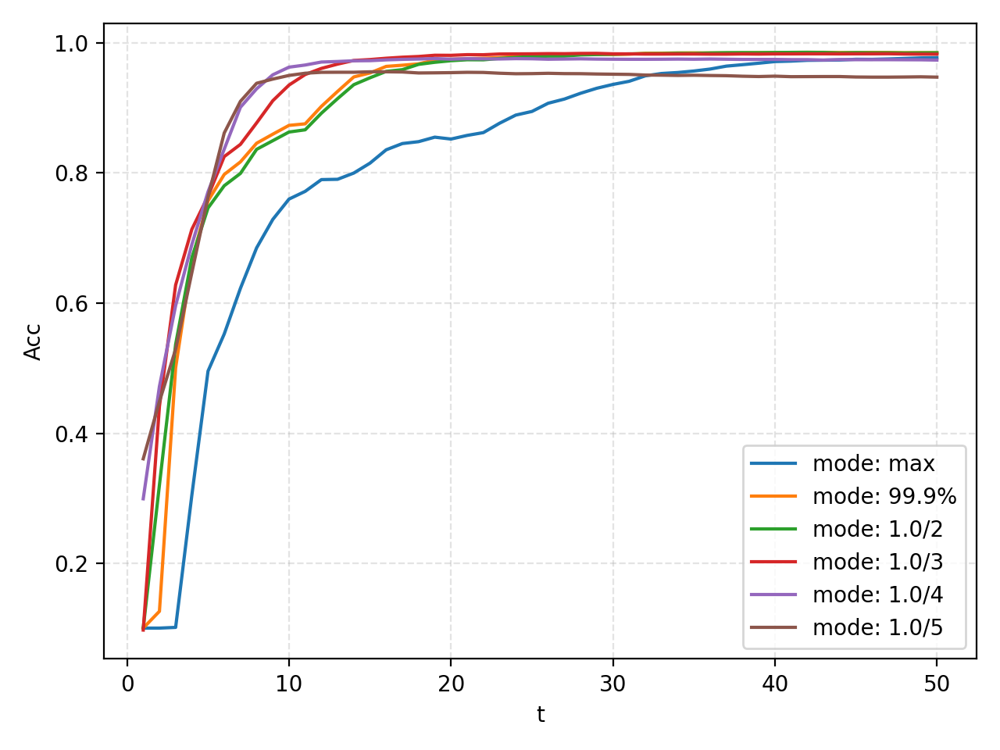

ANN转换SNN
=======================================
本页作者：`DingJianhao <https://github.com/DingJianhao>`_、`fangwei123456 <https://github.com/fangwei123456>`_、`Lv Liuzhenghao <https://github.com/Lyu6PosHao>`_、`黄一凡 (AllenYolk) <https://github.com/AllenYolk>`_

English version: :doc:`../en/ann2snn`

.. admonition:: ANN2SNN 教程导航

    当前 ANN2SNN 教程按转换流程拆分：

    #. 本页介绍当前 Recipe API 中基于 FX graph 的 rate-coded CNN 转换：``RateCodingRecipe`` / ``LocalThresholdBalancingRecipe`` 定义算法，``Converter`` （即 ``FXConverter`` 的兼容名）执行转换。
    #. :doc:`Transformer ANN2SNN 转换 <ann2snn_transformer>` 介绍面向 Transformer 模型的 ``STATransformerRecipe``、``SpikeZIPTFQANNRecipe`` 和离线多步 ``Qwen2SNNRecipe``。

    旧 API 教程仍可查阅：

    #. :doc:`更早期 clock-driven 时代 ANN2SNN API <../../legacy_tutorials/cn/5_ann2snn>`。
    #. :doc:`legacy pre-Recipe Converter API <../../legacy_tutorials/cn/ann2snn_converter_legacy>`，使用 ``Converter(mode=..., dataloader=...)`` 和 ``convert_to_spiking_neurons(model)``。

本节介绍 ``spikingjelly.activation_based.ann2snn``，展示如何用当前 Recipe API 将训练好的前馈 ANN 转换为 SNN 并在 SpikingJelly 中仿真。

相关 API 见 `API 参考 <https://spikingjelly.readthedocs.io/zh_CN/latest/APIs/spikingjelly.activation_based.ann2snn.html>`_。

本页介绍的 rate-coding 路径基于 ``torch.fx``。``torch.fx`` 会将 ``nn.Module`` 实例 trace 为计算图表示，然后由 ANN2SNN FX recipe 对该计算图进行变换。ANN2SNN 也提供不 trace FX graph 的 ``ModuleConverter``，用于 SpikeZIP 和 Qwen2 这类直接替换 ``nn.Module`` tree 的转换；这些路径见 Transformer ANN2SNN 教程。

ANN转换SNN的理论基础
--------------------

与 ANN 相比，SNN 使用离散脉冲通信，有利于高效计算，但直接训练 SNN 往往需要更多资源。一种做法是先训练 ANN，再将其转换为行为相近的 SNN。这需要建立 ANN 激活值和 SNN 发放率之间的联系。对于 rate-coded SNN，输出类别由脉冲计数读出。核心问题是：脉冲神经元的发放率能否近似 ANN 神经元的激活值？

ANN 中的 ReLU 激活与采用减法重置的 IF 神经元发放率有很强的相关性，其中膜电位会通过减去 :math:`V_{threshold}` 重置。这里的神经元更新方式就是 `神经元教程 <https://spikingjelly.readthedocs.io/zh_CN/latest/tutorials/cn/neuron.html>`_ 中介绍的 Soft reset 方式。``RateCodingRecipe`` 利用这一关系进行转换。

实验：IF神经元脉冲发放频率和输入的关系
^^^^^^^^^^^^^^^^^^^^^^^^^^^^^^^^^^^^^^^^^^^^^^^^^^^^^^^^^^^^^^^^^^^^^^

向IF神经元输入恒定值，观察其输出脉冲和脉冲发放频率。先导入模块，创建IF神经元层，画出每个神经元的输入 :math:`x_{i}`：

.. code-block:: python

    import torch
    from spikingjelly.activation_based import neuron
    from spikingjelly import visualizing
    from matplotlib import pyplot as plt
    import numpy as np

    plt.rcParams['figure.dpi'] = 200
    if_node = neuron.IFNode(v_reset=None)
    T = 128
    x = torch.arange(-0.2, 1.2, 0.04)
    plt.scatter(torch.arange(x.shape[0]), x)
    plt.title('Input $x_{i}$ to IF neurons')
    plt.xlabel('Neuron index $i$')
    plt.ylabel('Input $x_{i}$')
    plt.grid(linestyle='-.')
    plt.show()

.. image:: ../../_static/tutorials/5_ann2snn/0.*
    :width: 100%

接下来，将输入送入到IF神经元层，并运行 ``T=128`` 步，观察各个神经元发放的脉冲、脉冲发放频率：

.. code-block:: python

    s_list = []
    for t in range(T):
        s_list.append(if_node(x).unsqueeze(0))

    out_spikes = np.asarray(torch.cat(s_list))
    visualizing.plot_1d_spikes(out_spikes, 'IF neurons\' spikes and firing rates', 't', 'Neuron index $i$')
    plt.show()

.. image:: ../../_static/tutorials/5_ann2snn/1.*
    :width: 100%

脉冲发放频率在一定范围内与输入 :math:`x_{i}` 的大小成正比。

接下来，让我们画出IF神经元脉冲发放频率和输入 :math:`x_{i}` 的曲线，并与 :math:`\mathrm{ReLU}(x_{i})` 对比：

.. code-block:: python

    plt.subplot(1, 2, 1)
    firing_rate = np.mean(out_spikes, axis=0)
    plt.plot(x, firing_rate)
    plt.title('Input $x_{i}$ and firing rate')
    plt.xlabel('Input $x_{i}$')
    plt.ylabel('Firing rate')
    plt.grid(linestyle='-.')

    plt.subplot(1, 2, 2)
    plt.plot(x, x.relu())
    plt.title('Input $x_{i}$ and ReLU($x_{i}$)')
    plt.xlabel('Input $x_{i}$')
    plt.ylabel('ReLU($x_{i}$)')
    plt.grid(linestyle='-.')
    plt.show()

.. image:: ../../_static/tutorials/5_ann2snn/2.*
    :width: 100%

两者的曲线几乎一致。但脉冲频率不可能高于1，因此IF神经元无法拟合ANN中ReLU输入大于1的情况。

理论证明
^^^^^^^^

文献 [#f1]_ 为ANN转SNN提供了理论基础，证明SNN中的IF神经元是ReLU激活函数在时间上的无偏估计器。

针对神经网络第一层，考虑 SNN 神经元发放率 :math:`r` 和对应 ANN 激活值之间的关系。假定输入恒定为 :math:`z \in [0,1]`。对于采用减法重置的IF神经元，其膜电位V随时间变化为：

.. math::
    V_t=V_{t-1}+z-V_{threshold}\theta_t

其中：
 :math:`V_{threshold}` 为发放阈值，通常设为1.0。 :math:`\theta_t` 为输出脉冲。 :math:`T` 时间步内的平均发放率可以通过对膜电位求和得到：

.. math::
    \sum_{t=1}^{T} V_t= \sum_{t=1}^{T} V_{t-1}+z T-V_{threshold} \sum_{t=1}^{T}\theta_t

将含有 :math:`V_t` 的项全部移项到左边，两边同时除以 :math:`T` ：

.. math::
    \frac{V_T-V_0}{T} = z - V_{threshold}  \frac{\sum_{t=1}^{T}\theta_t}{T} = z- V_{threshold}  \frac{N}{T}

其中 :math:`N` 为 :math:`T` 时间窗口内的脉冲数， :math:`\frac{N}{T}` 就是发放率  :math:`r`。利用  :math:`z= V_{threshold} a` 即：

.. math::
    r = a- \frac{ V_T-V_0 }{T V_{threshold}}

故在仿真时间步  :math:`T` 无限长情况下:

.. math::
    r = a (a>0)

类似地，针对神经网络更高层，文献 [#f1]_ 进一步说明层间发放率满足：

.. math::
    r^l = W^l r^{l-1}+b^l- \frac{V^l_T}{T V_{threshold}}

完整推导见文献 [#f1]_。ann2snn 中的方法基于该文献。

转换到脉冲神经网络
^^^^^^^^^^^^^^^^^^^^^^^^

转换主要解决两个问题：

1. ANN 使用批归一化（Batch Normalization）加速训练和收敛。批归一化将激活值归一化到零均值，与 SNN 特性冲突。解决方法是将 BN 参数吸收到前面的参数层中（Linear、Conv2d）。

2. 按转换理论，ANN 每层的输入输出需要限制在 [0,1] 范围内，需要对参数进行缩放（模型归一化）。

◆ BatchNorm参数吸收

假定BatchNorm的参数为 :math:`\gamma` (``BatchNorm.weight``)， :math:`\beta` (``BatchNorm.bias``)， :math:`\mu` (``BatchNorm.running_mean``)，
:math:`\sigma` (``BatchNorm.running_var``，:math:`\sigma = \sqrt{\mathrm{running\_var}}`)。具体参数定义详见
`torch.nn.BatchNorm1d <https://pytorch.org/docs/stable/generated/torch.nn.BatchNorm1d.html#torch.nn.BatchNorm1d>`_。参数模块（例如 Linear）具有权重 :math:`W` 和偏置 :math:`b`。BatchNorm 参数吸收就是将 BatchNorm 的参数通过运算转移到参数模块的 :math:`W` 和 :math:`b` 中，使得数据输入新模块的输出和有 BatchNorm 时相同。对此，新模型的 :math:`\bar{W}` 和 :math:`\bar{b}` 公式表示为：

.. math::
    \bar{W} = \frac{\gamma}{\sigma}  W

.. math::
    \bar{b} = \frac{\gamma}{\sigma} (b - \mu) + \beta

◆ 模型归一化

对于某个参数模块，假定得到了其输入张量和输出张量，其输入张量的最大值为 :math:`\lambda_{pre}` ,输出张量的最大值为 :math:`\lambda` 那么，归一化后的权重 :math:`\hat{W}` 为：

.. math::
    \hat{W} = W * \frac{\lambda_{pre}}{\lambda}

归一化后的偏置 :math:`\hat{b}` 为：

.. math::
    \hat{b} = \frac{b}{\lambda}

ANN每层输出中常常存在较大的离群值，导致整体神经元发放率降低。鲁棒归一化将缩放因子从张量最大值改为张量的p分位点，推荐分位点为99.9% [#f1]_。

BatchNorm 融合和模型归一化是在脉冲替换前进行的代数变换。随后 rate-coding recipe 会将 ReLU 激活替换为 IF 神经元。对于 ANN 中的平均池化，转换后的模型保留空间下采样。由于 IF 神经元会在时间上近似 ReLU 激活，在空间下采样后立即再增加一个 IF 神经元通常对结果影响很小。当前 rate-coding recipe 没有通用的最大池化转换规则。文献中使用基于动量累计脉冲的门控函数控制脉冲通道 [#f1]_。因此，本教程的示例模型仍推荐使用 ``AvgPool2d``。仿真时，依照该转换理论，转换后的 SNN 应输入恒定的模拟输入。使用 Poisson 编码器可能引入额外的准确率损失。

实现与可选配置
^^^^^^^^^^^^^^^^^^^^^^^^

当前 ann2snn API 将算法定义和执行流程分离。对于本页的 rate-coding CNN 转换，使用 FX 路径：

* ``FXConversionRecipe`` 持有算法参数和算法相关的图变换。兼容名 ``ConversionRecipe`` 等价于 ``FXConversionRecipe``。
* ``FXConverter`` 是执行器。兼容名 ``Converter`` 等价于 ``FXConverter``。它接收 FX recipe，用 ``torch.fx`` trace 模型，并通过 ``convert(model)`` 依次调用 recipe 的 FX 转换步骤。
* 直接 ``nn.Module`` tree 转换使用 ``ModuleConversionRecipe`` 和 ``ModuleConverter``，不执行 FX tracing，也不会由 ``Converter`` 自动分发。

如果要做 ReLU-to-IFNode 的 rate-coding 转换，使用 ``RateCodingRecipe``。该 recipe 需要校准 dataloader，因为它会在替换 ReLU 前统计激活范围。常见模式包括：

* ``mode="max"``：MaxNorm，使用最大激活值 [#f2]_。
* ``mode="99.9%"``：RobustNorm，使用 99.9% 激活分位点 [#f1]_。
* ``mode`` 为 ``(0, 1]`` 内的浮点数：按该比例缩放最大激活值。

``RateCodingRecipe`` 也持有 ``fuse_flag`` 等选项。当 ``fuse_flag=True`` （默认值）时，Conv-BatchNorm 会在校准前被融合。

最简单的 rate-coding 调用如下：

.. code-block:: python

    recipe = ann2snn.RateCodingRecipe(dataloader=train_loader, mode="max")
    snn = ann2snn.Converter(recipe=recipe).convert(ann)

转换产物的运行方式与 ``spikingjelly.activation_based`` 中其他模块一致。单步模式下，用户显式编写时间循环。Rate-coding 和 LTB 模型在每个时间步接收同一个静态 ANN 输入：

.. code-block:: python

    from spikingjelly.activation_based import functional

    functional.set_step_mode(snn, "s")
    functional.reset_net(snn)

    y = None
    for t in range(T):
        y_t = snn(x)
        y = y_t if y is None else y + y_t

如果要运行 layer-wise 多步路径，输入第 0 维为时间维的序列，并显式做累计读出：

.. code-block:: python

    functional.set_step_mode(snn, "m")
    functional.reset_net(snn)

    x_seq = x.unsqueeze(0).expand(T, *x.shape)
    y_seq = snn(x_seq)
    y = y_seq.sum(dim=0)

转换后 ReLU 模块被删除，SNN 需要的新模块（包括 ``VoltageScaler``、``IFNode`` 等）会作为 ``spiking_*`` 子模块创建在原父模块下。使用 ``RateCodingRecipe`` 时，转换后模型的类型为 ``fx.GraphModule``，所以可以使用 ``snn.graph.print_tabular()`` 查看生成的计算图。更多 API 参见 `GraphModule <https://pytorch.org/docs/stable/fx.html?highlight=graphmodule#torch.fx.GraphModule>`_。

.. note::

    本页的 FX 转换使用 ``Converter(recipe=...)`` 和 ``Converter.convert(model)``。``Converter`` 是 ``FXConverter`` 的兼容名，只接受 ``FXConversionRecipe`` / ``ConversionRecipe``。旧的公开函数已移除，包括 ``convert_to_spiking_neurons()``、``replace_by_td_operators()``、``fuse()``、``set_voltagehook()``、``replace_by_neurons()`` 和 ``replace_by_ifnode()``。

识别MNIST
---------

构建并加载 ANN
^^^^^^^^^^^^^^^^^^^^^^^^

下面用 ``ann2snn`` 搭建一个简单卷积网络，对 MNIST 数据集进行分类。

完整的可运行示例是 ``spikingjelly.activation_based.ann2snn.examples.cnn_mnist``。网络结构定义在 ``ann2snn.sample_models.mnist_cnn`` 中：

.. code-block:: python

    class CNN(nn.Module):
        def __init__(self):
            super().__init__()
            self.network = nn.Sequential(
                nn.Conv2d(1, 32, 3, 1),
                nn.BatchNorm2d(32),
                nn.ReLU(),
                nn.AvgPool2d(2, 2),

                nn.Conv2d(32, 32, 3, 1),
                nn.BatchNorm2d(32),
                nn.ReLU(),
                nn.AvgPool2d(2, 2),

                nn.Conv2d(32, 32, 3, 1),
                nn.BatchNorm2d(32),
                nn.ReLU(),
                nn.AvgPool2d(2, 2),

                nn.Flatten(),
                nn.Linear(32, 10),
            )

        def forward(self, x):
            x = self.network(x)
            return x

注意：如果需要展开 tensor，在网络中定义 ``nn.Flatten`` 模块，在 ``forward`` 中调用它，而不是使用 ``view``。

定义基本运行选项：

.. code-block:: python

    torch.random.manual_seed(0)
    if torch.cuda.is_available():
        torch.cuda.manual_seed(0)
    device = "cuda" if torch.cuda.is_available() else "cpu"
    dataset_dir = "./data/mnist"
    batch_size = 100
    T = 50

``T`` 是 SNN 推理时使用的仿真步数。转换前先创建 MNIST dataloader：

.. code-block:: python

    train_data_dataset = torchvision.datasets.MNIST(
        root=dataset_dir,
        train=True,
        transform=torchvision.transforms.ToTensor(),
        download=True,
    )
    train_data_loader = torch.utils.data.DataLoader(
        dataset=train_data_dataset, batch_size=batch_size, shuffle=True, drop_last=False
    )
    calibration_data_loader = torch.utils.data.DataLoader(
        dataset=train_data_dataset, batch_size=batch_size, shuffle=False, drop_last=False
    )
    test_data_dataset = torchvision.datasets.MNIST(
        root=dataset_dir,
        train=False,
        transform=torchvision.transforms.ToTensor(),
        download=True,
    )
    test_data_loader = torch.utils.data.DataLoader(
        dataset=test_data_dataset, batch_size=50, shuffle=True, drop_last=False
    )

示例脚本会下载预训练 checkpoint。入口函数 ``download_checkpoint`` 封装了下载逻辑，``download_url`` 失败时回退到 ``requests`` 流式下载。先加载并验证 ANN：

.. code-block:: python

    from spikingjelly.activation_based.ann2snn.examples.cnn_mnist import (
        DEFAULT_CHECKPOINT_PATH,
        DEFAULT_CHECKPOINT_URL,
        download_checkpoint,
    )
    from spikingjelly.activation_based.ann2snn.sample_models import mnist_cnn

    download_checkpoint(DEFAULT_CHECKPOINT_URL, DEFAULT_CHECKPOINT_PATH)
    model = mnist_cnn.CNN().to(device)
    model.load_state_dict(torch.load(DEFAULT_CHECKPOINT_PATH, map_location=device))
    acc = val(model, device, test_data_loader)
    print('ANN Validating Accuracy: %.4f' % (acc))

本次运行中，ANN 准确率为：

.. code-block:: shell

    ANN Validating Accuracy: 0.9870

使用Converter进行转换
^^^^^^^^^^^^^^^^^^^^^^^^

ANN 训练完成。选择 rate-coding recipe，传入确定性校准 dataloader，由 ``Converter`` 执行转换：

.. code-block:: python

    recipe = ann2snn.RateCodingRecipe(dataloader=calibration_data_loader, mode="max")
    model_converter = ann2snn.Converter(recipe=recipe)
    snn_model = model_converter.convert(model)

``snn_model`` 即转换后的 SNN 模型。查看其网络结构，``BatchNorm2d`` 模块已消失——默认 rate-coding recipe 在校准前将 BatchNorm 参数吸收进了前面的 Conv 层：

.. code-block:: python

    CNN(
      (network): Module(
        (0): Conv2d(1, 32, kernel_size=(3, 3), stride=(1, 1))
        (3): AvgPool2d(kernel_size=2, stride=2, padding=0)
        (4): Conv2d(32, 32, kernel_size=(3, 3), stride=(1, 1))
        (7): AvgPool2d(kernel_size=2, stride=2, padding=0)
        (8): Conv2d(32, 32, kernel_size=(3, 3), stride=(1, 1))
        (11): AvgPool2d(kernel_size=2, stride=2, padding=0)
        (12): Flatten(start_dim=1, end_dim=-1)
        (13): Linear(in_features=32, out_features=10, bias=True)
        (spiking_0): Module(
          (scaler0): VoltageScaler(0.193247)
          (if_node): IFNode(
            v_threshold=1.0, v_reset=None, detach_reset=False, step_mode=s, backend=torch
            (surrogate_function): Sigmoid(alpha=4.0, spiking=True)
          )
          (scaler1): VoltageScaler(5.174733)
        )
        (spiking_1): Module(
          (scaler0): VoltageScaler(0.325697)
          (if_node): IFNode(
            v_threshold=1.0, v_reset=None, detach_reset=False, step_mode=s, backend=torch
            (surrogate_function): Sigmoid(alpha=4.0, spiking=True)
          )
          (scaler1): VoltageScaler(3.070336)
        )
        (spiking_2): Module(
          (scaler0): VoltageScaler(0.121967)
          (if_node): IFNode(
            v_threshold=1.0, v_reset=None, detach_reset=False, step_mode=s, backend=torch
            (surrogate_function): Sigmoid(alpha=4.0, spiking=True)
          )
          (scaler1): VoltageScaler(8.198915)
        )
      )
    )

使用 ``RateCodingRecipe`` 时，``snn_model`` 的类型为 ``GraphModule``。可参考 `GraphModule <https://pytorch.org/docs/stable/fx.html?highlight=graphmodule#torch.fx.GraphModule>`_。

调用 ``GraphModule.graph.print_tabular()`` 可以表格形式查看计算图的中间表示：

.. code-block:: shell

    # snn_model.graph.print_tabular()
    opcode       name                       target                     args                          kwargs
    -----------  -------------------------  -------------------------  ----------------------------  ------
    placeholder  x                          x                          ()                            {}
    call_module  network_0                  network.0                  (x,)                          {}
    call_module  network_spiking_0_scaler0  network.spiking_0.scaler0  (network_0,)                  {}
    call_module  network_spiking_0_if_node  network.spiking_0.if_node  (network_spiking_0_scaler0,)  {}
    call_module  network_spiking_0_scaler1  network.spiking_0.scaler1  (network_spiking_0_if_node,)  {}
    call_module  network_3                  network.3                  (network_spiking_0_scaler1,)  {}
    call_module  network_4                  network.4                  (network_3,)                  {}
    call_module  network_spiking_1_scaler0  network.spiking_1.scaler0  (network_4,)                  {}
    call_module  network_spiking_1_if_node  network.spiking_1.if_node  (network_spiking_1_scaler0,)  {}
    call_module  network_spiking_1_scaler1  network.spiking_1.scaler1  (network_spiking_1_if_node,)  {}
    call_module  network_7                  network.7                  (network_spiking_1_scaler1,)  {}
    call_module  network_8                  network.8                  (network_7,)                  {}
    call_module  network_spiking_2_scaler0  network.spiking_2.scaler0  (network_8,)                  {}
    call_module  network_spiking_2_if_node  network.spiking_2.if_node  (network_spiking_2_scaler0,)  {}
    call_module  network_spiking_2_scaler1  network.spiking_2.scaler1  (network_spiking_2_if_node,)  {}
    call_module  network_11                 network.11                 (network_spiking_2_scaler1,)  {}
    call_module  network_12                 network.12                 (network_11,)                 {}
    call_module  network_13                 network.13                 (network_12,)                 {}
    output       output                     output                     (network_13,)                 {}

其它 recipe 与自定义 recipe
^^^^^^^^^^^^^^^^^^^^^^^^^^^

上面的 MNIST 示例使用 rate coding 将 ReLU 激活转换为 IF 神经元。对于 Transformer 模型，可以改用 ``TransformerTDEquivalentRecipe``：

.. code-block:: python

    recipe = ann2snn.TransformerTDEquivalentRecipe()
    td_model = ann2snn.Converter(recipe=recipe).convert(transformer_ann)

该 recipe 不需要 dataloader，不插入 ``VoltageHook``，也不运行 rate-coding 校准。它将当前支持的 ANN 模块和 attention 调用替换为 TD-equivalent 算子，但不覆盖完整的 fully spike-driven LLM 转换。在这些 TD 算子中，``ann_forward(...)`` 是普通无状态 PyTorch 路径；``single_step_forward(...)`` 是有状态 temporal-difference 单步传播，处理独立序列前应先 ``reset()``。

要添加新的 FX graph 转换算法，继承 ``FXConversionRecipe`` （或兼容名 ``ConversionRecipe``）并覆盖需要改变的步骤方法即可。未覆盖的方法使用基类的默认 no-op 实现。Recipe 不是执行器，不应提供 ``convert()``、``run()`` 或 ``__call__()``：

.. code-block:: python

    class MyFXRecipe(ann2snn.FXConversionRecipe):
        def replace(self, converter, fx_model):
            # Implement the algorithm-specific graph rewrite here.
            return fx_model

FX 路径固定步骤顺序为 ``validate`` -> ``before_trace`` -> ``after_trace`` -> ``insert_observers`` -> ``calibrate`` -> ``replace`` -> ``finalize``。

如果算法不需要 FX graph，而是直接替换 ``nn.Module`` tree，应继承 ``ModuleConversionRecipe`` 并用 ``ModuleConverter`` 执行。该路径只有 ``validate`` -> ``convert_module`` 两步，不存在 ``before_trace`` 或 ``finalize``：

.. code-block:: python

    class MyModuleRecipe(ann2snn.ModuleConversionRecipe):
        def convert_module(self, converter, ann):
            # Replace submodules in ann or return a converted copy.
            return ann

    converted = ann2snn.ModuleConverter(recipe=MyModuleRecipe()).convert(ann)

自定义转换规则
^^^^^^^^^^^^^^

默认情况下，``RateCodingRecipe`` 使用 ``ReLURule`` 将 ``nn.ReLU`` 模块替换为 ``VoltageScaler(1 / s) -> IFNode -> VoltageScaler(s)``。其中校准尺度 ``s`` 由 ``ThresholdOptimizer`` 基于 ``VoltageHook`` 计算得到。

高级用户可以向 ``RateCodingRecipe`` 显式传入以下扩展点：

* ``rules`` 负责匹配 FX 计算图节点、插入校准 hook、查找完成校准的activation-hook 节点对，并把它们替换为 SNN 子图。
* ``NeuronFactory`` 负责创建替换时使用的神经元。默认工厂创建 ``IFNode(v_threshold=1.0, v_reset=None)``。
* ``ThresholdOptimizer`` 负责从已校准的 ``VoltageHook`` 计算有限正标量阈值。

下面的最小规则只演示协议形状，不表示新的转换算法。它匹配 ``nn.Identity``，并将完成校准的 identity 节点替换为另一个 ``nn.Identity`` 模块：

.. code-block:: python

    import torch
    import torch.nn as nn

    from spikingjelly.activation_based import ann2snn
    from spikingjelly.activation_based.ann2snn.modules import VoltageHook

    class IdentityRule:
        def match(self, node, modules):
            return node.op == "call_module" and type(modules[node.target]) is nn.Identity

        def insert_hooks(self, fx_model, node, hook_factory, hook_counts_per_prefix):
            target = f'{node.target}_voltage_hook'
            fx_model.add_submodule(target, hook_factory.create())
            with fx_model.graph.inserting_after(node):
                return fx_model.graph.call_module(target, args=(node,))

        def find_replacements(self, fx_model, modules):
            for hook_node in fx_model.graph.nodes:
                if hook_node.op == "call_module" and isinstance(
                    modules.get(hook_node.target), VoltageHook
                ):
                    yield hook_node.args[0], hook_node

        def replace_with_neurons(
            self, fx_model, activation_node, hook_node, neuron_factory, threshold_optimizer
        ):
            hook = fx_model.get_submodule(hook_node.target)
            threshold = threshold_optimizer.compute_threshold(hook)
            # IdentityRule 不使用脉冲阈值，但真实规则应将该标量接入替换子图。
            target = f'{activation_node.target}_spiking_identity'
            fx_model.add_submodule(target, nn.Identity())
            with fx_model.graph.inserting_after(hook_node):
                new_node = fx_model.graph.call_module(target, args=activation_node.args)
            hook_node.replace_all_uses_with(new_node)
            activation_node.replace_all_uses_with(new_node)
            fx_model.graph.erase_node(hook_node)
            fx_model.graph.erase_node(activation_node)

    recipe = ann2snn.RateCodingRecipe(
        dataloader=[torch.randn(2, 4)],
        rules=[IdentityRule()],
    )
    converter = ann2snn.Converter(recipe=recipe)

当前内置 ``ReLURule`` 路径只对标量阈值有明确语义。Per-channel 或张量阈值还需要先定义 shape、broadcast 和 ``VoltageScaler`` 语义，不属于当前转换路径。

不同转换模式的对比
^^^^^^^^^^^^^^^^^^

按照这个例子，也可以比较 ``RateCodingRecipe`` 中不同归一化模式的时间步收敛曲线。完整示例脚本保留了这一旧实验，可以用 ``--plot-mode-sweep`` 运行：

.. code-block:: shell

    python -m spikingjelly.activation_based.ann2snn.examples.cnn_mnist \
      --time-steps 50 \
      --plot-mode-sweep

以下输出是在 NVIDIA GeForce RTX 4090 上以 ``T=50`` 测得：

.. code-block:: shell

    ANN Validating Accuracy: 0.9870
    ---------------------------------------------
    Converting using MaxNorm
    Calibration: 3.76s
    Simulating...
    Simulation: 7.61s
    SNN accuracy (simulation 50 time-steps): 0.9771
    ---------------------------------------------
    Converting using RobustNorm
    Calibration: 12.08s
    Simulating...
    Simulation: 7.31s
    SNN accuracy (simulation 50 time-steps): 0.9848
    ---------------------------------------------
    Converting using 1/2 max(activation) as scales
    Calibration: 3.73s
    Simulating...
    Simulation: 7.28s
    SNN accuracy (simulation 50 time-steps): 0.9846
    ---------------------------------------------
    Converting using 1/3 max(activation) as scales
    Calibration: 3.72s
    Simulating...
    Simulation: 7.29s
    SNN accuracy (simulation 50 time-steps): 0.9825
    ---------------------------------------------
    Converting using 1/4 max(activation) as scales
    Calibration: 3.75s
    Simulating...
    Simulation: 7.27s
    SNN accuracy (simulation 50 time-steps): 0.9734
    ---------------------------------------------
    Converting using 1/5 max(activation) as scales
    Calibration: 3.70s
    Simulating...
    Simulation: 7.26s
    SNN accuracy (simulation 50 time-steps): 0.9472

不同归一化模式在早期时间步收敛速度和最终准确率之间形成取舍，可根据延迟和准确率需求选择。

转换 recipe 对比
^^^^^^^^^^^^^^^^

除了基础的 ``RateCodingRecipe``，SpikingJelly 还提供 ``LocalThresholdBalancingRecipe``，用于在转换阶段估计局部阈值。该 recipe 参考 local threshold balancing 方法 [#f3]_。下面比较 ANN、legacy 标量阈值 RobustNorm 转换和 LTB recipe。完整可运行入口仍是 ``spikingjelly.activation_based.ann2snn.examples.cnn_mnist``：

.. code-block:: shell

    python -m spikingjelly.activation_based.ann2snn.examples.cnn_mnist \
      --time-steps 32 \
      --output /tmp/ann2snn_mnist_t32.json

下表可以由该命令直接生成。其中 RobustNorm 使用 ``RateCodingRecipe(dataloader=..., mode="99.9%")``。 LTB 使用 ``LocalThresholdBalancingRecipe(dataloader=..., time_steps=32, mode="99.9%")``。本次 MNIST 结果使用完整训练集 60000 张样本作为校准集，使用完整测试集 10000 张样本评估：

.. list-table:: MNIST CNN 转换结果
    :header-rows: 1
    :widths: 22 20 18 18 22

    * - 方法
      - 校准样本
      - 测试样本
      - 时间步
      - Top-1 (%)
    * - ANN
      - -
      - 10000
      - -
      - 98.70
    * - RobustNorm（legacy，标量阈值）
      - 60000
      - 10000
      - 32
      - 98.35
    * - LocalThresholdBalancingRecipe
      - 60000
      - 10000
      - 32
      - 98.53

ResNet-18 转换
--------------

为了展示同一套 recipe 在更大规模模型上的行为，可以运行 ImageNet ResNet-18 示例。该脚本使用 torchvision 的 ``ResNet18_Weights.IMAGENET1K_V1`` 权重和对应预处理。校准集为 ImageNet 训练集中的确定性 50000 张子集，评估集为完整 ImageNet 验证集 50000 张。示例命令假设 ``/path/to/imagenet`` 下包含 ``train/`` 和 ``val/`` 两个目录；如果数据集组织在额外的 ``ILSVRC2012/`` 等子目录下，请将 ``--data-root`` 指向真正包含这两个目录的位置。

.. note::

    SpikingJelly 中的 ``LocalThresholdBalancingRecipe`` 是在当前 ANN2SNN recipe 框架内对 local threshold balancing 主要思想的工程化实现，并不是 LTB 原文 [#f3]_ 完整 pipeline 的复现。部分论文中特定的工程细节和评测设置没有纳入当前实现。因此，下表中的精度应理解为 SpikingJelly 该 recipe 实现的结果，不能直接视为 LTB 原文方法的官方精度，也不应与论文结果直接对比。

复现命令如下：

.. code-block:: shell

    CUDA_VISIBLE_DEVICES=0 python -m spikingjelly.activation_based.ann2snn.examples.imagenet_resnet18_ltb \
      --data-root /path/to/imagenet \
      --calib-samples 50000 \
      --batch-size 128 \
      --num-workers 8 \
      --device cuda:0 \
      --time-steps 32 \
      --recipes ann robust_legacy ltb \
      --delay-start auto \
      --output /tmp/ann2snn_imagenet_t32_delayauto_calib50k_tutorial.json

命令中的 ``robust_legacy`` 对应不启用 ``channel_wise`` 和 ``half_threshold`` 的 legacy 标量阈值 ``RateCodingRecipe``。``--delay-start auto`` 会在评估前估计 delayed readout 的起始时间步，用于跳过 SNN 早期 transient。该设置只影响读出窗口，不改变转换后的神经元动力学。下表中的 LTB 完整运行自动估计的 ``delay_start`` 为 27；该值依赖模型、校准数据和实现细节，用户运行时可能得到不同数值。

.. list-table:: ImageNet ResNet-18 转换结果
    :header-rows: 1
    :widths: 28 18 18 14 16 16

    * - 方法
      - 校准样本
      - 验证样本
      - 时间步
      - Top-1 (%)
      - Top-5 (%)
    * - ANN
      - -
      - 50000
      - -
      - 69.756
      - 89.074
    * - RobustNorm（legacy，标量阈值）
      - 50000
      - 50000
      - 32
      - 12.462
      - 28.662
    * - LocalThresholdBalancingRecipe
      - 50000
      - 50000
      - 32
      - 65.472
      - 86.636

在较深的 ImageNet CNN 上，缺少 per-channel 归一化的标量阈值 robust normalization 转换精度较低（Top-1 仅 12.462%）。LTB recipe 通过局部阈值估计将 Top-1 提升至 65.472%。

.. [#f1] Rueckauer B, Lungu I-A, Hu Y, Pfeiffer M and Liu S-C (2017) Conversion of Continuous-Valued Deep Networks to Efficient Event-Driven Networks for Image Classification. Front. Neurosci. 11:682.
.. [#f2] Diehl, Peter U. , et al. Fast classifying, high-accuracy spiking deep networks through weight and threshold balancing. Neural Networks (IJCNN), 2015 International Joint Conference on IEEE, 2015.
.. [#f3] Bu T, Li M, Yu Z. Inference-Scale Complexity in ANN-SNN Conversion for High-Performance and Low-Power Applications. arXiv:2409.03368, 2024. Accepted by CVPR 2025.

其他参考文献：

* Rueckauer, B., Lungu, I. A., Hu, Y., & Pfeiffer, M. (2016). Theory and tools for the conversion of analog to spiking convolutional neural networks. arXiv preprint arXiv:1612.04052.
* Sengupta, A., Ye, Y., Wang, R., Liu, C., & Roy, K. (2019). Going deeper in spiking neural networks: Vgg and residual architectures. Frontiers in neuroscience, 13, 95.
