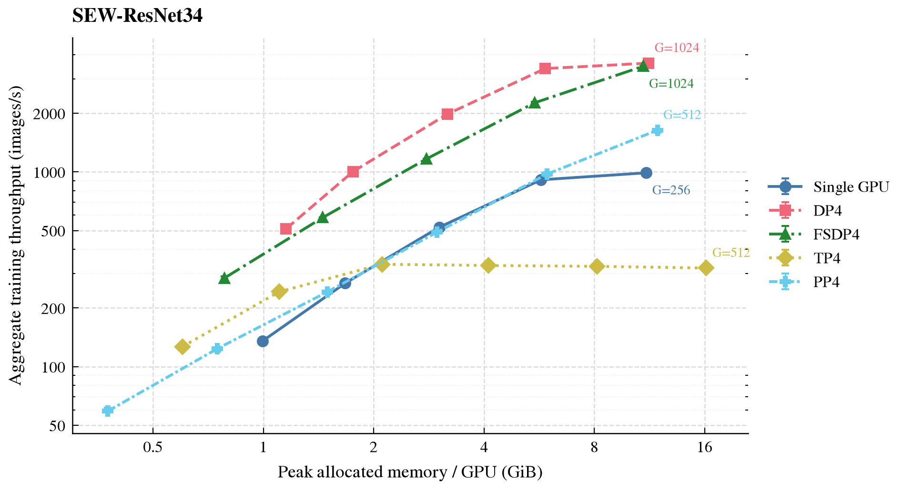
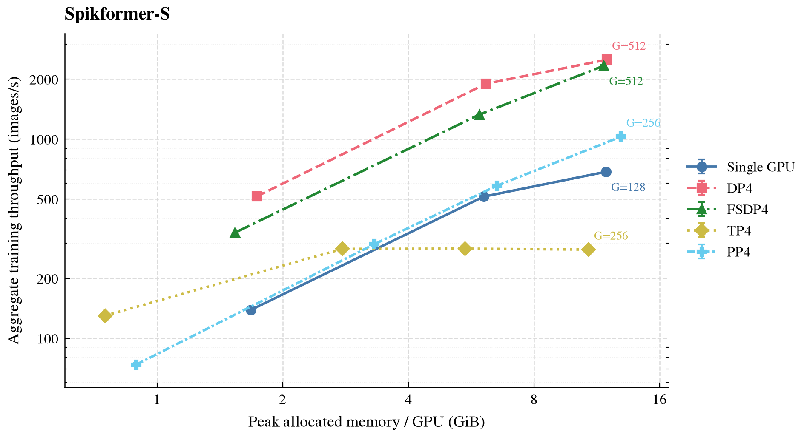
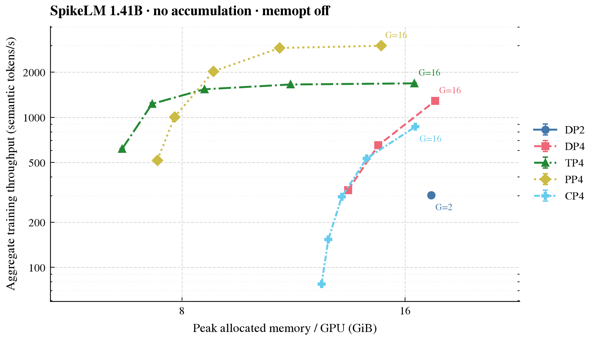
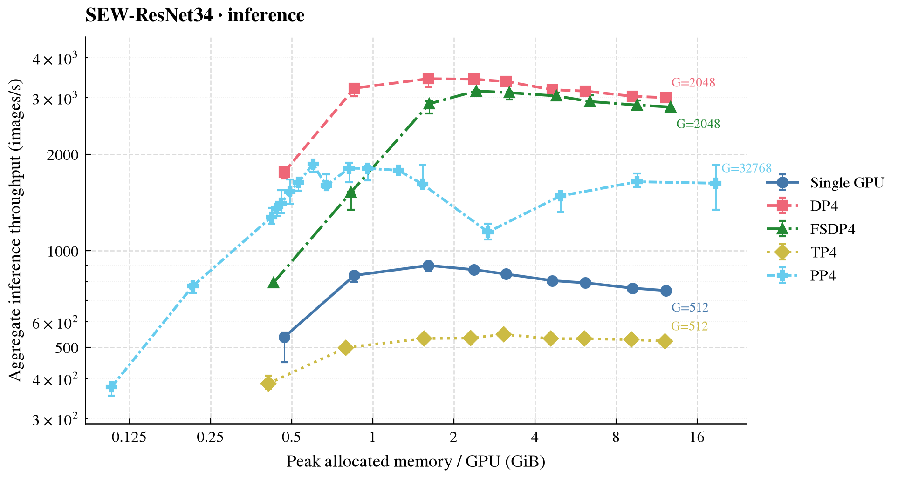
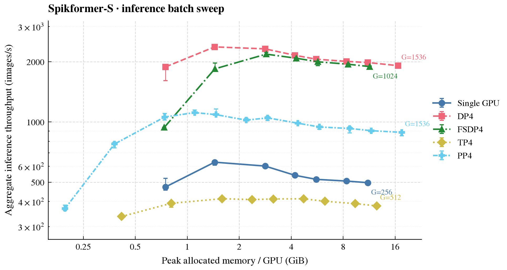
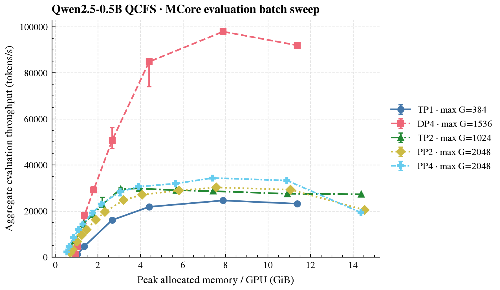
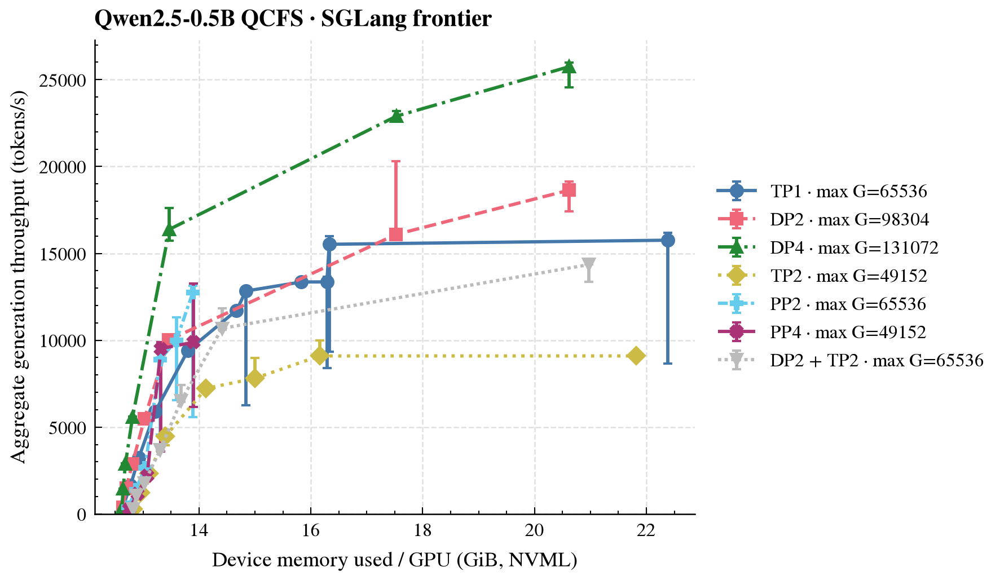

SNN 分布式训练与推理
====================

本教程作者： `Yifan Huang (AllenYolk) <https://github.com/AllenYolk>`_、`Wei Fang (fangwei123456) <https://github.com/fangwei123456>`_

English version: :doc:`../en/distributed_training`

本文先介绍训练、评测和离线推理的高层接口，再说明如何接入自定义模型与运行循环，
最后给出 4 卡 RTX 4090 上的吞吐和显存结果。

API 设计动机
------------

API 按工作负载分为 ``vision`` 和 ``llm``。Spiking CNN 以通道和特征图为主，LLM
则围绕 token、attention 和 context parallel；两者共用一套模型描述会产生大量分支。
公共概念仍保持一致：``ModelConfig`` 描述模型，``ModelBuilder`` 接入模型实现，
``TrainingConfig`` 和 ``EvaluationConfig`` 分别描述训练与有标签评测，prediction 与
generation config 描述无标签输出。

并行能力尽量复用现有运行时。PyTorch 提供 DP、FSDP2、device mesh 和视觉 pipeline；
Megatron Core 提供 LLM 的 TP、PP、CP、distributed optimizer 和 sharded checkpoint。
SpikingJelly 负责 SNN 时间布局、状态重置、通道分片层和 memopt。LLM builder 返回
MCore 的 ``model_provider`` / ``forward_step``，Vision builder 返回 pipeline stage、
FSDP2 roots 和边界形状。高层入口管理生命周期，自定义任务可直接组合底层组件。

高层 API
--------

视觉模型
~~~~~~~~

``spikingjelly.activation_based.distributed.vision`` 提供基于 PyTorch DDP、FSDP2、
张量并行和流水线并行的图像分类训练入口：``vision.TrainingConfig`` 描述任务，
``vision.train_classification`` 执行训练。

.. code-block:: python

    from pathlib import Path

    from spikingjelly.activation_based.distributed import vision
    from spikingjelly.activation_based.model.sew_resnet import SEWResNet34Config

    config = vision.TrainingConfig(
        model=SEWResNet34Config(
            time_steps=4, num_classes=1000, step_mode="m"
        ),
        dataset_builder=(
            "spikingjelly.activation_based.distributed.vision."
            "build_imagefolder_datasets"
        ),
        dataset_kwargs={"root": Path("/datasets/imagenet")},
        input_layout="NCHW",
        batch_size=32,
        loss_function="torch.nn.functional.cross_entropy",
        loss_kwargs={"label_smoothing": 0.1},
        tensor_parallel_size=2,
        data_parallel="fsdp2",
        precision="bf16",
        memopt_level=1,
        memopt_checkpoint_budget="balanced",
    )
    metrics = vision.train_classification(config)

``batch_size`` 是每个 DP rank 的 batch size；global batch 为
``batch_size * DP``，不乘 TP、PP 或 SNN 时间步。``tensor_parallel_size`` 和
``pipeline_parallel_size`` 分别控制 TP 和 PP，剩余 rank 自动作为 DP。模型专属的
distributed recipe 从 ``model.sew_resnet`` 和 ``model.spikformer`` 导入，而不是由
``distributed.vision`` 持有。仓库示例包括 ``SEWResNet34Config``、
``SpikformerConfig`` 和 ``SpikformerCIFAR10Config``。
CIFAR-10 变体固定使用官方的 32×32 输入、4×4 patch stem、384 维、12 个 attention
heads 和 4 个 Transformer blocks，并复用相同的 TP、PP 与 FSDP2 实现。
``mixup_alpha`` 配置可序列化的 batch-level mixup；``0`` 表示禁用。
rank 0 在每个 epoch 后输出一行 JSON，其中包含 optimizer step、train loss、
validation loss 和 validation accuracy；返回的 ``metrics`` 字典包含最终指标与吞吐统计。

``input_layout`` 显式声明 DataLoader batch 的布局。``"NCHW"`` 接收静态图像
``[N, C, H, W]``；single-step 直接对同一 batch 调用模型 ``T`` 次，multi-step
使用连续的 ``[T, N, C, H, W]``。``"NTCHW"`` 接收 CIFAR10-DVS、DVS Gesture
等默认 collate 产生的 ``[N, T, C, H, W]``，训练函数校验 T 后转为 time-first。
输入布局不根据 tensor 维数自动推断。

训练入口在并行包装前调用 ``functional.set_step_mode``，并在完整时间窗结束后调用
``functional.reset_net``。single-step 当前不支持 PP、memopt 或 Triton 神经元后端。
内置 SEW-ResNet34 支持 ``"s"`` 和 ``"m"``；Spikformer 的 architecture 与
attention 原生只支持 ``"m"``，不会通过 wrapper 模拟单步接口。
single-step DDP 会关闭逐次 forward 的 buffer 广播，避免 T 次调用期间原地修改
BatchNorm buffer；训练函数改为在每个完整 T 窗口前只广播一次 buffer，从而在不修改
单步 forward 已保存 buffer 的前提下同步各 DP rank。

``loss_function`` 是 loss callable 的完整导入路径；它接收经时间维归约后的
``[N, C]`` logits 和分类 target，并返回用于反向传播和 loss 统计的 batch-mean
标量张量。``loss_kwargs`` 是每次调用时传入的关键字参数。普通训练、PP、验证
共用同一 loss 函数；top-1 accuracy 仍是固定的分类指标。

仓库中的合成数据入口可以直接验证安装和并行配置：

.. code-block:: bash

    torchrun --standalone --nproc-per-node=4 benchmark/vision_distributed.py \
        --model sew-resnet34 \
        --data-parallel fsdp2 \
        --tensor-parallel-size 2 \
        --precision bf16 \
        --max-steps 10

自定义模型通过 ``vision.ModelConfig`` 和 ``vision.ModelBuilder`` 接入。
``build`` 返回当前 rank 的模型、FSDP2 分片模块路径，以及 PP 输入输出形状；完整签名见
:class:`spikingjelly.activation_based.distributed.vision.ModelBuilder`。

LLM
~~~

``spikingjelly.activation_based.distributed.llm`` 提供基于 Megatron Core 的 SNN
语言模型训练。该路径要求 Python 3.12 或更高版本；安装可选依赖后使用：

.. code-block:: bash

    uv pip install --editable ".[megatron]"

``llm.TrainingConfig`` 组合以下配置：

* ``llm.ModelConfig``：MCore ``TransformerConfig``、词表、context 和 SNN 时间步；
* MCore ``OptimizerConfig``；
* dataset builder、micro/global batch、训练步数、验证和 checkpoint；
* 可选的 SpikingJelly memopt。

未指定并行拓扑时，``llm.plan_training`` 根据 GPU 数量、显存预算和目标选择 TP、PP、
CP 与重计算配置；已有明确拓扑时直接设置 ``TransformerConfig``。SpikeLM 的完整
config、optimizer 和 dataset 配置位于 ``benchmark/snn_llm/cli.py``，可直接启动：

.. code-block:: bash

    torchrun --standalone --nproc-per-node=4 \
        benchmark/snn_llm/train_spikelm.py \
        --data /datasets/tokens \
        --output checkpoints/spikelm \
        --train-steps 200 \
        --global-batch-size 128

``llm.train`` 当前只支持完整、相互独立的固定 T 时间窗。模型专项
``forward_step`` 负责时间编码、状态隔离与时间归约；该 MCore ``T*B`` envelope
不等同于通用 SpikingJelly ``step_mode="m"``，因此 LLM config 暂不提供
``step_mode`` 字段。

离线分布式推理
~~~~~~~~~~~~~~~~~~

接口分工
^^^^^^^^

推理接口按是否处于训练生命周期以及是否需要 ground truth 分为四类。validation
与 test 使用相同的评测计算，区别只是调用时机和数据集，因此不增加重复的
``validate`` / ``test`` 函数。

.. list-table:: Vision 与 LLM 推理接口分工
    :header-rows: 1

    * - 场景
      - 真实标签
      - Vision
      - LLM
      - 输出
    * - 训练期间 validation
      - 需要
      - ``train_classification`` 每个 epoch 评测 validation dataset
      - ``train`` 按 ``eval_interval`` / ``eval_steps`` 评测
      - validation loss/accuracy 或 LM loss
    * - 训练后 evaluation/test
      - 需要
      - ``evaluate_classification``
      - MCore ``evaluate``
      - 聚合 loss、accuracy/perplexity 和性能指标
    * - 训练后 direct prediction/generation
      - 不需要
      - ``predict_classification``
      - MCore ``generate``
      - 逐样本 logits 或生成 token；不返回评测指标
    * - 训练后 scheduler-backed offline generation
      - 不需要
      - —
      - SGLang ``open_sglang_engine``
      - 按请求生成 token；不返回评测指标

``evaluate_classification`` 要求 dataset 的每个元素都是 ``(image, target)``；
``llm.evaluate`` 同样要求 ``input_ids``、``labels`` 和可选 ``loss_mask``。
相反，prediction/generation 不读取 ground truth：Vision 即使收到
``(image, target)`` 也会忽略 target，LLM generation 只接收 prompt。
这四类均属于训练或离线工作流。SGLang ``Engine`` 包含管理 request/KV pool 的
内部执行 scheduler，但 SpikingJelly 路径不包含 HTTP server、router 或其他在线
serving 控制面。

Vision
^^^^^^

Vision 推理继续使用 PyTorch。训练 checkpoint 先导出为与 TP/PP 拓扑无关的
canonical artifact，之后可在不同 DP、FSDP2、TP 或 PP 拓扑上评测：

.. code-block:: bash

    torchrun --standalone --nproc-per-node=4 benchmark/vision_inference.py \
        --artifact artifacts/sew-resnet34.pt \
        --export-checkpoint checkpoints/step_00000010 \
        --model sew-resnet34

    torchrun --standalone --nproc-per-node=4 benchmark/vision_inference.py \
        --artifact artifacts/sew-resnet34.pt \
        --model sew-resnet34 \
        --data-parallel replicate \
        --batch-size 32

``vision.evaluate_classification`` 返回全局 loss、accuracy、images/s 和最繁忙
rank 的峰值显存。``vision.predict_classification`` 不计算或返回这些指标，而是把
各 rank 的输出按 dataset index 合并为一个 HDF5 文件；文件只包含 ``index`` 和
``logits``，类别可用 ``logits.argmax(axis=1)`` 得到。填充样本不会写入结果，因而
数据集大小无需整除 DP 或 batch size。

LLM
^^^

LLM 提供两个目的不同的 backend：

* MCore 与训练使用相同 model provider 和 sharded checkpoint，适合 validation、
  loss/perplexity evaluation 和具有直接 tensor-batch 语义的同步 generation。
  ``llm.evaluate(EvaluationConfig(...))`` 支持 DP/TP/PP/CP 的完整 loss/perplexity
  评测；``llm.generate(MCoreGenerationConfig(...), input_ids)`` 支持 DP prompt
  切分、TP/PP 和 static KV-cache decode。MCore cached generation 要求 CP=1。
* SGLang 用于训练完成后的 scheduler-backed 高吞吐离线生成。
  :func:`open_sglang_engine` 管理原生 Engine 生命周期；采样、变长 token IDs、异步
  生成和 streaming 直接使用原生 Engine 接口。该路径不启动 HTTP server 或 router。

.. list-table:: LLM 推理 backend 选择
    :header-rows: 1

    * - 需求
      - 后端
    * - validation、loss/perplexity、训练 checkpoint 直接恢复
      - MCore
    * - 可解释的 local/global batch、pipeline microbatch 和 CUDA OOM
      - MCore
    * - 大规模 prompt corpus、continuous batching 和 KV-cache 调度
      - SGLang
    * - HTTP/router、多租户或 SLA serving
      - 本轮不支持

MCore evaluation 与 SGLang generation 回答不同问题，不能用同一套 batch、显存或
吞吐 protocol 横向比较。

SGLang 0.5.17 使用独立的 PyTorch/Transformers 运行栈，建议单独创建环境：

.. code-block:: bash

    uv venv --python 3.12 .venv-sglang
    source .venv-sglang/bin/activate
    uv pip install --editable ".[sglang]"

``llm.export_sglang_artifact`` 负责分布式 checkpoint 加载、逐 stage 分片写入、
index、失败同步和原子发布。模型自己的 ``stage_tensors`` 回调负责权重名称和变换，
``artifact_config`` 负责 SGLang/Hugging Face 配置。导出时用 ``torchrun`` 启动
checkpoint 的 TP x PP x CP 拓扑；任意 GPU 都不会聚合完整模型，输出 artifact 可在
推理时改用其他 TP/PP/DP 拓扑。

仓库中的 SpikeLM、Qwen2 recipe 和 external runtime model 位于
``benchmark/snn_llm``，用于演示该 seam，并不作为 wheel 内置模型支持。其 adapter
在内部保留 ``[token, T, hidden]``，仅在 RadixAttention/KV cache 边界并入 head 维。
自定义模型必须同时提供 export 回调和可导入的 SGLang external model package。

当前支持单节点 NVIDIA BF16 TP、PP 和 DP，不支持 prefill CP 与 DCP。CUDA Graph
也被禁用，因为 temporal adapter 尚未提供 SGLang 0.5.17 graph capture 所需的
attention metadata。SpikeLM 与 Qwen2 adapter 使用 SGLang 原生 stage 分层和
``PPProxyTensors`` 协议。

.. code-block:: python

    from pathlib import Path

    from spikingjelly.activation_based.distributed import llm

    def main():
        config = llm.SGLangEngineConfig(
            artifact=Path("artifacts/qwen2-snn"),
            external_model_package="benchmark.snn_llm.sglang_models",
            tensor_parallel_size=2,
        )
        with llm.open_sglang_engine(config) as engine:
            outputs = engine.generate(
                input_ids=[[1, 2, 3], [1, 2, 3, 4, 5]],
                sampling_params={"temperature": 0, "max_new_tokens": 32},
            )
        print(outputs)

    if __name__ == "__main__":
        main()

``benchmark/snn_llm/sglang_benchmark.py`` 提供可复现的 offline Engine 测量入口；
实验 protocol、吞吐/延迟指标和结果统一放在后文“实测结果”的 SGLang 小节。

底层 API
--------

自定义视觉模型
~~~~~~~~~~~~~~

``vision.ModelBuilder.build`` 构建当前 PP stage、配置模型并行并返回 FSDP2 分片位置。
实现可参考 ``SEWResNet34Builder`` 和 ``SpikformerBuilder``。

最小声明形式如下：

.. code-block:: python

    from dataclasses import dataclass
    from typing import ClassVar

    from spikingjelly.activation_based.distributed import vision

    @dataclass(frozen=True)
    class MyModelConfig(vision.ModelConfig):
        builder: ClassVar[str] = "my_package.model.MyModelBuilder"
        width: int = 128

    class MyModelBuilder(vision.ModelBuilder):
        def build(
            self,
            *,
            process_group,
            memopt_process_group,
            pipeline_rank,
            pipeline_size,
            pipeline_microbatches,
            device,
            micro_batch_size,
            memopt_level,
            memopt_compress_inputs,
            memopt_checkpoint_budget,
        ):
            if pipeline_size != 1:
                raise ValueError("MyModelBuilder does not define PP stages.")
            model = build_my_model(self.config)
            model = parallelize_my_model(model, process_group)
            model.to(device)
            return model, ("blocks",), None, None

``parallelize_my_model`` 由模型作者定义。下面的例子直接使用
``spikingjelly.activation_based.distributed.tensor_parallel`` 中的公开组件替换模型层：

.. code-block:: python

    from spikingjelly.activation_based.distributed.tensor_parallel import (
        ChannelShardBatchNorm2d,
        ChannelShardConv2d,
    )

    def parallelize_my_model(model, process_group):
        block = model.block
        block.conv1 = ChannelShardConv2d(block.conv1, process_group, "colwise")
        block.bn1 = ChannelShardBatchNorm2d(block.bn1, process_group)
        block.conv2 = ChannelShardConv2d(block.conv2, process_group, "rowwise")
        return model

神经元直接接收 colwise 层产生的本地通道张量，不需要额外包装；模型作者只需保证后续
rowwise 层消费该本地张量。

自定义训练流程
~~~~~~~~~~~~~~

若预定义 ``train`` 不适合任务，可以直接组合 PyTorch 分布式接口和上述 SpikingJelly
组件。下面省略任务相关的 ``build_my_model``、``dataset`` 和超参数，只展示组装顺序：

.. code-block:: python

    import os

    import torch
    import torch.distributed as dist
    from torch.distributed.device_mesh import init_device_mesh
    from torch.nn.parallel import DistributedDataParallel
    from torch.utils.data import DataLoader, DistributedSampler

    from spikingjelly.activation_based import functional

    local_rank = int(os.environ["LOCAL_RANK"])
    torch.cuda.set_device(local_rank)
    dist.init_process_group("nccl", device_id=torch.device("cuda", local_rank))

    mesh = init_device_mesh(
        "cuda", (dp_size, tp_size), mesh_dim_names=("dp", "tp")
    )
    dp_group = mesh["dp"].get_group()
    tp_group = mesh["tp"].get_group()

    model = build_my_model()
    model = parallelize_my_model(model, tp_group).cuda(local_rank)
    functional.set_step_mode(model, step_mode)
    model = DistributedDataParallel(
        model, device_ids=[local_rank], process_group=dp_group
    )
    optimizer = torch.optim.AdamW(model.parameters(), lr=1e-3)

    sampler = DistributedSampler(
        dataset,
        num_replicas=dp_size,
        rank=mesh.get_local_rank("dp"),
        shuffle=True,
    )
    loader = DataLoader(dataset, batch_size=local_batch_size, sampler=sampler)

    for epoch in range(epochs):
        sampler.set_epoch(epoch)
        for images, labels in loader:
            images = images.cuda(local_rank, non_blocking=True)
            labels = labels.cuda(local_rank, non_blocking=True)
            sequence = (
                images.unsqueeze(0)
                .expand(time_steps, *images.shape)
                .contiguous()
            )

            optimizer.zero_grad(set_to_none=True)
            if step_mode == "s":
                logits = torch.stack([model(x_t) for x_t in sequence]).mean(0)
            else:
                logits = model(sequence).mean(0)
            loss = torch.nn.functional.cross_entropy(logits, labels)
            loss.backward()
            optimizer.step()
            functional.reset_net(model)

验证、混合精度、scheduler、指标归约和 checkpoint 由具体任务补充。以下调用约束不能省略：

* world size 能被所选模型并行大小整除；
* 数据只沿 DP 维切分，同一 TP group 使用相同 batch；
* 完成模型并行和 DDP/FSDP2 包装后再创建 optimizer；
* 每个相互独立的 batch 或 pipeline microbatch 后重置 SNN 状态；
* global batch 不包含 TP、PP、CP 或 SNN 时间步。

自定义 LLM
~~~~~~~~~~

LLM 模型继承 ``llm.ModelConfig``，并通过 ``builder`` 类变量指向一个
``llm.ModelBuilder``。builder 的 ``build`` 方法返回 MCore 需要的
``model_provider`` 和 ``forward_step``：

.. code-block:: python

    from spikingjelly.activation_based.distributed import llm

    class MyModelBuilder(llm.ModelBuilder):
        def build(
            self,
            *,
            memopt_level: int = 0,
            memopt_checkpoint_budget: str = "memory",
            resume: bool,
        ):
            return model_provider, forward_step

``model_provider`` 构建当前 PP stage；``forward_step`` 从 data iterator 读取一个
microbatch，调用模型并返回 MCore loss callback。用户可以复用 ``llm.train``，也可以
在自己的 MCore 训练流程中使用这两个 callback。SpikeLM 和 Qwen2 的完整实现分别位于
``benchmark/snn_llm/spikelm.py`` 和 ``benchmark/snn_llm/qwen2.py``。

SNN 时间布局为 ``[T, B, S, H] -> [S, T*B, H]``。``T`` 只并入 MCore batch 维，
不会并入 token 维，也不用于计算 global batch。

实测结果
--------

以下 Vision 与 MCore 结果在同一台 4 × RTX 4090 24 GiB 主机上测得。机器没有
NVLink，跨卡 CUDA peer access 均为 ``False``；软件栈为 PyTorch 2.8.0、
Megatron Core 0.18.2 和 Triton 3.4.0。SGLang 使用相同 GPU/互连类别的独立租用实例
和自己的固定运行栈，具体口径在对应小节说明。这里给出 PCIe 多卡主机的相对参考；
NVLink 集群需要单独测量。

Vision 训练基准
~~~~~~~~~~~~~~~~~~~~~~~~

Vision 基准固定 BF16、``T=4``、128 × 128 输入和 1000 类。图中只保留单卡、
DP4、FSDP4、TP4 和 PP4；曲线末端标出最大的成功 global batch size（``G``）。单卡、TP4
和 PP4 的 global batch 等于每 rank batch，DP4 和 FSDP4 则是每 rank batch 的
4 倍。

固定 global batch 的全拓扑对比
^^^^^^^^^^^^^^^^^^^^^^^^^^^^^^^^

下表给出 ``G=32`` 时的完整拓扑对比。每个配置从新进程启动，预热 10 个
optimizer step，再测量 50 个 step，并独立重复三次；表中为三次中位数。吞吐是整个
作业的总吞吐，显存是所有 rank 中最高的 CUDA peak allocated memory。

.. list-table:: Vision 固定 ``G=32`` 的全拓扑结果
    :header-rows: 1

    * - 拓扑
      - GPU
      - SEW-ResNet34 images/s
      - SEW-ResNet34 GiB/卡
      - Spikformer-S images/s
      - Spikformer-S GiB/卡
    * - 单卡
      - 1
      - 269.0
      - 1.67
      - 270.1
      - 3.15
    * - DP2
      - 2
      - 261.8
      - 1.15
      - 264.3
      - 1.73
    * - FSDP2
      - 2
      - 146.9
      - 0.86
      - 172.6
      - 1.59
    * - TP2
      - 2
      - 257.6
      - 1.30
      - 262.6
      - 2.03
    * - PP2
      - 2
      - 83.9
      - 1.01
      - 85.9
      - 2.20
    * - DP4
      - 4
      - 259.9
      - 0.82
      - 258.8
      - 1.00
    * - FSDP4
      - 4
      - 145.7
      - 0.45
      - 169.4
      - 0.81
    * - TP4
      - 4
      - 240.3
      - 1.10
      - 246.9
      - 1.45
    * - PP4
      - 4
      - 122.2
      - 0.75
      - 148.5
      - 1.71
    * - TP2 + DP2
      - 4
      - 244.8
      - 0.82
      - 251.3
      - 1.10
    * - TP2 + FSDP2
      - 4
      - 143.3
      - 0.65
      - 166.7
      - 1.01
    * - PP2 + DP2
      - 4
      - 150.9
      - 0.53
      - 146.3
      - 1.18
    * - PP2 + FSDP2
      - 4
      - 74.4
      - 0.52
      - 86.2
      - 1.13
    * - TP2 + PP2
      - 4
      - 81.9
      - 0.86
      - 82.0
      - 1.45

在相同 ``G=32`` 下，多卡主要降低单卡显存；计算量变小后，PCIe 通信、同步和
pipeline bubble 更容易主导。下面改为扩大 global batch，比较各方案的吞吐—显存边界。

batch 从已有点开始按 2 的幂增加，直到首个不能完成的候选。SEW-ResNet34 的单卡、
DP4、FSDP4 成功到每 rank batch 256，TP4、PP4 成功到 512；每个配置从新进程启动，
预热 10 个 optimizer step，再测量 40 个 step。Spikformer-S 的单卡、DP4、FSDP4
成功到每 rank batch 128，TP4、PP4 成功到 256；预热 5 个 step，再测量 25 个
step。每个成功点均独立重复三次，图中绘制中位数和三次范围。计时包含 H2D、forward、
backward、通信与 optimizer，不包含初始化、DataLoader、验证和 checkpoint。

纵轴是整个作业的总吞吐，即 global batch 除以最慢 rank 的计时时间；横轴是各 rank
最高的 CUDA peak allocated memory。两轴使用对数尺度，失败候选不绘制为吞吐点。

    SEW-ResNet34：总训练吞吐与最繁忙 GPU 峰值分配显存。

    Spikformer-S：总训练吞吐与最繁忙 GPU 峰值分配显存。

SEW-ResNet34 的 DP4 在 ``G=1024`` 达到 3616.2 images/s 和 11.25 GiB/卡，
FSDP4 为 3482.5 images/s 和 10.86 GiB/卡；PP4 在 ``G=512`` 达到
1636.5 images/s。Spikformer-S 的 DP4 和 FSDP4 最大成功点均为 ``G=512``，
分别达到 2503.8 和 2334.6 images/s；PP4 在 ``G=256`` 达到 1028.2 images/s。
TP4 在两个模型上均早早进入吞吐平台，继续增大 batch 主要增加显存，说明该 PCIe
机器上的 TP 通信已经主导。这些数字描述扩大总工作量后的吞吐—容量边界，不是固定
batch 加速比。

.. list-table:: Vision 容量搜索边界（最大成功点 → 首个失败候选）
    :header-rows: 1

    * - 模型
      - 拓扑
      - 最大成功 ``B/G``
      - 首个失败 ``B/G``
      - 结果
    * - SEW-ResNet34
      - 单卡
      - 256/256
      - 512/512
      - CUDA OOM
    * - SEW-ResNet34
      - DP4
      - 256/1024
      - 512/2048
      - CUDA OOM
    * - SEW-ResNet34
      - FSDP4
      - 256/1024
      - 512/2048
      - CUDA OOM
    * - SEW-ResNet34
      - TP4
      - 512/512
      - 1024/1024
      - CUDA OOM
    * - SEW-ResNet34
      - PP4
      - 512/512
      - 1024/1024
      - NCCL collective timeout
    * - Spikformer-S
      - 单卡
      - 128/128
      - 256/256
      - CUDA OOM
    * - Spikformer-S
      - DP4
      - 128/512
      - 256/1024
      - CUDA OOM
    * - Spikformer-S
      - FSDP4
      - 128/512
      - 256/1024
      - CUDA OOM
    * - Spikformer-S
      - TP4
      - 256/256
      - 512/512
      - NCCL collective timeout
    * - Spikformer-S
      - PP4
      - 256/256
      - 512/512
      - NCCL collective timeout

``B`` 是每 rank batch。collective timeout 表示没有成功指标；只有出现 OOM traceback
时才标记为 OOM。

LLM 训练基准
~~~~~~~~~~~~~~~~~~~~

LLM 基准使用约 1.41B 参数的 SpikeLM：24 层、hidden 2048、16 heads、FFN 8192、
词表 50304、BF16、sequence 128 和 ``T=4``。下方容量搜索中的所有点均关闭
SpikingJelly memopt 和梯度累计，因此
``global_batch_size = micro_batch_size × data_parallel_size``；每个 optimizer step
在每个 DP rank 上只执行一个 micro batch。

固定 global batch 的全拓扑对比
^^^^^^^^^^^^^^^^^^^^^^^^^^^^^^^^

下表给出全部 2 卡、4 卡及混合拓扑的固定工作量实验：``micro batch=1``、
``G=8``，预热 10 个 optimizer step，再测量 30 个 step，并独立重复三次；表中为
三次中位数。单卡在 distributed optimizer 初始化时 OOM，因此以 DP2 作为相对吞吐
基线。为让不同 DP size 都保持 ``G=8``，这组固定工作量实验使用了梯度累计：累计
次数为 ``8 / DP``，所以 DP2 为 4、DP4 为 2，其余 DP1 拓扑为 8。它与下方明确关闭
梯度累计的容量搜索是两套不同口径。

.. list-table:: 1.41B SpikeLM 固定 ``G=8`` 的全拓扑结果
    :header-rows: 1

    * - 拓扑
      - GPU
      - semantic tokens/s
      - GiB/卡
      - 相对 DP2 吞吐
    * - DP2
      - 2
      - 746.3
      - 17.35
      - 1.00×
    * - TP2
      - 2
      - 679.9
      - 12.86
      - 0.91×
    * - PP2
      - 2
      - 1008.3
      - 13.15
      - 1.35×
    * - CP2
      - 2
      - 417.7
      - 16.56
      - 0.56×
    * - DP4
      - 4
      - 585.6
      - 13.40
      - 0.78×
    * - TP4
      - 4
      - 673.1
      - 6.65
      - 0.90×
    * - PP4
      - 4
      - 1379.9
      - 8.09
      - 1.85×
    * - CP4
      - 4
      - 289.5
      - 12.34
      - 0.39×
    * - TP2 + DP2
      - 4
      - 817.1
      - 8.91
      - 1.09×
    * - PP2 + DP2
      - 4
      - 997.9
      - 9.20
      - 1.34×
    * - CP2 + DP2
      - 4
      - 446.0
      - 12.61
      - 0.60×
    * - TP2 + PP2
      - 4
      - 989.1
      - 6.81
      - 1.33×
    * - TP2 + CP2
      - 4
      - 427.2
      - 8.39
      - 0.57×
    * - PP2 + CP2
      - 4
      - 612.6
      - 8.44
      - 0.82×

固定 ``G=8`` 时，PP4 的总吞吐最高，TP4 和 TP2 + PP2 的单卡峰值显存最低；CP
在 sequence 只有 128 时通信收益不足。这个表用于横向比较拓扑，下面的无梯度累计
实验用于比较各拓扑扩大 batch 后的容量和吞吐上限。

图中保留 DP2、DP4、TP4、PP4 和 CP4。DP2 只成功到 micro batch 1（``G=2``）；
DP4 成功到 micro batch 4（``G=16``）；TP4、PP4 和 CP4 均成功到 micro batch
16（``G=16``）。每个配置从新进程启动，预热 5 个 step，再测量 15 个 step，并
独立重复三次。单卡在 distributed optimizer 初始化时 OOM，因此省略。
LLM 路径使用 MCore DDP 与其 distributed optimizer，不叠加 PyTorch FSDP2。

    1.41B SpikeLM：无梯度累计和 memopt 时的总训练吞吐与每卡峰值显存。

PP4 的 ``G=16`` 点达到 2997.4 semantic tokens/s 和 14.85 GiB/卡，是本组最高
吞吐；从 ``G=8`` 的 2897.0 tokens/s 到 ``G=16`` 已接近平台。TP4 在 ``G=16``
达到 1684.4 tokens/s 和 16.47 GiB/卡，同样在 ``G=4`` 后明显变平。DP4 的最大
成功点仍为 ``G=16``：1284.3 tokens/s 和 17.55 GiB/卡。CP4 扩大到 ``G=16``
后达到 865.5 tokens/s 和 16.52 GiB/卡，但仍低于 TP4/PP4。DP2 只保留
``G=2``：303.0 tokens/s 和 17.35 GiB/卡。

.. list-table:: LLM 容量搜索边界（最大成功点 → 首个失败候选）
    :header-rows: 1

    * - 拓扑
      - 最大成功 ``micro/G``
      - 首个失败 ``micro/G``
      - 结果
    * - DP2
      - 1/2
      - 2/4
      - CUDA OOM
    * - DP4
      - 4/16
      - 8/32
      - CUDA OOM
    * - TP4
      - 16/16
      - 32/32
      - CUDA OOM
    * - PP4
      - 16/16
      - 32/32
      - stalled，无训练指标
    * - CP4
      - 16/16
      - 32/32
      - stalled，无训练指标

PP4/CP4 的 ``micro=32`` 候选长时间停在固定的 rank 等待状态，终止后记为 stalled，
不计入吞吐点。

不同曲线的点可能具有不同 global batch，因此这张图表达吞吐—容量边界，而不是固定
batch 下的加速比。完整中位数、三次运行范围和 batch 配置见
:download:`汇总 CSV <../../_static/tutorials/distributed/distributed-tradeoff.csv>`。

功能测试还覆盖了 BF16 的 TP4、PP4、TP2 × PP2、CP4、TP2 × CP2、PP2 × CP2，
以及 TP4/PP4/CP4 的 FP8。所有组合都得到有限 loss、有限梯度，且 SNN 模块上存在非零梯度。
在 7 GiB 显存预算下，planner 选择 TP4、SpikingJelly memopt 和 MCore selective
``core_attn`` 重计算，两步训练使用 6.28 GiB。TP2 × PP2 的 sharded model/optimizer
checkpoint 也已验证从 step 1 恢复到 step 2。

分布式推理基准
~~~~~~~~~~~~~~~~

共同实验环境
^^^^^^^^^^^^

推理基准使用与训练相同的单机 4 × RTX 4090 24 GiB 环境。``nvidia-smi topo -m``
显示 GPU0 到其余 GPU 为跨 NUMA 的 ``SYS``，GPU1--3 之间为 ``NODE``，没有
``NV#`` 链路；``nvidia-smi topo -p2p r/w`` 对所有跨卡组合均返回 ``CNS``。
因此本机既没有 NVLink，也没有可用的 CUDA P2P read/write，NCCL 跨卡通信经过
PCIe/CPU interconnect。Vision/MCore 软件栈与训练相同：PyTorch 2.8.0、Megatron
Core 0.18.2 和 Triton 3.4.0。

Vision 评测
^^^^^^^^^^^

下方历史曲线使用 BF16、``T=4``、1000 类和缓存的全零 224 × 224 合成图像。
现行 benchmark 要求通过 ``--cifar10-data`` 或 ``--data`` 指定固定真实图像子集；
seeded-random 默认值只用于 smoke。两种 protocol 的结果不能混在一条曲线中。

每个吞吐点从新进程启动，使用 4 个 DataLoader workers，预热 5 个 batch、测量
10 个 batch，并独立重复三次。计时包含 H2D、forward、通信和指标归约，不包含
DataLoader、artifact 加载和初始化。图中绘制全部三次完成点的中位数与范围。

``L`` 是每个 DP replica 的本地 batch，``G = L × DP`` 是 global batch；TP、PP、
CP 和时间步 ``T`` 不计入 ``G``。PP 的 ``K`` 表示 pipeline microbatch 数，每块大小
为 ``L / K``。非 PP 的 SEW-ResNet34 grid 为
``16, 32, 64, 96, 128, 192, 256, 384, 512, 768, 1024``；Spikformer-S 根据 OOM
在 384--1024 之间停止。PP4 固定 ``K=4``，SEW-ResNet34 扩展到 ``L=3072``，
Spikformer-S 扩展到 ``L=1536``。容量搜索从成功点 ``x`` 依次尝试 ``2x`` 和
``1.5x``，直到 CUDA OOM。

推理 PP 使用 forward-only streaming schedule，并在每个高层 batch 返回前同步
pipeline group。SEW 下采样 block 位于 stage 边界前，Spikformer blocks 按
``0/2/2/2`` 分配。``pipeline_microbatches`` 默认为 1；本节的 Vision/MCore PP
点固定为 4，因此每块随 ``L/4`` 增长。CSV 同时记录 L、G、K、每块大小和失败候选。

    SEW-ResNet34：固定 PP K=4 的完整 batch sweep。

    Spikformer-S：固定 PP K=4 的完整 batch sweep。

在每 rank batch 128 时，SEW-ResNet34 的单卡、DP4、FSDP4、TP4、PP4 分别为
845.7、3368.9、3109.3、548.3、1320.9 images/s；Spikformer-S 分别为
516.6、2060.4、2000.2、412.2、1088.5 images/s。DP/FSDP 接近四卡线性吞吐，
PP 分别达到单卡的 1.56 倍和 2.11 倍。固定 K 后 PP 吞吐在中等 batch 达峰，随后
随每块样本和显存继续增大而平滑进入容量尾部。

纯 TP4 在两个模型上仍低于单卡，但曲线已经稳定；这是模型计算/通信比限制，不是调度
波动。SEW 每 batch 需要 16 次、合计约 1.41 GB 的 rowwise all-reduce，Spikformer
需要 12 次、约 0.92 GB。使用两个 TP2 replica 的四卡 ``TP2 × DP2`` 可达到
1226.1 和 858.6 images/s，说明实际部署应以 TP 容纳模型、再以 DP 扩展吞吐。

.. list-table:: Vision 推理容量边界
    :header-rows: 1

    * - 模型
      - 拓扑
      - 最大三次完成 ``L/G``
      - 首个失败与最终容量证据
    * - SEW-ResNet34
      - 单卡
      - 512/512
      - 768/768：正式多 batch 运行 CUDA OOM
    * - SEW-ResNet34
      - DP4
      - 512/2048
      - 768/3072：正式多 batch 运行 CUDA OOM
    * - SEW-ResNet34
      - FSDP4
      - 512/2048
      - 768/3072：正式多 batch 运行 CUDA OOM
    * - SEW-ResNet34
      - TP4
      - 512/512
      - 768/768：正式多 batch 运行 CUDA OOM
    * - SEW-ResNet34
      - PP4
      - 3072/3072
      - 4096/4096：CUDA OOM
    * - Spikformer-S
      - 单卡
      - 256/256
      - 384/384：CUDA OOM
    * - Spikformer-S
      - DP4
      - 384/1536
      - 512/2048：CUDA OOM
    * - Spikformer-S
      - FSDP4
      - 256/1024
      - 384/1536：CUDA OOM
    * - Spikformer-S
      - TP4
      - 512/512
      - 768/768：CUDA OOM
    * - Spikformer-S
      - PP4
      - 1536/1536
      - 2048/2048：CUDA OOM

Vision 正确性测试还覆盖 FSDP2、PP2，以及 TP2 × PP2 训练 checkpoint 导出后在
4 个单卡 replica（DP4）上恢复。导出前后的 validation loss 分别为 2.310132205 和
2.310132384。

MCore loss/perplexity 评测
^^^^^^^^^^^^^^^^^^^^^^^^^^^^^^^^^^^^^^^^

MCore loss/perplexity 评测使用 Qwen2.5-0.5B QCFS、BF16、``T=2`` 和序列长度 16，
比较单卡、DP4、TP2、PP2 和 PP4。模型有 14 个 attention heads，因此纯 TP 只能使用
TP2。单卡/DP4 使用固定 128-sample 数据集；TP2/PP2/PP4 的样本数等于 G，避免
padding 影响吞吐。

每个点从新进程恢复同一 sharded checkpoint，预热 5 个 schedule，计时完整 schedule，
并重复三次。计时包含 H2D、模型、通信和指标归约，不包含初始化、dataset indexing
与 collation。运行时设置 ``NCCL_P2P_DISABLE=1``、``NCCL_IB_DISABLE=1`` 和
``PYTORCH_CUDA_ALLOC_CONF=expandable_segments:True``。

本节的 L 等于 ``micro_batch_size × pipeline_microbatches``。非 PP 点使用 ``K=1``，
PP2/PP4 固定 ``K=4``，所以每块随 ``L/4`` 增长。grid 为
``16, 32, 64, 96, 128, 192, 256, 384, 512, 768, 1024``，随后按 ``2x/1.5x``
搜索容量边界。PP4 的 ``L=3072`` debug probe 只预热一次，仅用于容量判断。

    MCore 评测：总 semantic-token 吞吐与每卡峰值显存。

在小 batch 的 L=16，单卡、TP2、PP2 和 PP4 分别为 4636.2、3611.2、1823.5
和 2203.6 semantic tokens/s；固定 K=4 后 PP 每块仅有 4 个样本，kernel 与 schedule
开销尚未摊薄。到 L=384，单卡、TP2、PP2 和 PP4 分别达到 23145.8、28975.2、
24707.7 和 28348.2 tokens/s，三种模型并行拓扑均已超过同 L 单卡。

单卡、TP2、PP2 和 PP4 的最佳点分别为 24549.7、29767.5、30217.9 和
34317.2 tokens/s；后三者为单卡最佳点的 1.21、1.23 和 1.40 倍。TP2 最佳点在
L=256、3.95 GiB/卡；PP2/PP4 最佳点都在 L=1024，分别为 7.57/7.40 GiB/卡。
PP2/PP4 的三次正式曲线均延伸到 L=2048、约 14.5 GiB/卡，容量尾部的吞吐下降在
三次运行中重复出现，是每块增至 512 后的真实代价。PP4 的 L=3072 debug 容量
probe 单次通过（21.35 GiB/卡），但无 debug 的正式运行 timeout，因此不进入曲线；
L=4096 明确 CUDA OOM。

.. list-table:: MCore 容量尾部（最大完成点 → 首个失败点）
    :header-rows: 1

    * - 拓扑
      - 最大完成 ``L/G``
      - 首个失败 ``L/G``
      - 状态
    * - 单卡
      - 384/384
      - 512/512
      - CUDA OOM
    * - DP4
      - 384/1536
      - 512/2048
      - CUDA OOM
    * - TP2
      - 1024/1024
      - 1536/1536
      - CUDA OOM
    * - PP2
      - 2048/2048
      - 2304/2304
      - CUDA OOM
    * - PP4
      - 2048/2048
      - 3072/3072
      - 单次 debug probe 通过但正式运行 timeout；4096 CUDA OOM

完整中位数、运行范围、显存和失败状态见
:download:`推理结果 CSV <../../_static/tutorials/distributed/distributed-inference-tradeoff.csv>`。
该 CSV 只包含 Vision 和 MCore evaluation 结果；图可直接从汇总 CSV 重新生成：

.. code-block:: bash

    python benchmark/plot_distributed_inference.py \
        docs/source/_static/tutorials/distributed/distributed-inference-tradeoff.csv \
        docs/source/_static/tutorials/distributed

SGLang 调度式生成
^^^^^^^^^^^^^^^^^

``benchmark/snn_llm/sglang_benchmark.py`` 测量 offline Engine 的 request/input/output
吞吐、TTFT、TPOT、端到端延迟和每卡峰值显存。正式点使用无 NVLink 和 CUDA P2P 的
on-demand 4 × RTX 4090 主机；独立环境为 PyTorch 2.11.0、CUDA 13.0、
SGLang 0.5.17、BF16 和 Triton attention，并关闭 CUDA Graph。每个点先 warmup
一次，随后在每次计时前清空 Radix cache，重复三次并取中位数。Qwen 与 SpikeLM
来自相同规格的两次租用，只在各自模型内比较拓扑和 workload。

Qwen artifact 使用 Qwen2.5-0.5B 权重和确定性的全一 QCFS scale。SpikeLM
artifact 使用确定性初始化的 32 层模型：hidden 2560、20 heads、FFN 10240、词表
50304、``T=4``，共 2,775,209,216 个参数。两者都用于系统测量，不代表训练后模型质量。

    左：SpikeLM-2.78B 在 32/64 requests 下的单卡与 PP4 output 吞吐；中：
    Qwen2.5-0.5B 单卡与 DP4 output 吞吐；右：单卡共享前缀的 input/output 吞吐。

PP 不是无条件加速。在 32 requests、64 input/64 output 时，SpikeLM-2.78B 的单卡和
PP4 分别为 1074.8 和 786.9 output tokens/s，PP4 只有 0.73 倍；通信和 pipeline
bubble 尚未摊薄。请求数增至 64 后，同一 workload 下单卡为 1031.1 tokens/s，PP4
为 1416.9 tokens/s，即 1.37 倍。此时 p99 TTFT 从 2430.9 ms 降到 446.4 ms，
而 p99 TPOT 从 33.2 ms 增到 39.8 ms。在这台主机上，PP4 需要足够并发才能提高
吞吐；这一结果不代表单请求延迟也会降低。

Qwen2.5-0.5B 的 DP4 使用每个 replica 32 个请求，总 output 吞吐为 5845.5
tokens/s，是单卡 1486.5 tokens/s 的 3.93 倍，TPOT 基本不变。单卡的 2048-token
共享前缀 workload 将 input 吞吐提高 18.3 倍。CSV 也保留了小模型 PP2 的中位数，
该点仍低于单卡。并行拓扑需要按模型规模和并发选择。

容量测试还将 12.6B SpikeLM 导出为 564 个 tensor、25,173,851,048 bytes，并在
PP4 上加载和生成，无需单卡持有完整模型。

固定 parity prompts 下，Qwen2 与 MCore 的 32 个 greedy tokens 完全一致。
SpikeLM 的首个 decode token 全部一致；四个 PP2 prompt 中三个完整 8-token 一致，
另一个在第三个 token 后因 BF16 执行次序不同而分叉。接近并列 logits 时，不要求
跨 backend 的完整生成序列相同。

已发布中位数见 :download:`SGLang 结果 CSV
<../../_static/tutorials/distributed/sglang-inference-results.csv>`。可直接重新生成图片：

.. code-block:: bash

    python benchmark/plot_sglang_inference.py \
        docs/source/_static/tutorials/distributed/sglang-inference-results.csv \
        docs/source/_static/tutorials/distributed/sglang-inference.png
