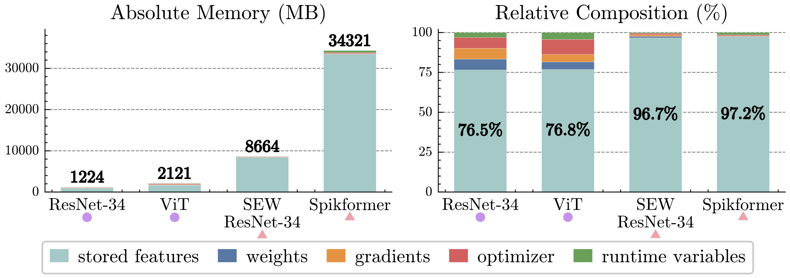
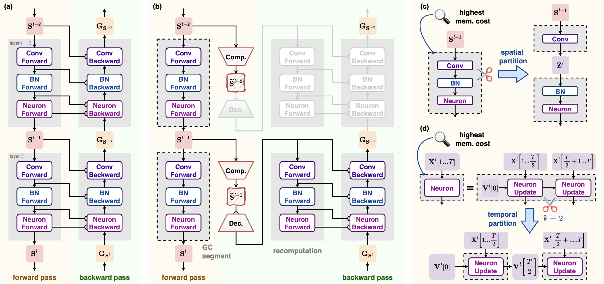
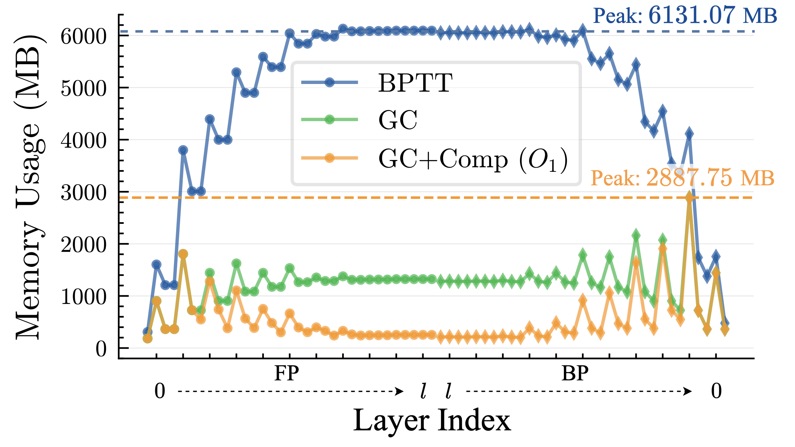

训练显存优化
=========================================

本教程作者： `黄一凡 (AllenYolk) <https://github.com/AllenYolk>`_

English version: :doc:`../en/memopt`

本团队在ICLR 2026发表的新工作 `Towards Lossless Memory-efficient Training of Spiking Neural Networks via Gradient Checkpointing and Spike Compression <https://openreview.net/forum?id=nrBJ0Uvj7c>`_ 提出了基于梯度检查点和脉冲压缩的深度SNN训练显存自动优化工具（源代码位于 `Github <https://github.com/AllenYolk/snn-gradient-checkpointing>`_ ）。利用该工具，用户只需添加少量代码，便可以在不损失精度且不过多影响速度的前提下，大幅降低深度SNN训练时的显存占用。

该工具已经集成到 ``spikingjelly.activation_based.memopt`` 子包中，可应用于几乎所有以多步模式运行的 spikingjelly SNN 模型。本教程将介绍其使用方式。

方法原理
+++++++++++++++++++++++

显存占用分析
---------------------

从图1可以看出，SNN的训练显存峰值远大于结构相似的ANN。而且， **中间特征** （下图浅蓝色部分）占据了SNN峰值显存的绝大部分（96%以上）；这些中间特征在前向传播期间被缓存下来，以供反向传播计算梯度时使用。因此，减少中间特征显存占用是降低SNN训练显存的关键。

    图1. 在ImageNet训练期间，不同ANN和SNN在达到峰值显存时的显存breakdown [#huang2026gc]_ 。

若将深度SNN视作若干个 **“权重-归一化-神经元”模块** （后亦简称为 **“层”** ）的堆叠，那么中间特征又可以细分成两个部分：

1. **输入** ：通常是二值脉冲向量。但也有例外，如网络的输入通常是浮点值，以及SEW ResNet [#fang2021sew]_ 中可能含非二值整数值。
2. **内部状态** ：权重和归一化层的中间计算结果，以及神经元的内部状态等。

梯度检查点 + 脉冲压缩
------------------------

为了降低 **内部状态** 的显存占用，可以对每一层施加 **梯度检查点 (gradient checkpointing, GC)** [#chen2016gc]_ 。具体而言，在执行第 :math:`l` 层的前向传播时，只缓存其输入 :math:`\mathbf{S}^{l-1}` 以及其他必要的权重；所有内部状态在完成计算后立即丢弃，不再缓存。在执行第 :math:`l` 层的反向传播时，首先使用 :math:`\mathbf{S}^{l-1}` 和权重重新计算该层前向传播以获得内部状态（即重构该层计算图），然后再计算梯度。如此一来，同一时刻最多只有一层的内部状态会存在于显存中，峰值显存得以大幅降低。我们称施加了上述变换的、只有输入被缓存的层为 **梯度检查点片段 (GC segment)** ；将常规层转换为梯度检查点片段后，需要多进行一次额外前向传播，故训练耗时增加。

即使施加了逐层梯度检查点，每层的 **输入** 仍需缓存。前文提到，深度SNN中绝大多数层的输入都是二值脉冲张量。然而，在 spikingjelly 等框架内部，二值张量使用浮点（ ``float32``, ``float16``, ...）表示；这保证了计算的兼容性，却带来了存储上的巨大冗余。为此，可以在缓存每层输入之前先进行 **无损脉冲压缩** ，将二值浮点张量 :math:`\mathbf{S}^{l-1}` 压缩到更紧凑的形式 :math:`\tilde{\mathbf{S}}^{l-1}` 以节省显存；重新计算前向传播时，解压 :math:`\tilde{\mathbf{S}}^{l-1}` 即可无损恢复出原始输入 :math:`\mathbf{S}^{l-1}` 。实验表明，基于比特表示的压缩器（用1比特表示一个0/1值）兼具速度和压缩率，因此被选为默认的脉冲压缩器。

图2(b)展示了梯度检查点+脉冲压缩施加后的前向/反向传播计算流程。更多细节，参见原文算法1 [#huang2026gc]_ 。

    图2. 方法流程图。带有虚线黑框的灰色方形表示检查点片段 [#huang2026gc]_ 。

检查点结构自适应调整
-------------------------

施加逐层梯度检查点+脉冲压缩后，一个训练iteration内的如化情况如图3橙色折线所示。优化后，虽然相比传统BPTT（蓝色折线）峰值显存已大幅降低，但全局峰值显存却远大于在其他层上运行时的临时显存占用。对此，我们设计了一系列检查点片段分割策略，以引入更多需缓存的输入为代价，降低关键检查点片段的大小；此外，也可地择性将一些检查点片段还原为常规层，以略微增加临时显存开销为代价，加快训练速度，同时不增加峰值显存。具体流程为：

1. **空间分割**：找出峰值显存开销所在的检查点片段，将其沿空间分割成两个更小的检查点片段。重复此步骤，直到无法进一步降低峰值显存。见图2(c)。
2. **时间分割**：找出峰值显存开销所在的检查点片段，将其沿时间轴分割成 :math:`k` 个更小的检查点片段。重复此步骤，直到无法进一步降低峰值显存。见图2(d)。
3. **贪心还原**：测量每个检查点片段的前向传播用时，并降序排列。按序尝试将每个检查点片段还原为常规层。一步变换后，若峰值显存不增加，则保留；否则撤销这一步变换。

更多细节，参见原文算法2 [#huang2026gc]_ 。

    图3. Spiking VGG在CIFAR10-DVS上训练的一个iteration内显存消耗变化情况 [#huang2026gc]_ 。

.. note::

    先考虑空间分割，再考虑时间分割；换言之，**时间分割仅仅作为空间分割的补充**。这是因为：时间分割与时间维度并行方法不兼容；而且，这限制了沿着时间步的内核融合（原本可将 :math:`T` 步融合到一个内核，分割后则需运行 :math:`k` 个 :math:`T/k` 步的内核），降低了速度。

使用说明
+++++++++++++++++++++++++

实现方式简述
---------------------

本框架使用以下两个类来表示检查点片段：

* :class:`GCContainer <spikingjelly.activation_based.memopt.checkpointing.GCContainer>` ： ``nn.Sequential`` 的子类，含一系列 ``nn.Module`` 成员。重写了 ``forward`` 方法，以实现梯度检查点逻辑。
* :class:`TCGCContainer <spikingjelly.activation_based.memopt.checkpointing.TCGCContainer>` ： :class:`GCContainer <spikingjelly.activation_based.memopt.checkpointing.GCContainer>` 的子类，额外记录了时间维度分段的份数。重写了 ``forward`` 方法，以实现时间分段 (temporal chunked) 梯度检查点的逻辑。

上一节介绍的整个优化过程被封装为 :func:`memory_optimization <spikingjelly.activation_based.memopt.pipeline.memory_optimization>` 函数。它将根据显存/时间分析结果，自适应地用 :class:`GCContainer <spikingjelly.activation_based.memopt.checkpointing.GCContainer>` 和 :class:`TCGCContainer <spikingjelly.activation_based.memopt.checkpointing.TCGCContainer>` 包装目标网络中的特定模块。检查点调整策略的实现方式即为：

* 空间分割：将一个 :class:`GCContainer <spikingjelly.activation_based.memopt.checkpointing.GCContainer>` 拆分成多个。
* 时间分割：将 :class:`GCContainer <spikingjelly.activation_based.memopt.checkpointing.GCContainer>` 变换成 :class:`TCGCContainer <spikingjelly.activation_based.memopt.checkpointing.TCGCContainer>` ，或者增加 :class:`TCGCContainer <spikingjelly.activation_based.memopt.checkpointing.TCGCContainer>` 的分割块数。
* 贪心还原：将 :class:`GCContainer <spikingjelly.activation_based.memopt.checkpointing.GCContainer>` 或 :class:`TCGCContainer <spikingjelly.activation_based.memopt.checkpointing.TCGCContainer>` 解包。

用户无需了解底层实现，只需调用 :func:`memory_optimization <spikingjelly.activation_based.memopt.pipeline.memory_optimization>` ，即可自动网络结构转换。

示例
-----------------------

以在CIFAR10-DVS上训练Spiking VGG为例，讲解如何使用上述工具。Spiking VGG模型定义如下：

.. code:: python

    import torch
    import torch.nn as nn
    from spikingjelly.activation_based import layer, neuron, surrogate, functional

    class VGGBlock(nn.Module):
        def __init__(
            self, in_plane, out_plane, kernel_size, stride, padding,
            preceding_avg_pool=False, **kwargs
        ):
            super().__init__()
            proj_bn = []
            if preceding_avg_pool:
                proj_bn.append(layer.AvgPool2d(2))
            proj_bn += [
                layer.Conv2d(in_plane, out_plane, kernel_size, stride, padding),
                layer.BatchNorm2d(out_plane),
            ]
            self.proj_bn = nn.Sequential(*proj_bn)
            self.neuron = neuron.LIFNode(**kwargs)

        def forward(self, x_seq):
            return self.neuron(self.proj_bn(x_seq))

    class CIFAR10DVSVGG(nn.Module):
        def __init__(
            self, dropout: float = 0.25, tau: float = 1.333,
            decay_input: bool = False, detach_reset: bool = True,
            surrogate_function=surrogate.ATan(), backend="triton",
        ):
            super().__init__()
            kwargs = {
                "tau": tau,
                "decay_input": decay_input,
                "detach_reset": detach_reset,
                "surrogate_function": surrogate_function,
                "backend": backend,
                "step_mode": "m",
            }
            self.features = nn.Sequential(
                VGGBlock(2, 64, 3, 1, 1, False, **kwargs),
                VGGBlock(64, 128, 3, 1, 1, False, **kwargs),
                VGGBlock(128, 256, 3, 1, 1, True, **kwargs),
                VGGBlock(256, 256, 3, 1, 1, False, **kwargs),
                VGGBlock(256, 512, 3, 1, 1, True, **kwargs),
                VGGBlock(512, 512, 3, 1, 1, False, **kwargs),
                VGGBlock(512, 512, 3, 1, 1, True, **kwargs),
                VGGBlock(512, 512, 3, 1, 1, False, **kwargs),
                layer.AvgPool2d(2),
            )
            d = int(48 / 2 / 2 / 2 / 2)
            l = [nn.Dropout(dropout)] if dropout > 0 else []
            l.append(nn.Linear(512 * d * d, 10))
            self.classifier = nn.Sequential(*l)
            for m in self.modules():
                if isinstance(m, nn.Conv2d):
                    nn.init.kaiming_normal_(m.weight, mode="fan_out", nonlinearity="relu")
            functional.set_step_mode(self, "m")

        def forward(self, input):
            functional.reset_net(self)
            # input.shape = [N, T, C, H, W]
            input = input.transpose(0, 1).contiguous()  # [T, N, C, H, W]
            x = self.features(input)
            x = torch.flatten(x, 2)  # [T, N, D]
            x = self.classifier(x)
            return x

注意：在 ``CIFAR10DVSVGG`` 的构造函数中，整个网络被配置为以多步模式运行。

欲使用 :func:`memory_optimization <spikingjelly.activation_based.memopt.pipeline.memory_optimization>` ，用户只需做以下准备。

Step 1. 定义分割规则
################################

:func:`memory_optimization <spikingjelly.activation_based.memopt.pipeline.memory_optimization>` 将按以下方式尝试对一个 :class:`GCContainer <spikingjelly.activation_based.memopt.checkpointing.GCContainer>` 做空间分割：

1. 若 :class:`GCContainer <spikingjelly.activation_based.memopt.checkpointing.GCContainer>` 的成员模块数量 ``n>1`` ，则将其拆分成 ``n`` 个片段。每个成员模块独自构成一个片段。
2. 若 :class:`GCContainer <spikingjelly.activation_based.memopt.checkpointing.GCContainer>` 成员模块数量 ``n==1`` ，则调用该成员的 ``__spatial_split__`` 方法，得到一个模块元组。该元组中的每个模块都构成一个拆分后的检查点片段。
3. 若上述方法都不可行，则当前片段不可沿空间分割。

换言之，用户只需定义 ``__spatial_split__`` 方法，返回一个模块元组，即可实现空间分割。对于 ``VGGBlock`` 而言，可以定义为：

.. code:: python

    class VGGBlock(nn.Module):
        ...
        def __spatial_split__(self):
            return self.proj_bn, self.neuron

:func:`memory_optimization <spikingjelly.activation_based.memopt.pipeline.memory_optimization>` 的时间分割将自动借助 :func:`to_functional_forward <spikingjelly.activation_based.base.to_functional_forward>` 实现，无需手动定义规则。

Step 2. 显式声明压缩器（可选）
################################

:func:`memory_optimization <spikingjelly.activation_based.memopt.pipeline.memory_optimization>` 会自动探测每个检查点模块的输入分布。若输入是二值的，则会使用比特压缩器 :class:`BitSpikeCompressor <spikingjelly.activation_based.memopt.compress.BitSpikeCompressor>` 进行压缩；否则，使用空压缩器 :class:`NullSpikeCompressor <spikingjelly.activation_based.memopt.compress.NullSpikeCompressor>` （即：不压缩）。自动探测机制无法穷尽所有情况，存在出现错误的可能；用户有时也希望使用其它类型的压缩器。为此，用户可以显式声明每个检查点片段的压缩器，以覆盖自动探测的结果。

例如， 如果 ``CIFAR10DVSVGG`` 的输入并非二值，可以这样声明：

.. code:: python

    class CIFAR10DVSVGG(nn.Module):
        def __init__(
            self, dropout: float = 0.25, tau: float = 1.333,
            decay_input: bool = False, detach_reset: bool = True,
            surrogate_function=surrogate.ATan(), backend="triton",
        ):
            ...
            self.features = nn.Sequential(
                VGGBlock(2, 64, 3, 1, 1, False, **kwargs),
                ...
            )
            self.features[0].x_compressor = "NullSpikeCompressor"
            ...

这样一来，在用 :class:`GCContainer <spikingjelly.activation_based.memopt.checkpointing.GCContainer>` 包装 ``features[0]`` 时，将使用 :class:`NullSpikeCompressor <spikingjelly.activation_based.memopt.compress.NullSpikeCompressor>` 作为其输入压缩器。 ``x_compressor`` 属性可被赋值为 :class:`BaseSpikeCompressor <spikingjelly.activation_based.memopt.compress.BaseSpikeCompressor>` 子类的实例，或是子类名称字符串（如上例）；查阅 :doc:`../../APIs/spikingjelly.activation_based.memopt.compress` 文档以获取所有可选的压缩器。

Step 3. 调用工具函数
################################

完成上述准备后，调用 :func:`memory_optimization <spikingjelly.activation_based.memopt.pipeline.memory_optimization>` 即可：

.. code:: python

    from spikingjelly.activation_based import memopt

    net = CIFAR10DVSVGG(...)
    net = memopt.memory_optimization(
        net,
        (VGGBlock,),
        dummy_input=(torch.zeros(32, T, 2, 48, 48),),
        compress_x=True,
        level=4,
        temporal_split_factor=2,
        verbose=True,
    )

查询 :func:`memory_optimization <spikingjelly.activation_based.memopt.pipeline.memory_optimization>` 的文档以获取参数说明。

结果
###############################

调用 :func:`memory_optimization <spikingjelly.activation_based.memopt.pipeline.memory_optimization>` ，输出为：

.. code:: text

    Level 1: layer-wise GC with input spike compression
    Level 2: split GCContainers spatially
            net's features.1: successfully split (2830308352 -> 2726500352)
            net's features.1.0: can't be spatially split
    Level 3: split GCContainers temporally
            net's features.1.0: successfully split (2726500352 -> 2641563648)
            net's features.1.1: successfully split (2641563648 -> 2338393088)
            net's features.2: successfully split (2338393088 -> 2132545536)
            net's features.1.1: no reduction in memory, revert (2132545536 -> 2147287040)
    Level 4: greedily disable GCContainers
            net's features.3: disable GCContainer (2132545536 -> 2126712832)
            net's features.1.0: keep GCContainer (2126712832 -> 2687308800)
            net's features.2: keep GCContainer (2126712832 -> 2898722816)
            net's features.5: disable GCContainer (2126712832 -> 2123108352)
            net's features.4: keep GCContainer (2123108352 -> 2232676352)
            net's features.1.1: disable GCContainer (2123108352 -> 2039347200)
            net's features.0: keep GCContainer (2039347200 -> 2417163264)
            net's features.6: disable GCContainer (2039347200 -> 2036398080)
            net's features.7: disable GCContainer (2036398080 -> 2036316160)

优化后的网络结构大致为：

.. code:: text

  (net): CIFAR10DVSVGG(
    (features): Sequential(
      (0): GCContainer(
        x_compressor=NullSpikeCompressor,
        (0): VGGBlock(...)
      )
      (1): Sequential(
        (0): TCGCContainer(
          x_compressor=BitSpikeCompressor, n_chunk=2, n_seq_inputs=1, n_seq_outputs=1
          (0): Sequential(
            (0): Conv2d(64, 128, kernel_size=(3, 3), stride=(1, 1), padding=(1, 1), step_mode=m)
            (1): BatchNorm2d(128, eps=1e-05, momentum=0.1, affine=True, track_running_stats=True, step_mode=m)
          )
        )
        (1): LIFNode()
      )
      (2): TCGCContainer(
        x_compressor=BitSpikeCompressor, n_chunk=2, n_seq_inputs=1, n_seq_outputs=1
        (0): VGGBlock(...)
      )
      (3): VGGBlock(...)
      (4): GCContainer(
        x_compressor=BitSpikeCompressor,
        (0): VGGBlock(...)
      )
      (5): VGGBlock(...)
      (6): VGGBlock(...)
      (7): VGGBlock(...)
      (8): AvgPool2d(kernel_size=2, stride=2, padding=0, step_mode=m)
    )
    (classifier): Sequential(
      (0): Dropout(p=0.25, inplace=False)
      (1): Linear(in_features=4608, out_features=10, bias=True)
    )
  )

在 CIFAR10-DVS 上训练， 令 ``batch_size=32`` 且 ``T=10`` 。未经优化的CuPy后端网络、未经优化的Triton后端网络，以及优化后的Triton后端网络在 ``epoch=5`` 时的训练日志为：

.. code:: text

    # CuPy backend, not optimized (level=0)
    Epoch 5/100: train_samples_per_second=349.36 samples/s
    Epoch 5/100: peak_allocated=4966.7451171875 MB, peak_reserved=5370.0 MB
    Epoch 5/100: train_loss=1.63, train_acc=47.92%

    # Triton backend, not optimized (level=0)
    Epoch 5/100: train_samples_per_second=383.55 samples/s
    Epoch 5/100: peak_allocated=3830.3056640625 MB, peak_reserved=5544.0 MB
    Epoch 5/100: train_loss=1.64, train_acc=47.42%

    # Triton backend, optimized (level=4)
    Epoch 5/100: train_samples_per_second=315.77 samples/s
    Epoch 5/100: peak_allocated=1973.11767578125 MB, peak_reserved=2770.0 MB
    Epoch 5/100: train_loss=1.64, train_acc=47.89%

可见，训练峰值显存显著降低，而训练速度的降低可以接受。优化后的Triton后端网络与未经优化的Triton后端网络并非完全等价，是对BN层的计算做时间分段的结果，详见原论文 Appendix G [#huang2026gc]_ 。完整可运行的示例代码位于 `spikingjelly.activation.example.memopt <https://github.com/fangwei123456/spikingjelly/tree/master/spikingjelly/activation_based/examples/memopt>`_ 中。

.. note::

    本教程的结果与原论文结果 [#huang2026gc]_ 并不相同，是因为SpikingJelly对 ``memopt`` 的实现与原工作并不完全相同。若想获得与原论文完全一致的结果，请使用原工作的 `源代码  <https://github.com/AllenYolk/snn-gradient-checkpointing>`_ 。

.. [#huang2026gc] Huang, Y., Fang, W., Hao, Z., Ma, Z., & Tian Y. (2026). Towards Lossless Memory-efficient Training of Spiking Neural Networks via Gradient Checkpointing and Spike Compression. The Fourteenth International Conference on Learning Representations.
.. [#fang2021sew] Fang, W., Yu, Z., Chen, Y., Huang, T., Masquelier, T., & Tian, Y. (2021). Deep residual learning in spiking neural networks. Advances in neural information processing systems, 34, 21056-21069.
.. [#chen2016gc] Chen, T., Xu, B., Zhang, C., & Guestrin, C. (2016). Training deep nets with sublinear memory cost. arXiv preprint arXiv:1604.06174.
