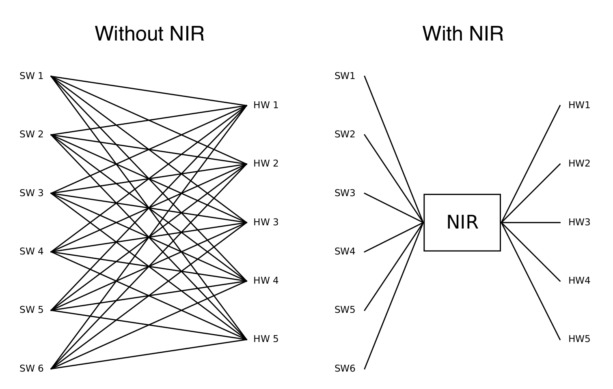

与 NIR 相互转换
#########################

本教程作者： `黄一凡 (AllenYolk) <https://github.com/AllenYolk>`_

English version: :doc:`../en/nir_exchange`

`Neuromorphic intermediate representation (NIR) <https://neuroir.org/docs/index.html>`_ 是一组计算原语，以图（节点+边）的形式描述了 SNN 的模块和连接，在不同的神经形态框架和技术栈之间通用。目前，NIR `被多个模拟器和硬件平台支持 <https://neuroir.org/docs/support.html>`_ 。SpikingJelly 的 ``nir_exchange`` 包支持在可转换的 SpikingJelly 模型与 NIR 图之间双向转换。

    图片来源： `What is the Neuromorphic Intermediate Representation (NIR)? <https://neuroir.org/docs/what.html>`_

SpikingJelly 的 ``nir_exchange`` 包提供了两个关键的用户接口：

* :func:`export_to_nir <spikingjelly.activation_based.nir_exchange.to_nir.export_to_nir>` ：将 SpikingJelly 模型导出为 NIR 图；
* :func:`import_from_nir <spikingjelly.activation_based.nir_exchange.from_nir.import_from_nir>` ：将 NIR 图导入为 SpikingJelly 模型。

本教程将对这两个函数展开介绍。

.. note::

    使用以下命令安装 NIR exchange 可选依赖：

    .. code:: shell

        pip install "spikingjelly[nir]"

从 SpikingJelly 到 NIR
==========================

由于开发者精力有限且 NIR 本身只能表示少数几种模块，故目前 :func:`export_to_nir <spikingjelly.activation_based.nir_exchange.to_nir.export_to_nir>` 只支持以下 SpikingJelly / PyTorch 模块的转换：

* ``torch.nn.Linear``, :class:`layer.Linear <spikingjelly.activation_based.layer.Linear>`
* ``torch.nn.Conv1d``, :class:`layer.Conv1d <spikingjelly.activation_based.layer.Conv1d>`
* ``torch.nn.Conv2d``, :class:`layer.Conv2d <spikingjelly.activation_based.layer.Conv2d>`
* ``torch.nn.AvgPool2d``, :class:`layer.AvgPool2d <spikingjelly.activation_based.layer.AvgPool2d>`
* ``torch.nn.Flatten``, :class:`layer.Flatten <spikingjelly.activation_based.layer.Flatten>`
* :class:`IFNode <spikingjelly.activation_based.neuron.IFNode>`
* :class:`LIFNode <spikingjelly.activation_based.neuron.LIFNode>` and :class:`ParametricLIFNode <spikingjelly.activation_based.neuron.ParametricLIFNode>`
* :class:`CUBALIFNode <spikingjelly.activation_based.neuron.CUBALIFNode>`

以下面的 SNN 模型为例：

.. code:: python

    import torch.nn as nn
    from spikingjelly.activation_based import layer, neuron

    net = nn.Sequential(
        layer.Conv2d(3, 16, 3, 1, 1, step_mode="s"),
        neuron.IFNode(),
        nn.AvgPool2d((2, 2)),
        layer.Flatten(step_mode="s"),
        nn.Linear(4096, 10),
        neuron.ParametricLIFNode(10., decay_input=False, v_reset=0.0),
    )

为了展示兼容性，这一示例故意混用了原生 PyTorch 的无状态层 ``nn.AvgPool2d, nn.Linear`` 和 SpikingJelly 包装后的无状态层 ``layer.Conv2d, layer.Flatten``。此外，本例中还使用了 ``neuron.IFNode`` 和 ``neuron.ParametricLIFNode`` 两种神经元模型。

调用 :func:`export_to_nir <spikingjelly.activation_based.nir_exchange.to_nir.export_to_nir>` ，即可将上述模型转换成 NIR 图并保存为 HDF5 文件：

.. code:: python

    import torch
    from spikingjelly.activation_based import nir_exchange

    graph = nir_exchange.export_to_nir(
        net,
        example_input=torch.rand(8, 3, 32, 32),
        save_path="./example.nir",
        dt=1e-4
    )
    print(graph)

:func:`export_to_nir <spikingjelly.activation_based.nir_exchange.to_nir.export_to_nir>` 参数的含义为：

* ``net`` ：SpikingJelly 模型；
* ``example_input`` ：模型输入的样例，用于确定子模块输入和输出的形状；
* ``save_path`` ：HDF5 文件路径，用于保存 NIR 图（若为 ``None`` ，则不保存）；
* ``dt`` ：NIR 模拟时间步长。建议设置成 ``1e-4`` 以对齐其它支持 NIR 的框架。

运行后，当前目录下出现文件 ``example.nir``，其中包含以 HDF5 编码的 NIR 图。终端打印出的结果大致为：

.. code:: text

    NIRGraph(
        nodes={
            'input_1': Input(input_type={'input': array([ 3, 32, 32])}, metadata={}),

            '_0': Conv2d(input_shape=(32, 32), weight=array(...), stride=(1, 1), padding=(1, 1), dilation=(1, 1), groups=1, bias=array(...), metadata={}),

            '_1': IF(r=array(...), v_threshold=array(...), v_reset=array(...), input_type={'input': array([16, 32, 32])}, output_type={'output': array([16, 32, 32])}, metadata={}),

            '_2': AvgPool2d(kernel_size=(2, 2), stride=(2, 2), padding=0, metadata={}),

            '_3': Flatten(input_type={'input': array([16, 16, 16])}, start_dim=0, end_dim=-1, output_type={'output': array([4096])}, metadata={}),

            '_4': Affine(weight=array(...), bias=array(...), input_type={'input': array([4096])}, output_type={'output': array([10])}, metadata={}),

            '_5': LIF(tau=array(...), r=array(...), v_leak=array(...), v_threshold=array(...), v_reset=array(...), input_type={'input': array([10])}, output_type={'output': array([10])}, metadata={}),

            'output': Output(output_type={'output': array([10])}, metadata={})
        },

        edges=[
            ('input_1', '_0'), ('_0', '_1'), ('_1', '_2'), ('_2', '_3'),
            ('_3', '_4'), ('_4', '_5'), ('_5', 'output')
        ],

        input_type={'input_1': array([ 3, 32, 32])},
        output_type={'output': array([10])},
        metadata={}
    )

这里，我们只展示了 ``NIRGraph`` 的结构，省略了具体的参数数值。可见，NIR 图由节点 ``nodes`` 和边 ``edges`` 组成。节点对应 SNN 模块，边指示了节点的输入输出关系。

.. note::

    原模型中的 ``ParametricLIFNode`` 被转换成了 ``nir.LIF`` 节点。这是合理的，因为一旦膜电位时间常量 ``tau`` 固定下来，PLIF 神经元就将变成 LIF 神经元。

.. note::

    不同于 PyTorch 和 SpikingJelly 模型， ``NIRGraph`` 中的节点大多蕴含 **输入输出形状** 信息。例如，上方例子中的 ``'_3': Flatten(...)`` 节点指明了输入形状为 ``[16, 16, 16]`` ，输出形状为 ``[4096]`` ； ``'_5': LIF(...)`` 的输入输出形状则都为 ``[10]`` 。显然，NIR 图中的形状信息是不包含时间维度 ``T`` 和批量维度 ``B`` 的；换言之，NIR只 **描述单样本、单个时间步上的模型结构** 。

    PyTorch / SpikingJelly 模型的子模块不含输入输出形状信息，但 NIR 图却需要这些信息。为了获取输入输出形状信息，:func:`export_to_nir <spikingjelly.activation_based.nir_exchange.to_nir.export_to_nir>` 要求用户给出 ``example_input`` 样例输入。 ``example_input`` 可以具有时间或批量维度，具体取决于 PyTorch / SpikingJelly 模型的需求。 :func:`export_to_nir <spikingjelly.activation_based.nir_exchange.to_nir.export_to_nir>` 函数内部将调用 PyTorch 的 `ShapeProp <https://github.com/pytorch/pytorch/blob/main/torch/fx/passes/shape_prop.py>`_ 功能来获取输入输出形状信息。

.. warning::

    NIR 无法区分 SpikingJelly 的 soft reset 与 hard reset，因此会拒绝 ``v_reset=None`` 的神经元。分组卷积以及无法被 NIR 精确表示的池化选项也会被拒绝。

从 NIR 到 SpikingJelly
==========================

函数 :func:`import_from_nir <spikingjelly.activation_based.nir_exchange.from_nir.import_from_nir>` 可以将已有的 NIR 图转换成 SpikingJelly 模型。以上一节生成的 NIR 图为例：

.. code:: python

    gm = nir_exchange.import_from_nir(graph="./example.nir", dt=1e-4)
    x = torch.rand(9, 3, 32, 32) # [B, C, H, W]
    y, state = gm(x) # state=None 表示从初始状态开始
    print("y.shape =", y.shape)

    # 将返回的状态传回模型以继续运行。
    y, state = gm(x, state)

此处，:func:`import_from_nir <spikingjelly.activation_based.nir_exchange.from_nir.import_from_nir>` 参数的含义是：

* ``graph`` ：``NIRGraph`` 对象，或指向 HDF5 NIR 文件的字符串/``Path``。
* ``dt`` ：NIR 图的模拟时间步长。与 :func:`export_to_nir <spikingjelly.activation_based.nir_exchange.to_nir.export_to_nir>` 的 ``dt`` 参数一致。

返回的 ``torch.fx.GraphModule`` 使用显式状态。以 ``state=None`` 调用时总是从神经元和图的初始状态开始。逐步循环必须将返回的状态传入下一次调用，否则每一步都会从初始状态重新运行。:func:`functional.reset_net <spikingjelly.activation_based.functional.reset_net>` 不会重置已经返回的显式状态；若要重新开始，应传入 ``state=None``。循环 NIR 图只能使用单步模式，每次调用推进一个时间步。

目前， :func:`import_from_nir <spikingjelly.activation_based.nir_exchange.from_nir.import_from_nir>` 仅支持以下 NIR 节点类型：

* ``nir.Linear``, ``nir.Affine``
* ``nir.Conv1d``
* ``nir.Conv2d``
* ``nir.AvgPool2d``
* ``nir.Flatten``
* ``nir.IF``
* ``nir.LIF``
* ``nir.CubaLIF``

.. note::

    :func:`import_from_nir <spikingjelly.activation_based.nir_exchange.from_nir.import_from_nir>` 还提供了 ``dtype`` ， ``device`` 和 ``step_mode`` 参数，用于控制所返回的 SpikingJelly 模型的数据类型、设备、步进模式。例如，可以通过以下方式得到多步模式的 SpikingJelly 模型：

    .. code:: python

        gm = nir_exchange.import_from_nir(
            "./example.nir", dt=1e-4, step_mode="m"
        )
        x = torch.rand(7, 9, 3, 32, 32) # [T, B, C, H, W]
        y, state = gm(x)
        print("y.shape =", y.shape)
