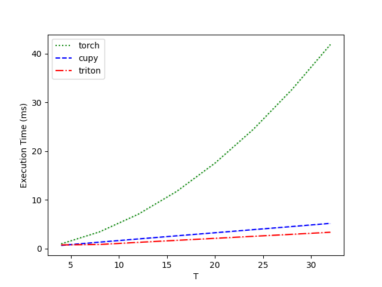

Triton 后端
===========================

本教程作者： `黄一凡 (AllenYolk) <https://github.com/AllenYolk>`_

English version: :doc:`../en/triton_backend`

SpikingJelly ``0.0.0.1.0`` 版本引入了 `Triton <https://github.com/triton-lang/triton>`_ 后端，作为本框架继 PyTorch 和 CuPy 之后的第三种后端。相比使用 CUDA 撰写的 CuPy 后端，Triton 后端具有更好的可读性、扩展性和可维护性，更容易达到较高的 GPU 利用率，且有扩展到 `其他硬件平台 <https://gitcode.com/Ascend/triton-ascend>`_ 的潜力。

本教程聚焦于预定义神经元的 Triton 后端用法。关于基于自定义动力学函数自动生成内核，请参考 :doc:`./flexsn`。

本教程需要如下的准备及前置知识：

#. `安装好 Triton <https://triton-lang.org/main/getting-started/installation.html>`_ 。推荐使用 ``triton >= 3.3.1`` 。
#. 熟悉 SpikingJelly 的 :doc:`./neuron` 模块。

使用预定义的 Triton 神经元内核
++++++++++++++++++++++++++++++

前向传播与反向传播
-------------------------

神经元 Triton 后端的启用方式和 CuPy 后端类似。以 ``LIFNode`` 为例：

.. code:: python

    import torch
    from spikingjelly.activation_based import neuron

    n = neuron.LIFNode(step_mode="m", backend="triton").to("cuda:0")
    x = torch.randn([16, 1, 3, 32, 32], device="cuda:0") # [T, B, C, H, W]

    s = n(x)
    print(s.device, s.shape, s.mean())
    # cuda:0 torch.Size([16, 1, 3, 32, 32]) tensor(0.0313, device='cuda:0')

这里，我们构造了一个以多步模式 ``step_mode="m"`` 运行的 LIF 神经元，并启用 Triton 后端。将神经元和输入张量都移动到 ``"cuda:0"`` 设备上后，即可使用 Triton 后端完成前向传播计算。 Triton 后端当然也支持反向传播，且会得到与其它后端（几乎）完全相同的结果：

.. code:: python

    import torch
    import torch.nn.functional as F
    from spikingjelly.activation_based import neuron

    n_triton = neuron.LIFNode(
        step_mode="m", backend="triton", store_v_seq=True
    ).to("cuda:0")
    n_torch = neuron.LIFNode(
        step_mode="m", backend="torch", store_v_seq=True
    ).to("cuda:0")

    x = torch.randn([16, 1, 3, 32, 32], device="cuda:0") # [T, B, C, H, W]
    x_triton = x.clone().requires_grad_(True)
    x_torch = x.clone().requires_grad_(True)

    s_triton = n_triton(x_triton)
    s_torch = n_torch(x_torch)
    v_triton = n_triton.v_seq
    v_torch = n_torch.v_seq

    grad = torch.randn_like(s_triton)
    s_triton.backward(grad)
    s_torch.backward(grad)

    assert torch.allclose(s_triton, s_torch)
    print(s_triton.mean()) # tensor(0.0309, device='cuda:0', grad_fn=<MeanBackward0>)
    assert torch.allclose(v_triton, v_torch)
    print(v_triton.mean()) # tensor(-0.0702, device='cuda:0', grad_fn=<MeanBackward0>)
    assert torch.allclose(x_triton.grad, x_torch.grad, rtol=1e-6, atol=1e-6)
    print(
        F.cosine_similarity(x_triton.grad.flatten(), x_torch.grad.flatten(), dim=0)
    ) # tensor(1., device='cuda:0')

速度测算
------------------

Triton 后端支持 ``torch.float16``。下面，我们使用 Triton 提供的性能测算工具 ``triton.testing`` 来对比不同后端的速度：

.. code:: python

    import torch
    import triton
    from spikingjelly.activation_based import neuron, functional

    DEVICE = "cuda:0"

    def forward_backward(net, x_seq):
        y_seq  = net(x_seq)
        y_seq.sum().backward()
        x_seq.grad = None
        functional.reset_net(net)

    @triton.testing.perf_report(
        triton.testing.Benchmark(
            x_names=["T"],
            x_vals=[4*i for i in range(1, 9)],
            line_arg="backend",
            line_vals=["torch", "cupy", "triton"],
            line_names=["torch", "cupy", "triton"],
            styles=[
                ('green', ':'), ('blue', '--'), ('red', '-.'),
            ],
            ylabel='Execution Time (ms)',
            plot_name='Performance-float16',
            args={"N": 64, "C": 64*32*32, 'dtype': torch.float16},
        )
    )
    def benchmark(T, N, C, dtype, backend):
        net = neuron.LIFNode(
            backend=backend,
            step_mode='m',
        ).to(device=DEVICE, dtype=dtype)
        x_seq = torch.rand(
            [T, N, C], device=DEVICE, dtype=dtype, requires_grad=True
        )
        results = triton.testing.do_bench(
            lambda: forward_backward(net, x_seq),
            quantiles=[0.5, 0.2, 0.8],
            grad_to_none=[x_seq]
        )
        return results

    benchmark.run(save_path="./logs", print_data=True, show_plots=True)

在单个 GeForce RTX 4090 上运行，结果如下：

.. code:: text

    Performance-float16:
        T      torch      cupy    triton
    0   4.0   0.992784  0.667648  0.771072
    1   8.0   3.459072  1.338368  0.857088
    2  12.0   7.058432  1.988608  1.289216
    3  16.0  11.737088  2.630736  1.704896
    4  20.0  17.557505  3.263488  2.115584
    5  24.0  24.517120  3.902464  2.533376
    6  28.0  32.649216  4.535296  2.940928
    7  32.0  41.872896  5.189120  3.365888

.. note::

    ``cupy`` 后端是遗留选项。SpikingJelly 推荐的主要 GPU 加速后端是 ``triton``。上表中的 CuPy 列仅保留用于历史参考。

可见，数据规模和序列长度 ``T`` 都较大时，Triton 后端相比 CuPy 和 PyTorch 后端具有明显的速度优势。

.. admonition:: 警告
    :class: warning

    在使用预定义的 Triton 神经元内核时，需注意：

    * 目前仅最常用的 ``IFNode`` ， ``LIFNode`` 和 ``PLIFNode`` 配备了 Triton 内核。我们将在后续更新中逐步添加更多的 Triton 内核。
    * Triton 后端应在 GPU 上运行。
    * Triton 后端仅支持多步运行模式 ``step_mode="m"`` 。
