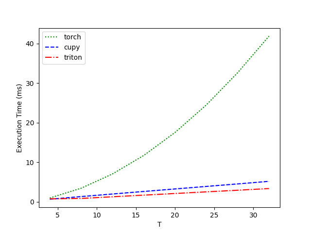
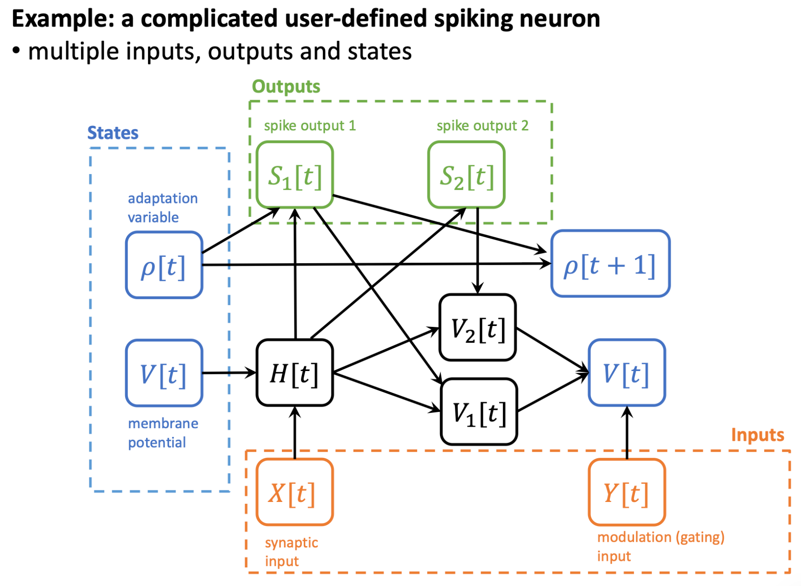

Triton 后端与 FlexSN
===========================

本教程作者： `黄一凡 (AllenYolk) <https://github.com/AllenYolk>`_

English version: :doc:`../en/triton_flexsn`

SpikingJelly ``0.0.0.1.0`` 版本引入了 `Triton <https://github.com/triton-lang/triton>`_ 后端，作为本框架继 PyTorch 和 CuPy 之后的第三种后端。相比使用 CUDA 撰写的 CuPy 后端，Triton 后端具有更好的可读性、扩展性和可维护性，更容易达到较高的 GPU 利用率，且有扩展到 `其他硬件平台 <https://gitcode.com/Ascend/triton-ascend>`_ 的潜力。

用户可以通过两种方式使用 SpikingJelly 的 Triton 后端：

* 预定义的神经元内核： 构造神经元时，设置 ``backend="triton"`` 即可直接使用 Triton 后端，就像使用 CuPy 后端那样。
* ``FlexSN`` ： 根据用户自定义的 PyTorch 神经元动力学方程生成 Triton 内核。该模块比曾经的 ``auto_cuda`` 工具更加灵活、强大。

本教程将从这两方面出发，介绍 Triton 后端的使用方式。本教程需要如下的准备及前置知识：

#. `安装好 Triton <https://triton-lang.org/main/getting-started/installation.html>`_ 。推荐使用 ``triton >= 3.3.1`` 。
#. 熟悉 SpikingJelly 的 :doc:`./neuron` 模块。

使用预定义的 Triton 神经元内核
++++++++++++++++++++++++++++++

前向传播与反向传播
-------------------------

神经元 Triton 后端的启用方式和 CuPy 后端类似。以 ``LIFNode`` 为例：

.. code:: python

    import torch
    from spikingjelly.activation_based import neuron

    n = neuron.LIFNode(step_mode="m", backend="triton").to("cuda:0")
    x = torch.randn([16, 1, 3, 32, 32], device="cuda:0") # [T, B, C, H, W]

    s = n(x)
    print(s.device, s.shape, s.mean())
    # cuda:0 torch.Size([16, 1, 3, 32, 32]) tensor(0.0313, device='cuda:0')

这里，我们构造了一个以多步模式 ``step_mode="m"`` 运行的 LIF 神经元，并启用 Triton 后端。将神经元和输入张量都移动到 ``"cuda:0"`` 设备上后，即可使用 Triton 后端完成前向传播计算。 Triton 后端当然也支持反向传播，且会得到与其它后端（几乎）完全相同的结果：

.. code:: python

    import torch
    import torch.nn.functional as F
    from spikingjelly.activation_based import neuron

    n_triton = neuron.LIFNode(
        step_mode="m", backend="triton", store_v_seq=True
    ).to("cuda:0")
    n_torch = neuron.LIFNode(
        step_mode="m", backend="torch", store_v_seq=True
    ).to("cuda:0")

    x = torch.randn([16, 1, 3, 32, 32], device="cuda:0") # [T, B, C, H, W]
    x_triton = x.clone().requires_grad_(True)
    x_torch = x.clone().requires_grad_(True)

    s_triton = n_triton(x_triton)
    s_torch = n_torch(x_torch)
    v_triton = n_triton.v_seq
    v_torch = n_torch.v_seq

    grad = torch.randn_like(s_triton)
    s_triton.backward(grad)
    s_torch.backward(grad)

    assert torch.allclose(s_triton, s_torch)
    print(s_triton.mean()) # tensor(0.0309, device='cuda:0', grad_fn=<MeanBackward0>)
    assert torch.allclose(v_triton, v_torch)
    print(v_triton.mean()) # tensor(-0.0702, device='cuda:0', grad_fn=<MeanBackward0>)
    assert torch.allclose(x_triton.grad, x_torch.grad, rtol=1e-6, atol=1e-6)
    print(
        F.cosine_similarity(x_triton.grad.flatten(), x_torch.grad.flatten(), dim=0)
    ) # tensor(1., device='cuda:0')

速度测算
------------------

Triton 后端支持 ``torch.float16``。下面，我们使用 Triton 提供的性能测算工具 ``triton.testing`` 来对比不同后端的速度：

.. code:: python

    import torch
    import triton
    from spikingjelly.activation_based import neuron, functional

    DEVICE = "cuda:0"

    def forward_backward(net, x_seq):
        y_seq  = net(x_seq)
        y_seq.sum().backward()
        x_seq.grad = None
        functional.reset_net(net)

    @triton.testing.perf_report(
        triton.testing.Benchmark(
            x_names=["T"],
            x_vals=[4*i for i in range(1, 9)],
            line_arg="backend",
            line_vals=["torch", "cupy", "triton"],
            line_names=["torch", "cupy", "triton"],
            styles=[
                ('green', ':'), ('blue', '--'), ('red', '-.'),
            ],
            ylabel='Execution Time (ms)',
            plot_name='Performance-float16',
            args={"N": 64, "C": 64*32*32, 'dtype': torch.float16},
        )
    )
    def benchmark(T, N, C, dtype, backend):
        net = neuron.LIFNode(
            backend=backend,
            step_mode='m',
        ).to(device=DEVICE, dtype=dtype)
        x_seq = torch.rand(
            [T, N, C], device=DEVICE, dtype=dtype, requires_grad=True
        )
        results = triton.testing.do_bench(
            lambda: forward_backward(net, x_seq),
            quantiles=[0.5, 0.2, 0.8],
            grad_to_none=[x_seq]
        )
        return results

    benchmark.run(save_path="./logs", print_data=True, show_plots=True)

在单个 GeForce RTX 4090 上运行，结果如下：

.. code:: text

    Performance-float16:
        T      torch      cupy    triton
    0   4.0   0.992784  0.667648  0.771072
    1   8.0   3.459072  1.338368  0.857088
    2  12.0   7.058432  1.988608  1.289216
    3  16.0  11.737088  2.630736  1.704896
    4  20.0  17.557505  3.263488  2.115584
    5  24.0  24.517120  3.902464  2.533376
    6  28.0  32.649216  4.535296  2.940928
    7  32.0  41.872896  5.189120  3.365888

可见，数据规模和序列长度 ``T`` 都较大时，Triton 后端相比 CuPy 和 PyTorch 后端具有明显的速度优势。

.. admonition:: 警告
    :class: warning

    在使用预定义的 Triton 神经元内核时，需注意：

    * 目前仅最常用的 ``IFNode`` ， ``LIFNode`` 和 ``PLIFNode`` 配备了 Triton 内核。我们将在后续更新中逐步添加更多的 Triton 内核。
    * Triton 后端应在 GPU 上运行。
    * Triton 后端仅支持多步运行模式 ``step_mode="m"`` 。

使用 FlexSN 自定义 Triton 神经元内核
++++++++++++++++++++++++++++++++++++++++++

FlexSN 可以根据用户给出的 **单步神经元动力学方程** 自动生成高性能的多步 Triton 内核，具有极高的通用性。利用 FlexSN ，用户可以轻松地提升自定义神经元模型的运行效率。

用函数描述神经元动力学
------------------------

绝大多数脉冲神经元模型在一个离散时间步上的动力学可以描述为：

.. math::

    Y_1[t], Y_2[t], \dots, V_1[t], V_2[t], \dots = f_s\left( X_1[t], X_2[t], \dots, V_1[t-1], V_2[t-1], \dots \right)

其中 :math:`Y_i` 表示输出，:math:`V_i` 表示状态变量，:math:`X_i` 表示输入。该公式可以用 PyTorch 函数描述：

.. code:: python

    def single_step_inference(x1, x2, ..., v1, v2, ...):
        ...
        return y1, y2, ..., v1_updated, v2_updated, ...

其中 ``x1, x2, ...`` 表示输入， ``v1, v2, ...`` 表示状态变量， ``y1, y2, ...`` 表示输出，而 ``v1_updated, v2_updated, ...`` 表示更新后的状态变量（与 ``v1, v2, ...`` 对应）。例如，输入不衰减的软重置 LIF 神经元（ ``tau=2`` ， ``v_th=1.0`` ，sigmoid 替代函数 ）可以描述为：

.. code:: python

    from spikingjelly.activation_based import surrogate

    tau = 2.0 # time constant
    v_th = 1.0 # threshold
    spike_fn = surrogate.Sigmoid()

    def lif_single_step_inference(x, v):
        h = (1 - 1/tau) * v + x
        s = spike_fn(h - v_th)
        v = h - s * v_th
        return s, v

这个例子中，输入、输出和状态变量的数量都是1；而对于更复杂的神经元模型，输入、输出和状态变量的数量都可能是多个。另外，此处的模型超参数 ``tau`` ， ``v_th`` 和 ``spike_fn`` 都是固定下来的全局变量。为了灵活配置超参数，可以使用 **函数闭包** ：

.. code:: python

    from spikingjelly.activation_based import surrogate

    def lif_single_step_inference_closure(tau=2., v_th=1., spike_fn=surrogate.Sigmoid()):
        def lif_single_step_inference(x, v):
            h = (1 - 1/tau) * v + x
            s = spike_fn(h - v_th)
            v = h - s * v_th
            return s, v
        return lif_single_step_inference

    f = lif_single_step_inference_closure(tau=99., v_th=0.5)

FlexSN 使用流程
----------------------

以如下的自定义脉冲神经元为例：

.. code:: python

    import torch
    from spikingjelly.activation_based import surrogate

    def complicated_lif_core_generator(beta: float, gamma: float, spike_fn=surrogate.ATan()):
        def complicated_lif_core(
    	    x: torch.Tensor, y: torch.Tensor, v: torch.Tensor, rho: torch.Tensor
        ):
            h = beta*v + x
            s1 = spike_fn(h - (rho+1.)) # spike, with threshold adaptation
            s2 = spike_fn(h - 1.)       # spike, without threshold adaptation
            rho = gamma*rho + s1        # adaptation variable update
            v1 = h * (1.-s1)            # hard reset
            v2 = h - s2                 # soft reset
            yy = torch.sigmoid(y)       # modulation factor
            v = v1*yy + v2 * (1.-yy)    # modulated reset
            return s1, s2, v, rho
        return complicated_lif_core

该模型有两个输入 ``x, y`` ，两个输出 ``s1, s2`` ，以及两个状态变量 ``v, rho`` 。不同变量之间的依赖关系如下图所示：

为了生成多步 Triton 内核，使用 :class:`FlexSN <spikingjelly.activation_based.neuron.FlexSN>` 模块进行包装：

.. code:: python

    from spikingjelly.activation_based import neuron

    f = neuron.FlexSN(
        core=complicated_lif_core_generator(beta=0.5, gamma=0.9),
        example_inputs=(
            torch.zeros([1], device="cuda"), torch.zeros([1], device="cuda"),
            torch.zeros([1], device="cuda"), torch.zeros([1], device="cuda"),
        ),
        num_inputs=2,
        num_states=2,
        num_outputs=2,
        requires_grad=(True, True, True, True),
        step_mode="m",
        backend="triton",
        store_state_seqs=True,
    )

    x = torch.randn([16, 3, 32, 32], device="cuda")
    y = torch.randn([16, 3, 32, 32], device="cuda")
    s1, s2 = f(x, y)
    v, rho = f.state_seqs

    print(s1.mean()) # tensor(0.0821, device='cuda:0', grad_fn=<MeanBackward0>)
    print(s2.mean()) # tensor(0.1494, device='cuda:0', grad_fn=<MeanBackward0>)
    print(v.mean()) # tensor(-0.2750, device='cuda:0', grad_fn=<MeanBackward0>)
    print(rho.mean()) # tensor(0.4842, device='cuda:0', grad_fn=<MeanBackward0>)

``FlexSN`` 的构造需要以下关键参数：

* ``core`` ：描述单步神经元动力学的函数，签名为 ``[*inputs, *states] -> [*outputs, *states]`` 。
* ``example_inputs`` ： ``core`` 的参数示例。 ``FlexSN`` 内部将使用这些示例输入调用 ``core`` ，从而捕获计算图。
* ``num_inputs, num_states, num_outputs`` ：输入、状态变量和输出的个数。应与 ``core`` 签名的情况相一致。
* ``requires_grad`` ： ``core`` 参数是否需要求梯度。默认值为 ``None`` ，含义为“所有参数都需要梯度”（即等价于全为 ``True`` ）。
* ``step_mode, backend`` ：类似于其他神经元模块，这两个参数决定了步进模式和后端。 ``triton`` 后端只在 ``step_mode="m"`` 时有效。
* ``store_state_seqs`` ：类似于其他神经元的 ``store_v_seq``，该参数决定是否保存状态序列。若为 ``True``，则可通过 ``state_seqs`` 属性获取上一次运行的状态序列：该属性是一个列表，列表的每个元素对应着某个状态的序列。

``FlexSN`` 当然也支持反向传播，如下面的代码片段所示：

.. code:: python

    n_triton = neuron.FlexSN(
        core=complicated_lif_core_generator(beta=0.5, gamma=0.9),
        example_inputs=(
            torch.zeros([1], device="cuda"), torch.zeros([1], device="cuda"),
            torch.zeros([1], device="cuda"), torch.zeros([1], device="cuda"),
        ),
        num_inputs=2,
        num_states=2,
        num_outputs=2,
        requires_grad=(True, True, True, True),
        step_mode="m",
        backend="triton",
        store_state_seqs=True,
    )

    n_torch = neuron.FlexSN(
        core=complicated_lif_core_generator(beta=0.5, gamma=0.9),
        example_inputs=(
            torch.zeros([1], device="cuda"), torch.zeros([1], device="cuda"),
            torch.zeros([1], device="cuda"), torch.zeros([1], device="cuda"),
        ),
        num_inputs=2,
        num_states=2,
        num_outputs=2,
        requires_grad=(True, True, True, True),
        step_mode="m",
        backend="torch",
        store_state_seqs=True,
    )

    x = torch.randn([16, 3, 32, 32], device="cuda")
    y = torch.randn([16, 3, 32, 32], device="cuda")
    x_triton = x.clone().requires_grad_(True)
    y_triton = y.clone().requires_grad_(True)
    x_torch = x.clone().requires_grad_(True)
    y_torch = y.clone().requires_grad_(True)

    s1_triton, s2_triton = n_triton(x_triton, y_triton)
    s1_torch, s2_torch = n_torch(x_torch, y_torch)
    grad = torch.randn_like(s1_triton)
    s1_triton.backward(grad)
    s1_torch.backward(grad)

    v_triton, rho_triton = n_triton.state_seqs
    v_torch, rho_torch = n_torch.state_seqs

    assert torch.allclose(s1_triton, s1_torch)
    assert torch.allclose(s2_triton, s2_torch)
    assert torch.allclose(x_triton.grad, x_torch.grad, atol=1e-6, rtol=1e-6)
    assert torch.allclose(y_triton.grad, y_torch.grad, atol=1e-6, rtol=1e-6)
    assert torch.allclose(v_triton, v_torch, atol=1e-6, rtol=1e-6)
    assert torch.allclose(rho_triton, rho_torch)
    print(s1_triton.mean())
    print(s2_triton.mean())
    print(x_triton.grad.mean())
    print(y_triton.grad.mean())
    print(v_triton.mean())
    print(rho_triton.mean())

``assert`` 全部通过，输出如下所示。这证明： ``FlexSN`` 生成的 Triton 内核与原始 PyTorch 函数在前向和反向传播时都具有等价性。

.. code:: text

    tensor(0.0821, device='cuda:0', grad_fn=<MeanBackward0>)
    tensor(0.1494, device='cuda:0', grad_fn=<MeanBackward0>)
    tensor(0.0007, device='cuda:0')
    tensor(6.2995e-05, device='cuda:0')
    tensor(-0.2750, device='cuda:0', grad_fn=<MeanBackward0>)
    tensor(0.4842, device='cuda:0', grad_fn=<MeanBackward0>)

使用上述流程，用户可以用极少的代码量得到 Triton 加速的神经元模型。相比曾经的 ``auto_cuda`` 模块（见 :doc:`./cupy_neuron` ）， ``FlexSN`` 更加灵活、泛用。

.. admonition:: 注意
    :class: note

    在上方的例子中，状态变量 ``v`` 和 ``rho`` 采用了 **默认的全零初始化方式** 。用户可以重写 ``init_states()`` 方法，从而改变状态初始化规则。该方法的原始定义如下，其中 ``*args`` 代表 ``forward()`` 方法的参数：

    .. code:: python

        class FlexSN(base.MemoryModule):

            ...

            def init_states(self, *args):
                if self.step_mode == "s":
                    self.states = [
                        torch.zeros_like(args[0]) for _ in range(self.num_states)
                    ]
                elif self.step_mode == "m":
                    self.states = [
                        torch.zeros_like(args[0][0]) for _ in range(self.num_states)
                    ]
                else:
                    raise ValueError(f"Unsupported step mode: {self.step_mode}")

    详见 :class:`FlexSN <spikingjelly.activation_based.neuron.FlexSN>`。

.. admonition:: 警告
    :class: warning

    在使用 ``FlexSN`` 时，需注意：

    * 应在 GPU 上运行。
    * ``FlexSN`` 不兼容 ``torch.jit``。运行脚本前，请设置环境变量 ``PYTORCH_JIT=0``。
    * Triton 后端仅支持多步运行模式 ``step_mode="m"`` 。
    * PyTorch 后端是通过反复调用 ``core`` 来实现的。
    * ``FlexSN`` 在设计时，为了追求泛用性，在效率方面做出了妥协。目前， ``IFNode`` ， ``LIFNode`` 和 ``PLIFNode`` 配备了高度优化的预定义 Triton 内核。请尽量使用这些预定义的内核以获取更高的性能！
    * ``FlexSN`` 完成一次模拟之后，需要调用 ``reset()`` 方法来重置神经元状态。