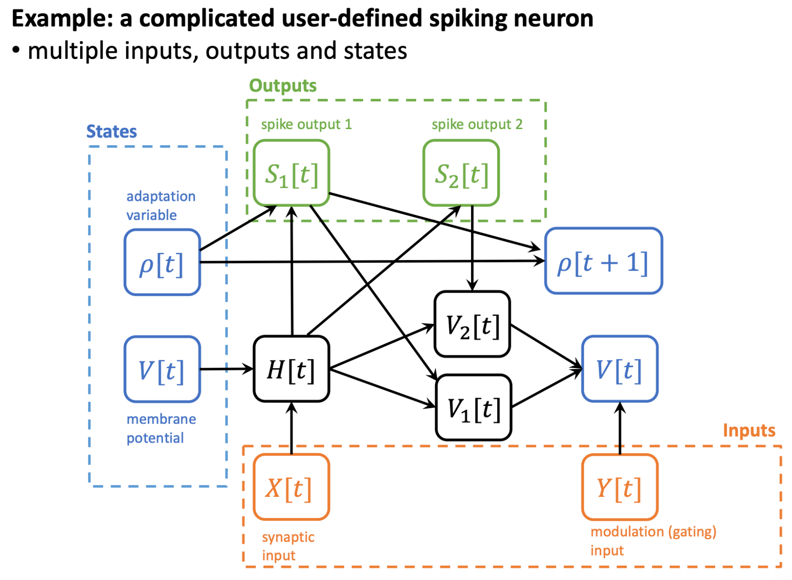

FlexSN
====================

Author: `Yifan Huang (AllenYolk) <https://github.com/AllenYolk>`_, `wei.fang <https://github.com/fangwei123456>`_

中文版: :doc:`../cn/flexsn`

This tutorial focuses on ``FlexSN``. If you have not read the Triton backend basics yet, it is recommended to read :doc:`./triton_backend` first to understand the usage and constraints of predefined Triton neuron kernels.

``FlexSN`` can generate high-performance multi-step kernels from a user-defined single-step neuronal dynamics function ``core``. For CUDA execution, ``backend="triton"`` and ``backend="inductor"`` are peer, equivalent backend labels in FlexSN; they currently dispatch the same maintained Triton scan implementation.

Using FlexSN to Customize Triton Neuron Kernels
-----------------------------------------------

Describing Neuronal Dynamics with Functions
^^^^^^^^^^^^^^^^^^^^^^^^^^^^^^^^^^^^^^^^^^^^

The discrete-time dynamics of most spiking neuron models can be described as:

.. math::

    Y_1[t], Y_2[t], \dots, V_1[t], V_2[t], \dots = f_s\left( X_1[t], X_2[t], \dots, V_1[t-1], V_2[t-1], \dots \right)

where :math:`Y_i` denotes outputs, :math:`V_i` denotes state variables, and :math:`X_i` denotes inputs. This equation can be described using a PyTorch function:

.. code:: python

    def single_step_inference(x1, x2, ..., v1, v2, ...):
        ...
        return y1, y2, ..., v1_updated, v2_updated, ...

Here, ``x1, x2, ...`` represent inputs, ``v1, v2, ...`` represent state variables, ``y1, y2, ...`` represent outputs, and ``v1_updated, v2_updated, ...`` represent the updated state variables (corresponding to ``v1, v2, ...``). For example, a soft-reset LIF neuron with non-decaying input (``tau=2``, ``v_th=1.0``, sigmoid surrogate function) can be described as:

.. code:: python

    from spikingjelly.activation_based import surrogate

    tau = 2.0 # time constant
    v_th = 1.0 # threshold
    spike_fn = surrogate.Sigmoid()

    def lif_single_step_inference(x, v):
        h = (1 - 1/tau) * v + x
        s = spike_fn(h - v_th)
        v = h - s * v_th
        return s, v

In this example, there is only one input, one output, and one state variable. For more complex neuron models, however, there may be multiple inputs, outputs, and state variables. In addition, the model hyperparameters ``tau``, ``v_th``, and ``spike_fn`` here are fixed global variables. To flexibly configure hyperparameters, **function closures** can be used:

.. code:: python

    from spikingjelly.activation_based import surrogate

    def lif_single_step_inference_closure(tau=2., v_th=1., spike_fn=surrogate.Sigmoid()):
        def lif_single_step_inference(x, v):
            h = (1 - 1/tau) * v + x
            s = spike_fn(h - v_th)
            v = h - s * v_th
            return s, v
        return lif_single_step_inference

    f = lif_single_step_inference_closure(tau=99., v_th=0.5)

FlexSN Workflow
^^^^^^^^^^^^^^^

Take the following customized spiking neuron as an example:

.. code:: python

    import torch
    from spikingjelly.activation_based import surrogate

    def complicated_lif_core_generator(beta: float, gamma: float, spike_fn=surrogate.ATan()):
        def complicated_lif_core(
            x: torch.Tensor, y: torch.Tensor, v: torch.Tensor, rho: torch.Tensor
        ):
            h = beta*v + x
            s1 = spike_fn(h - (rho+1.)) # spike, with threshold adaptation
            s2 = spike_fn(h - 1.)       # spike, without threshold adaptation
            rho = gamma*rho + s1        # adaptation variable update
            v1 = h * (1.-s1)            # hard reset
            v2 = h - s2                 # soft reset
            yy = torch.sigmoid(y)       # modulation factor
            v = v1*yy + v2 * (1.-yy)    # modulated reset
            return s1, s2, v, rho
        return complicated_lif_core

This model has two inputs ``x, y``, two outputs ``s1, s2``, and two state variables ``v, rho``. The dependency relationships among different variables are illustrated in the figure below:

To generate a multi-step Triton kernel, use :class:`FlexSN <spikingjelly.activation_based.neuron.flexsn.FlexSN>`:

.. code:: python

    from spikingjelly.activation_based import neuron

    f = neuron.FlexSN(
        core=complicated_lif_core_generator(beta=0.5, gamma=0.9),
        num_inputs=2,
        num_states=2,
        num_outputs=2,
        example_inputs=(
            torch.zeros([1], device="cuda"), torch.zeros([1], device="cuda"),
            torch.zeros([1], device="cuda"), torch.zeros([1], device="cuda"),
        ),
        requires_grad=(True, True, True, True),
        step_mode="m",
        backend="inductor",
        store_state_seqs=True,
    )

    x = torch.randn([16, 3, 32, 32], device="cuda")
    y = torch.randn([16, 3, 32, 32], device="cuda")
    s1, s2 = f(x, y)
    v, rho = f.state_seqs

    print(s1.mean()) # tensor(0.0821, device='cuda:0', grad_fn=<MeanBackward0>)
    print(s2.mean()) # tensor(0.1494, device='cuda:0', grad_fn=<MeanBackward0>)
    print(v.mean()) # tensor(-0.2750, device='cuda:0', grad_fn=<MeanBackward0>)
    print(rho.mean()) # tensor(0.4842, device='cuda:0', grad_fn=<MeanBackward0>)

The construction of :class:`FlexSN <spikingjelly.activation_based.neuron.flexsn.FlexSN>` requires the following arguments:

* ``core`` : a function that describes the single-step neuron dynamics, with the signature ``[*inputs, *states] -> [*outputs, *states]``.
* ``num_inputs, num_states, num_outputs`` : the numbers of inputs, state variables, and outputs, which should be consistent with the signature of ``core``.
* ``example_inputs`` : example arguments for ``core``. ``FlexSN`` will call ``core`` with these example inputs in order to capture the computation graph.
* ``requires_grad`` : whether the arguments of ``core`` require gradients. The default value is ``None``, which means that all arguments require gradients (i.e., equivalent to all ``True``).
* ``step_mode, backend`` : similar to other neuron modules, these two arguments determine the step mode and the backend. For FlexSN on CUDA, ``triton`` and ``inductor`` are equivalent backend labels, and both are only valid when ``step_mode="m"``.
* ``store_state_seqs`` : similar to ``store_v_seq`` in other neuron modules, this argument determines whether state sequences are stored. If ``True``, the state sequences from the last run can be accessed via the ``state_seqs`` attribute. This attribute is a list, where each element corresponds to the sequence of a specific state variable.

``FlexSN`` also supports backward propagation, as shown in the following code block:

.. code:: python

    n_inductor = neuron.FlexSN(
        core=complicated_lif_core_generator(beta=0.5, gamma=0.9),
        num_inputs=2,
        num_states=2,
        num_outputs=2,
        example_inputs=(
            torch.zeros([1], device="cuda"), torch.zeros([1], device="cuda"),
            torch.zeros([1], device="cuda"), torch.zeros([1], device="cuda"),
        ),
        requires_grad=(True, True, True, True),
        step_mode="m",
        backend="inductor",
        store_state_seqs=True,
    )

    n_torch = neuron.FlexSN(
        core=complicated_lif_core_generator(beta=0.5, gamma=0.9),
        num_inputs=2,
        num_states=2,
        num_outputs=2,
        example_inputs=(
            torch.zeros([1], device="cuda"), torch.zeros([1], device="cuda"),
            torch.zeros([1], device="cuda"), torch.zeros([1], device="cuda"),
        ),
        requires_grad=(True, True, True, True),
        step_mode="m",
        backend="torch",
        store_state_seqs=True,
    )

    x = torch.randn([16, 3, 32, 32], device="cuda")
    y = torch.randn([16, 3, 32, 32], device="cuda")
    x_inductor = x.clone().requires_grad_(True)
    y_inductor = y.clone().requires_grad_(True)
    x_torch = x.clone().requires_grad_(True)
    y_torch = y.clone().requires_grad_(True)

    s1_inductor, s2_inductor = n_inductor(x_inductor, y_inductor)
    s1_torch, s2_torch = n_torch(x_torch, y_torch)
    grad = torch.randn_like(s1_inductor)
    s1_inductor.backward(grad)
    s1_torch.backward(grad)

    v_inductor, rho_inductor = n_inductor.state_seqs
    v_torch, rho_torch = n_torch.state_seqs

    assert torch.allclose(s1_inductor, s1_torch)
    assert torch.allclose(s2_inductor, s2_torch)
    assert torch.allclose(x_inductor.grad, x_torch.grad, atol=1e-6, rtol=1e-6)
    assert torch.allclose(y_inductor.grad, y_torch.grad, atol=1e-6, rtol=1e-6)
    assert torch.allclose(v_inductor, v_torch, atol=1e-6, rtol=1e-6)
    assert torch.allclose(rho_inductor, rho_torch)
    print(s1_inductor.mean())
    print(s2_inductor.mean())
    print(x_inductor.grad.mean())
    print(y_inductor.grad.mean())
    print(v_inductor.mean())
    print(rho_inductor.mean())

All ``assert`` statements pass, and the outputs are shown below. This demonstrates that the Triton scan kernels used by ``FlexSN`` are equivalent to the original PyTorch function in both forward and backward propagation.

.. code:: text

    tensor(0.0821, device='cuda:0', grad_fn=<MeanBackward0>)
    tensor(0.1494, device='cuda:0', grad_fn=<MeanBackward0>)
    tensor(0.0007, device='cuda:0')
    tensor(6.2995e-05, device='cuda:0')
    tensor(-0.2750, device='cuda:0', grad_fn=<MeanBackward0>)
    tensor(0.4842, device='cuda:0', grad_fn=<MeanBackward0>)

With the workflow described above, users can obtain Triton-accelerated neuron models with very little code. Compared with the former ``auto_cuda`` module (see :doc:`./cupy_neuron`), ``FlexSN`` is more flexible and general.

.. admonition:: Note
    :class: note

    In the example above, the state variables ``v`` and ``rho`` use the default **zero initialization**. Users can override the ``init_states()`` method to change the state initialization rule. The original definition of this method is shown below, where ``*args`` represents the arguments of ``forward()``:

    .. code:: python

        class FlexSN(base.MemoryModule):

            ...

            @staticmethod
            def init_states(num_states: int, step_mode: str, *args) -> List[torch.Tensor]:
                if step_mode == "s":
                    return [torch.zeros_like(args[0]) for _ in range(num_states)]
                elif step_mode == "m":
                    return [torch.zeros_like(args[0][0]) for _ in range(num_states)]
                else:
                    raise ValueError(f"Unsupported step mode: {step_mode}")

    See :meth:`FlexSN.init_states <spikingjelly.activation_based.neuron.flexsn.FlexSN.init_states>` for details.

.. admonition:: Note
    :class: note

    :class:`FlexSN <spikingjelly.activation_based.neuron.flexsn.FlexSN>` implements most features of SpikingJelly's neuron modules.
    To call the generated kernels directly in a lightweight, transparent, and functional style, use :class:`FlexSNKernel <spikingjelly.activation_based.neuron.flexsn.FlexSNKernel>`.

.. admonition:: Warning
    :class: warning

    When using ``FlexSN``, please note the following:

    * It should be executed on a GPU.
    * The CUDA backend labels ``triton`` and ``inductor`` only support multi-step mode ``step_mode="m"``.
    * The PyTorch backend is implemented by repeatedly calling ``core``.
    * In the design of ``FlexSN``, compromises are made in efficiency in order to pursue generality. At present, ``IFNode``, ``LIFNode``, and ``PLIFNode`` are equipped with highly optimized predefined Triton kernels. Please use these predefined kernels whenever possible to obtain higher performance.
    * After completing a simulation with ``FlexSN``, ``reset()`` must be called to reset the neuron states.

FlexSN CUDA Backends
--------------------

``FlexSN`` exposes two equivalent CUDA backend labels, ``backend="triton"`` and ``backend="inductor"``. They are peers in the public API and currently share the same maintained Triton-based execution path. In practice, choose whichever label is clearer in your codebase; behavior and kernel generation are aligned.

Key properties:

* Integrates with ``torch.compile``, enabling cross-layer fusion with surrounding modules.
* Ships dedicated Triton kernels for both inference and training.
* Provides specialized final-state fast paths and HOP/eager fallbacks when dedicated kernels are unavailable.

.. admonition:: Important
   :class: warning

   * Only CUDA devices are supported.
   * Ops inside ``core`` must be in the ``FX_TO_TRITON`` table.
     Unsupported ops fall back to ``eager_scan`` with a WARNING log.
     See :ref:`Op Coverage <flexsn-inductor-op-coverage-en>` below for the full list.
   * For training, ``core`` should use a surrogate gradient
     (e.g. :class:`spikingjelly.activation_based.surrogate.Sigmoid`) instead
     of a hard threshold; hard thresholds yield zero gradients by design.

Quick Start — Inference
^^^^^^^^^^^^^^^^^^^^^^^

.. code:: python

    import torch
    import torch.nn as nn
    from spikingjelly.activation_based.neuron.flexsn import FlexSN

    def lif_core(x: torch.Tensor, v: torch.Tensor):
        tau, v_th = 2.0, 1.0
        h = v + (x - v) / tau
        s = (h >= v_th).to(h.dtype)
        return s, h * (1.0 - s)

    neuron = FlexSN(core=lif_core, num_inputs=1, num_states=1,
                    num_outputs=1, step_mode="m", backend="inductor").cuda()

    x = torch.randn(8, 64, 512, device="cuda")
    with torch.no_grad():
        out = neuron(x)   # no torch.compile required

    # Optional: wrap with torch.compile for cross-layer fusion
    model = nn.Sequential(nn.Linear(512, 512), neuron, nn.Linear(512, 512)).cuda()
    model = torch.compile(model, fullgraph=True)
    out = model(x)

Quick Start — Training
^^^^^^^^^^^^^^^^^^^^^^

Use a surrogate gradient to make spike signals differentiable:

.. code:: python

    import torch
    from spikingjelly.activation_based import surrogate
    from spikingjelly.activation_based.neuron.flexsn import FlexSN

    sg = surrogate.Sigmoid(alpha=4.0)

    def lif_core_sg(x: torch.Tensor, v: torch.Tensor):
        tau, v_th = 2.0, 1.0
        h = v + (x - v) / tau
        s = sg(h - v_th)        # Sigmoid surrogate gradient
        return s, h * (1.0 - s)

    neuron = FlexSN(core=lif_core_sg, num_inputs=1, num_states=1,
                    num_outputs=1, step_mode="m", backend="inductor").cuda()

    x = torch.randn(8, 64, 512, device="cuda", requires_grad=True)
    out = neuron(x)
    out.sum().backward()        # BPTT via dedicated Triton fwd+bwd kernels
    print(x.grad.shape)         # [8, 64, 512]

.. admonition:: torch.compile() is optional for training
   :class: tip

   ``backend="triton"`` and ``backend="inductor"`` both work with and without ``torch.compile``.
   When wrapped by ``torch.compile``, FlexSN can remain in the compiled graph
   and still dispatch its dedicated Triton scan kernels through the
   custom-op path. This is the mode to use when benchmarking cross-layer
   fusion with surrounding ``Linear`` / ``Conv`` modules.

Kernel Dispatch Strategy
^^^^^^^^^^^^^^^^^^^^^^^^

``multi_step_forward`` selects a path automatically based on context. The
``triton`` and ``inductor`` labels share the same CUDA dispatch logic:

.. list-table::
   :header-rows: 1
   :widths: 35 65

   * - Condition
     - Path
   * - Inference (no grad) + CUDA
     - Single Triton scan kernel (``tl.static_range(T)``, 1 launch)
   * - Training + CUDA (with or without ``torch.compile``)
     - Dedicated Triton forward/backward scan kernels; ``torch.compile`` can
       keep FlexSN in the compiled graph through the custom-op path
   * - CPU or kernels unavailable
     - ``eager_scan`` / ``flex_sn_scan`` HOP fallback

Supported Backends
^^^^^^^^^^^^^^^^^^

.. list-table::
   :header-rows: 1
   :widths: 24 22 22 32

   * - Backend
     - Device
     - Typical use
     - Notes
   * - ``"torch"``
     - CPU / CUDA
     - reference / debugging
     - Pure PyTorch multi-step loop
   * - ``"triton"`` / ``"inductor"``
     - CUDA
     - production CUDA path
     - Equivalent peer labels; both use the same dedicated Triton scan kernels and optional ``torch.compile``
   * - ``"hop"``
     - CPU / CUDA
     - scan/HOP experimentation
     - Higher-order-op / eager fallback path

Performance Notes
^^^^^^^^^^^^^^^^^

**Inference**: at initialization time, ``core`` is traced with ``make_fx`` and the FlexSN template generates a single Triton scan kernel with a ``tl.static_range(T)`` time loop. Every inference call triggers exactly one kernel launch regardless of T.

**Training (without torch.compile)**: at initialization time, ``aot_function`` traces both the forward and backward of ``core`` and compiles dedicated Triton forward and backward scan kernels, each with a ``tl.static_range(T)`` time loop; one kernel launch per direction regardless of T.

**Training with torch.compile**: the triton / inductor backend path exposes opaque custom ops for the generated kernels, allowing FlexSN to stay compiler-friendly while surrounding layers are jointly compiled.

When to Use Each Backend
^^^^^^^^^^^^^^^^^^^^^^^^

.. list-table::
   :header-rows: 1
   :widths: 30 30 40

   * - Scenario
     - Recommended backend
     - Reason
   * - Prototyping / CPU
     - ``"torch"``
     - No constraints
   * - CUDA inference, max throughput
     - ``"triton"`` or ``"inductor"``
     - Equivalent CUDA labels for the same single-kernel scan path
   * - CUDA training
     - ``"triton"`` / ``"inductor"`` + ``torch.compile()`` (optional)
     - Dedicated fwd+bwd scan kernels; compile adds cross-layer fusion opportunities
   * - Inference + cross-layer fusion
     - ``"triton"`` / ``"inductor"`` + ``torch.compile``
     - Single-kernel scan + joint compilation with surrounding Conv/Linear

.. _flexsn-inductor-op-coverage-en:

Op Coverage
^^^^^^^^^^^

The ``FX_TO_TRITON`` table currently covers the following ATen ops (supported for both inference and training):

.. list-table::
   :header-rows: 1
   :widths: 20 80

   * - Category
     - Ops
   * - Arithmetic
     - ``add``, ``sub``, ``mul``, ``div``, ``reciprocal``, ``neg``, ``rsub``
   * - Transcendentals
     - ``exp``, ``log``, ``log2``, ``sqrt``, ``rsqrt``, ``tanh``, ``sin``, ``cos``, ``erf``
   * - Rounding
     - ``floor``, ``ceil``, ``round``
   * - Activation / threshold
     - ``relu``, ``sigmoid``, ``sign`` / ``sgn``, ``abs``
   * - Comparisons
     - ``eq``, ``ne``, ``ge``, ``le``, ``gt``, ``lt``
   * - Logic / bitwise
     - ``logical_and`` / ``or`` / ``not``, ``bitwise_and`` / ``or`` / ``not``
   * - Binary math
     - ``minimum``, ``maximum``, ``pow``, ``fmod``
   * - Clamp
     - ``clamp``, ``clamp_min``, ``clamp_max``
   * - Type / construction
     - ``_to_copy`` (type cast), ``scalar_tensor``, ``zeros_like``, ``ones_like``
   * - Selection
     - ``where``, ``masked_fill``
   * - Backward-only
     - ``sigmoid_backward``, ``tanh_backward``, ``threshold_backward``
   * - Misc
     - ``clone``, ``detach``, ``spike_fn``

Ops not in this table (e.g. matrix ops, complex control flow) trigger ``eager_scan`` fallback with a WARNING log.
