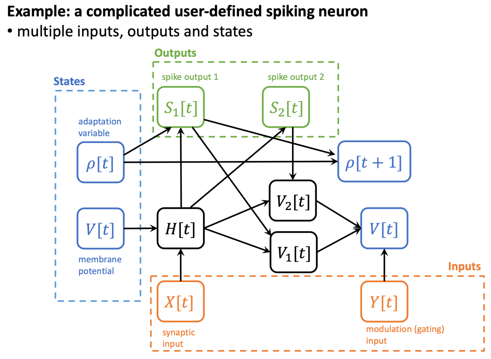

FlexSN
======

Authors: `Yifan Huang (AllenYolk) <https://github.com/AllenYolk>`_ and `Wei Fang <https://github.com/fangwei123456>`_

中文版： :doc:`../cn/flexsn`

``FlexSN`` turns a pure-PyTorch single-step neuron function into a stateful
SpikingJelly neuron and can generate a Triton kernel for multi-step CUDA
execution. See :doc:`./triton_backend` for the predefined IF, LIF, and PLIF
Triton backends.

Describing neuron dynamics with a function
------------------------------------------

Most spiking neurons can be written at one discrete time step as

.. math::

    Y_1[t], Y_2[t], \dots, V_1[t], V_2[t], \dots =
    f_s\left(X_1[t], X_2[t], \dots, V_1[t-1], V_2[t-1], \dots\right).

Here :math:`X_i` denotes an input, :math:`Y_i` an output, and :math:`V_i` a
state carried between time steps. ``FlexSN`` represents this equation with

.. code-block:: text

    core(*step_inputs, *states, *static_inputs)
        -> (*outputs, *updated_states)

The final ``num_states`` return values must update the input states in order.
For example, this function describes a soft-reset LIF neuron without input
decay:

.. code-block:: python

    import torch

    def lif_core(x: torch.Tensor, v: torch.Tensor):
        h = 0.5 * v + x
        spike = torch.sigmoid(h - 1.0)
        v = h - spike
        return spike, v

``core`` must be pure: it must not capture a Tensor or ``nn.Module``. Ordinary
numeric hyperparameters may live in a closure. Tensors that should train with
the model or appear in its ``state_dict`` belong in ``static_inputs``.

Building a neuron with several states
-------------------------------------

Consider a neuron with two inputs, two outputs, and two states. ``rho`` adapts
the threshold of the first output, while ``y`` blends hard and soft membrane
reset:

.. code-block:: python

    import torch

    def complicated_lif_core_generator(beta: float, gamma: float):
        def complicated_lif_core(
            x: torch.Tensor,
            y: torch.Tensor,
            v: torch.Tensor,
            rho: torch.Tensor,
        ):
            h = beta * v + x
            s1 = torch.sigmoid(h - (rho + 1.0))
            s2 = torch.sigmoid(h - 1.0)
            rho = gamma * rho + s1
            v_hard = h * (1.0 - s1)
            v_soft = h - s2
            modulation = torch.sigmoid(y)
            v = v_hard * modulation + v_soft * (1.0 - modulation)
            return s1, s2, v, rho

        return complicated_lif_core

The first two returns are outputs; the last two update ``v`` and ``rho``:

The constructor takes the state count. FlexSN infers input and output arities
from the signature and one construction-time call with unit tensors, so example
inputs are not needed:

.. code-block:: python

    from spikingjelly.activation_based import neuron

    f = neuron.FlexSN(
        core=complicated_lif_core_generator(beta=0.5, gamma=0.9),
        num_states=2,
        step_mode="m",
        backend="triton",
        store_state_seqs=True,
    ).cuda()

    x = torch.randn([16, 3, 32, 32], device="cuda")
    y = torch.randn([16, 3, 32, 32], device="cuda")
    s1, s2 = f(x, y)
    v_seq, rho_seq = f.state_seqs
    final_v, final_rho = f.states

    print(s1.shape, s2.shape)
    print(v_seq.shape, rho_seq.shape)
    print(final_v.shape, final_rho.shape)

``forward`` returns a Tensor for one output and a tuple for several outputs.
``states`` and ``state_seqs`` are always tuples. Call ``reset()`` after each
independent sequence to clear managed state.

Managed and functional state
----------------------------

``forward`` initializes, updates, and stores state automatically.
Use ``functional_forward`` when state ownership belongs to the caller. It does
not modify the module's ``states``:

.. code-block:: python

    f_torch = neuron.FlexSN(
        core=complicated_lif_core_generator(beta=0.5, gamma=0.9),
        num_states=2,
        backend="torch",
    )
    initial_states = (
        torch.zeros_like(x[0]),
        torch.zeros_like(x[0]),
    )
    (s1, s2), (final_v, final_rho) = f_torch.functional_forward(
        (x, y), initial_states, static_inputs=()
    )
    assert f_torch.states == (None, None)

States default to zero tensors shaped like one step of the first input. Override
``init_states`` when a model needs a different rule:

.. code-block:: python

    class NonzeroFlexSN(neuron.FlexSN):
        @staticmethod
        def init_states(num_states, step_mode, *inputs):
            reference = inputs[0] if step_mode == "s" else inputs[0][0]
            return tuple(torch.ones_like(reference) for _ in range(num_states))

Static inputs
-------------

Tensors reused at every time step are passed through ``static_inputs``.
Parameters are registered as parameters and other tensors as buffers; both are
included in ``state_dict``. The PLIF dynamics below use a trainable
membrane-decay parameter:

.. code-block:: python

    def plif_core(x, v, w):
        reciprocal_tau = w.sigmoid()
        h = v + reciprocal_tau * (x - v)
        spike = torch.sigmoid(h - 1.0)
        return spike, h * (1.0 - spike)

    w = torch.nn.Parameter(torch.tensor(0.0))
    plif = neuron.FlexSN(
        plif_core,
        num_states=1,
        static_inputs=(w,),
        backend="torch",
    )

A functional call supplies static values explicitly, so it can use another
value without replacing the module parameter:

.. code-block:: python

    x_seq = torch.randn(8, 4)
    v0 = (torch.zeros_like(x_seq[0]),)
    outputs, states = plif.functional_forward(
        (x_seq,), v0, static_inputs=(torch.tensor(1.0),)
    )

A static tensor must be a scalar or have the same number of elements as one
input step. Arbitrary broadcasting is not supported.

Checking forward and backward
-----------------------------

``backend="torch"`` is the reference implementation. For a new dynamics
function, compare Torch and Triton outputs, final states, state trajectories,
and input gradients:

.. code-block:: python

    core = complicated_lif_core_generator(beta=0.5, gamma=0.9)
    n_torch = neuron.FlexSN(
        core, 2, backend="torch", store_state_seqs=True
    ).cuda()
    n_triton = neuron.FlexSN(
        core, 2, backend="triton", store_state_seqs=True
    ).cuda()

    x = torch.randn([16, 3, 32, 32], device="cuda")
    y = torch.randn([16, 3, 32, 32], device="cuda")
    x_torch = x.clone().requires_grad_(True)
    y_torch = y.clone().requires_grad_(True)
    x_triton = x.clone().requires_grad_(True)
    y_triton = y.clone().requires_grad_(True)

    s1_torch, s2_torch = n_torch(x_torch, y_torch)
    s1_triton, s2_triton = n_triton(x_triton, y_triton)
    grad = torch.randn_like(s1_torch)
    s1_torch.backward(grad)
    s1_triton.backward(grad)

    torch.testing.assert_close(s1_triton, s1_torch)
    torch.testing.assert_close(s2_triton, s2_torch)
    torch.testing.assert_close(n_triton.states, n_torch.states)
    torch.testing.assert_close(n_triton.state_seqs, n_torch.state_seqs)
    torch.testing.assert_close(x_triton.grad, x_torch.grad)
    torch.testing.assert_close(y_triton.grad, y_torch.grad)

Backends and ``torch.compile``
------------------------------

``FlexSN`` provides three backends:

.. list-table::
   :header-rows: 1
   :widths: 18 18 64

   * - Backend
     - Device
     - Use
   * - ``"torch"``
     - CPU / CUDA
     - Reference implementation; supports single- and multi-step execution
   * - ``"hop"``
     - CPU / CUDA
     - Compiler-visible scan for multi-step execution and whole-model compilation
   * - ``"triton"``
     - CUDA
     - Generated multi-step forward and backward kernels

The HOP path can be passed directly to ``torch.compile``:

.. code-block:: python

    model = neuron.FlexSN(lif_core, 1, backend="hop")
    compiled_model = torch.compile(model, fullgraph=True)
    output = compiled_model(torch.randn(8, 64, 512))

The Triton path builds its runtime from the dtype and device of the first real
CUDA input. No example tensor is required at construction. The enclosing model
may still be compiled:

.. code-block:: python

    import torch.nn as nn

    flex = neuron.FlexSN(lif_core, 1, backend="triton").cuda()
    model = nn.Sequential(
        nn.Linear(512, 512),
        flex,
        nn.Linear(512, 512),
    ).cuda()
    model = torch.compile(model, fullgraph=True)
    output = model(torch.randn(8, 64, 512, device="cuda"))

An unsupported ``core`` operation or a Triton build failure raises an error. It
does not silently switch to HOP or Torch, so selecting the accelerated backend
cannot unknowingly execute another path.

Limits and migration
--------------------

* The leading dimension of a multi-step input is time ``T``; ``T == 0`` is rejected.
* ``hop`` and ``triton`` require ``step_mode="m"``.
* Changing backend or step mode preserves final states and clears derived
  ``state_seqs``.
* The old ``num_inputs``, ``num_outputs``, ``example_inputs``,
  ``example_outputs``, and ``requires_grad`` constructor arguments are removed.
* ``FlexSNKernel`` and ``FlexSN.kernel`` are removed. Use
  ``functional_forward`` for explicit-state execution.
