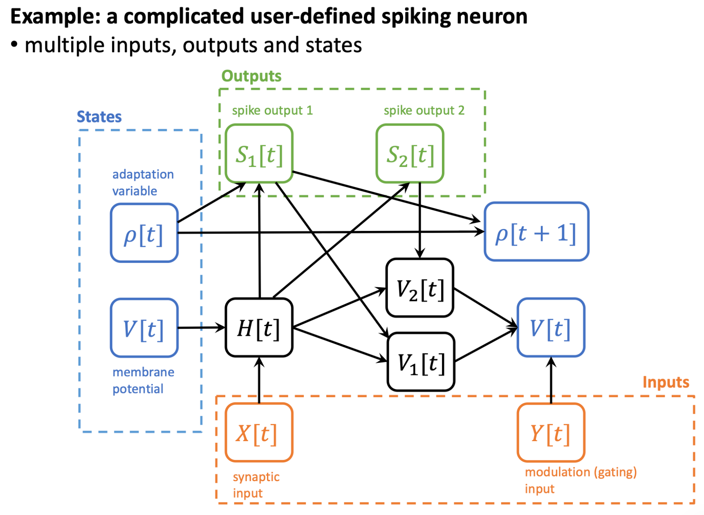

FlexSN
======

Authors: `Yifan Huang (AllenYolk) <https://github.com/AllenYolk>`_ and `Wei Fang <https://github.com/fangwei123456>`_

中文版： :doc:`../cn/flexsn`

``FlexSN`` turns a pure-PyTorch single-step neuron function into a stateful
SpikingJelly neuron and can generate a Triton kernel for multi-step CUDA
execution. See :doc:`./triton_backend` for device-based neuron execution.

Use FlexSN for custom multi-step neurons and public neuron/functional interfaces
for fixed neurons. The old Auto CUDA translator and neuron code-generation
templates have been removed.

.. note::

    The ``torch.sigmoid`` examples produce continuous outputs to demonstrate
    composition and gradients. Built-in LIF uses a step forward and surrogate
    backward, so these outputs are not equivalent. Construction runs the core
    on unit tensors. Keep it pure, without captured tensors or modules, and pass
    parameters through ``static_inputs``.

Describing neuron dynamics with a function
------------------------------------------

Most spiking neurons can be written at one discrete time step as

.. math::

    Y_1[t], Y_2[t], \dots, V_1[t], V_2[t], \dots =
    f_s\left(X_1[t], X_2[t], \dots, V_1[t-1], V_2[t-1], \dots\right).

Here :math:`X_i` denotes an input, :math:`Y_i` an output, and :math:`V_i` a
state carried between time steps. ``FlexSN`` represents this equation with

.. code-block:: text

    core(*step_inputs, *states, *static_inputs)
        -> (*outputs, *updated_states)

The final ``num_states`` return values must update the input states in order.
For example, this function describes a soft-reset LIF neuron without input
decay:

.. code-block:: python

    import torch

    def lif_core(x: torch.Tensor, v: torch.Tensor):
        h = 0.5 * v + x
        spike = torch.sigmoid(h - 1.0)
        v = h - spike
        return spike, v

``core`` must be pure: it must not capture a Tensor or ``nn.Module``. Ordinary
numeric hyperparameters may live in a closure. Tensors that should train with
the model or appear in its ``state_dict`` belong in ``static_inputs``.

Building a neuron with several states
-------------------------------------

Consider a neuron with two inputs, two outputs, and two states. ``rho`` adapts
the threshold of the first output, while ``y`` blends hard and soft membrane
reset:

.. code-block:: python

    import torch

    def complicated_lif_core_generator(beta: float, gamma: float):
        def complicated_lif_core(
            x: torch.Tensor,
            y: torch.Tensor,
            v: torch.Tensor,
            rho: torch.Tensor,
        ):
            h = beta * v + x
            s1 = torch.sigmoid(h - (rho + 1.0))
            s2 = torch.sigmoid(h - 1.0)
            rho = gamma * rho + s1
            v_hard = h * (1.0 - s1)
            v_soft = h - s2
            modulation = torch.sigmoid(y)
            v = v_hard * modulation + v_soft * (1.0 - modulation)
            return s1, s2, v, rho

        return complicated_lif_core

The first two returns are outputs; the last two update ``v`` and ``rho``:

Pass the state count to the constructor. FlexSN infers the input and output
counts from the signature and one call with unit tensors, without example
inputs:

.. code-block:: python

    from spikingjelly.activation_based import neuron

    f = neuron.FlexSN(
        core=complicated_lif_core_generator(beta=0.5, gamma=0.9),
        num_states=2,
        step_mode="m",
        store_state_seqs=True,
    ).cuda()

    x = torch.randn([16, 3, 32, 32], device="cuda")
    y = torch.randn([16, 3, 32, 32], device="cuda")
    s1, s2 = f(x, y)
    v_seq, rho_seq = f.state_seqs
    final_v, final_rho = f.states

    print(s1.shape, s2.shape)
    print(v_seq.shape, rho_seq.shape)
    print(final_v.shape, final_rho.shape)

``forward`` returns a Tensor for one output and a tuple for several outputs.
``states`` and ``state_seqs`` are always tuples. Call ``reset()`` after each
independent sequence to clear managed state.

Managed and functional state
----------------------------

``forward`` initializes, updates, and stores state automatically.
Use ``functional_forward`` when state ownership belongs to the caller. It does
not modify the module's ``states``:

.. code-block:: python

    f_torch = neuron.FlexSN(
        core=complicated_lif_core_generator(beta=0.5, gamma=0.9),
        num_states=2,
    )
    initial_states = (
        torch.zeros_like(x[0]),
        torch.zeros_like(x[0]),
    )
    (s1, s2), (final_v, final_rho) = f_torch.functional_forward(
        (x, y), initial_states, static_inputs=()
    )
    assert f_torch.states == (None, None)

States default to zero tensors shaped like one step of the first input. Override
``init_states`` when a model needs a different rule:

.. code-block:: python

    class NonzeroFlexSN(neuron.FlexSN):
        @staticmethod
        def init_states(num_states, step_mode, *inputs):
            reference = inputs[0] if step_mode == "s" else inputs[0][0]
            return tuple(torch.ones_like(reference) for _ in range(num_states))

Static inputs
-------------

Tensors reused at every time step are passed through ``static_inputs``.
Parameters are registered as parameters and other tensors as buffers; both are
included in ``state_dict``. The PLIF dynamics below use a trainable
membrane-decay parameter:

.. code-block:: python

    def plif_core(x, v, w):
        reciprocal_tau = w.sigmoid()
        h = v + reciprocal_tau * (x - v)
        spike = torch.sigmoid(h - 1.0)
        return spike, h * (1.0 - spike)

    w = torch.nn.Parameter(torch.tensor(0.0))
    plif = neuron.FlexSN(
        plif_core,
        num_states=1,
        static_inputs=(w,),
    )

A functional call supplies static values explicitly, so it can use another
value without replacing the module parameter:

.. code-block:: python

    x_seq = torch.randn(8, 4)
    v0 = (torch.zeros_like(x_seq[0]),)
    outputs, states = plif.functional_forward(
        (x_seq,), v0, static_inputs=(torch.tensor(1.0),)
    )

A static tensor must be a scalar or have the same number of elements as one
input step. Arbitrary broadcasting is not supported.

Automatic execution and ``torch.compile``
-----------------------------------------

FlexSN selects its execution automatically. CPU uses the Torch implementation.
On CUDA, supported cores use the generated Triton kernels; known unsupported
compositions use the Torch/HOP path. The constructor has no backend argument.

.. code-block:: python

    import torch.nn as nn
    from spikingjelly.activation_based import neuron

    flex = neuron.FlexSN(lif_core, 1).cuda()
    model = nn.Sequential(nn.Linear(512, 512), flex, nn.Linear(512, 512)).cuda()
    compiled = torch.compile(model, fullgraph=True)
    output = compiled(torch.randn(8, 64, 512, device="cuda"))

A supported CUDA core compiles when it first receives a real CUDA input. An
unsupported operation or a kernel error after selection is reported directly.

Limits and migration
--------------------

* The leading dimension of a multi-step input is time ``T``; ``T == 0`` is rejected.
* Single-step mode executes the core directly; automatic CUDA fusion targets multi-step mode.
* Changing step mode preserves final states and clears derived ``state_seqs``.
* The old ``num_inputs``, ``num_outputs``, ``example_inputs``,
  ``example_outputs``, and ``requires_grad`` constructor arguments are removed.
* ``FlexSNKernel`` and ``FlexSN.kernel`` are removed. Use
  ``functional_forward`` for explicit-state execution.

Training and state management
-----------------------------

This training example uses trainable static inputs and stores full state traces.
Reset independent batches after backward and parameter updates; retain state
for continuous sequences. The final explicit-state call leaves module memory
unchanged:

.. code-block:: python

    import torch
    from spikingjelly.activation_based import neuron

    def smooth_core(x, v, w):
        h = v + w.sigmoid() * (x - v)
        output = torch.sigmoid(h - 1.0)
        return output, h * (1.0 - output)

    device = torch.device("cuda:0" if torch.cuda.is_available() else "cpu")
    node = neuron.FlexSN(
        smooth_core,
        1,
        static_inputs=(torch.nn.Parameter(torch.tensor(0.0)),),
        store_state_seqs=True,
    ).to(device)
    optimizer = torch.optim.SGD(node.parameters(), lr=0.01)
    x = torch.rand(4, 2, 8, device=device, requires_grad=True)
    output = node(x)
    assert node.state_seqs[0].shape == x.shape
    (output.sum() + node.states[0].sum()).backward()
    assert node.static_inputs[0].grad is not None
    optimizer.step()
    node.reset()
    assert node.states == (None,)
    # Explicit-state calls return output/state tuples without changing managed state.
    outputs, states = node.functional_forward(
        (x.detach(),), (torch.zeros_like(x[0]),), static_inputs=node.static_inputs
    )
    assert outputs[0].shape == x.shape and states[0].shape == x.shape[1:]
    assert node.states == (None,)
