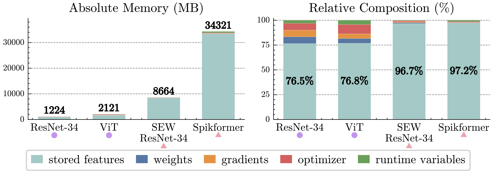
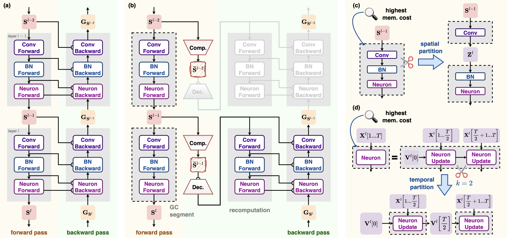
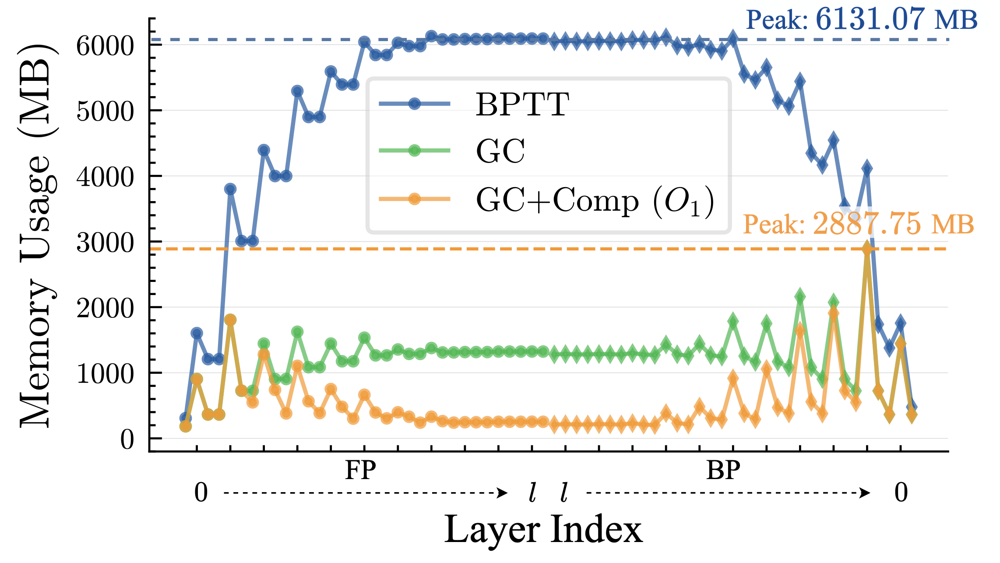

Training Memory Optimization
=========================================

Author: `Yifan Huang (AllenYolk) <https://github.com/AllenYolk>`_

中文版： :doc:`../cn/memopt`

Our new work `Towards Lossless Memory-efficient Training of Spiking Neural Networks via Gradient Checkpointing and Spike Compression <https://openreview.net/forum?id=nrBJ0Uvj7c>`_ was published at ICLR 2026. In this work, we propose an automatic memory optimization tool for deep SNN training based on gradient checkpointing and spike compression (source code available on `GitHub <https://github.com/AllenYolk/snn-gradient-checkpointing>`_). With only a few extra lines of code, users can significantly reduce training memory consumption for deep SNNs while keeping accuracy intact and speed slowdown acceptable.

The toolkit is available in ``spikingjelly.activation_based.memopt`` with interfaces for manual checkpointing, automatic search, and distributed training.

Method Overview
++++++++++++++++++++++++

Memory Footprint Analysis
-------------------------

As shown in Fig. 1, the peak training memory cost of SNNs is far larger than that of ANNs with similar architectures. **Intermediate features** (light blue bars) account for more than 96% of SNN peak training memory; these features are cached during the forward pass so they can be reused in the backward pass when computing gradients. Therefore, reducing the memory footprint of intermediate features is the key to lowering SNN training memory.

	Fig. 1. Memory breakdown at the peak memory moment when training various ANNs and SNNs on ImageNet [#huang2026gc]_.

If we view a deep SNN as a stack of **"weight-norm-neuron" modules** (simply called **"layers"** below), the intermediate features can be divided into two parts:

1. **Inputs**: usually binary spike tensors. There are exceptions, such as floating-point network inputs or possible non-binary integers in SEW ResNet [#fang2021sew]_.
2. **Internal states**: intermediate results inside weights and normalization layers, as well as neuron internal states.

Gradient Checkpointing + Spike Compression
------------------------------------------

To reduce the memory footprint of **internal states**, we can apply **gradient checkpointing (GC)** [#chen2016gc]_ to every layer. Concretely, during the forward pass of layer :math:`l`, we only cache its input :math:`\mathbf{S}^{l-1}` together with the necessary weights; all internal states are discarded immediately after they are computed. During the backward pass of layer :math:`l`, we recompute the layer's forward using :math:`\mathbf{S}^{l-1}` and the weights to reconstruct internal states before computing gradients. This ensures that at most one layer's internal states live in memory at any time, drastically lowering the peak memory. We call a layer processed this way, which only caches inputs, a **GC segment**. Compared with a normal layer, a GC segment requires an extra forward pass, so training becomes slower.

Even with layer-wise gradient checkpointing, every layer's **input** still needs to be cached. Most deep SNN layers take binary spike tensors as their inputs, yet frameworks like spikingjelly store binary tensors using floating-point dtypes (``float32``, ``float16``, ...). This guarantees computational compatibility but wastes memory. To fix this, we perform **lossless spike compression** before caching each layer input: the binary floating-point tensor :math:`\mathbf{S}^{l-1}` is compressed into a compact representation :math:`\tilde{\mathbf{S}}^{l-1}` before caching; during recomputation, we decompress :math:`\tilde{\mathbf{S}}^{l-1}` to losslessly recover :math:`\mathbf{S}^{l-1}`. Experiments show that bit-based compressors (one bit per 0/1 value) offer the best balance between speed and compression ratio, so they serve as the default spike compressor.

Fig. 2(b) illustrates the forward/backward workflow after applying gradient checkpointing plus spike compression. Refer to Algorithm 1 in the original paper for more details [#huang2026gc]_.

	Fig. 2. Method flowchart. Gray rectangles with dashed black borders denote GC segments [#huang2026gc]_.

Adaptive Adjustment of Checkpoint Structures
---------------------------------------------------------------

After applying per-layer gradient checkpointing and spike compression, the memory evolution within one training iteration looks like the orange curve in Fig. 3. Although the peak is already far lower than vanilla BPTT (blue curve), the global peak is still much higher than the temporary memory usage in other layers. To address this, we design a series of checkpoint splitting strategies. These strategies shrink the size of critical GC segments at the cost of caching more inputs. Additionally, we selectively revert some GC segments back to normal layers to slightly increase temporary memory but speed up training without raising the peak memory. The procedure is:

1. **Spatial splitting**: Locate the GC segment corresponding to peak memory and split it spatially into two smaller segments. Repeat this until peak memory can no longer be reduced. See Fig. 2(c).
2. **Temporal splitting**: Locate the peak memory segment and split it along the time dimension into :math:`k` smaller segments. Repeat until no further memory reduction. See Fig. 2(d).
3. **Greedy restoration**: Measure the forward time of every GC segment and sort them in descending order. Try reverting each segment back to a normal layer. If peak memory does not increase after a restoration, keep it; otherwise undo the change.

See Algorithm 2 in the original paper for more details [#huang2026gc]_.

	Fig. 3. Memory usage during one training iteration of Spiking VGG on CIFAR10-DVS [#huang2026gc]_.

.. note::

    Spatial splitting is always tried before temporal splitting. That is, **temporal splitting is only a supplementary strategy**. That's because temporal splitting is not compatible with temporal parallelism, and it prevents kernel fusion across time steps (a kernel that originally fused :math:`T` steps must turn into :math:`k` kernels that each handles :math:`T/k` steps), which slows things down.

Usage Guide
++++++++++++++++++++++++

Choose an Entry Point
---------------------

``memopt`` has two entry points:

* Use ``checkpoint`` or ``checkpoint_module`` when you know which part of the
  network should be recomputed.
* Use ``optimize_memory`` when you want memopt to search for a checkpoint layout.

Start with manual checkpoints when possible. They are direct and require no
search. ``optimize_memory`` packages the paper's automatic strategy as an
optional high-level preset.

Set Checkpoints Manually
------------------------

Use :func:`checkpoint <spikingjelly.activation_based.memopt.checkpoint>` with a
function or any other callable:

.. code-block:: python

    from spikingjelly.activation_based import memopt

    y = memopt.checkpoint(block, x)

When the recomputation region matches a module boundary, use
:func:`checkpoint_module
<spikingjelly.activation_based.memopt.checkpoint_module>`:

.. code-block:: python

    model.blocks[2] = memopt.checkpoint_module(model.blocks[2])

``checkpoint_module`` preserves parameter objects, parameter names, and
``state_dict`` keys, so the same weights work before and after wrapping. It also
passes neuron state explicitly. Buffers such as BatchNorm running statistics are
updated once per training iteration, not again during backward recomputation.

Compress Checkpoint Inputs
--------------------------

A checkpoint still has to save its inputs. If the first positional tensor is a
spike tensor, it can be compressed at the same time:

.. code-block:: python

    model.spike_block = memopt.checkpoint_module(
        model.spike_block,
        compressor=memopt.BitSpikeCompressor(),
    )

The built-in compressors cover the common storage formats:

* ``BitSpikeCompressor`` packs eight binary spikes into one byte.
* ``BooleanSpikeCompressor`` stores binary spikes as ``bool``.
* ``Uint8SpikeCompressor`` stores integer spikes representable as ``uint8``.
* ``SparseSpikeCompressor`` stores nonzero positions and suits very sparse binary
  spikes.

Bit, Boolean, and Sparse compression require values that are exactly zero or one.
Memopt does not validate values when you choose a compressor manually. Using one
of these compressors on ordinary floating-point activations changes the values.

Custom compressors must inherit ``SpikeCompressor`` and implement ``compress`` and
``decompress``. For example, when every input is an integer spike in the int16
range:

.. code-block:: python

    class Int16SpikeCompressor(memopt.SpikeCompressor):
        def compress(self, tensor):
            return tensor.short(), tensor.dtype

        def decompress(self, payload):
            tensor, dtype = payload
            return tensor.to(dtype)

Put per-call metadata, including shape, dtype, and device, in the payload rather
than on the compressor instance. This keeps one compressor safe to use from
concurrent calls.

Split Work Along Time
---------------------

``checkpoint_module`` can process a sequence in several temporal chunks:

.. code-block:: python

    model.neuron = memopt.checkpoint_module(
        model.neuron,
        chunks=2,
        chunked_args=(0,),
        time_dim=0,
    )

Temporal chunking changes execution order. Use it only when processing chunks in
sequence preserves the module's behavior. Standard multi-step neurons carry state
between chunks and fit this model. Training BatchNorm, attention across time, and
operations that depend on whole-sequence statistics usually do not.

All chunked inputs must have the same nonzero temporal length, and ``chunks``
cannot exceed that length. Tensor outputs are concatenated along ``time_dim``.
Non-tensor outputs must be identical for every chunk.

Use the Automatic Preset
------------------------

:func:`optimize_memory <spikingjelly.activation_based.memopt.optimize_memory>`
modifies the model in place and returns the same object. This example assumes the
model defines ``ResidualBlock``:

.. code-block:: python

    import torch
    from spikingjelly.activation_based import memopt, neuron

    def split_residual(module):
        if isinstance(module, ResidualBlock):
            return module.conv, module.neuron
        return ()

    sample = torch.zeros(4, 8, 128, device="cuda")
    model.cuda()
    memopt.optimize_memory(
        model,
        targets=ResidualBlock,
        example_forward=lambda current: current(sample),
        level=3,
        checkpoint_budget="balanced",
        split_fn=split_residual,
        can_chunk=lambda module: isinstance(module, neuron.BaseNode),
    )

``example_forward`` should match real training in shape, dtype, device, and
training mode, and it must return at least one differentiable floating-point
tensor. The search only sees this run, so use a representative sample.

``level`` controls how far the search goes. Each level includes the one before it:

``0``
    Make no changes. ``example_forward`` is not required.
``1``
    Observe the first tensor input to each target and checkpoint the modules with
    the largest inputs first.
``2``
    Use ``split_fn`` to try several smaller checkpoints in place of one large
    checkpoint. Keep a split only when peak memory falls.
``3``
    Try temporal chunking on checkpoints for which ``can_chunk`` returns ``True``.
``4``
    Measure checkpoint forward cost and remove expensive checkpoints when doing so
    does not raise the current peak memory.

``checkpoint_budget`` controls how many level-1 candidates are selected.
``"speed"``, ``"balanced"``, and ``"memory"`` select 50%, 75%, and 100%
respectively. Candidates are ordered by input size, with model order breaking
ties.

When ``compress`` is enabled, the preset uses bit compression only if every rank
in the relevant process group observes a strictly binary input. ``split_fn`` must
return at least two non-overlapping registered descendants, or an empty tuple when
it does not apply. ``can_chunk`` should accept only modules that are genuinely
safe to split along time.

Levels 2-4 run forward and backward repeatedly. They are intended as a one-time
search before training and require both the model and sample on CUDA. After each
trial, memopt restores random-number state, buffers, neuron state, and existing
gradients. A change is reverted after an OOM or when it fails to reduce peak
memory.

Distributed Training
--------------------

Call ``optimize_memory`` before wrapping the model with DDP or FSDP. With pipeline
parallelism, ``process_group`` must contain every DP and TP rank for the current
pipeline stage. All ranks must call the function in the same order. Memopt
combines their observations so every rank builds the same structure.

The built-in distributed Vision training path creates this group and exposes
``memopt_level``, ``memopt_checkpoint_budget``, and
``memopt_compress_inputs``. Input compression is enabled only when the model recipe
guarantees strictly binary candidate inputs. MCore training exposes the level and
budget settings, but its Transformer path checkpoints only predefined module
boundaries. It does not force spatial or temporal splitting into the Transformer.

Evaluation, prediction, generation, and model export omit training-time
checkpoint wrappers. Because ``checkpoint_module`` preserves ``state_dict``
keys, inference does not need a weight conversion step.

Neuron Backends and ``torch.compile``
-------------------------------------

Memopt does not replace the neuron backend. Torch, CuPy, and Triton neurons can
run inside a checkpoint when their functional forward path supports the selected
backend. A custom backend that does not support this path will not become
compatible just by adding memopt. Before a full training run, test forward and
backward with the actual model, dtype, backend, and distributed topology.

``memopt.checkpoint`` uses PyTorch's non-reentrant checkpoint.
The uncompressed, Boolean-compressed, and bit-compressed paths support
``torch.compile(..., fullgraph=True)``. Sparse payload size depends on the input
and may require dynamic shapes during compilation.

Measured Performance
--------------------

These results were measured on 2026-08-29 with the ``memopt`` implementation in
SpikingJelly 2.0.0rc1, not with data from the paper repository. Every
configuration started in a new process and ran three times. Tables report the
median and the minimum-to-maximum range in parentheses.
Memory comes from ``torch.cuda.max_memory_allocated``, not reserved memory. The
single- and two-GPU measurements use different Vast.ai on-demand instances, so
each subsection gives its own software environment.

Simple Single-GPU Case
^^^^^^^^^^^^^^^^^^^^^^

The single-GPU model has three ``Linear-IF-Linear-IF`` blocks. Its FP32 input has
shape ``[T=16, N=512, C=512]``. The host used one 24 GiB RTX 4090 with PyTorch
2.11.0 and CUDA 12.8. Each run warms up for 10 steps and measures 50:

.. code-block:: bash

    CUDA_VISIBLE_DEVICES=0 python benchmark/benchmark_memopt.py \
        --model-kind block --T 16 --N 512 --C 512 \
        --warmup 10 --iters 50

.. list-table:: Single-GPU training results
    :header-rows: 1

    * - level
      - peak memory (MiB)
      - versus level 0
      - time per step (ms)
      - one-time search (ms)
    * - 0
      - 462.3
      - --
      - 48.9 (47.9--50.3)
      - --
    * - 1
      - 249.3
      - -46.1%
      - 93.5 (66.5--95.1)
      - 66.4
    * - 2
      - 249.3
      - -46.1%
      - 66.5 (65.5--67.0)
      - 833.2
    * - 3
      - 249.3
      - -46.1%
      - 66.8 (65.4--67.5)
      - 684.9
    * - 4
      - 248.8
      - -46.2%
      - 60.1 (59.8--60.3)
      - 1687.5

Deeper spatial and temporal searches did not reduce memory further on this
workload. Level 4 reduced the median step time from level 1's 93.5 ms to 60.1 ms
at the same memory level. Search runs once inside ``optimize_memory`` and is not
included in step time.

Two-GPU Case
^^^^^^^^^^^^

The distributed host had two 24 GiB RTX 4090 GPUs without NVLink. Its software
stack was PyTorch 2.13.0+cu130, CUDA 13.0, and NCCL 2.29.7. The workload is DDP2
SEW-ResNet34 with BF16, ``T=4``, and random synthetic 224 × 224 inputs.
Calibration started at a local batch of 64 and increased it in steps of eight.
The baseline peak was 9.71 GiB at batch 72 and 10.75 GiB at batch 80, so the
formal runs use a local batch of 80 and global batch of 160.

Each run executes 60 steps, discards the first 10 for timing, and measures the
remaining 50. The baseline uses ``memopt_level=0``. The memopt run uses level 1
with its default memory budget. The default ``ADD`` residual does not guarantee
strictly binary block inputs, so this model does not apply bit compression:

.. code-block:: bash

    torchrun --standalone --nproc-per-node=2 benchmark/vision_distributed.py \
        --model sew-resnet34 --dataset synthetic --data-parallel ddp \
        --precision bf16 --time-steps 4 --image-size 224 --classes 1000 \
        --batch-size 80 --samples 9600 --workers 0 \
        --max-steps 60 --timing-warmup-steps 10 --memopt-level 1

Change the final argument to ``--memopt-level 0`` to reproduce the baseline.

.. list-table:: Two-GPU DDP training results
    :header-rows: 1

    * - configuration
      - peak memory per GPU (GiB)
      - versus baseline
      - total throughput (images/s)
    * - baseline
      - 10.75 (10.75--10.75)
      - --
      - 595.3 (594.0--595.6)
    * - memopt level 1
      - 6.20 (6.20--6.20)
      - -42.3%
      - 482.8 (481.6--486.6)

The baseline and memopt loss matched in all three runs. Level 1 reduced peak
allocated memory per GPU by 42.3% and reduced total throughput by 18.9%. These
changes belong to this workload. Rerun the benchmark with the real model,
inputs, and topology before a full training job.

Migrate from the Previous API
-----------------------------

.. list-table::
    :header-rows: 1

    * - Previous API
      - Replacement
    * - ``input_compressed_gc``
      - ``checkpoint(..., compressor=...)``
    * - ``GCContainer`` / ``TCGCContainer``
      - ``checkpoint_module``
    * - ``memory_optimization``
      - ``optimize_memory``
    * - Module-side ``__spatial_split__``
      - Pass ``split_fn`` to ``optimize_memory``

The previous mutable compressor base class, summary/profile objects, and
compatibility aliases are no longer available.

.. [#huang2026gc] Huang, Y., Fang, W., Hao, Z., Ma, Z., & Tian Y. (2026). Towards Lossless Memory-efficient Training of Spiking Neural Networks via Gradient Checkpointing and Spike Compression. The Fourteenth International Conference on Learning Representations.
.. [#fang2021sew] Fang, W., Yu, Z., Chen, Y., Huang, T., Masquelier, T., & Tian, Y. (2021). Deep residual learning in spiking neural networks. Advances in neural information processing systems, 34, 21056-21069.
.. [#chen2016gc] Chen, T., Xu, B., Zhang, C., & Guestrin, C. (2016). Training deep nets with sublinear memory cost. arXiv preprint arXiv:1604.06174.
