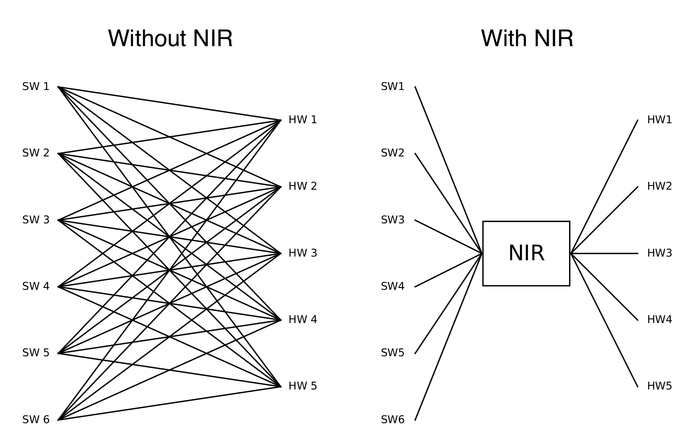

Export to and Import from NIR
###################################

Author: `Yifan Huang (AllenYolk) <https://github.com/AllenYolk>`_

中文版： :doc:`../cn/nir_exchange`

`Neuromorphic intermediate representation (NIR) <https://neuroir.org/docs/index.html>`_ is a set of computational primitives that describes SNN modules and their connections in the form of graphs (nodes and edges), and is designed to be shared across different neuromorphic frameworks and technology stacks. At present, NIR `is supported by multiple simulators and hardware platforms <https://neuroir.org/docs/support.html>`_. SpikingJelly ``0.0.0.1.0`` introduces the ``nir_exchange`` package, which enables (under certain conditions) bidirectional conversion between SpikingJelly models and NIR graphs. By leveraging NIR as an intermediate representation, users can easily perform hardware deployment and framework migration.

    Image source: `What is the Neuromorphic Intermediate Representation (NIR)? <https://neuroir.org/docs/what.html>`_

The ``nir_exchange`` package provides two key interfaces:

* :func:`export_to_nir <spikingjelly.activation_based.nir_exchange.to_nir.export_to_nir>` : export a SpikingJelly model to an NIR graph;
* :func:`import_from_nir <spikingjelly.activation_based.nir_exchange.from_nir.import_from_nir>` : convert an NIR graph to a SpikingJelly model.

This tutorial provides a detailed introduction to these two functions.

.. note::

    ``nir_exchange`` package depends on ``nir`` and ``nir_exchange``. Install them using ``pip`` :

    .. code:: shell

        pip install nir nir_exchange

From SpikingJelly to NIR
============================

Due to limited development resources and the fact that NIR itself can only represent a small number of module types, the current :func:`export_to_nir <spikingjelly.activation_based.nir_exchange.to_nir.export_to_nir>` function supports conversion only for the following SpikingJelly / PyTorch modules:

* ``torch.nn.Linear``, :class:`layer.Linear <spikingjelly.activation_based.layer.Linear>`
* ``torch.nn.Conv2d``, :class:`layer.Conv2d <spikingjelly.activation_based.layer.Conv2d>`
* ``torch.nn.AvgPool2d``, :class:`layer.AvgPool2d <spikingjelly.activation_based.layer.AvgPool2d>`
* ``torch.nn.Flatten``, :class:`layer.Flatten <spikingjelly.activation_based.layer.Flatten>`
* :class:`IFNode <spikingjelly.activation_based.neuron.IFNode>`
* :class:`LIFNode <spikingjelly.activation_based.neuron.LIFNode>` and :class:`ParametricLIFNode <spikingjelly.activation_based.neuron.ParametricLIFNode>`

Consider the following SNN model as an example:

.. code:: python

    import torch.nn as nn
    from spikingjelly.activation_based import layer, neuron

    net = nn.Sequential(
        layer.Conv2d(3, 16, 3, 1, 1, step_mode="s"),
        neuron.IFNode(),
        nn.AvgPool2d((2, 2)),
        layer.Flatten(step_mode="s"),
        nn.Linear(4096, 10),
        neuron.ParametricLIFNode(10., decay_input=False, v_reset=None),
    )

To demonstrate compatibility, this example deliberately mixes native PyTorch stateless layers ``nn.AvgPool2d, nn.Linear`` with the SpikingJelly-wrapped stateless layers ``layer.Conv2d, layer.Flatten``. In addition, two neuron models, ``neuron.IFNode`` and ``neuron.ParametricLIFNode``, are used in this example.

By calling :func:`export_to_nir <spikingjelly.activation_based.nir_exchange.to_nir.export_to_nir>`, the above model can be converted into an NIR graph and saved as an HDF5 file:

.. code:: python

    import torch
    from spikingjelly.activation_based import nir_exchange

    graph = nir_exchange.export_to_nir(
        net,
        example_input=torch.rand(8, 3, 32, 32),
        save_path="./example.h5",
        dt=1e-4
    )
    print(graph)

The meanings of the parameters of :func:`export_to_nir <spikingjelly.activation_based.nir_exchange.to_nir.export_to_nir>` are as follows:

* ``net``: the SpikingJelly model;
* ``example_input``: an example input to the model, used to determine the input and output shapes of submodules;
* ``save_path``: the path to the HDF5 file used to save the NIR graph (if ``None``, the graph is not saved);
* ``dt``: the simulation time step used in NIR. It is recommended to set this value to ``1e-4`` in order to align with other frameworks that support NIR.

After execution, a file named ``example.h5`` will appear in the current directory, containing the NIR graph. The output printed in the terminal is roughly as follows:

.. code:: text

    NIRGraph(
        nodes={
            'input_1': Input(input_type={'input': array([ 3, 32, 32])}, metadata={}),

            '_0': Conv2d(input_shape=(32, 32), weight=array(...), stride=(1, 1), padding=(1, 1), dilation=(1, 1), groups=1, bias=array(...), metadata={}),

            '_1': IF(r=array(...), v_threshold=array(...), v_reset=array(...), input_type={'input': array([16, 32, 32])}, output_type={'output': array([16, 32, 32])}, metadata={}),

            '_2': AvgPool2d(kernel_size=(2, 2), stride=(2, 2), padding=0, metadata={}),

            '_3': Flatten(input_type={'input': array([16, 16, 16])}, start_dim=0, end_dim=-1, output_type={'output': array([4096])}, metadata={}),

            '_4': Affine(weight=array(...), bias=array(...), input_type={'input': array([4096])}, output_type={'output': array([10])}, metadata={}),

            '_5': LIF(tau=array(...), r=array(...), v_leak=array(...), v_threshold=array(...), v_reset=array(...), input_type={'input': array([10])}, output_type={'output': array([10])}, metadata={}),

            'output': Output(output_type={'output': array([10])}, metadata={})
        },

        edges=[
            ('input_1', '_0'), ('_0', '_1'), ('_1', '_2'), ('_2', '_3'),
            ('_3', '_4'), ('_4', '_5'), ('_5', 'output')
        ],

        input_type={'input_1': array([ 3, 32, 32])},
        output_type={'output': array([10])},
        metadata={}
    )

Here, only the structure of the ``NIRGraph`` is shown. As can be seen, an NIR graph consists of nodes (``nodes``) and edges (``edges``). Nodes correspond to SNN modules, while edges indicate the input-output relationships between nodes.

.. note::

    The original ``ParametricLIFNode`` in the model is converted into a ``nir.LIF`` node. This is reasonable because once the membrane time constant ``tau`` is fixed, a PLIF neuron degenerates into an LIF neuron.

.. note::

    Unlike PyTorch and SpikingJelly models, most nodes in an ``NIRGraph`` explicitly contain **input and output shape** information. For example, the ``'_3': Flatten(...)`` node in the above example specifies an input shape of ``[16, 16, 16]`` and an output shape of ``[4096]``; the ``'_5': LIF(...)`` node has both input and output shapes equal to ``[10]``. Clearly, the shape information in an NIR graph does not include the time dimension ``T`` or the batch dimension ``B``. In other words, NIR **describes the model structure for a single sample at a single time step only**.

    Submodules in PyTorch / SpikingJelly models do not carry input-output shape information, whereas NIR graphs require it. To obtain such shape information, :func:`export_to_nir <spikingjelly.activation_based.nir_exchange.to_nir.export_to_nir>` requires the user to provide ``example_input``. ``example_input`` may include a time or batch dimension, depending on the requirements of the PyTorch / SpikingJelly model. Internally, :func:`export_to_nir <spikingjelly.activation_based.nir_exchange.to_nir.export_to_nir>` invokes PyTorch’s `ShapeProp <https://github.com/pytorch/pytorch/blob/main/torch/fx/passes/shape_prop.py>`_ utility to infer input and output shapes.

From NIR to SpikingJelly
==========================

The function :func:`import_from_nir <spikingjelly.activation_based.nir_exchange.from_nir.import_from_nir>` converts an existing NIR graph into a SpikingJelly model. Using the NIR graph generated in the previous section as an example

.. code:: python

    gm = nir_exchange.import_from_nir(graph="./example.h5", dt=1e-4)
    print(gm)
    x = torch.rand(9, 3, 32, 32) # [B, C, H, W]
    y = gm(x) # forward pass
    print("y.shape =", y[0].shape) # y is a tuple; the 2nd element is each layer's state

Here, the arguments of :func:`import_from_nir <spikingjelly.activation_based.nir_exchange.from_nir.import_from_nir>` means:

* ``graph``: If a string is provided, it is interpreted as the path to an HDF5 file that stores an NIR graph; the function will load the ``NIRGraph`` from this file. If an ``NIRGraph`` object is provided, it will be used directly.
* ``dt``: The simulation time step of the NIR graph. This parameter should be consistent with the ``dt`` argument of :func:`export_to_nir <spikingjelly.activation_based.nir_exchange.to_nir.export_to_nir>`.

This function returns a ``torch.fx.GraphModule`` object, which can be invoked directly like a ``torch.nn.Module`` to perform forward propagation. The forward pass returns a tuple: the first element is the model output, and the second element is a dictionary of internal states of the submodules (which is unnecessary in most cases). The terminal output of the above code block is approximately

.. code:: text

    GraphModule(
      (_0): Conv2d(16, 3, kernel_size=(3, 3), stride=(1, 1), padding=(1, 1), step_mode=s)
      (_1): IFNode(
        v_threshold=1.0, v_reset=0.0, detach_reset=False, step_mode=s, backend=torch
        (surrogate_function): Sigmoid(alpha=4.0, spiking=True)
      )
      (_2): AvgPool2d(kernel_size=(2, 2), stride=(2, 2), padding=0, step_mode=s)
      (_3): Flatten(start_dim=1, end_dim=-1, step_mode=s)
      (_4): Linear(in_features=4096, out_features=10, bias=True)
      (_5): LIFNode(
        v_threshold=1.0, v_reset=0.0, detach_reset=False, step_mode=s, backend=torch, tau=10.0
        (surrogate_function): Sigmoid(alpha=4.0, spiking=True)
      )
    )

    def forward(self, input, state : typing_Dict[str,typing_Any] = {'_0': None, '_1': None, '_2': None, '_3': None, '_4': None, '_5': None, 'input_1': None, 'output': None}):
        ones = torch.ones(1);  ones = None
        input_1 = input
        _0 = self._0(input_1);  input_1 = None
        _1 = self._1(_0);  _0 = None
        _2 = self._2(_1);  _1 = None
        _3 = self._3(_2);  _2 = None
        _4 = self._4(_3);  _3 = None
        _5 = self._5(_4);  _4 = None
        return (_5, state)

    # To see more debug info, please use `graph_module.print_readable()`

    y.shape = torch.Size([9, 10])

As shown above, the NIR graph is correctly converted into a SpikingJelly model. All stateless layers in the model are instantiated from classes in ``spikingjelly.activation_based.layer`` and support configurable step modes (see the ``step_mode`` attribute).

Currently, :func:`import_from_nir <spikingjelly.activation_based.nir_exchange.from_nir.import_from_nir>` supports only the following NIR node types.

* ``nir.Linear``, ``nir.Affine``
* ``nir.Conv2d``
* ``nir.AvgPool2d``
* ``nir.Flatten``
* ``nir.IF``
* ``nir.LIF``

.. note::

    :func:`import_from_nir <spikingjelly.activation_based.nir_exchange.from_nir.import_from_nir>` also provides the ``dtype``, ``device``, and ``step_mode`` arguments, which control the data type, device, and step mode of the returned SpikingJelly model. For example, a multi-step SpikingJelly model can be obtained as follows.

    .. code:: python

        gm = nir_exchange.import_from_nir(
            "./example.h5", dt=1e-4, step_mode="m"
        )
        print(gm)
        x = torch.rand(7, 9, 3, 32, 32) # [T, B, C, H, W]
        y = gm(x)
        print("y.shape =", y[0].shape)

