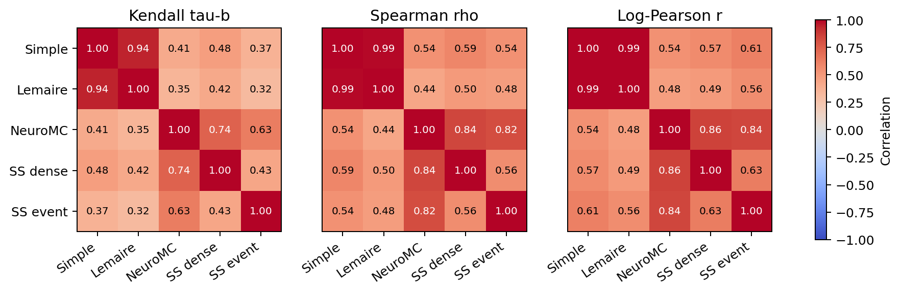

Operation Counters and Energy Estimation
=========================================

Author: `Yifan Huang (AllenYolk) <https://github.com/AllenYolk>`_

中文版： :doc:`../cn/op_counter`

This tutorial covers ``spikingjelly.activation_based.op_counter``. It counts
FLOPs, memory accesses, SynOps, MACs, and ACs during one execution, then uses
those counts to estimate energy. Results depend on input shape, spike sparsity,
and ``train``/``eval`` mode, so profile a configuration that represents the
target workload.

Overview
++++++++++++++++++++++++

Runtime Counting Modes
----------------------

``op_counter`` observes runtime calls through three context managers:

* ``DispatchCounterMode`` intercepts ATen operators;
* ``FunctionCounterMode`` intercepts ``torch.*`` functions;
* ``ModuleCounterMode`` records executed ``nn.Module`` forward and backward events.

The modes are active only inside their contexts and do not modify the model.
Multiple counters can observe the same execution. Unlike static shape analysis,
runtime counting distinguishes binary spikes from dense activations and reflects
changes in input sparsity and execution stage.

Basic Counting Workflow
++++++++++++++++++++++++

Using ``DispatchCounterMode``
------------------------------

1. instantiate one or more counters;
2. run one real forward or forward-backward pass inside ``DispatchCounterMode``;
3. read per-scope counts from ``get_counts()`` or the global total from ``get_total()``.

Both ``train()`` and ``eval()`` can be counted. For modules such as dropout or
batch normalization, use the mode that matches the target workload.

.. code-block:: python

    import torch
    import torch.nn as nn
    from spikingjelly.activation_based import neuron, op_counter

    model = nn.Sequential(
        nn.Linear(8, 16, bias=False),
        neuron.IFNode(),
        nn.Linear(16, 4, bias=False),
    )
    x = (torch.rand(2, 8) > 0.5).float()

    flop_counter = op_counter.FlopCounter()
    mem_counter = op_counter.MemoryAccessCounter()

    with op_counter.DispatchCounterMode(
        [flop_counter, mem_counter],
        strict=False,
    ):
        _ = model(x)

    print("FLOPs:", flop_counter.get_total())
    print("Memory access (bytes):", mem_counter.get_total())
    print("Global FLOP record:", flop_counter.get_counts()["Global"])

The package logger emits per-operation ``DEBUG`` records. They can be expensive
on large models, so enable them only while diagnosing counts:

.. code-block:: python

    from spikingjelly.logger import logger

    logger.enable("spikingjelly")

The dispatch examples use ``strict=False`` and skip unsupported auxiliary
operators. After confirming coverage, use ``strict=True`` to fail on unsupported
operators.

Using ``ModuleCounterMode``
---------------------------

Module-counter rule keys are ``("forward" | "backward", module_type)``.
``ModuleCounterMode`` manages hooks, scopes, and exception cleanup, but does not
reset counters. Scopes start with ``Global``, followed by the root module type
and qualified child paths.

.. code-block:: python

    memory_counter = op_counter.NeuromorphicMemoryAccessCounter()
    with op_counter.ModuleCounterMode(
        [memory_counter], model=model, strict=True
    ):
        _ = model(x)

    print(memory_counter.get_counts()["Global"])

After any mode exits, call ``mode.get_unsupported(counter)`` to inspect subjects
skipped by a non-strict run.

Available Counters
-------------------

* :class:`FlopCounter <spikingjelly.activation_based.op_counter.flop.FlopCounter>`:
  counts floating-point operations. It is useful for ANN-style compute intensity analysis.
* :class:`MemoryAccessCounter <spikingjelly.activation_based.op_counter.memory_access.MemoryAccessCounter>`:
  counts runtime memory traffic in bytes.
* :class:`SynOpCounter <spikingjelly.activation_based.op_counter.synop.SynOpCounter>`:
  counts spike-driven synaptic additions. Dense floating-point inputs do not contribute to SynOps.
* :class:`MACCounter <spikingjelly.activation_based.op_counter.mac.MACCounter>`:
  counts multiply-accumulate operations.
* :class:`ACCounter <spikingjelly.activation_based.op_counter.ac.ACCounter>`:
  counts addition-like arithmetic work that is not modeled as MAC.

The counters measure different work. A spike-driven linear layer may produce
SynOps and ACs but no MACs. ``SynOpCounter`` counts only binary spike inputs;
dense floating-point inputs produce zero SynOps.

.. code-block:: python

    import torch
    import torch.nn as nn
    from spikingjelly.activation_based import op_counter

    model = nn.Linear(8, 4, bias=False)
    spike_x = (torch.rand(2, 8) > 0.5).float()

    synop_counter = op_counter.SynOpCounter()
    with op_counter.DispatchCounterMode([synop_counter], strict=False):
        _ = model(spike_x)

    print("SynOps:", synop_counter.get_total())

Roofline Analysis Example
--------------------------

The following example counts FLOPs, memory access, and arithmetic intensity for
one training step. Remove ``backward()`` for inference.

.. code-block:: python

    import torch
    import torch.nn as nn
    from spikingjelly.activation_based import op_counter

    model = nn.Sequential(
        nn.Conv2d(2, 4, kernel_size=3, padding=1, bias=False),
        nn.Conv2d(4, 8, kernel_size=3, padding=1, bias=False),
    )
    x = torch.rand(1, 2, 16, 16)

    flop_counter = op_counter.FlopCounter()
    mem_counter = op_counter.MemoryAccessCounter()

    with op_counter.DispatchCounterMode([flop_counter, mem_counter], strict=False):
        y = model(x)
        y.sum().backward()

    flops = flop_counter.get_total()
    mem_bytes = mem_counter.get_total()
    intensity = flops / mem_bytes if mem_bytes > 0 else float("inf")

    print("total FLOPs:", flops)
    print("total memory access (bytes):", mem_bytes)
    print("arithmetic intensity (FLOPs/byte):", intensity)

The result is the workload point for a roofline chart; combine it with hardware
peak FLOPs and bandwidth. The counts use an idealized model: two FLOPs per MAC,
one read per logical input, and one write per logical output. They exclude
tiling, caches, fusion, bank conflicts, and physical DRAM traffic.

High-Level Energy Models
++++++++++++++++++++++++

Model Overview
--------------

``op_counter`` exposes four high-level entry points and five energy regimes:

* ``estimate_simple_energy``: simple runtime MAC/AC/memory energy;
* ``estimate_lemaire_energy``: Lemaire-aligned analytical forward inference energy;
* ``estimate_neuromc_runtime_energy``: runtime NeuroMC-style energy;
* ``estimate_spikesim_energy``: runtime SpikeSim dense or event Conv2d energy.

Simple Energy and SpikeSim event are defined by SpikingJelly. Lemaire follows
the paper; NeuroMC and SpikeSim dense follow author models. Source-conformance
evaluation covers Lemaire, NeuroMC, and SpikeSim dense. Simple Energy and
SpikeSim event have no independent external reference.

.. list-table::
    :header-rows: 1

    * - Estimator
      - Main purpose
      - Covers
      - Main boundary
    * - ``estimate_simple_energy``
      - normalized runtime energy comparison
      - MAC, AC, weight/bias reads, and persistent neuron-state accesses
      - excludes signal flow, FIFOs, routing, addressing, and hardware mapping
    * - ``estimate_lemaire_energy``
      - forward SNN inference estimate aligned with Lemaire-style formulas
      - ops, addressing, runtime-sized memory traffic, neuron-state traffic
      - forward inference only; analytical estimate, not hardware simulation
    * - ``estimate_neuromc_runtime_energy``
      - runtime energy for forward, backward, and optimizer stages
      - compute and memory under NeuroMC-like mapping rules
      - covers only supported fragments and stage semantics
    * - ``estimate_spikesim_energy``
      - SpikeSim-style Conv2d accelerator estimate
      - Conv2d stage energy with SpikeSim coefficients
      - only for supported Conv2d inference stages; not a general full-model energy estimator

The five regimes use different costs and hardware assumptions. Do not
compare their absolute values.

Every report exposes ``model_info`` with a stable model ID, sources, technology,
precision, scope, and fidelity. ``config`` (``memory_config`` for NeuroMC) records
the actual cost configuration. ``paper`` and ``reference-code`` identify upstream
parity, ``source-aligned`` identifies an upstream-cost runtime adapter, and
``spikingjelly-defined`` identifies a formula specified by this project. Report
the estimator, execution stages, cost configuration, input type, and sparsity.

Simple Runtime Energy
---------------------

``estimate_simple_energy`` runs one forward pass and converts runtime counts with
``MAC * E_MAC + AC * E_AC + bytes * E_memory``.

Its main assumptions are:

* ``NeuromorphicMemoryAccessCounter`` independently counts weights and biases
  that are actually used, plus one read and one write per timestep for persistent
  neuron states;
* input currents and output spikes are treated as on-chip signal flow, not memory;
* it does not model FIFOs, addressing, routing, cache reuse, or hardware mapping;
* ``SynOps`` is an auxiliary subset of AC and is not charged a second time;
* defaults use Horowitz 2014 FP32 arithmetic and STEP Table 9's
  ``24.96 pJ/byte`` memory cost; SpikingJelly defines the traffic formula;
* FP16 and INT8 presets change arithmetic costs but do not quantize the model.

Lemaire Analytical Inference Energy
------------------------------------

``estimate_lemaire_energy`` runs one forward pass and maps synaptic operations,
MAC/AC work, addressing, neuron state, and per-layer SRAM accesses to the
Lemaire equations. Its main limits are:

* forward inference only;
* analytical estimation, not cycle-accurate hardware simulation;
* operations and accesses keep the paper's fixed 32-bit regime regardless of the
  host tensor dtype;
* parameter, FIFO, and potential accesses are priced against each layer's local
  SRAM capacity before energy is aggregated;
* binary inputs use the SNN event formulas, while sparse non-binary inputs remain
  on the dense FNN path;
* grouped and depthwise convolutions use output channels per group for spike fanout;
* neuron modules are limited to the paper's IF/LIF scope; other ``BaseNode`` types
  are rejected by default;
* SNN FIFOs hold 1000 messages by default; override
  ``snn_fifo_capacity_elements`` for another assumption;
* ``strict=True`` is the default and rejects unsupported transposed convolutions;
  explicitly setting it to ``False`` warns and omits them.

NeuroMC Runtime Energy
-----------------------

``estimate_neuromc_runtime_energy`` profiles real execution fragments and maps
them through the fixed NeuroMC weight-stationary FE/BE/WE mapping and v1 cost
table. Results follow the executed branches, call counts, and tensor shapes;
unexecuted modules do not enter the report.

The author code uses ZigZag to derive MAC, partial-sum, and memory traffic from
static workloads and mappings. SpikingJelly does not invoke ZigZag at runtime;
it applies the same fixed 16x16 weight-stationary mapping to captured fragments.
Both paths use the same loop dimensions, data-movement rules, and cost constants.
The runtime calculation depends on fragment shapes, not network names or layer IDs.

The convenience function always runs forward. Adding
``target`` and ``loss_fn`` runs backward; adding ``optimizer`` also estimates
the optimizer stage. Use
:class:`NeuroMCEnergyProfiler <spikingjelly.activation_based.op_counter.neuromc.core.NeuroMCEnergyProfiler>`
for manual stages.

Its main limits are:

* unsupported energy-bearing operators reject totals;
* manual profiling passes mapping semantics explicitly with
  ``stage(name, phase=..., reuse_weights=..., batch_norm_backward=...)``; a stage
  name reused in one context must keep the same options;
* the convenience function clears existing gradients but does not call
  ``optimizer.step()`` or update parameters;
* repeated calls to one module must all participate in backward; selective
  backward through only some calls is rejected as ambiguous;
* results come from a hardware model, not measurements from a real chip.

SpikeSim Runtime Energy
-----------------------

``estimate_spikesim_energy`` counts executed Conv2d inference stages. The default
``dense`` mode uses the author-code PE-cycle formula; ``event`` uses a sparse
formula defined by SpikingJelly. Here, ``dense`` means charging the full PE
cycles for an executed convolution; it does not mean a fully connected layer,
and zero-valued inputs do not reduce its energy. Its main limits are:

* the model should be in ``eval`` mode; with the default ``strict=True``,
  unsupported Conv2d stages and empty reports fail;
* only supported Conv2d forward stages enter the main energy path;
* with the default ``activity_mode="dense"``, runtime spike sparsity does not reduce energy;
* ``activity_mode="event"`` selects ``spikingjelly_spikesim_event_v1``
  model using SpikeSim constants and SpikingJelly's documented A/R/Z sparse formula;
* ``require_if_lif_neurons=True`` accepts only IF/LIF-style neurons.

Energy Estimation Example
+++++++++++++++++++++++++++++++++++

Simple Energy Example
---------------------

Run inference estimators after ``model.eval()``. The first example uses Simple
Energy:

.. code-block:: python

    import torch
    import torch.nn as nn
    from spikingjelly.activation_based import op_counter

    model = nn.Linear(8, 4, bias=False).eval()
    x = torch.rand(2, 8)

    report = op_counter.estimate_simple_energy(model, x)

    print("total energy (pJ):", report.energy_total_pj)
    print("compute energy (pJ):", report.energy_compute_pj)
    print("MAC energy (pJ):", report.energy_mac_pj)
    print("AC energy (pJ):", report.energy_ac_pj)
    print("memory energy (pJ):", report.energy_memory_pj)
    print("counts:", report.counts)

Select another cost regime explicitly:

.. code-block:: python

    cfg = op_counter.SimpleEnergyConfig(
        cost_config=op_counter.SimpleEnergyCostConfig.fp16()
    )
    report_fp16 = op_counter.estimate_simple_energy(model, x, config=cfg)
    print("FP16-regime energy (pJ):", report_fp16.energy_total_pj)

The Lemaire estimator also includes addressing and neuron state:

.. code-block:: python

    import torch
    import torch.nn as nn
    from spikingjelly.activation_based import neuron, op_counter

    model_snn = nn.Sequential(
        nn.Linear(8, 16, bias=False),
        neuron.IFNode(),
        nn.Linear(16, 4, bias=False),
    ).eval()
    spike_x = (torch.rand(2, 8) > 0.5).float()

    lemaire_report = op_counter.estimate_lemaire_energy(model_snn, spike_x)
    print("Lemaire total (pJ):", lemaire_report.total_pj)
    print("Lemaire breakdown:", lemaire_report.breakdown_pj)

Validation and Sources
++++++++++++++++++++++

Primary Sources
---------------

* Simple arithmetic costs: `Horowitz 2014 <https://doi.org/10.1109/ISSCC.2014.6757323>`_;
  memory coefficient: `STEP Table 9 <https://openreview.net/pdf?id=SzwU2XrXIS>`_.
* Lemaire: `An Analytical Estimation of Spiking Neural Networks Energy Efficiency
  <https://arxiv.org/abs/2210.13107>`_.
* SpikeSim dense: author-code commit
  `c2627bc <https://github.com/Intelligent-Computing-Lab-Yale/SpikeSim/commit/c2627bc091a47bdcb630ca6207eaf44a00bd1da4>`_.
* NeuroMC: author-code commit
  `712c66f <https://github.com/dayanhn/NeuroMC/commit/712c66f47cf76ae530a55f8bcad3858bd68788de>`_.

Source-Model Conformance
------------------------

This benchmark checks conformance with the source models, not hardware accuracy.
Each case records one
``(E_origin, E_SJ)`` pair. SpikeSim and NeuroMC use pinned author code. Lemaire
has no public code, so its reference values follow equations (1)--(20).

SpikeSim and Lemaire cases come from parameter grids in the script. NeuroMC
covers all FE, BE, and WE fragments from the official S-ResNet-18, S-ResNet-50,
and S-VGG-16 workloads, for 786 cases in total. SpikingJelly runs the matching
PyTorch forward or backward execution; author modules are reloaded before each
case to avoid shared mutable state.

Lemaire did not publish source code; the paper states that code and models are
available from the authors on request. For FC cases, ``theta_in`` is the observed
input-spike count. Equation (2) multiplies this value by ``N_in`` again, unlike
the definition and Eqs. (8), (10), (15), and (17). This benchmark counts one
``N_out`` fanout per observed input spike.

Kendall's tau-b is the primary metric, with a paired 2,000-sample 95% bootstrap
interval. Spearman's rho and log-Pearson ``r`` are secondary metrics. Raw P90
measures absolute symmetric error without calibration. Scale-adjusted P90
removes the median multiplicative scale and is used only to diagnose shape
error. NeuroMC FE, BE, WE, and aggregate results must all satisfy
``tau-b >= 0.90``, raw ``P90 <= 1.50x``, and median scale within
``[0.80x, 1.25x]``.

* **Kendall's tau-b** compares the ordering of every pair of cases. ``1`` means
  identical ordering, ``0`` means no consistent ranking association, and
  ``-1`` means completely reversed ordering.
* **Spearman's rho** correlates the ranks of the two score sets. It also ranges
  from ``-1`` to ``1`` and is more sensitive than tau-b to how far individual
  cases move in the ranking.
* The **raw P90 symmetric factor** is the empirical 90th percentile of
  ``exp(abs(log(E_SJ / E_origin)))``. ``1.0x`` is ideal; ``1.5x`` places that
  percentile between ``1 / 1.5`` and ``1.5`` times the reference value.
* The **scale-adjusted P90 symmetric factor** applies the same calculation
  after removing the median log ratio. Comparing it with raw P90 separates a
  mostly fixed scale bias from workload-dependent shape error.

.. list-table:: Validation results
   :header-rows: 1
   :widths: 18 11 21 11 11 12 14 14

   * - Estimator mode
     - Comparable cases
     - Kendall tau-b (95% bootstrap interval)
     - Spearman rho
     - Log-Pearson r
     - Raw P90 factor
     - Scale-adjusted P90
     - Median scale E_SJ/E_origin
   * - Lemaire
     - 288
     - 1.00 [1.00, 1.00]
     - 1.00
     - 1.00
     - 1.00x
     - 1.00x
     - 1.00x
   * - SpikeSim dense
     - 216
     - 1.00 [1.00, 1.00]
     - 1.00
     - 1.00
     - 1.00x
     - 1.00x
     - 1.00x
   * - NeuroMC
     - 786
     - 1.00 [1.00, 1.00]
     - 1.00
     - 1.00
     - 1.00x
     - 1.00x
     - 1.00x

Each NeuroMC phase contains 262 fragments. Raw P90 is ``1.000x`` for FE,
``1.001x`` for BE, and ``1.000x`` for WE; all three phase tau-b and median-scale
values round to ``1.000``, and both phase-level and aggregate results pass the
gates. All 288 Lemaire cases also pass. SpikeSim's 216 cases match because the
dense runtime directly implements the author formula.

**Limitations:**

* The NeuroMC implementation and reference share the same author model. This is
  a conformance check, not independent validation.
* All references are analytical-model outputs, not hardware measurements.
* Coverage remains incomplete: published equations reconstruct Lemaire because
  no author code is public;
  NeuroMC BN and optimizer formulas, Simple Energy, and SpikeSim event have no
  independent end-to-end external estimator.

Cross-Validation on Real Networks
---------------------------------

The cross-validation runs VGG-11/13/16/19 and SEW-ResNet-18/34/50 at image
sizes 32, 40, 48, and 56, for 28 network cases. VGG uses the non-BN variants;
SEW ResNet uses identity normalization. The script first runs each full network,
then extracts the inputs of executed Conv2d stages and evaluates the same
Conv2d-to-IF stages under all five energy regimes. Results cover only the common
convolution-neuron scope, not full-model energy.

Spikformer is excluded because its attention and MLP primarily use Conv1d,
while SpikeSim supports only Conv2d; its patch embedding alone does not
represent the full network.

   Simple Energy and Lemaire have the closest ranking (Kendall tau-b ``0.94``).
   NeuroMC has tau-b ``0.74`` with SpikeSim dense and ``0.63`` with SpikeSim
   event. The differences reflect memory, mapping, and activity assumptions;
   they do not identify one model as more accurate.

For cross-model comparisons, tau-b at or above ``0.90`` usually indicates
highly consistent rankings, while ``0.70`` to ``0.90`` indicates strong
correlation. These are interpretive ranges, not correctness gates; high
correlation does not imply close absolute energy values.

The figure also reports Spearman rho and log-Pearson ``r``. Per-network results
for all five regimes are available in the
:download:`cross-validation CSV <../../_static/tutorials/op_counter/energy_model_cross_validation.csv>`.

Run the benchmark manually with:

.. code-block:: bash

    uv run python benchmark/energy_model_validation.py \
        --spikesim-root /path/to/SpikeSim \
        --neuromc-root /path/to/NeuroMC

Case inputs, paired scores, metrics, and version information are available in
the :download:`case-level CSV <../../_static/tutorials/op_counter/energy_model_validation.csv>`.
The benchmark depends on pinned external repositories and does not run in CI.

Summary
++++++++++++++++++++++++

``op_counter`` records the executed work for a given input. Use basic counters
for operations and traffic, and energy estimators for relative comparisons
within their stated scope. Do not compare absolute values across estimators.
