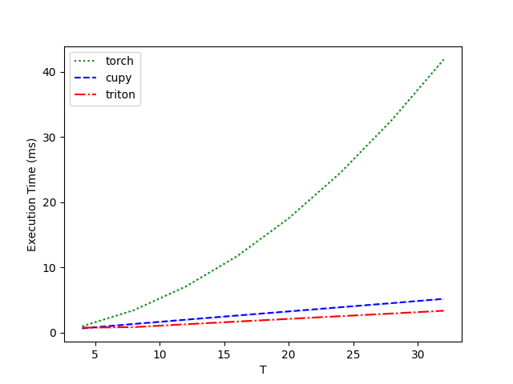

Triton Backend
===========================

Author: `Yifan Huang (AllenYolk) <https://github.com/AllenYolk>`_

中文版： :doc:`../cn/triton_backend`

SpikingJelly version ``0.0.0.1.0`` introduces the `Triton <https://github.com/triton-lang/triton>`_ backend as an alternative to PyTorch and CuPy. Compared with the CuPy backend, the Triton backend offers better readability, extensibility, and maintainability, makes it easier to achieve higher GPU utilization, and has the potential to be applied to `other hardware platforms <https://gitcode.com/Ascend/triton-ascend>`_.

This tutorial focuses on predefined neuron kernels with the Triton backend. For automatic kernel generation from custom dynamics functions, see :doc:`./flexsn`.

The following preparations and prerequisites are required:

#. `Install Triton <https://triton-lang.org/main/getting-started/installation.html>`_. It is recommended to use ``triton >= 3.3.1``.
#. Be familiar with the SpikingJelly :doc:`./neuron` module.

Forward and Backward Propagation
---------------------------------------

The way to enable the Triton backend is similar to that of the CuPy backend. Taking ``LIFNode`` as an example:

.. code:: python

    import torch
    from spikingjelly.activation_based import neuron

    n = neuron.LIFNode(step_mode="m", backend="triton").to("cuda:0")
    x = torch.randn([16, 1, 3, 32, 32], device="cuda:0") # [T, B, C, H, W]

    s = n(x)
    print(s.device, s.shape, s.mean())
    # cuda:0 torch.Size([16, 1, 3, 32, 32]) tensor(0.0313, device='cuda:0')

Here, we construct an LIF neuron running in multi-step mode ``step_mode="m"`` and enable the Triton backend. After moving both the neuron and the input tensor to the ``"cuda:0"`` device, forward propagation can be performed. The Triton backend also supports backward propagation and produces (almost) identical results to other backends:

.. code:: python

    import torch
    import torch.nn.functional as F
    from spikingjelly.activation_based import neuron

    n_triton = neuron.LIFNode(
        step_mode="m", backend="triton", store_v_seq=True
    ).to("cuda:0")
    n_torch = neuron.LIFNode(
        step_mode="m", backend="torch", store_v_seq=True
    ).to("cuda:0")

    x = torch.randn([16, 1, 3, 32, 32], device="cuda:0") # [T, B, C, H, W]
    x_triton = x.clone().requires_grad_(True)
    x_torch = x.clone().requires_grad_(True)

    s_triton = n_triton(x_triton)
    s_torch = n_torch(x_torch)
    v_triton = n_triton.v_seq
    v_torch = n_torch.v_seq

    grad = torch.randn_like(s_triton)
    s_triton.backward(grad)
    s_torch.backward(grad)

    assert torch.allclose(s_triton, s_torch)
    print(s_triton.mean()) # tensor(0.0309, device='cuda:0', grad_fn=<MeanBackward0>)
    assert torch.allclose(v_triton, v_torch)
    print(v_triton.mean()) # tensor(-0.0702, device='cuda:0', grad_fn=<MeanBackward0>)
    assert torch.allclose(x_triton.grad, x_torch.grad, rtol=1e-6, atol=1e-6)
    print(
        F.cosine_similarity(x_triton.grad.flatten(), x_torch.grad.flatten(), dim=0)
    ) # tensor(1., device='cuda:0')

Performance Benchmark
------------------------

The Triton backend supports ``torch.float16``. The following benchmark uses ``triton.testing`` to compare backend execution time:

.. code:: python

    import torch
    import triton
    from spikingjelly.activation_based import neuron, functional

    DEVICE = "cuda:0"

    def forward_backward(net, x_seq):
        y_seq  = net(x_seq)
        y_seq.sum().backward()
        x_seq.grad = None
        functional.reset_net(net)

    @triton.testing.perf_report(
        triton.testing.Benchmark(
            x_names=["T"],
            x_vals=[4*i for i in range(1, 9)],
            line_arg="backend",
            line_vals=["torch", "cupy", "triton"],
            line_names=["torch", "cupy", "triton"],
            styles=[
                ('green', ':'), ('blue', '--'), ('red', '-.'),
            ],
            ylabel='Execution Time (ms)',
            plot_name='Performance-float16',
            args={"N": 64, "C": 64*32*32, 'dtype': torch.float16},
        )
    )
    def benchmark(T, N, C, dtype, backend):
        net = neuron.LIFNode(
            backend=backend,
            step_mode='m',
        ).to(device=DEVICE, dtype=dtype)
        x_seq = torch.rand(
            [T, N, C], device=DEVICE, dtype=dtype, requires_grad=True
        )
        results = triton.testing.do_bench(
            lambda: forward_backward(net, x_seq),
            quantiles=[0.5, 0.2, 0.8],
            grad_to_none=[x_seq]
        )
        return results

    benchmark.run(save_path="./logs", print_data=True, show_plots=True)

When running on a single GeForce RTX 4090, the results are as follows:

.. code:: text

    Performance-float16:
        T      torch      cupy    triton
    0   4.0   0.992784  0.667648  0.771072
    1   8.0   3.459072  1.338368  0.857088
    2  12.0   7.058432  1.988608  1.289216
    3  16.0  11.737088  2.630736  1.704896
    4  20.0  17.557505  3.263488  2.115584
    5  24.0  24.517120  3.902464  2.533376
    6  28.0  32.649216  4.535296  2.940928
    7  32.0  41.872896  5.189120  3.365888

It can be observed that when both the data scale and sequence length ``T`` are large, the Triton backend exhibits a clear speed advantage over the CuPy and PyTorch backends.

Combining with ``torch.compile``
------------------------------------

.. warning::

    Current Triton neurons convert non-contiguous inputs to contiguous tensors.
    For convolutional SNNs, Inductor's default layout optimization may select
    channels-last convolutions and insert reorders or copies between convolutions
    and neurons. Start with
    ``torch.compile(..., options={"layout_optimization": False})`` and benchmark
    the target GPU, model, and batch size. CuPy neurons have the same contiguous
    layout restriction. Linear-only SNNs do not have this NCHW/channels-last
    convolution-layout conflict.

Triton neurons can be captured by ``torch.compile``, but a complete graph does
not guarantee an end-to-end speedup. Per-kernel profiling identified one causal
regression: default Inductor selected NHWC convolutions, while the fixed stride
requirements of Triton LIF forced the network back to NCHW and also selected
slower convolution kernels. Five GPU steps of the minimal failing case on an
RTX 4090 (SEW-ResNet18, B=32, T=4, 136×136) give:

.. list-table:: Causal comparison of layout policies
    :header-rows: 1

    * - path
      - total (ms)
      - convolution (ms)
      - layout conversion (ms / count)
      - LIF (ms)
    * - Triton eager
      - 38.079
      - 18.874
      - 0 / 0
      - 4.300
    * - default compile+Triton
      - 47.923
      - 33.411
      - 2.794 / 195
      - 4.650
    * - layout optimization disabled
      - **36.866**
      - 20.995
      - 0 / 0
      - 4.010

Disabling layout optimization changes this case's speedup from 0.800× to
1.040×; LIF itself accounts for only 0.350 ms of the regression. Throughput
workloads can use:

.. code-block:: python

    compiled_model = torch.compile(
        model,
        backend="inductor",
        options={
            "layout_optimization": False,
            "max_autotune": True,
            "triton.cudagraphs": False,
            "triton.cudagraph_trees": False,
        },
    )

``layout_optimization=False`` is the key correction. ``max_autotune`` increases
first-compilation time and contributes only about another 1.2% on SEW-ResNet18.

The following results use an exclusive, on-demand RTX 5090 with PyTorch
2.11.0+cu128, Triton 3.6.0, T=4, LIF, FP32, and 224×224 inputs. Every case runs
in a fresh process with a separate Inductor cache and is repeated for three
rounds. Every compiled case produces one graph with zero graph breaks and zero
recompiles. Values are three-round medians; inference uses batch 64 and training
uses batch 16.

.. list-table:: Corrected four-mode end-to-end latency
    :header-rows: 1

    * - model / phase
      - Torch eager (ms)
      - Torch compile (ms)
      - Triton eager (ms)
      - Triton compile (ms)
      - compile / Triton eager
    * - VGG inference
      - 389.204
      - 163.176
      - 176.896
      - **150.719**
      - 1.174×
    * - VGG training
      - 251.198
      - 160.743
      - 139.855
      - **130.926**
      - 1.068×
    * - SEW inference
      - 54.266
      - 28.823
      - 27.868
      - **27.350**
      - 1.019×
    * - SEW training
      - 71.232
      - 23.870
      - 47.136
      - **20.481**
      - 2.298×
    * - Spikformer inference
      - 60.318
      - 34.739
      - 35.078
      - **32.860**
      - 1.068×
    * - Spikformer training
      - 73.473
      - 29.458
      - 51.102
      - **26.795**
      - 1.905×

Corrected compile+Triton beats eager+Triton in all six cases and every round.
The complete results are available as a :download:`CSV file
<../../_static/tutorials/triton_backend/compile-backends-rtx5090-tuned.csv>`.
The full ordering ``compile+Triton > eager+Triton > compile+Torch > eager+Torch``
holds only for VGG training and SEW inference because compile+Torch overtakes
eager+Triton in the other modes.

For SEW-ResNet18 inference, paired speedups at batch 1, 2, 4, 8, 16, 32, 64,
and 128 are 3.147×, 2.601×, 2.535×, 2.156×, 1.112×, 1.019×, 1.019×, and
1.012×. The complete results are available as a :download:`CSV file
<../../_static/tutorials/triton_backend/compile-sew18-rtx5090-tuned.csv>`.
The 1%–2% gains at large batches are hardware-sensitive and should be
remeasured in the target environment.

Inference models can also call :func:`fuse_conv_bn_eval_modules
<spikingjelly.activation_based.functional.conv_bn_fusion.fuse_conv_bn_eval_modules>`.
It reduces VGG Triton eager from 176.896 ms to 157.898 ms. After applying the
fusion fairly to all four modes, Torch compile reaches 143.950 ms and remains
faster than Triton compile at 149.803 ms, so evaluate this optimization
independently.

.. admonition:: Warning
    :class: warning

    When using predefined Triton neuron kernels, please note the following:

    * ``IFNode``, ``LIFNode``, and ``PLIFNode`` provide predefined Triton kernels for inference and training. The experimental ``ActivationAwareIFNode`` additionally provides a multi-step inference-only Triton kernel for scalar or channel-wise thresholds and membrane offsets; it rejects training and autograd instead of falling back to PyTorch.
    * The Triton backend should be executed on a GPU.
    * The Triton backend only supports multi-step mode ``step_mode="m"``.
