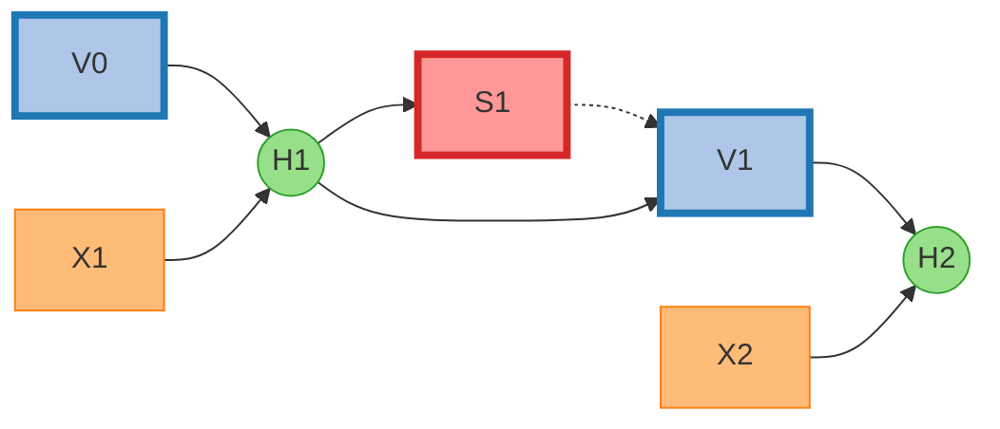
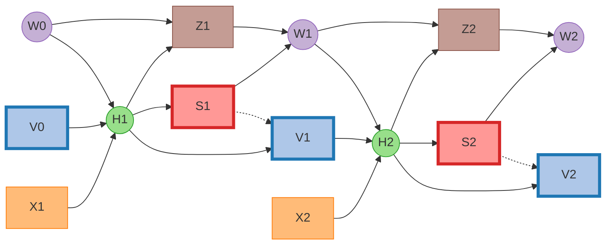

# cuda_utils

This md file shows how we define cuda kernel for neuronal forward and backward.

## Definition

We use three equations to describe spiking neurons:

$$
\begin{align}
	H[t] &= f(V[t - 1], X[t])\\
	S[t] &= \Theta(H[t] - V_{th})\\
	V[t] &= \begin{cases}
	H[t]\left( 1 - S[t] \right) + V_{reset}S[t], &\text{Hard Reset}\\
	H[t] - V_{th}S[t], &\text{Soft Reset}\\
\end{cases}
\end{align}
$$

We define the FPTT function as

$$
S[1,2,...,T], V[1,2,...,T] = F_{fp}(X[1,2,...,T], V[0])
$$

Thus, we need to define the backward as

$$
\frac{\mathrm{d} L}{\mathrm{d} X[1,2,...,T]},\frac{\mathrm{d} L}{\mathrm{d} V[0]} = F_{bp}(\frac{\partial L}{\partial S[1,2,...,T]},\frac{\partial L}{\partial V[1,2,...,T]})
$$

According to the forward function, we can get

$$
\begin{align}
	\frac{\mathrm{d} L}{\mathrm{d} X[t]} &= \frac{\mathrm{d} L}{\mathrm{d} H[t]} \frac{\mathrm{d} H[t]}{\mathrm{d} X[t]}\\
	\frac{\mathrm{d} L}{\mathrm{d} H[t]} &=\frac{\partial L}{\partial S[t]}\frac{\mathrm{d} S[t]}{\mathrm{d} H[t]} + (\frac{\partial L}{\partial V[t]}+\frac{\mathrm{d} L}{\mathrm{d} H[t+1]}\frac{\mathrm{d} H[t+1]}{\mathrm{d} V[t]})\frac{\mathrm{d} V[t]}{\mathrm{d} H[t]}\\
	\frac{\mathrm{d} S[t]}{\mathrm{d} H[t]} &= \Theta'(H[t] - V_{th})\\
	\frac{\mathrm{d} V[t]}{\mathrm{d} H[t]} &= 
	\begin{cases}
		1 - S[t] + (-H[t] + V_{reset})\frac{\partial S[t]}{\partial H[t]}(1-D_{reset}), &\text{Hard Reset}\\
		1 - V_{th}\frac{\partial S[t]}{\partial H[t]}(1-D_{reset}), &\text{Soft Reset}\\
	\end{cases}
\end{align}
$$

where

$$
D_{reset} = \begin{cases}
	1, &\text{Detach Reset}\\
	0, &\text{Not Detach Reset}\\
\end{cases}
$$

Finally, we will calculate gradients as

$$
\begin{align}
\frac{\mathrm{d} L}{\mathrm{d} H[t]} &=\frac{\partial L}{\partial S[t]}\frac{\mathrm{d} S[t]}{\mathrm{d} H[t]} + (\frac{\partial L}{\partial V[t]}+\frac{\mathrm{d} L}{\mathrm{d} H[t+1]}\frac{\mathrm{d} H[t+1]}{\mathrm{d} V[t]})\frac{\mathrm{d} V[t]}{\mathrm{d} H[t]}\\
\frac{\mathrm{d} L}{\mathrm{d} X[t]} &= \frac{\mathrm{d} L}{\mathrm{d} H[t]}\frac{\mathrm{d} H[t]}{\mathrm{d} X[t]}\\
\frac{\mathrm{d} L}{\mathrm{d} V[0]} &= \frac{\mathrm{d} L}{\mathrm{d} H[1]}\frac{\mathrm{d} H[1]}{\mathrm{d} V[0]}
\end{align}
$$

### Computation Graph

The circle means saved gradient for Dynamic Programming (DP). Nodes with wide border indicates direct links to loss function. The dashed line show the ignored gradient path when $D_{reset}=1$.

## CUDA Kernel

The cuda kernel of spiking neuron will regard any input tensor with arbitrary shape as ``shape=[numel/neuron_num, neuron_num]``.

It will calculate ``index`` where ``0 <= index < neuron_num``, and do a for loop with ``mem_offset = 0, neuron_num, 2 * neuron_num, …, numel - neuron_num``. We can find that the time-step ``t`` is ``t = index + mem_offset``. The following figure shows the cuda memory layout:

|                      | 0          | 1    |       ...        | neuron_num-1 |
| -------------------- | ---------- | ---- | :--------------: | ------------ |
| 0                    |            |      |                  |              |
| 1                    |            |      |                  |              |
| ...                  | mem_offset |      | index+mem_offset |              |
| numel/neuron_num - 1 |            |      |                  |              |

### Integrate-and-Fire Neuron (IF Neuron)

For the IF neuron, the charge function is 

$$
H[t] = V[t - 1] + X[t]
$$

Then the gradients are

$$
\begin{align}
\frac{\mathrm{d} L}{\mathrm{d} H[t]} &=\frac{\partial L}{\partial S[t]}\frac{\mathrm{d} S[t]}{\mathrm{d} H[t]} + (\frac{\partial L}{\partial V[t]}+\frac{\mathrm{d} L}{\mathrm{d} H[t+1]})\frac{\mathrm{d} V[t]}{\mathrm{d} H[t]}\\
\frac{\mathrm{d} L}{\mathrm{d} X[t]} &= \frac{\mathrm{d} L}{\mathrm{d} H[t]}\\
\frac{\mathrm{d} L}{\mathrm{d} V[0]} &= \frac{\mathrm{d} L}{\mathrm{d} H[1]}
\end{align}
$$

### Leaky-Integrate-and-Fire Neuron (LIF Neuron)

For the LIF neuron with decay input, the charge function is

$$
H[t] = V[t - 1] + \frac{1}{\tau}(X[t] - (V[t - 1] - V_{reset}))
$$

Then the gradients are

$$
\begin{align}
\frac{\mathrm{d} L}{\mathrm{d} H[t]} &=\frac{\partial L}{\partial S[t]}\frac{\mathrm{d} S[t]}{\mathrm{d} H[t]} + (\frac{\partial L}{\partial V[t]}+\frac{\mathrm{d} L}{\mathrm{d} H[t+1]}(1 - \frac{1}{\tau}))\frac{\mathrm{d} V[t]}{\mathrm{d} H[t]}\\
\frac{\mathrm{d} L}{\mathrm{d} X[t]} &= \frac{\mathrm{d} L}{\mathrm{d} H[t]} \frac{1}{\tau}\\
\frac{\mathrm{d} L}{\mathrm{d} V[0]} &= \frac{\mathrm{d} L}{\mathrm{d} H[1]} (1 - \frac{1}{\tau})
\end{align}
$$

For the LIF neuron without decay input, the charge function is 

$$
H[t] = V[t - 1] - \frac{1}{\tau}(V[t - 1] - V_{reset}) + X[t]
$$

Then the gradients are

$$
\begin{align}
\frac{\mathrm{d} L}{\mathrm{d} H[t]} &=\frac{\partial L}{\partial S[t]}\frac{\mathrm{d} S[t]}{\mathrm{d} H[t]} + (\frac{\partial L}{\partial V[t]}+\frac{\mathrm{d} L}{\mathrm{d} H[t+1]}(1 - \frac{1}{\tau}))\frac{\mathrm{d} V[t]}{\mathrm{d} H[t]}\\
\frac{\mathrm{d} L}{\mathrm{d} X[t]} &= \frac{\mathrm{d} L}{\mathrm{d} H[t]}\\
\frac{\mathrm{d} L}{\mathrm{d} V[0]} &= \frac{\mathrm{d} L}{\mathrm{d} H[1]} (1 - \frac{1}{\tau})
\end{align}
$$

### Parametric Leaky-Integrate-and-Fire Neuron (PLIF Neuron)

For the PLIF neuron with decay input, the charge function is

$$
H[t] = V[t - 1] + \frac{1}{\tau}(X[t] - (V[t - 1] - V_{reset}))
$$

Then the gradients are

$$
\begin{align}
\frac{\mathrm{d} L}{\mathrm{d} H[t]} &=\frac{\partial L}{\partial S[t]}\frac{\mathrm{d} S[t]}{\mathrm{d} H[t]} + (\frac{\partial L}{\partial V[t]}+\frac{\mathrm{d} L}{\mathrm{d} H[t+1]}(1 - \frac{1}{\tau}))\frac{\mathrm{d} V[t]}{\mathrm{d} H[t]}\\
\frac{\mathrm{d} L}{\mathrm{d} X[t]} &= \frac{\mathrm{d} L}{\mathrm{d} H[t]} \frac{1}{\tau}\\
\frac{\mathrm{d} L}{\mathrm{d} \frac{1}{\tau}} &= \sum_{t} \frac{\mathrm{d} L}{\mathrm{d} H[t]} (X[t] - (V[t - 1] - V_{reset}))=\sum_{t} \frac{\mathrm{d} L}{\mathrm{d} H[t]}(H[t]-V[t-1])\tau\\
\frac{\mathrm{d} L}{\mathrm{d} V[0]} &= \frac{\mathrm{d} L}{\mathrm{d} H[1]} (1 - \frac{1}{\tau})
\end{align}
$$

For the PLIF neuron without decay input, the charge function is 

$$
H[t] = V[t - 1] - \frac{1}{\tau}(V[t - 1] - V_{reset}) + X[t]
$$

Then the gradients are

$$
\begin{align}
\frac{\mathrm{d} L}{\mathrm{d} H[t]} &=\frac{\partial L}{\partial S[t]}\frac{\mathrm{d} S[t]}{\mathrm{d} H[t]} + (\frac{\partial L}{\partial V[t]}+\frac{\mathrm{d} L}{\mathrm{d} H[t+1]}(1 - \frac{1}{\tau}))\frac{\mathrm{d} V[t]}{\mathrm{d} H[t]}\\
\frac{\mathrm{d} L}{\mathrm{d} X[t]} &= \frac{\mathrm{d} L}{\mathrm{d} H[t]}\\
\frac{\mathrm{d} L}{\mathrm{d} \frac{1}{\tau}} &= \sum_{t} \frac{\mathrm{d} L}{\mathrm{d} H[t]} (V_{reset} - V[t - 1])\\
\frac{\mathrm{d} L}{\mathrm{d} V[0]} &= \frac{\mathrm{d} L}{\mathrm{d} H[1]} (1 - \frac{1}{\tau})
\end{align}
$$

### Quadratic Integrate-and-Fire Neuron (QIF Neuron)

For the QIF neuron, the charge function is 

$$
H[t] = V[t - 1] + \frac{1}{\tau}\left(X[t] + a_0 (V[t - 1] - V_{rest})(V[t - 1] - v_c)\right)
$$

Then the gradients are

$$
\begin{align}
\frac{\mathrm{d} L}{\mathrm{d} H[t]} &=\frac{\partial L}{\partial S[t]}\frac{\mathrm{d} S[t]}{\mathrm{d} H[t]} + (\frac{\partial L}{\partial V[t]}+\frac{\mathrm{d} L}{\mathrm{d} H[t+1]}(1+\frac{a_0}{\tau}(2V[t]-V_{rest}-v_c)))\frac{\mathrm{d} V[t]}{\mathrm{d} H[t]}\\
\frac{\mathrm{d} L}{\mathrm{d} X[t]} &= \frac{\mathrm{d} L}{\mathrm{d} H[t]} \frac{1}{\tau}\\
\frac{\mathrm{d} L}{\mathrm{d} V[0]} &= \frac{\mathrm{d} L}{\mathrm{d} H[1]} (1+\frac{a_0}{\tau}(2V[t]-V_{rest}-v_c))
\end{align}
$$

### Exponential Integrate-and-Fire Neuron (EIF Neuron)

For the EIF neuron, the charge function is 

$$
H[t] = V[t - 1] + \frac{1}{\tau}\left(X[t] - (V[t - 1] - V_{rest}) + \Delta_T\exp\left(\frac{V[t-1] - \theta_{rh}}{\Delta_T}\right)\right)
$$

Then the gradients are

$$
\begin{align}
\frac{\mathrm{d} L}{\mathrm{d} H[t]} &=\frac{\partial L}{\partial S[t]}\frac{\mathrm{d} S[t]}{\mathrm{d} H[t]} + (\frac{\partial L}{\partial V[t]}+\frac{\mathrm{d} L}{\mathrm{d} H[t+1]}(1 - \frac{1}{\tau}+\frac{1}{\tau}\exp(\frac{V[t] - \theta_{rh}}{\Delta_T})))\frac{\mathrm{d} V[t]}{\mathrm{d} H[t]}\\
\frac{\mathrm{d} L}{\mathrm{d} X[t]} &= \frac{\mathrm{d} L}{\mathrm{d} H[t]} \frac{1}{\tau}\\
\frac{\mathrm{d} L}{\mathrm{d} V[0]} &= \frac{\mathrm{d} L}{\mathrm{d} H[1]} (1 - \frac{1}{\tau}+\frac{1}{\tau}\exp(\frac{V[0] - \theta_{rh}}{\Delta_T}))
\end{align}
$$

## Definition of Adaptive Neuron

For adaptive neuron, an extra equation for adaptive variable $W$ is used for describing spiking neurons. $Z,H$ are intermediate states of adaptive variable $W$ and membrane potential $V$, respectively:

$$
\begin{align}
	H[t] &= f(V[t - 1], X[t], W[t - 1])\\
	Z[t] &= W[t - 1] + \frac{1}{\tau_w}(a(H[t]-V_{rest})-W[t - 1])\\
	S[t] &= \Theta(H[t] - V_{th})\\
	V[t] &= 
	\begin{cases}
	H[t]\left( 1 - S[t] \right) + V_{reset}S[t], &\text{Hard Reset}\\
	H[t] - V_{th}S[t], &\text{Soft Reset}\\
	\end{cases}\\
	W[t] &= Z[t]+bS[t]
\end{align}
$$

We define the FPTT function as

$$
S[1,2,...,T], V[1,2,...,T] = F_{fp}(X[1,2,...,T], V[0], W[0])
$$

Thus, we need to define the backward as

$$
\frac{\mathrm{d} L}{\mathrm{d} X[1,2,...,T]},\frac{\mathrm{d} L}{\mathrm{d} V[0]},\frac{\mathrm{d} L}{\mathrm{d} W[0]} = F_{bp}(\frac{\partial L}{\partial S[1,2,...,T]},\frac{\partial L}{\partial V[1,2,...,T]},\frac{\partial L}{\partial W[1,2,...,T]})
$$

According to the forward function, we can get

$$
\begin{align}
	\frac{\mathrm{d} L}{\mathrm{d} X[t]} &= \frac{\mathrm{d} L}{\mathrm{d} H[t]} \frac{\mathrm{d} H[t]}{\mathrm{d} X[t]}\\
	\frac{\mathrm{d} L}{\mathrm{d} H[t]} &= \frac{\mathrm{d} L}{\mathrm{d} W[t]}\frac{\mathrm{d} W[t]}{\mathrm{d} H[t]}+\frac{\mathrm{d} L}{\mathrm{d} V[t]}\frac{\mathrm{d} V[t]}{\mathrm{d} H[t]}+\frac{\partial L}{\partial S[t]}\frac{\mathrm{d} S[t]}{\mathrm{d} H[t]}\\
	\frac{\mathrm{d} L}{\mathrm{d} W[t]} &= \frac{\mathrm{d} L}{\mathrm{d} H[t+1]}\frac{\mathrm{d} H[t+1]}{\mathrm{d} W[t]}+\frac{\mathrm{d} L}{\mathrm{d} W[t+1]}\frac{\mathrm{d} W[t+1]}{\mathrm{d} Z[t+1]}\frac{\partial Z[t+1]}{\partial W[t]}\\
	\frac{\mathrm{d} L}{\mathrm{d} V[t]} &= \frac{\mathrm{d} L}{\mathrm{d} H[t+1]}\frac{\mathrm{d} H[t+1]}{\mathrm{d} V[t]}+\frac{\partial L}{\partial V[t]}\\
	\frac{\mathrm{d} W[t]}{\mathrm{d} H[t]} &= \frac{\mathrm{d} Z[t]}{\mathrm{d} H[t]}+b\frac{\mathrm{d} S[t]}{\mathrm{d} H[t]}\\
	\frac{\mathrm{d} Z[t]}{\mathrm{d} H[t]} &= \frac{a}{\tau_{w}}\\
	\frac{\mathrm{d} S[t]}{\mathrm{d} H[t]} &= \Theta'(H[t] - V_{th})\\
	\frac{\partial Z[t + 1]}{\partial W[t]} &= 1 - \frac{1}{\tau_{w}}\\
	\frac{\mathrm{d} V[t]}{\mathrm{d} H[t]} &= 
	\begin{cases}
		1 - S[t] + (-H[t] + V_{reset})\frac{\partial S[t]}{\partial H[t]}(1-D_{reset}), &\text{Hard Reset}\\
		1 - V_{th}\frac{\partial S[t]}{\partial H[t]}(1-D_{reset}), &\text{Soft Reset}\\
	\end{cases}
\end{align}
$$

where

$$
D_{reset} = \begin{cases}
	1, &\text{Detach Reset}\\
	0, &\text{Not Detach Reset}\\
\end{cases}
$$

Finally, we will calculate gradients as

$$
\begin{align}
	\frac{\mathrm{d} L}{\mathrm{d} W[t]} &= \frac{\mathrm{d} L}{\mathrm{d} H[t+1]}\frac{\mathrm{d} H[t+1]}{\mathrm{d} W[t]}
	+\frac{\mathrm{d} L}{\mathrm{d} W[t+1]}\frac{\mathrm{d} W[t+1]}{\mathrm{d} Z[t+1]}\frac{\partial Z[t+1]}{\partial W[t]}\\
	\frac{\mathrm{d} L}{\mathrm{d} H[t]} &= \frac{\mathrm{d} L}{\mathrm{d} W[t]}\frac{\mathrm{d} W[t]}{\mathrm{d} H[t]}+(\frac{\mathrm{d} L}{\mathrm{d} H[t+1]}\frac{\mathrm{d} H[t+1]}{\mathrm{d} V[t]}+\frac{\partial L}{\partial V[t]})\frac{\mathrm{d} V[t]}{\mathrm{d} H[t]}+\frac{\partial L}{\partial S[t]}\frac{\mathrm{d} S[t]}{\mathrm{d} H[t]}\\
\frac{\mathrm{d} L}{\mathrm{d} X[t]} &= \frac{\mathrm{d} L}{\mathrm{d} H[t]}\frac{\mathrm{d} H[t]}{\mathrm{d} X[t]}\\
\frac{\mathrm{d} L}{\mathrm{d} V[0]} &= \frac{\mathrm{d} L}{\mathrm{d} H[1]}\frac{\mathrm{d} H[1]}{\mathrm{d} V[0]}\\
\frac{\mathrm{d} L}{\mathrm{d} W[0]} &= \frac{\mathrm{d} L}{\mathrm{d} H[1]}\frac{\mathrm{d} H[1]}{\mathrm{d} W[0]}+\frac{\mathrm{d} L}{\mathrm{d} W[1]}\frac{\mathrm{d} W[1]}{\mathrm{d} Z[1]}\frac{\partial Z[1]}{\partial W[0]}
\end{align}
$$

### Computation Graph

The circle means saved gradient for Dynamic Programming (DP). Nodes with wide border indicates direct links to loss function. The dashed line show the ignored gradient path when $D_{reset}=1$.

### Izhikevich Neuron 

For the Izhikevich neuron, the charge function is 

$$
H[t] = V[t - 1] + \frac{1}{\tau}\left(X[t] + a_0 (V[t - 1] - V_{rest})(V[t - 1] - v_c)-W[t-1]\right)
$$

Then the gradients are

$$
\begin{align}
	\frac{\mathrm{d} L}{\mathrm{d} W[t]} &= -\frac{1}{\tau}\frac{\mathrm{d} L}{\mathrm{d} H[t+1]}
	+(1-\frac{1}{\tau_w})\frac{\mathrm{d} L}{\mathrm{d} W[t+1]}\\
	\frac{\mathrm{d} L}{\mathrm{d} H[t]} &= \left(\frac{a}{\tau_w}+b\frac{\mathrm{d} S[t]}{\mathrm{d} H[t]}\right)\frac{\mathrm{d} L}{\mathrm{d} W[t]}+\left(\left(1+\frac{a_0}{\tau}(2V[t]-v_c-V_{rest})\right)\frac{\mathrm{d} L}{\mathrm{d} H[t+1]}+\frac{\partial L}{\partial V[t]}\right)\frac{\mathrm{d} V[t]}{\mathrm{d} H[t]}\\
	&+\frac{\partial L}{\partial S[t]}\frac{\mathrm{d} S[t]}{\mathrm{d} H[t]}\\
\frac{\mathrm{d} L}{\mathrm{d} X[t]} &= \frac{\mathrm{d} L}{\mathrm{d} H[t]}\frac{1}{\tau}\\
\frac{\mathrm{d} L}{\mathrm{d} V[0]} &= \frac{\mathrm{d} L}{\mathrm{d} H[1]} (1+\frac{a_0}{\tau}(2V[0]-V_{rest}-v_c))\\
\frac{\mathrm{d} L}{\mathrm{d} W[0]} &= -\frac{1}{\tau}\frac{\mathrm{d} L}{\mathrm{d} H[1]}
	+(1-\frac{1}{\tau_w})\frac{\mathrm{d} L}{\mathrm{d} W[1]}
\end{align}
$$